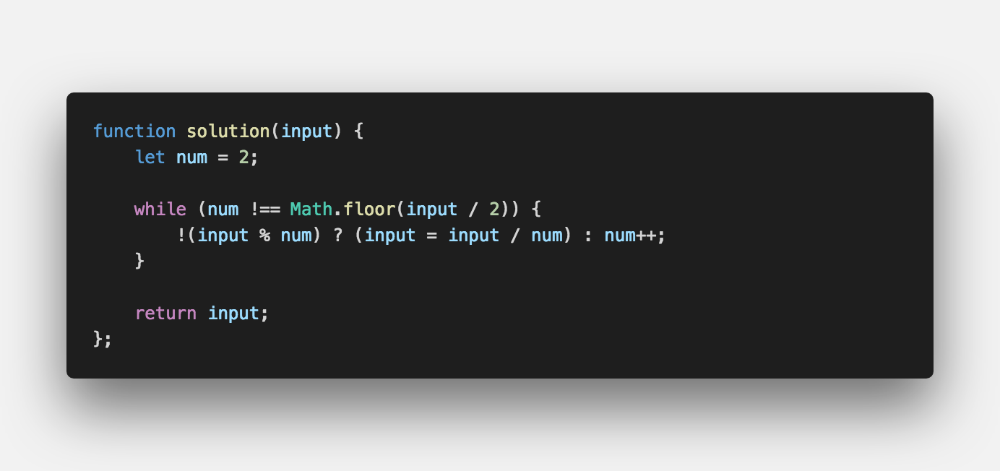

문제 설명
-------

- 어떤 수를 소수의 곱으로만 나타내는 것을 소인수분해라고 합니다.

- 이 소수들을 그 수의 소인수라고 합니다.

- n의 소인수 중에서 가장 큰 수를 구하시요.

입출력 예
-------
```sh

Input: 13195
Ouput: 29 // [5, 7, 13, 29]

```

문제 풀이
-------



#여러분의 댓글이 큰힘이 됩니다. ʕ　·ᴥʔ

<br />

> 출처
> <a href="http://euler.synap.co.kr/prob_detail.php?id=3" target="_blank">http://euler.synap.co.kr/prob_detail.php?id=3</a>
