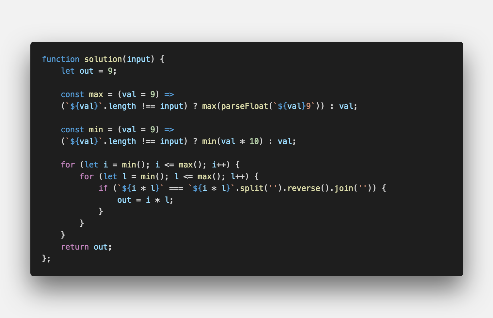

## **💎 목차**
  * [문제 설명 (Problem)](#-문제-설명)
  * [입출력 예 (Example)](#-입출력-예)
  * [문제 풀이 (Solution)](#-문제-풀이)

## **📕 문제 설명**

- 앞에서부터 읽을 때나 뒤에서부터 읽을 때나 모양이 같은 수를 `대칭수`라고 합니다.

- n자리 수를 곱해 만들 수 있는 `가장 큰 대칭수`를 구하시오.

<br />

**[⬆ 목차](#-목차)**

---

## **📙 입출력 예**

```js

Input : 2
Output : 9009 // 91 × 99 = 9009

```

<br />

**[⬆ 목차](#-목차)**

---

## **📘 문제 풀이**


<br />

**[⬆ 목차](#-목차)**

---

<br />

> 출처
>
> <a href="http://euler.synap.co.kr/prob_detail.php?id=4" target="_blank">http://euler.synap.co.kr/prob_detail.php?id=4</a>

#여러분의 댓글이 큰힘이 됩니다. (๑•̀ㅂ•́)و✧
