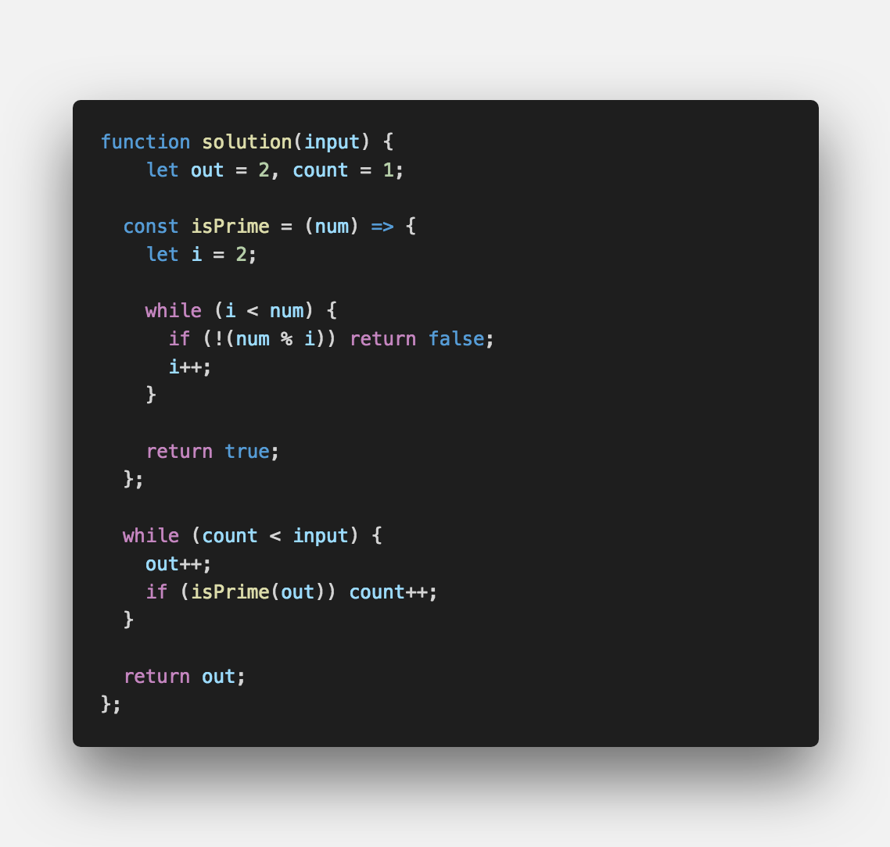

▶︎ 문제 설명
-------

- n번째 소수를 구하시오.

▶︎ 입출력 예
-------
```js

Input: n = 3
Ouput: 5

Input: n = 6
Ouput: 13

```

▶︎ 문제 풀이
-------



#여러분의 댓글이 큰힘이 됩니다. (๑•̀ㅂ•́)و✧

<br />

> 출처
> <a href="http://euler.synap.co.kr/prob_detail.php?id=7" target="_blank">http://euler.synap.co.kr/prob_detail.php?id=7</a>
