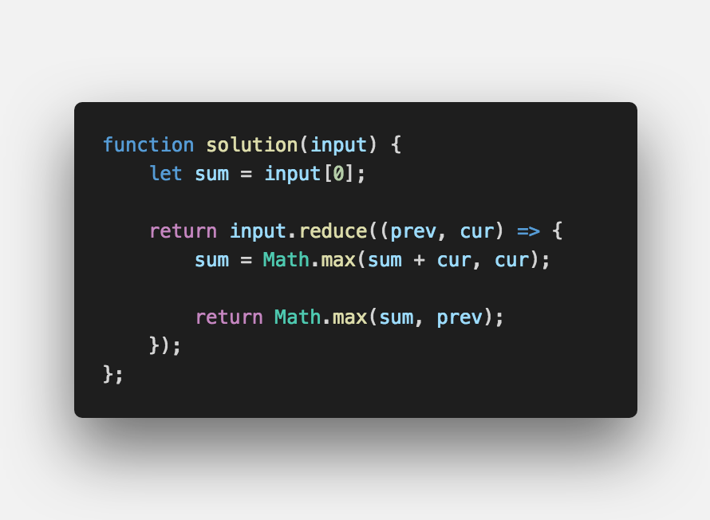

문제 설명
-------

- 정수 배열(int array)가 주어지면 가장 큰 이어지는 원소들의 합을 구하시오.

입출력 예
-------
```sh

Input: [-1, 3, -1, 5]
Output: 7 // 3 + (-1) + 5

Input: [-5, -3, -1]
Output: -1 // -1

Input: [2, 4, -2, -3, 8]
Output: 9 // 2 + 4 + (-2) + (-3) + 8

```

문제 풀이
-------



#끝까지 봐 주셔서 감사합니다.  ʕ　·ᴥʔ

<br />

> 출처  <a href="https://mailprogramming.com" target="_blank">https://mailprogramming.com</a>
