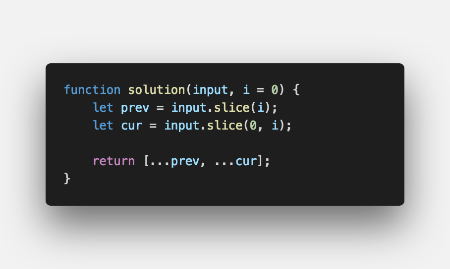

▶︎ 문제 설명
-------

- 정수 배열과 정수 k가 주어지면 모든 원소를 k칸씩 앞으로 옮기시오.

▶︎ 입출력 예
-------
```js

Input: [1, 2, 3, 4, 5], 2
Output: [3, 4, 5, 1, 2]

Input: [0, 1, 2, 3, 4], 1
Output: [1, 2, 3, 4, 0]

```

▶︎ 문제 풀이
-------



#여러분의 댓글이 큰힘이 됩니다. (๑•̀ㅂ•́)و✧

<br />

> 출처
> <a href="https://mailprogramming.com" target="_blank">https://mailprogramming.com</a>
