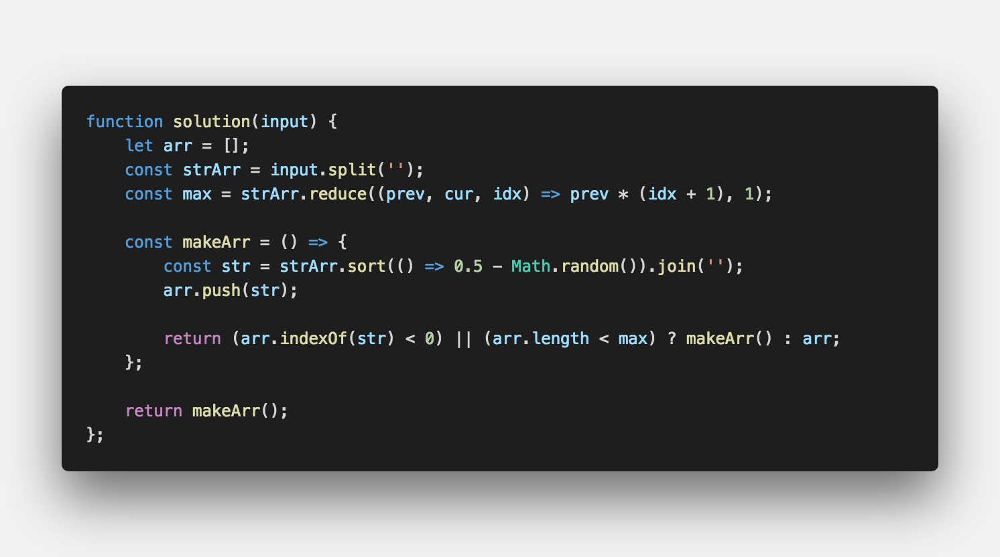

문제 설명
-------

- 문자배열이 주어지면, 주어진 문자로 만들수 있는 모든 문자배열 조합을 구하시오.

입출력 예
-------
```sh

Input: ABC
Output: ABC ACB BAC BCA CBA CAB

```

문제 풀이
-------



#여러분의 댓글이 큰힘이 됩니다. ʕ　·ᴥʔ

<br />

> 출처
> <a href="https://mailprogramming.com" target="_blank">https://mailprogramming.com</a>
