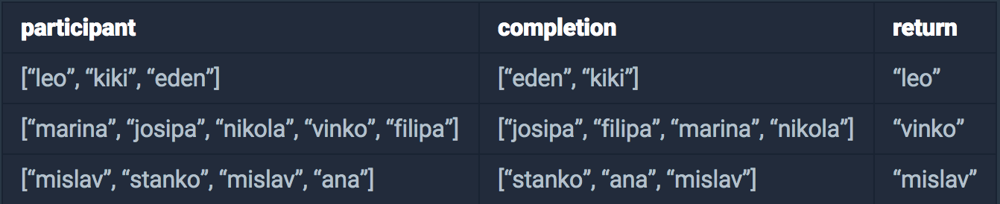
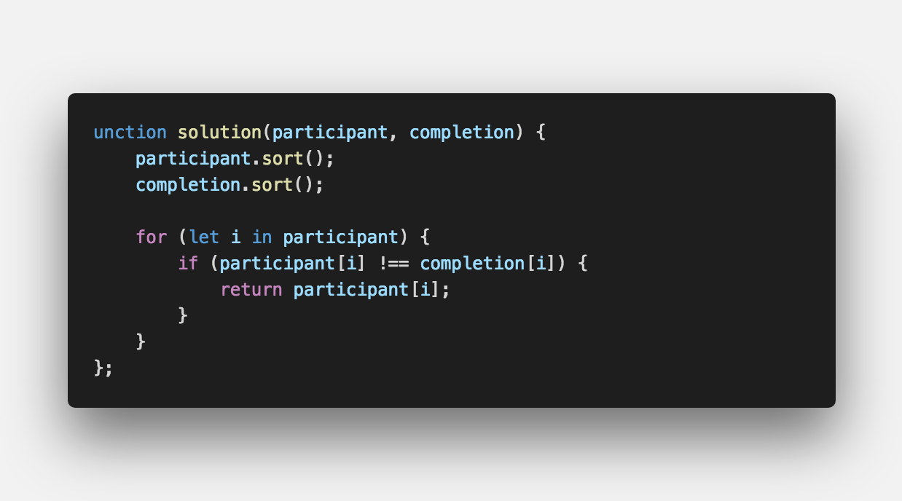

문제 설명
-------

- 수 많은 마라톤 선수들이 마라톤에 참여하였습니다. 단 한명의 선수를 제외하고는 모든 선수가 마라톤을 완주하였습니다.

- 마라톤에 참여한 선수들의 이름이 담긴 배열 participant와 완주한 선수들의 이름이 담긴 배열 completion이 주어질 때, 

- 완주하지 못한 선수의 이름을 return 하도록 solution 함수를 작성해주세요.

제한 사항
-------

- 마라톤 경기에 참여한 선수의 수는 1명 이상 100,000명 이하입니다.

- completion의 길이는 participant의 길이보다 1 작습니다.

- 참가자의 이름은 1개 이상 20개 이하의 알파벳 소문자로 이루어져 있습니다.

- 참가자 중에는 동명이인이 있을 수 있습니다.

입출력 예
-------

문제 풀이
-------

#끝까지 봐 주셔서 감사합니다.  ʕ　·ᴥʔ

 

> 출처  <a href="https://programmers.co.kr/learn/courses/30/lessons/42576" target="_blank">https://programmers.co.kr/learn/courses/30/lessons/42576</a>
