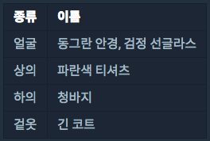
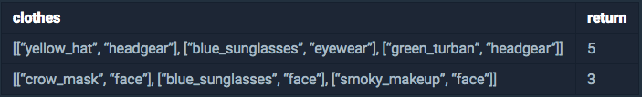
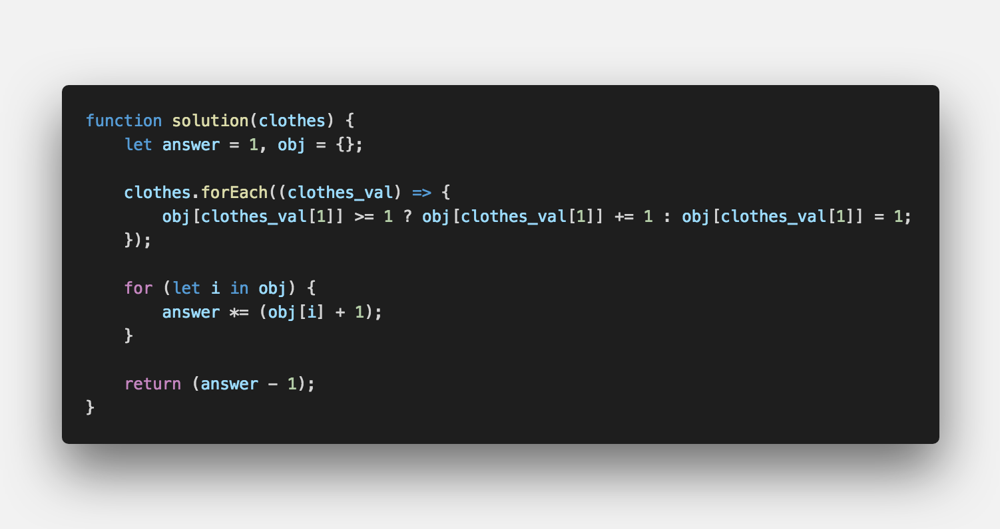

▶︎ 문제 설명
-------

- 스파이들은 매일 다른 옷을 조합하여 입어 자신을 위장합니다.

- 예를 들어 스파이가 가진 옷이 아래와 같고 오늘 스파이가 동그란 안경, 긴 코트, 파란색 티셔츠를 입었다면 다음날은 청바지를 추가로 입거나 동그란 안경 대신 검정 선글라스를 착용하거나 해야 합니다.

- 스파이가 가진 의상들이 담긴 2차원 배열 clothes가 주어질 때,

- 서로 다른 옷의 조합의 수를 return 하도록 solution 함수를 작성해주세요.

▶︎ 제한 사항
-------

- clothes의 각 행은 [의상의 이름, 의상의 종류]로 이루어져 있습니다.

- 스파이가 가진 의상의 수는 1개 이상 30개 이하입니다.

- 같은 이름을 가진 의상은 존재하지 않습니다.

- clothes의 모든 원소는 문자열로 이루어져 있습니다.

- 모든 문자열의 길이는 1 이상 20 이하인 자연수이고 알파벳 소문자 또는 '_' 로만 이루어져 있습니다.

- 스파이는 하루에 최소 한 개의 의상은 입습니다.

▶︎ 입출력 예
-------

▶︎ 문제 풀이
-------

#여러분의 댓글이 큰힘이 됩니다. (๑•̀ㅂ•́)و✧

 

> 출처
> <a href="https://programmers.co.kr/learn/courses/30/lessons/42578" target="_blank">https://programmers.co.kr/learn/courses/30/lessons/42578</a>
