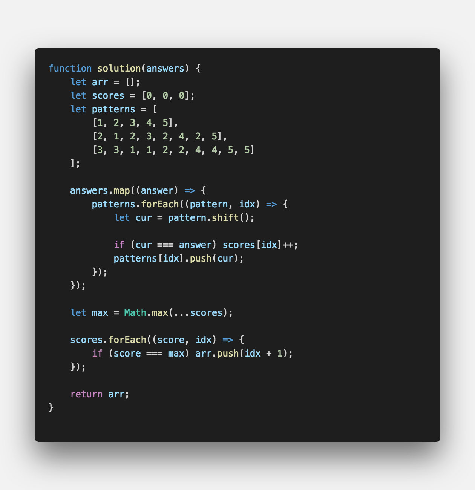

<strong style="font-size: 20px;">무식해 보여도 사실은 최고의 방법일 때가 있지요.</strong>

 

## **💎 목차**

- [문제 설명 (Problem)](#-문제-설명)
- [제한 사항 (Limitations)](#-제한-사항)
- [입출력 예 (Example)](#-입출력-예)
- [문제 풀이 (Solution)](#-문제-풀이)

## **📕 문제 설명**

- 수포자는 수학을 포기한 사람의 준말입니다.

- 수포자 삼인방은 모의고사에 수학 문제를 전부 찍으려 합니다.

- 수포자는 1번 문제부터 마지막 문제까지 다음과 같이 찍습니다.

  - 1번 수포자가 찍는 방식: 1, 2, 3, 4, 5, 1, 2, 3, 4, 5, ...

  - 2번 수포자가 찍는 방식: 2, 1, 2, 3, 2, 4, 2, 5, 2, 1, 2, 3, 2, 4, 2, 5, ...

  - 3번 수포자가 찍는 방식: 3, 3, 1, 1, 2, 2, 4, 4, 5, 5, 3, 3, 1, 1, 2, 2, 4, 4, 5, 5, ...

- 1번 문제부터 마지막 문제까지의 정답이 순서대로 들은 배열 answers가 주어졌을 때,

- 가장 많은 문제를 맞힌 사람이 누구인지 배열에 담아 return 하도록 solution 함수를 작성해주세요.

 

**[⬆ 목차](#-목차)**

## **🔖 제한 사항**

- 시험은 최대 10,000 문제로 구성되어있습니다.

- 문제의 정답은 1, 2, 3, 4, 5중 하나입니다.

- 가장 높은 점수를 받은 사람이 여럿일 경우, return하는 값을 오름차순 정렬해주세요.

 

**[⬆ 목차](#-목차)**

## **📙 입출력 예**

 

- 입출력 예 #1
  - 수포자 1은 모든 문제를 맞혔습니다.
  - 수포자 2는 모든 문제를 틀렸습니다.
  - 수포자 3은 모든 문제를 틀렸습니다.

따라서 가장 문제를 많이 맞힌 사람은 수포자 1입니다.

- 입출력 예 #2
  - 모든 사람이 2문제씩을 맞췄습니다.

 

**[⬆ 목차](#-목차)**

## **📘 문제 풀이**

 

 

**[⬆ 목차](#-목차)**

 

> 출처
>
> <a href="https://programmers.co.kr/learn/courses/30/lessons/42840" target="_blank">코딩테스트 연습 > 완전탐색 > 모의고사</a>

# 여러분의 댓글이 큰힘이 됩니다. (๑•̀ㅂ•́)و✧
