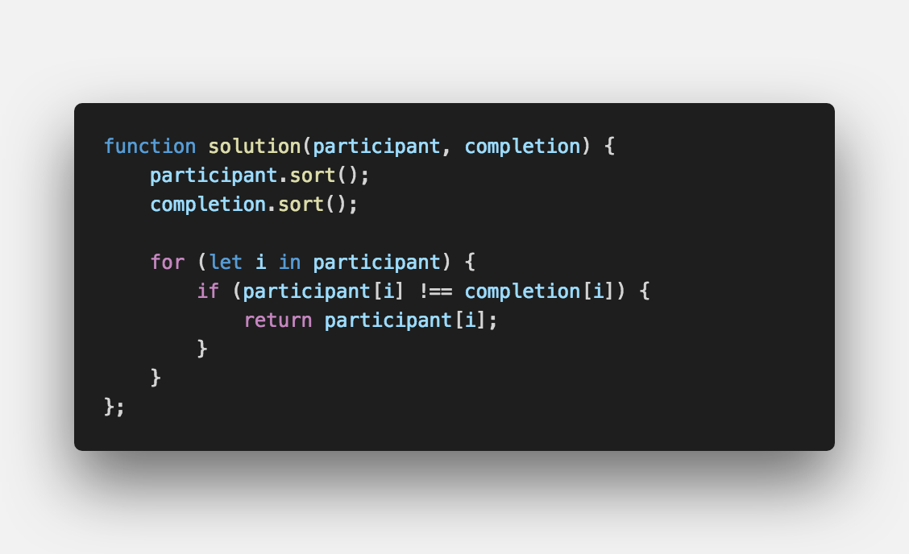

<strong>해시는 Key-value쌍으로 데이터를 저장하는 자료구조입니다.</strong>

 

## **💎 목차**
  * [문제 설명 (Problem)](#-문제-설명)
  * [제한 사항 (Limitations)](#-제한-사항)
  * [입출력 예 (Example)](#-입출력-예)
  * [문제 풀이 (Solution)](#-문제-풀이)

## **📕 문제 설명**

- 수 많은 마라톤 선수들이 마라톤에 참여하였습니다. 단 한명의 선수를 제외하고는 모든 선수가 마라톤을 완주하였습니다.

- 마라톤에 참여한 선수들의 이름이 담긴 배열 participant와 완주한 선수들의 이름이 담긴 배열 completion이 주어질 때, 

- 완주하지 못한 선수의 이름을 return 하도록 solution 함수를 작성해주세요.

 

**[⬆ 목차](#-목차)**

---

## **🔖 제한 사항**

- 마라톤 경기에 참여한 선수의 수는 1명 이상 100,000명 이하입니다.

- completion의 길이는 participant의 길이보다 1 작습니다.

- 참가자의 이름은 1개 이상 20개 이하의 알파벳 소문자로 이루어져 있습니다.

- 참가자 중에는 동명이인이 있을 수 있습니다.

 

**[⬆ 목차](#-목차)**

---

## **📙 입출력 예**

 

**[⬆ 목차](#-목차)**

---

## **📘 문제 풀이**

 

**[⬆ 목차](#-목차)**

---

 

> 출처
>
> <a href="https://programmers.co.kr/learn/courses/30/lessons/42576" target="_blank">코딩테스트 연습 > 해시 > 완주하지 못한 선수</a>

# 여러분의 댓글이 큰힘이 됩니다. (๑•̀ㅂ•́)و✧
