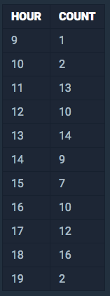

<center><strong style="color:#FDE2BF">프로그래머스</strong>에서 주최하는 SQL 문제 풀이</center>

<br />

## **💎 목차**

- [문제 설명 (Problem)](#-문제-설명)
- [입출력 예 (Example)](#-입출력-예)
- [문제 풀이 (Solution)](#-문제-풀이)

## **📕 문제 설명**

- `ANIMAL_OUTS` 테이블은 동물 보호소에서 입양 보낸 동물의 정보를 담은 테이블입니다.

- `ANIMAL_OUTS` 테이블 구조는 다음과 같으며,

- `ANIMAL_ID`, `ANIMAL_TYPE`, `DATETIME`, `NAME`, `SEX_UPON_INTAKE`는

- 각각 동물의 아이디, 생물 종, 입양일, 이름, 성별 및 중성화 여부를 나타냅니다.

<br />


<br />

- 보호소에서는 몇 시에 입양이 가장 활발하게 일어나는지 알아보려 합니다.

- 9시부터 19시까지, 각 시간대별로 입양이 몇 건이나 발생했는지 조회하는 SQL문을 작성해주세요.

- 이때 결과는 `시간대`**순** 으로 정렬해야 합니다.

<br />

**[⬆ 목차](#-목차)**

---

## **📙 입출력 예**

SQL문을 실행하면 다음과 같이 출력되어야 합니다.


<br />

**[⬆ 목차](#-목차)**

---

## **📘 문제 풀이**

```js

SELECT HOUR('DATETIME') AS 'HOUR', COUNT('DATETIME') AS 'COUNT'
FROM 'ANIMAL_OUTS'
WHERE HOUR('DATETIME') >= 9 AND HOUR('DATEITME') <= 19
GROUP BY 'HOUR'
ORDER BY 'HOUR' ASC

```

<br />

**[⬆ 목차](#-목차)**

---

<br />

> 출처
>
> <a href="https://programmers.co.kr/learn/courses/30/lessons/59412" target="_blank">코딩테스트 연습 > GROUP BY > 입양 시각 구하기(1)</a>

# 여러분의 댓글이 큰힘이 됩니다. (๑•̀ㅂ•́)و✧
