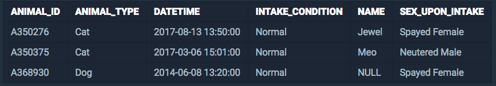
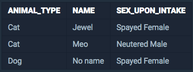

<center><strong style="color:#FDE2BF">프로그래머스</strong>에서 주최하는 SQL 문제 풀이</center>

<br />

## **💎 목차**

- [문제 설명 (Problem)](#-문제-설명)
- [입출력 예 (Example)](#-입출력-예)
- [문제 풀이 (Solution)](#-문제-풀이)

## **📕 문제 설명**

- `ANIMAL_INS` 테이블은 동물 보호소에 들어온 동물의 정보를 담은 테이블입니다.

- `ANIMAL_INS` 테이블 구조는 다음과 같으며,

- `ANIMAL_ID`, `ANIMAL_TYPE`, `DATETIME`, `INTAKE_CONDITION`, `NAME`, `SEX_UPON_INTAKE`는

- 각각 동물의 아이디, 생물 종, 보호 시작일, 보호 시작 시 상태, 이름, 성별 및 중성화 여부를 나타냅니다.

<br />


<br />

- 입양 게시판에 동물 정보를 게시하려 합니다.

- 동물의 생물 종, 이름, 성별 및 중성화 여부를 `아이디` **순** 으로 조회하는 SQL문을 작성해주세요.

- 이때 프로그래밍을 모르는 사람들은 NULL이라는 기호를 모르기 떼문에,

- 이름이 없는 동물의 이름은 `No name`으로 표시해 주세요.

<br />

**[⬆ 목차](#-목차)**

---

## **📙 입출력 예**

- 예를 들어 `ANIMAL_INS` 테이블이 다음과 같다면


<br />

- 마지막 줄의 개는 이름이 없기 때문에,

- 이 개의 이름은 `No name`으로 표시합니다.

- 따라서 SQL문을 실행하면 다음과 같이 출력되어야 합니다.

<br />


<br />

**[⬆ 목차](#-목차)**

---

## **📘 문제 풀이**

```js

SELECT 'ANIMAL_TYPE', IFNULL('NAME', 'No name') AS 'NAME', 'SEX_UPON_INTAKE'
FROM 'ANIMAL_INS'
ORDER BY 'ANIMAL_ID' ASC

```

<br />

**[⬆ 목차](#-목차)**

---

<br />

> 출처
>
> <a href="https://programmers.co.kr/learn/courses/30/lessons/59410" target="_blank">코딩테스트 연습 > IS NULL > NULL 처리하기</a>

# 여러분의 댓글이 큰힘이 됩니다. (๑•̀ㅂ•́)و✧
