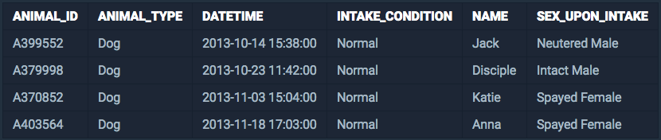

<center><strong style="color:#fbc2eb">프로그래머스</strong>에서 주최하는 SQL 문제 풀이</center>

<br />

<center>보호소에 가장 먼저 들어온 동물은 누구일까요?🤔<br />테이블을 뒤져 통계를 내어봅시다.</center>

## **💎 목차**
  * [문제 설명 (Problem)](#-문제-설명)
  * [입출력 예 (Example)](#-입출력-예)
  * [문제 풀이 (Solution)](#-문제-풀이)

## **📕 문제 설명**

- `ANIMAL_INS` 테이블은 동물 보호소에 들어온 동물의 정보를 담은 테이블입니다.

- `ANIMAL_INS` 테이블 구조는 다음과 같으며,

- `ANIMAL_ID`, `ANIMAL_TYPE`, `DATETIME`, `INTAKE_CONDITION`, `NAME`, `SEX_UPON_INTAKE`는

- 각각 동물의 아이디, 생물 종, 보호 시작일, 보호 시작 시 상태, 이름, 성별 및 중성화 여부를 나타냅니다.

<br />


<br />

- 동물 보호소에 가장 먼저 들어온 동물은 언제 들어왔는지 조회하는 SQL 문을 작성해주세요.

<br />

**[⬆ 목차](#-목차)**

---

## **📙 입출력 예**

- 예를 들어 `ANIMAL_INS` 테이블이 다음과 같다면


<br />

- 가장 먼저 들어온 동물은 `Jack`이고, `2013-10-14 15:38:00`에 들어왔습니다.

- 따라서 SQL문을 실행하면 다음과 같이 나와야 합니다.


<br />

**[⬆ 목차](#-목차)**

---

## **📘 문제 풀이**

```js

SELECT MIN('ANIMAL_ID')
FROM 'ANIMAL_INS'

```

<br />

**[⬆ 목차](#-목차)**

---

<br />

> 출처
>
> <a href="https://programmers.co.kr/learn/courses/30/lessons/59038" target="_blank">코딩테스트 연습 > SQL > 최솟값 구하기</a>

#여러분의 댓글이 큰힘이 됩니다. (๑•̀ㅂ•́)و✧
