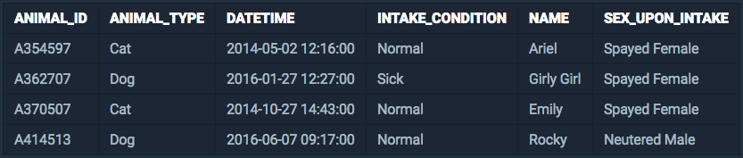
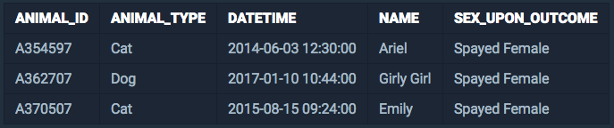
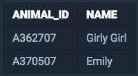

<center><strong style="color:#FDE2BF; font-size: 20px;">프로그래머스</strong>에서 주최하는 SQL 문제 풀이</center>

<br />

## **💎 목차**

- [문제 설명 (Problem)](#-문제-설명)
- [입출력 예 (Example)](#-입출력-예)
- [문제 풀이 (Solution)](#-문제-풀이)

## **📕 문제 설명**

- `ANIMAL_INS` 테이블은 동물 보호소에 들어온 동물의 정보를 담은 테이블입니다.

- `ANIMAL_INS` 테이블 구조는 다음과 같으며,

- `ANIMAL_ID`, `ANIMAL_TYPE`, `DATETIME`, `INTAKE_CONDITION`, `NAME`, `SEX_UPON_INTAKE`는

- 각각 동물의 아이디, 생물 종, 보호 시작일, 보호 시작 시 상태, 이름, 성별 및 중성화 여부를 나타냅니다.

<br />


<br />

- `ANIMAL_OUTS` 테이블은 동물 보호소에서 입양 보낸 동물의 정보를 담은 테이블입니다.

- `ANIMAL_OUTS` 테이블 구조는 다음과 같으며,

- `ANIMAL_ID`, `ANIMAL_TYPE`, `DATETIME`, `NAME`, `SEX_UPON_INTAKE`는

- 각각 동물의 아이디, 생물 종, 입양일, 이름, 성별 및 중성화 여부를 나타냅니다.

<br />


<br />

- 입양을 간 동물 중, 보호 기간이 가장 길었던 동물 두 마리의 아이디와 이름을 조회하는 SQL문을 작성해주세요.

- 이때 결과는 보호 기간이 긴 순으로 조회해야 합니다.

<br />

**[⬆ 목차](#-목차)**

---

## **📙 입출력 예**

- 예를 들어, `ANIMAL_INS` 테이블과 `ANIMAL_OUTS` 테이블이 다음과 같다면

**ANIMAL_INS**


<br />

**ANIMAL_OUTS**


<br />

SQL문을 실행하면 다음과 같이 나와야 합니다.

<br />


<br />

- 입양을 간 동물이 2마리 이상인 경우만 입력으로 주어집니다.

<br />

**[⬆ 목차](#-목차)**

---

## **📘 문제 풀이**

```js

SELECT 'OUTS.ANIMAL_ID', 'OUTS.NAME'
FROM 'ANIMAL_INS' AS 'INS'
RIGHT JOIN 'ANIMAL_OUTS' AS 'OUTS' ON 'INS.ANIMAL_ID' = 'OUTS.ANIMAL_ID'
ORDER BY DATEDIFF('OUTS.DATETIME', 'INS.DATETIME') DESC
LIMIT 2

```

<br />

**[⬆ 목차](#-목차)**

---

<br />

> 출처
>
> <a href="https://programmers.co.kr/learn/courses/30/lessons/59411" target="_blank">코딩테스트 연습 > String, Date > 오랜 기간 보호한 동물(2)</a>

# 여러분의 댓글이 큰힘이 됩니다. (๑•̀ㅂ•́)و✧
