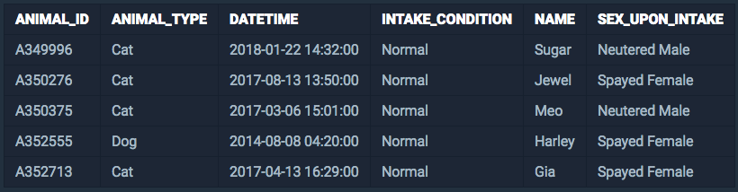
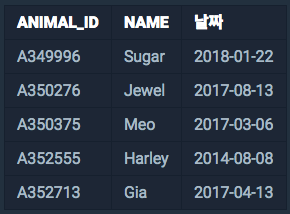

<center><strong style="color:#FDE2BF">프로그래머스</strong>에서 주최하는 SQL 문제 풀이</center>

<br />

## **💎 목차**

- [문제 설명 (Problem)](#-문제-설명)
- [입출력 예 (Example)](#-입출력-예)
- [문제 풀이 (Solution)](#-문제-풀이)

## **📕 문제 설명**

- `ANIMAL_INS` 테이블은 동물 보호소에 들어온 동물의 정보를 담은 테이블입니다.

- `ANIMAL_INS` 테이블 구조는 다음과 같으며,

- `ANIMAL_ID`, `ANIMAL_TYPE`, `DATETIME`, `INTAKE_CONDITION`, `NAME`, `SEX_UPON_INTAKE`는

- 각각 동물의 아이디, 생물 종, 보호 시작일, 보호 시작 시 상태, 이름, 성별 및 중성화 여부를 나타냅니다.

<br />


<br />

- `ANIMAL_INS` 테이블에 등록된 모든 레코드에 대해, 각 동물의 아이디와 이름, 들어온 날짜를 조회하는 SQL문을 작성해주세요.

- 이때 결과는 **아이디 순** 으로 조회해야 합니다.

- 들어온 날짜는 시각(시-분-초)을 제외한 날짜(년-월-일)만 보여주세요.

<br />

**[⬆ 목차](#-목차)**

---

## **📙 입출력 예**

- 예를 들어, `ANIMAL_INS` 테이블이 다음과 같다면


<br />

SQL문을 실행하면 다음과 같이 나와야 합니다.

<br />


<br />

**[⬆ 목차](#-목차)**

---

## **📘 문제 풀이**

```js

SELECT 'ANIMAL_ID', 'NAME', DATE_FORMAT('DATETIME', '%Y-%m-%d') AS '날짜'
FROM 'ANIMAL_INS'
ORDER BY 'ANIMAL_ID' ASC

```

<br />

**[⬆ 목차](#-목차)**

---

<br />

> 출처
>
> <a href="https://programmers.co.kr/learn/courses/30/lessons/59414" target="_blank">코딩테스트 연습 > String, Date > DATETIME에서 DATE로 형 변환</a>

# 여러분의 댓글이 큰힘이 됩니다. (๑•̀ㅂ•́)و✧
