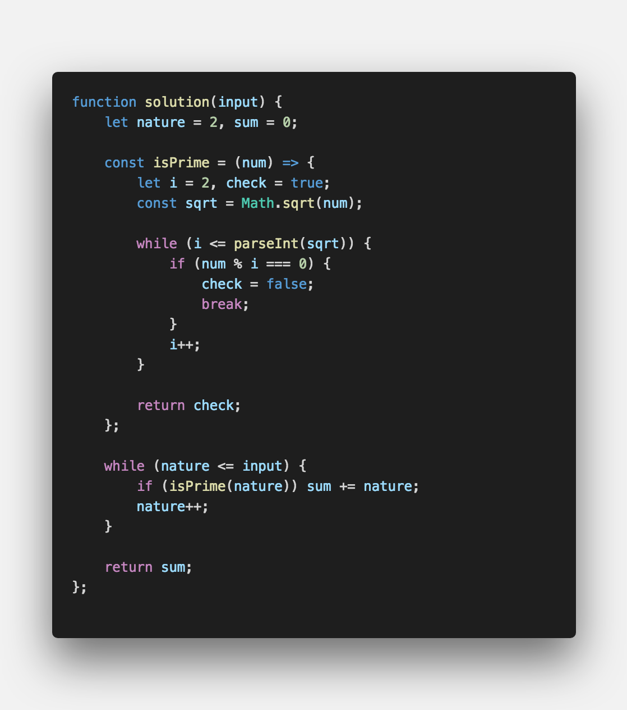

<center><strong>어떠한 문제를 해결하기 위해 정해진 절차나 방법을 공식화</strong></center>

<br />

## **💎 목차**

- [문제 설명 (Problem)](#-문제-설명)
- [입출력 예 (Example)](#-입출력-예)
- [문제 풀이 (Solution)](#-문제-풀이)

## **📕 문제 설명**

- n 이하 `소수의 합`을 구하시오.

<br />

**[⬆ 목차](#-목차)**

---

## **📙 입출력 예**

```js
Input: 10
Output: 17 // 2 + 3 + 5 + 7 = 17
```

<br />

**[⬆ 목차](#-목차)**

---

## **📘 문제 풀이**


<br />

**[⬆ 목차](#-목차)**

---

<br />

> 출처
>
> <a href="http://euler.synap.co.kr/prob_detail.php?id=10" target="_blank">Project Euler > Problem 10</a>

# 여러분의 댓글이 큰힘이 됩니다. (๑•̀ㅂ•́)و✧
