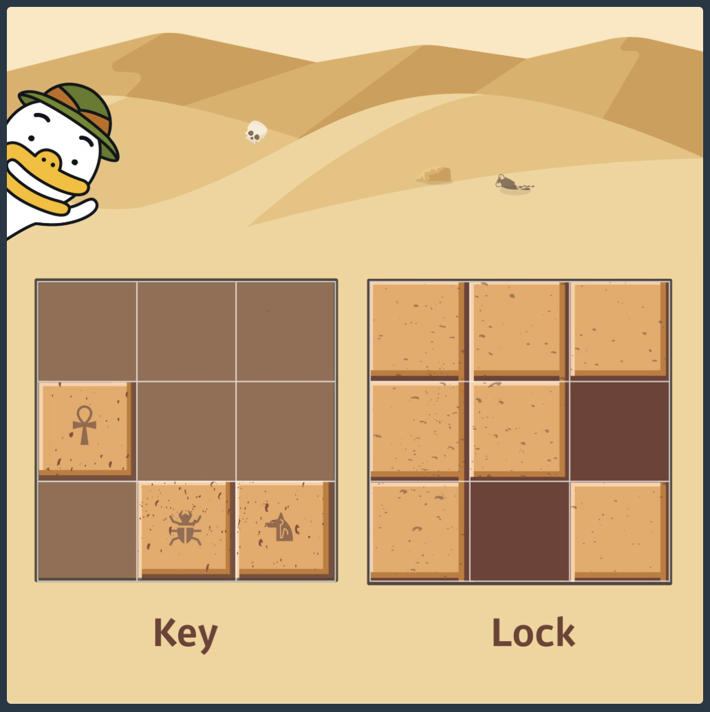

<!-- ---
title: ' 카카오 블라인드 ▻ 프로그래밍 3 '
date: 2019-09-07 15:00:00
category: 'Coding Test'
---

<strong style="font-size: 20px;">2020 KAKAO BLIND RECRUITMENT</strong>

 

## **💎 목차**

- [문제 설명 (Problem)](#-문제-설명)
- [제한 사항 (Limitations)](#-제한-사항)
- [입출력 예 (Example)](#-입출력-예)
- [문제 풀이 (Solution)](#-문제-풀이)

## **📕 문제 설명**

- 고고학자인 튜브는 고대 유적지에서 보물과 유적이 가득할 것으로 추정되는 비밀의 문을 발견하였습니다.

- 그런데 문을 열려고 살펴보니 특이한 형태의 자물쇠로 잠겨 있었고 문 앞에는 특이한 형태의 열쇠와 함께 자물쇠를 푸는 방법에 대해 다음과 같이 설명해 주는 종이가 발견되었습니다.

- 잠겨있는 자물쇠는 격자 한 칸의 크기가 1 x 1인 N x N 크기의 정사각 격자 형태이고 특이한 모양의 열쇠는 M x M 크기인 정사각 격자 형태로 되어 있습니다.

- 자물쇠에는 홈이 파여 있고 열쇠 또한 홈과 돌기 부분이 있습니다.

- 열쇠는 회전과 이동이 가능하며 열쇠의 돌기 부분을 자물쇠의 홈 부분에 딱 맞게 채우면 자물쇠가 열리게 되는 구조입니다.

- 자물쇠 영역을 벗어난 부분에 있는 열쇠의 홈과 돌기는 자물쇠를 여는 데 영향을 주지 않지만,

- 자물쇠 영역 내에서는 열쇠의 돌기 부분과 자물쇠의 홈 부분이 정확히 일치해야 하며 열쇠의 돌기와 자물쇠의 돌기가 만나서는 안됩니다.

- 또한 자물쇠의 모든 홈을 채워 비어있는 곳이 없어야 자물쇠를 열 수 있습니다.

- 열쇠를 나타내는 2차원 배열 key와 자물쇠를 나타내는 2차원 배열 lock이 매개변수로 주어질 때,

- 열쇠로 자물쇠를 열수 있으면 true를, 열 수 없으면 false를 return 하도록 solution 함수를 완성해주세요.

 

**[⬆ 목차](#-목차)**

---

## **🔖 제한 사항**

- key는 M x M(3 ≤ M ≤ 20, M은 자연수)크기 2차원 배열입니다.

- lock은 N x N(3 ≤ N ≤ 20, N은 자연수)크기 2차원 배열입니다.

- M은 항상 N 이하입니다.

- key와 lock의 원소는 0 또는 1로 이루어져 있습니다.
  - 0은 홈 부분, 1은 돌기 부분을 나타냅니다.

 

**[⬆ 목차](#-목차)**

---

## **📙 입출력 예**

 

**입출력 예에 대한 설명**

 

- key를 시계 방향으로 90도 회전하고, 오른쪽으로 한 칸, 아래로 한 칸 이동하면 lock의 홈 부분을 정확히 모두 채울 수 있습니다.

 

**[⬆ 목차](#-목차)**

---

## **📘 문제 풀이**

풀이는 추후
 

**[⬆ 목차](#-목차)**

---

 

> 출처
>
> <a href="https://programmers.co.kr/tryouts/9846/challenges/33725" target="_blank">온라인 코딩테스트 > 프로그래밍 3</a>

# 여러분의 댓글이 큰힘이 됩니다. (๑•̀ㅂ•́)و✧ -->
