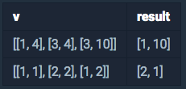

<!-- ---
title: ' 카카오 블라인드 ▻ 데모 테스트 1 '
date: 2019-09-06 17:58:00
category: 'Coding Test'
---

<strong>2020 KAKAO BLIND RECRUITMENT</strong>

 

## **💎 목차**

- [문제 설명 (Problem)](#-문제-설명)
- [제한 사항 (Limitations)](#-제한-사항)
- [입출력 예 (Example)](#-입출력-예)
- [문제 풀이 (Solution)](#-문제-풀이)

## **📕 문제 설명**

- 직사각형을 만드는 데 필요한 4개의 점 중 3개의 좌표가 주어질 때,

- 나머지 한 점의 좌표를 구하려고 합니다.

- 점 3개의 좌표가 들어있는 배열 v가 매개변수로 주어질 때,

- 직사각형을 만드는 데 필요한 나머지 한 점의 좌표를 return 하도록 solution 함수를 완성해주세요.

- 단, 직사각형의 각 변은 x축, y축에 평행하며,

- 반드시 직사각형을 만들 수 있는 경우만 입력으로 주어집니다.

 

**[⬆ 목차](#-목차)**

---

## **🔖 제한 사항**

- v는 세 점의 좌표가 들어있는 2차원 배열입니다.

- v의 각 원소는 점의 좌표를 나타내며, 좌표는 [x축 좌표, y축 좌표] 순으로 주어집니다.

- 좌표값은 1 이상 10억 이하의 자연수입니다.

- 직사각형을 만드는 데 필요한 나머지 한 점의 좌표를 [x축 좌표, y축 좌표] 순으로 담아 return 해주세요.

 

**[⬆ 목차](#-목차)**

---

## **📙 입출력 예**

 

- 입출력 예 #1

  - 세 점이 [1, 4], [3, 4], [3, 10] 위치에 있을 때, [1, 10]에 점이 위치하면 직사각형이 됩니다.

- 입출력 예 #2
  - 세 점이 [1, 1], [2, 2], [1, 2] 위치에 있을 때, [2, 1]에 점이 위치하면 직사각형이 됩니다.

 

**[⬆ 목차](#-목차)**

---

## **📘 문제 풀이**

풀이는 추후
 

**[⬆ 목차](#-목차)**

---

 

> 출처
>
> <a href="https://programmers.co.kr/tryouts/3930/challenges/11622" target="_blank">온라인 코딩테스트 > 프로그래밍 1</a>

# 여러분의 댓글이 큰힘이 됩니다. (๑•̀ㅂ•́)و✧ -->
