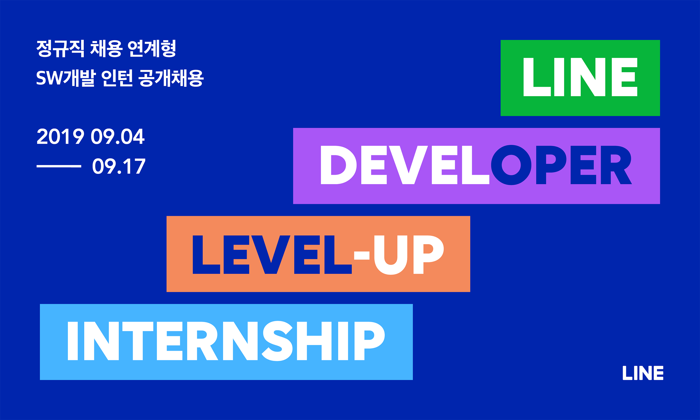

<!-- ---
title: ' LINE 인턴 채용 ▻ 코딩테스트 '
date: 2019-09-19 14:00:00
category: 'Coding Test'
---



<center>2019년 상반기 <strong style="color:#72F35D; font-size: 20px;">LINE 인턴 채용 코딩테스트</strong></center>

<br />

## **💎 목차**

- [문제 설명 (Problem)](#-문제-설명)
- [제한 사항 (Limitations)](#-제한-사항)
- [입출력 예 (Example)](#-입출력-예)
- [문제 풀이 (Solution)](#-문제-풀이)

## **📕 문제 설명**

- 연인 코니와 브라운은 광활한 들판에서 ‘나 잡아 봐라’ 게임을 한다.

- 이 게임은 브라운이 코니를 잡거나, 코니가 너무 멀리 달아나면 끝난다.

- 게임이 끝나는데 걸리는 최소 시간을 구하시오.

<br />

**[⬆ 목차](#-목차)**

---

## **🔖 제한 사항**

- 코니는 처음 위치 C에서 1초 후 1만큼 움직이고, 이후에는 가속이 붙어 매 초마다 이전 이동 거리 + 1만큼 움직인다.

- 즉 시간에 따른 코니의 위치는 C, C + 1, C + 3, C + 6, …이다.

- 브라운은 현재 위치 B에서 다음 순간 B – 1, B + 1, 2 \* B 중 하나로 움직일 수 있다.

- 코니와 브라운의 위치 p는 조건 0 <= x <= 200,000을 만족한다.

- 브라운은 범위를 벗어나는 위치로는 이동할 수 없고, 코니가 범위를 벗어나면 게임이 끝난다.

**입력 형식**

- 표준 입력의 첫 줄에 코니의 위치 C와 브라운의 위치 B를 공백으로 구분하여 순서대로 읽는다.

**출력 형식**

- 브라운이 코니를 잡을 수 있는 최소시간 N초를 표준 출력한다.

- 단 브라운이 코니를 잡지 못한 경우에는 -1을 출력한다.

<br />

**[⬆ 목차](#-목차)**

---

## **📙 입출력 예**

```js

Input: 11 2
Output: 5

코니의 위치: 11 → 12 → 14 → 17 → 21 → 26

브라운의 위치: 2 → 3 → 6 → 12 → 13 → 26

브라운은 코니를 5초 만에 잡을 수 있다.

```

<br />

**[⬆ 목차](#-목차)**

---

## **📘 문제 풀이**

풀이는 추후
<br />

**[⬆ 목차](#-목차)**

---

<br />

> 출처
>
> <a href="https://engineering.linecorp.com/ko/blog/2019-firsthalf-line-internship-recruit-coding-test/" target="_blank">2019년 상반기 LINE 인턴 채용 코딩테스트</a>

# 여러분의 댓글이 큰힘이 됩니다. (๑•̀ㅂ•́)و✧ -->
