
구글이 개발중인 <strong style="color:#666666; font-size: 20px;">프리웨어 웹 브라우저</strong>이다.

## **💎 목차**

- [서론 (Introduction)](#-서론)
- [본론 (Main)](#-본론)
- [결론 (Conclusion)](#🥀-결론)

## **🌱 서론**

안녕하세요~ 👋

오늘의 주제는 제가 즐겨쓰는 웹 브라우저 **Google Chrome** EXTENSIONS에 대해 알아보겠습니다.

개발에 용이한 패키지들을 제공하는데요

제가 사용하는 EXTENSIONS 위주로 설명하겠습니다. 😝

크롬 EXTENSIONS는 [링크](https://chrome.google.com/webstore/category/extensions?hl=ko)를 통해서 다운로드가 가능합니다.

참고, 저는 웹 개발를 중점으로 개발합니다.

 

**[⬆ 목차](#-목차)**

---

## **🌹 본론**

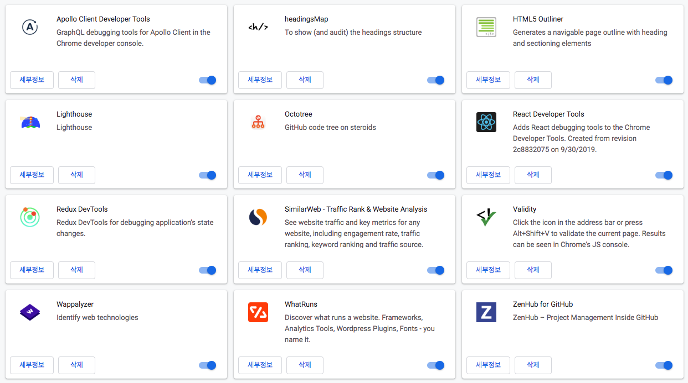
 

현재 사용하고 있는 EXTENSIONS는 다음과 같습니다.

이제 차근차근 하나씩 살펴 보겠습니다.

### **▸ Apollo Client Developer Tools**

[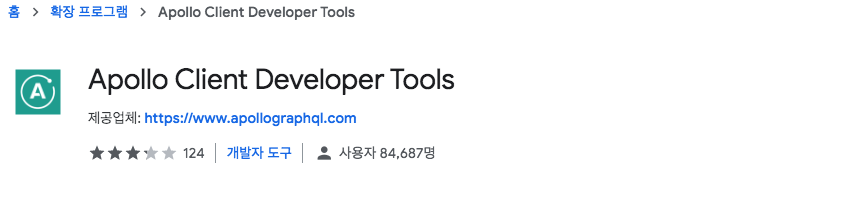](https://chrome.google.com/webstore/detail/apollo-client-developer-t/jdkknkkbebbapilgoeccciglkfbmbnfm)
 

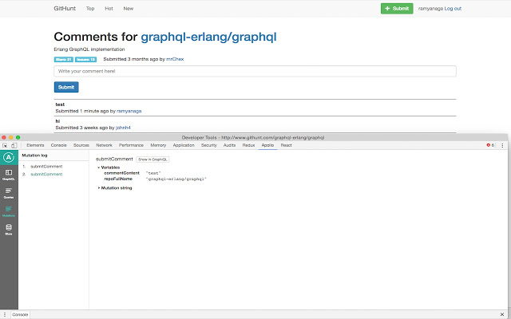
 

`GraphQL + Apollo`로 개발하시는 분들께 추천드립니다.

Apollo Client용 GraphQL 디버깅 도구입니다.

Playground를 자동으로 제공해줍니다.

 

### **▸ headingsMap**

 

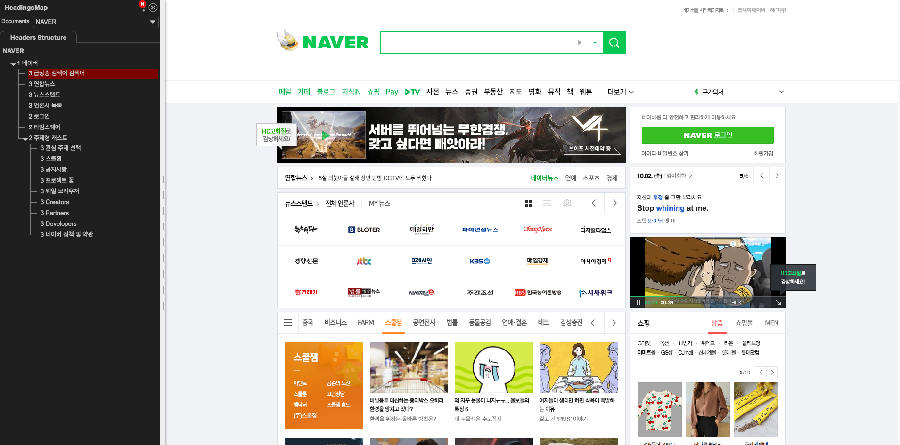
 

HTML5 구조를 파악해주는 도구입니다.

 

### **▸ HTML5 Outliner**

 

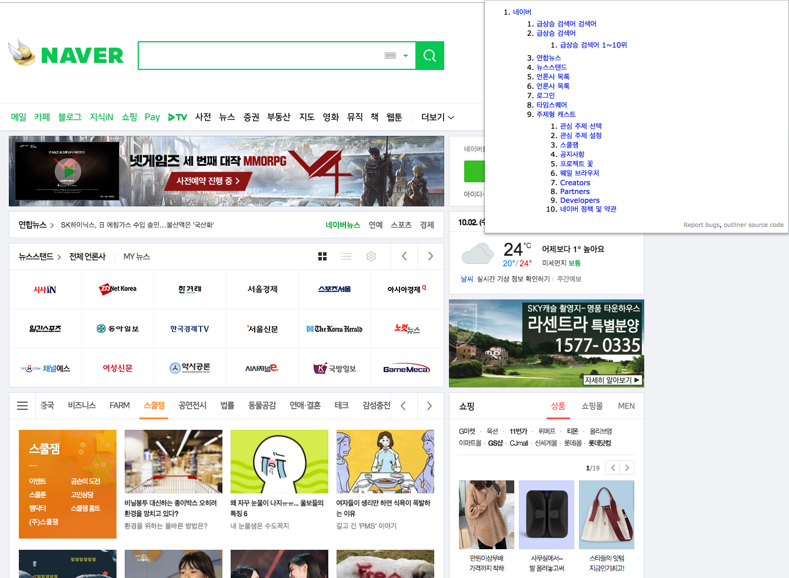
 

HTML5 구조를 파악해주는 도구입니다.

 

### **▸ Lighthouse**

[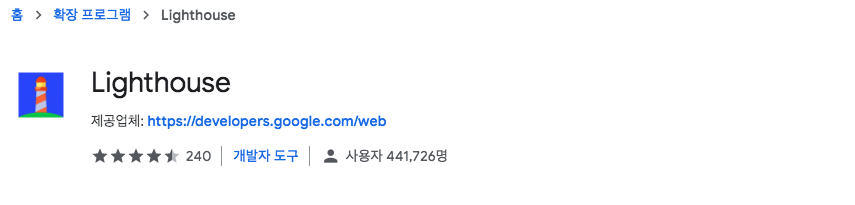](https://chrome.google.com/webstore/detail/lighthouse/blipmdconlkpinefehnmjammfjpmpbjk)
 

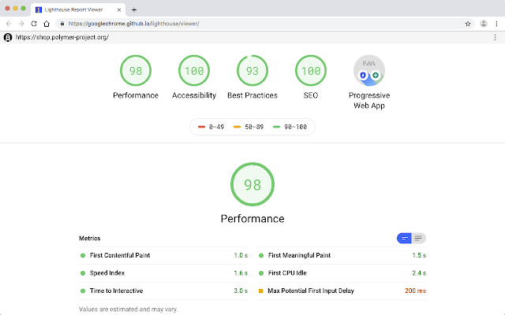
 

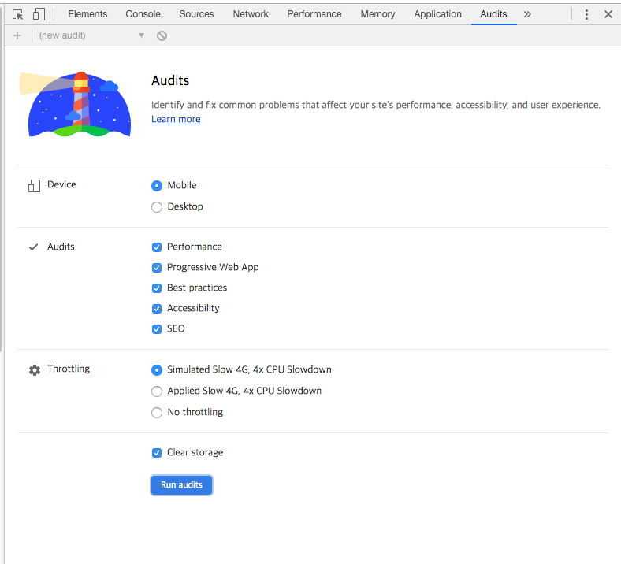
 

웹 앱의 성능, 품질 및 정확성을 개선하기위한 오픈 소스 자동 도구입니다.

페이지를 감사하여 성능에 대한 보고서를 생성합니다.

실패한 테스트를 앱 개선을 위해 수행 할 수 있는 작업에 대한 지표로 사용 할 수 있습니다.

또한, 확장 프로그램 설치가 아닌 `개발자 모드(F12) - Audits`에서도 사용이 가능합니다.

 

### **▸ Octotree**

 

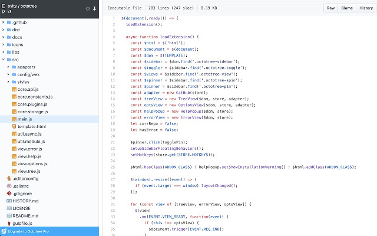
 

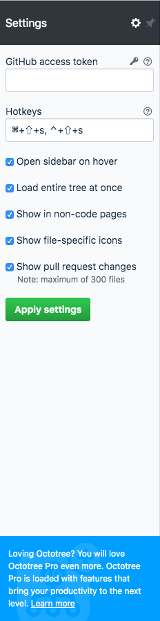
 

`GitHub`를 사용하시는 분들께 추천드립니다.

레포지토리를 탐색하는데 유용한 도구입니다.

`Private` 레포지토리 경우는 Setting을 통해서 확인도 가능합니다.

 

### **▸ React Developer Tools**

[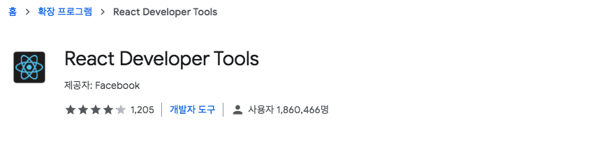](https://chrome.google.com/webstore/detail/react-developer-tools/fmkadmapgofadopljbjfkapdkoienihi)
 

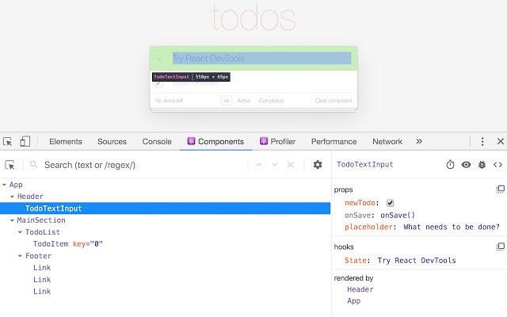
 

`React` 로 개발하시는 분들께 추천드립니다.

React 구성 요소 계층을 검사할 수 있는 개발 도구입니다.

 

### **▸ Redux DevTools**

[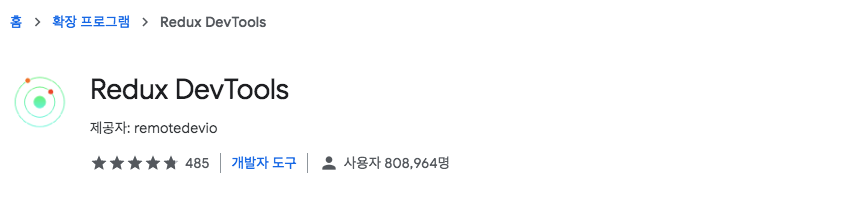](https://chrome.google.com/webstore/detail/redux-devtools/lmhkpmbekcpmknklioeibfkpmmfibljd)
 

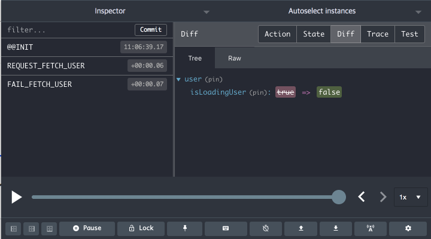
 

`Redux`로 개발하시는 분들께 추천드립니다.

Redux 개발 워크플로우 제공하는 도구입니다.

그 외에도 상태를 처리하는 다른 아키텍처와 함께 사용할 수 있습니다.

 

### **▸ SimilarWeb - Traffic Rank & Website Analysis**

 

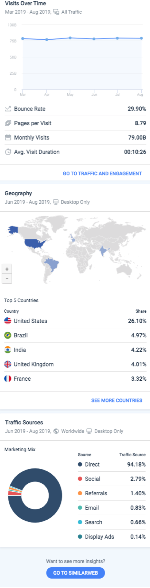
 

웹 사이트의 통계 및 전략에 대한 정보를 제공하는 도구입니다.

랭킹, 시간 지역 접속률, 접속 경로 등을 알려준다.

 

### **▸ Validity**

 

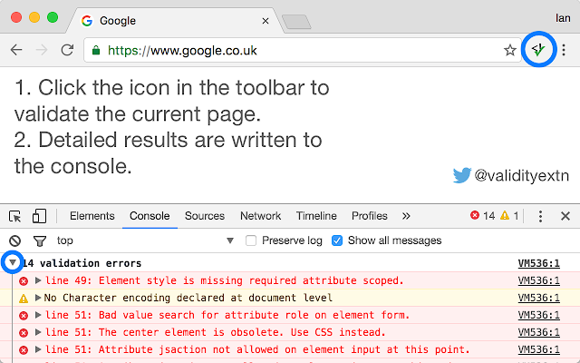
 

HTML 문서의 유효성 검사 도구입니다.

 

### **▸ Wappalyzer**

 

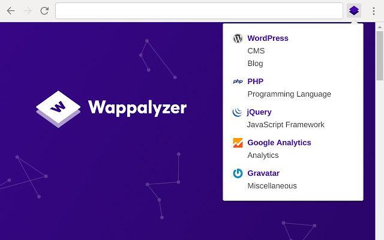
 

웹 사이트에서 사용되는 기술을 밝혀내는 크로스 플랫폼 유틸리티입니다.

컨텐츠 시스템, 전자 상거래 플랫폼, 웹 프레임 워크, 소프트웨어 버전, 분석 도구를 감지합니다.

 

### **▸ WhatRuns**

 

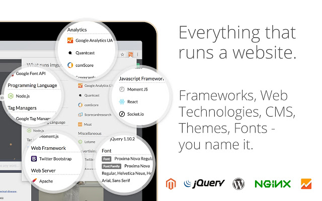
 

웹 사이트에서 사용되는 기술을 알려주는 도구입니다.

개발 도구, 광고, 플러그인, 테마에 이르기까지 새로운 도구와 서비스도 감지합니다.

 

### **▸ ZenHub for GitHub**

 

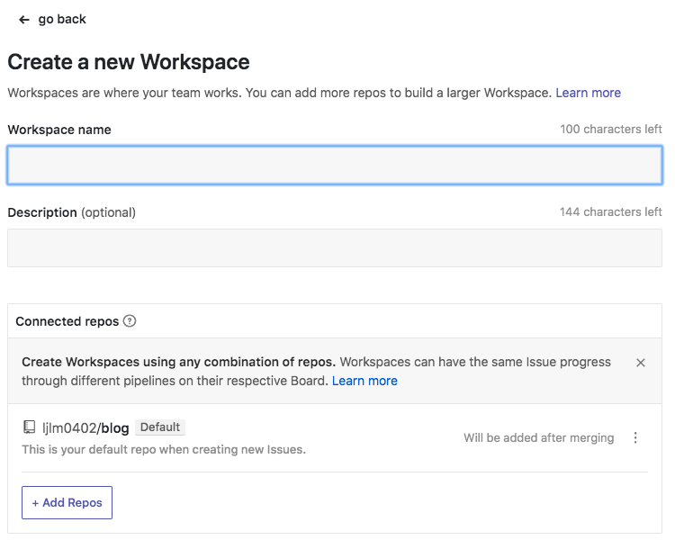
 

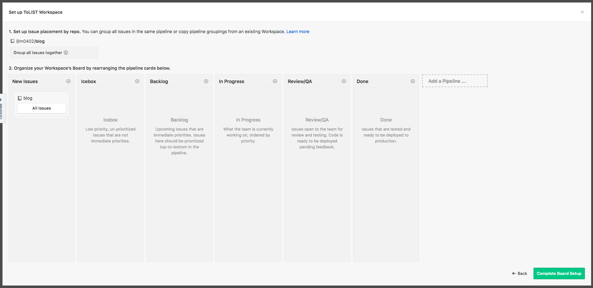
 

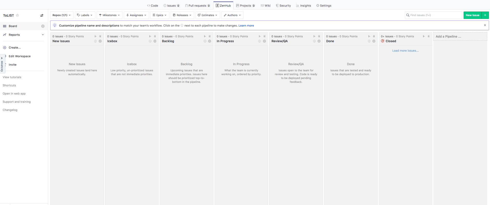
 

`GitHub`를 사용하시는 분들께 추천드립니다.

레포지토리 내에서 스케줄러를 작성하고 공유하는 도구입니다.

 

**[⬆ 목차](#-목차)**

---

## **🥀 결론**

끝까지 읽어주셔서 감사합니다. 👍🏻

구글 크롬에서 제공하는 확장프로그램은 편의를 위한 것이니 필수는 아닙니다.

그러므로 자신이 원하는 프로그램을 설치해보고 사용해보시는걸 권장합니다.

다음에도 좋은 자료로 여러분을 찾아뵙겠습니다.

감사합니다.

 

**[⬆ 목차](#-목차)**

---

 

# 여러분의 댓글이 큰힘이 됩니다. (๑•̀ㅂ•́)و✧
