
MS에서 제공하는 <strong style="color:#302D6C; font-size: 20px;">크로스 플랫폼 에디터</strong>

## **💎 목차**

- [서론 (Introduction)](#-서론)
- [본론 (Main)](#-본론)
- [결론 (Conclusion)](#🥀-결론)

## **🌱 서론**

안녕하세요~ 👋

오늘의 주제는 제가 즐겨쓰는 에디터 **VS Code** EXTENSIONS에 대해 알아보겠습니다.

개발에 용이한 패키지들을 제공하는데요

제가 사용하는 EXTENSIONS 위주로 설명하겠습니다. 😝

참고, 저는 `JavaScript`, `TypeScript` 중점 언어로 개발합니다.

 

**[⬆ 목차](#-목차)**

## **🌹 본론**

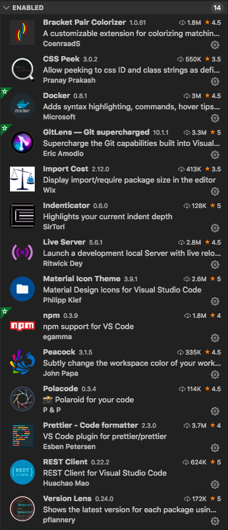

 

현재 사용하고 있는 EXTENSIONS는 다음과 같습니다.

이제 차근차근 하나씩 살펴 보겠습니다.

### **▸ Bracket Pair Colorizer**

<a href="https://marketplace.visualstudio.com/items?itemName=CoenraadS.bracket-pair-colorizer" target="_blank">VSC Extension Link</a>

 

 

대괄호를 색상으로 식별 할 수 있도록 해준다.

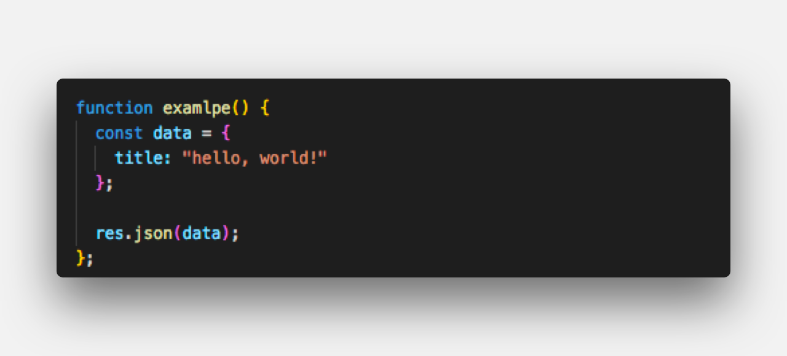

 

`function` 괄호는 노란색

`object` 선언은 분홍색으로 색상을

나뉘어 구별하기 쉽습니다.

기본적으로 `()` `{}` `[]` 를 제공하고 있습니다.

 

### **▸ CSS Peek**

<a href="https://marketplace.visualstudio.com/items?itemName=pranaygp.vscode-css-peek" target="_blank">VSC Extension Link</a>

 

 

클래스와 아이디에 한하여 CSS, SCSS 코드를 살펴볼수 있다.

 

`css` 연동 후 클래스네임을 비춰보면 `style`을 확인할 수 있다.

 

### **▸ Docker**

<a href="https://marketplace.visualstudio.com/items?itemName=ms-azuretools.vscode-docker" target="_blank">VSC Extension Link</a>

 

 

컨테이너화 된 응용프로그램을 빌드, 관리, 배포를 쉽게 할 수 있다.

 

플랫폼 엔진을 선택하면 자동으로 `Dockerfile`, `docker-compose.yml` 생성

 

### **▸ GitLens - Git supercharged**

<a href="https://marketplace.visualstudio.com/items?itemName=eamodio.gitlens" target="_blank">VSC Extension Link</a>

 

 

라인 또는 코드 블록이 변경된 사람, 이유, 시기를 신속하게 엿볼 수 있습니다.

 

- `ljlm0402` 아이디

- `4 days ago` 일자

- `first commit` 메시지

커밋에 관련한 정보를 볼수 있다.

 

### **▸ Import Cost**

<a href="https://marketplace.visualstudio.com/items?itemname=wix.vscode-import-cost" target="_blank">VSC Extension Link</a>

 

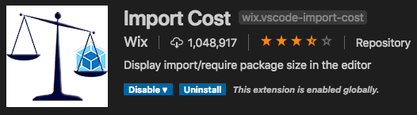

 

패키지의 크기를 인라인으로 표시합니다.

 

패키지 크기를 표시하여 효율적인 `import` 혹은 `require`를 한다.

 

### **▸ Indenticator**

<a href="https://marketplace.visualstudio.com/items?itemname=sirtori.indenticator" target="_blank">VSC Extension Link</a>

 

 

들여 쓰기 깊이를 시각적으로 강조 표시 합니다.

 

시각적인 표시로 코드를 이쁘게 작성하고 읽기도 편리하다.

 

### **▸ Live Server**

<a href="https://marketplace.visualstudio.com/items?itemName=ritwickdey.LiveServer" target="_blank">VSC Extension Link</a>

 

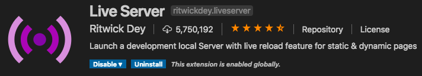

 

정적 및 동적 페이지를 위한 라이브 리로드 기능을 갖춘 개발 로컬 서버 서비스

 

정적 페이지를 라이브 로드로 실시간 업데이트가 편리하다.

 

### **▸ Material Icon Theme VS vscode-icons**

두가지의 폴더 및 파일 디자인 테마를 소개합니다.

저는 `Meterial Icon Theme`를 사용하고 있지만

많은 분들은 `vscode-icons`를 사용하고 있습니다.

각각에 대하여 소개하겠습니다.

 

#### **▸ Material Icon Theme**

<a href="https://marketplace.visualstudio.com/items?itemname=pkief.material-icon-theme" target="_blank">VSC Extension Link</a>

 

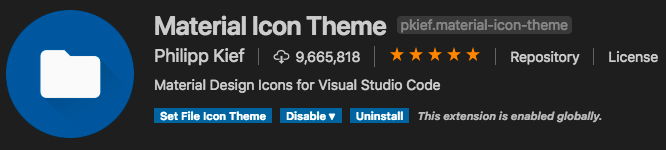

 

**File icons**

 

**Folder icons**

 

#### **▸ vscode-icons**

<a href="https://marketplace.visualstudio.com/items?itemname=vscode-icons-team.vscode-icons" target="_blank">VSC Extension Link</a>

 

 

 

원하시는 파일, 폴더 아이콘을 보시고

적용하시면 좋을것 같습니다. 🤣

또한, 그밖에 [테마 링크](https://marketplace.visualstudio.com/search?term=icon%20theme&target=VSCode&category=Themes&sortBy=Relevance)를 통해서 설치도 가능합니다.

 

### **▸ npm**

<a href="https://marketplace.visualstudio.com/items?itemName=eg2.vscode-npm-script" target="_blank">VSC Extension Link</a>

 

 

`package.json`파일에 정의 된 npm 스크립트를 실행하고,

정의 된 패키지에 대해 설치된 모듈의 유효성 검사를 합니다.

 

 

패키지 관리에 편리성을 제공한다.

 

### **▸ Peacock**

<a href="https://marketplace.visualstudio.com/items?itemName=johnpapa.vscode-peacock" target="_blank">VSC Extension Link</a>

 

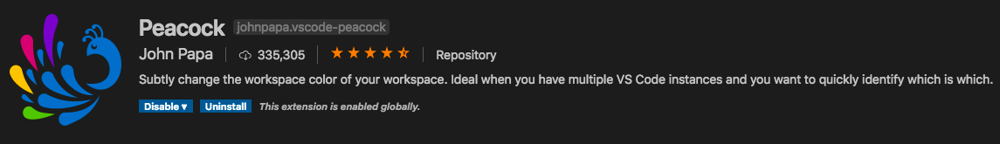

 

워크스페이스 색상을 변경해줍니다.

 

`CMD + Shift + P > Peacock: Enter a Color` 후, 원하시는 색상을 입력하시면 됩니다.

 

### **▸ Polacode**

<a href="https://marketplace.visualstudio.com/items?itemName=pnp.polacode" target="_blank">VSC Extension Link</a>

 

 

코드를 폴라로이드 형식의 캡쳐 지원 서비스

 

`CMD + Shift + P > Polacode` 로 실행, 해당 소스를 드래그하여 캡쳐한다.

 

### **▸ Prettier - Code formatter**

<a href="https://marketplace.visualstudio.com/items?itemName=esbenp.prettier-vscode" target="_blank">VSC Extension Link</a>

 

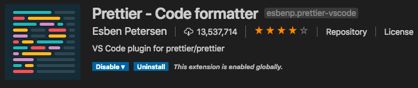

 

일관된 스타일을 적용하는 코드 포맷터입니다.

**before**

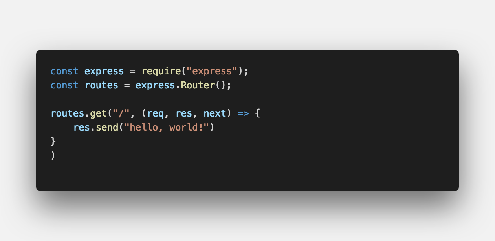

 

**after**

 

위 처럼 코드를 자동으로 세미콜론 및 정렬을 해줍니다.

1. `CMD + Shift + P > Format Document With`

2. `Configure Default Formatter..`

3. `Prettier - code formatter`

하면 (default)로 설정된다.

그러면 `CMD + K + F` 명령어를 통해 자동으로 formatter 적용

 

### **▸ REST Client**

<a href="https://marketplace.visualstudio.com/items?itemName=humao.rest-client" target="_blank">VSC Extension Link</a>

 

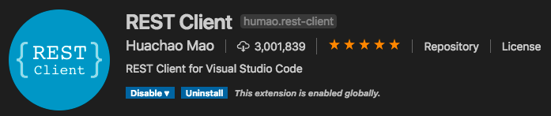

 

HTTP 요청을 보내고 직접 응답을 확인 할 수 있습니다.

**REST**

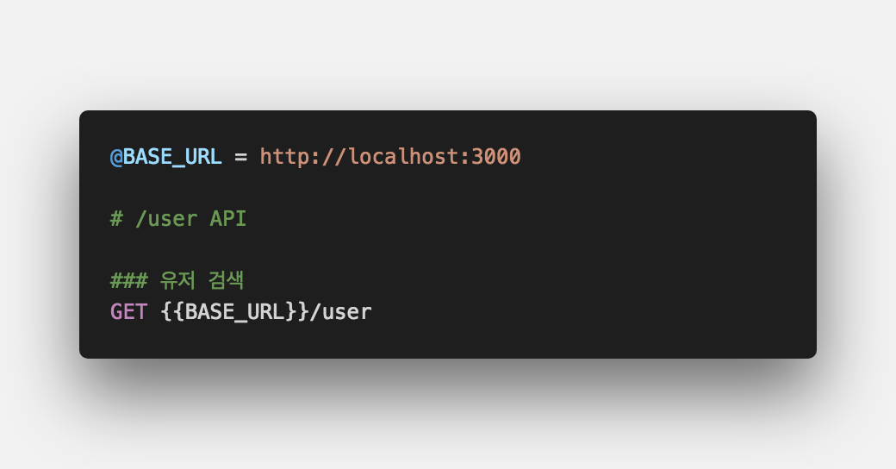

 

**Router**

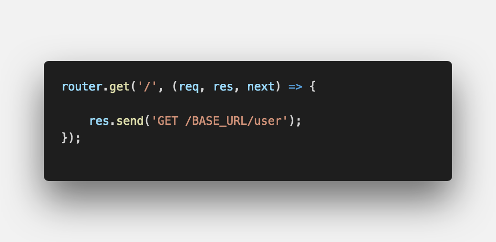

 

**Response**

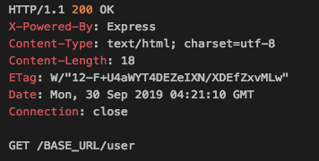

 

`Postman` 이나 `테스트 프레임워크`를 사용하지 않아도, vscode에서 직접 응답을 확인 할 수 있다.

 

### **▸ Version Lens**

<a href="https://marketplace.visualstudio.com/items?itemName=pflannery.vscode-versionlens" target="_blank">VSC Extension Link</a>

 

 

npm 패키지 버전 정보를 표시 합니다.

 

버전 텍스트를 바꾸지만 패키지는 자동으로 변경되지 않습니다.

그러므로 변경 후에는 반드시 `npm install`를 해줘야합니다.

 

**[⬆ 목차](#-목차)**

## **🥀 결론**

끝까지 읽어주셔서 감사합니다. 👍🏻

`EXTENSIONS`은 어디까지나 편의를 위한 것이니 필수는 아닙니다.

그러므로 자신이 원하는 모듈을 설치해보고 사용해보시는걸 권장합니다.

다음에도 좋은 자료로 여러분을 찾아뵙겠습니다.

감사합니다.

 

**[⬆ 목차](#-목차)**

 

# 여러분의 댓글이 큰힘이 됩니다. (๑•̀ㅂ•́)و✧
