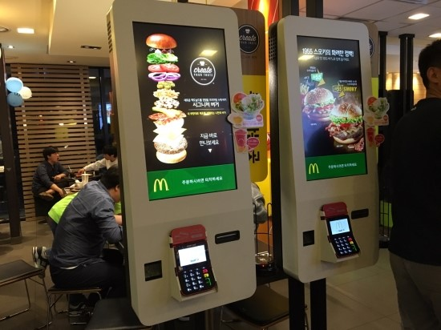
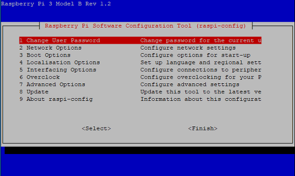

<center><strong style="color:#62B7B4">무인주문결제기</strong> 개발기</center>

## **💎 목차**
  * [서론 (Introduction)](#-서론)
  * [본론 (Main)](#-본론)
  * [결론 (Conclusion)](#🥀-결론)

## **🌱 서론**

태풍 링링 🌪 지니가고 쌀쌀한 가을 🍂이 왔습니다.

모두들 이제는 자켓을 걸치고 다녀야 할거같아요 :)

이번 주제는 첫 직장에서 개발했던 프로젝트에 대해 얘기해보자 합니다.

그 당시는 여러모로 고생했던 기억이 새록새록나네요 🤔

__키오스크 ?__

첫 직장에서는 키오스크를 개발하였습니다.

맨 처음 키오스크라는 얘기를 듣고는 이게 무엇인가 했습니다.

사전적 정의를 살펴보니 키오스크란, __무인 자동 결제기__ 라고 합니다.


<br />

일반적으로 패스트푸드점에서 볼수 있는 키오스크입니다.

키오스크를 생각하면 임베디드 영역이고 당연히 `C 언어`를 생각하여 걱정이 앞섰습니다.

왜냐하면 대학과정에서 `C 언어`는 1학년을 제외하고는 배운적이 없었고

그마저 군대라는 문턱으로 놀기만 바빠 1학년 지식은 머리속에는 없었습니다. 🤣

추가적으로 첫 직장은 `PHP기반의 ERP` 솔루션을 제공하여

자연스럽게 웹 기반인 키오스크를 개발 계획을 세웠습니다.

그 당시, 기획, 설계, 구현을 총괄하였으며, 

`Node Js` 처음으로 접했습니다. 🤩

<br />

**[⬆ 목차](#-목차)**

---

## **🌹 본론**

### **▸ 기술 스택**

2017년, `Node Js` 처음 접한 시점에서는 

키오스크는 임베디드 장비이다보니

어떤식으로 환경을 구축해야하는 막막하였지만

타겟보드 장비에 서버를 구동시키고 터치 스크린으로 페이지를 조작하는

매커니즘을 구성하여 진행해 보았습니다.

#### **▸ 타겟 보드**

대학교 시절, 사용해봤던 [Raspberry Pi](https://www.raspberrypi.org/)로 진행을 1차 개발을 진행하였고

OS는 [Raspbian](https://www.raspberrypi.org/downloads/) 이라는 `ubuntu` 설치했습니다.

그럼 차근차근 환경 셋팅을 해보겠습니다.

__1. 비밀번호 변경__

```sh

$ sudo raspi-config

```


<br />

해당 화면이 나타나면 `1. Change User Password` __Select__ 클릭

```sh

Enter new UNIX password : 비밀번호 입력 ( 숨김 )

Retype new UNIX password : 비밀번호 재확인 ( 숨김 )

passwd : password updated successfully ( 변경 성공 )

```

보안을 위해 비밀번호를 변경

<hr />

__2. 한글 설치__

```sh

$ sudo apt-get install -y ibus 

$ sudo apt-get install -y ibus-hangul

$ sudo apt-get install -y fonts-unfonts-core

$ sudo reboot

```

맨 처음 당시 한글이 깨지는 현상이 발생합니다. 

그러므로 한글을 설치해줘야합니다.

설치가 완료되면 `reboot`를 통해서 재부팅을 해줘야합니다.

<hr />

__3. 해상도 변경__

```sh

$ sudo nano /boot/config.txt

# 코멘트(#) 처리된 것들을 활성화 시켜준다.

hdmi_force_hotplug = 1

hdmi_group = 2

# 해상도 설정
hdmi_mode = N

# 1: 단순 영상, 2: 음성 출력
hdmmi_drive = 2 

```

출력하는 모니터 화면에 맞게 해상도를 조절하며 음성 출력까지 설정합니다.

`hdmi_group`는 1과 2로 나뉘는데,

1 = CEA : 텔레비전, 프로젝터 등을 위한 출력 스탠다드

2 = DMT : 일반적인 모니터

DMT의 경우는 `hdmi_mode`가 해상도에 따라 달라집니다. [해상도](http://studymake.blogspot.com/2015/04/blog-post_36.html) 참조

<hr />

__4. 절전모드 해제__

```sh

$ sudo nano /etc/lightdm/lightdm.conf

# before
#xserver-command = x 

# after #(코멘드) 제거 및 -s O -dpms 추가
xserver-command = x -s O -dpms

$ sudo reboot

```

장시간 대기 시 절전모드를 해제한다.

<hr />

__5. 스크린세이버 해제__

```sh

$ sudo nano /etc/X11/xinit/xinitrc

# 하단에 추가
xset s off
xset -dpms
xset s noblank

$ sudo reboot

```

마찬가지로 장시간 대기 시 스크린세이버 해제

<hr />

__6. 마우스 커서 숨기기__

```sh

$ sudo apt-get install unclutter

$ sudo nano ~/.config/lxsession/LXDE-pi/autostart

# 하단에 추가
@unclutter -idle 0

$ sudo reboot

```

<hr />

__7. 화면 회전__

```sh

$ sudo nano /boot/config.txt

display_rotate = 3 (0 = 0도, 1 = 90도, 2 = 180도, 3 = 270도)

```

모니터를 세로로 할지, 가로로 할지 판단 후에 설정 해준다.

<hr />

__8. 터치 보정__

```sh

$ nano /etc/X11/xorg.conf.d/90-rotate-screen.conf

# 단, xorg.conf.d 디렉토리가 존재하지 않을경우 
$ mkdir /etc/x11/xorg.conf.d

$ sudo nano /usr/share/X11/xorg.conf.d/90-rotate-screen.conf

# 아래 내용을 복사해서 붙여넣는다.
Section "Input Class"
     Identifier "RotateTouchCW"
     MatchProduct "ILITEK ILITEK-TP"
     Option "TransformationMatrix" "0 -1 1 1 0 0 0 0 1"
EndSection

```

세로 모드로 전환 시 터치가 이상하니 보정을 해준다.

<br />

<hr />

#### **▸ Node Js**

라즈베리파이 셋팅은 끝났으니 본격적으로 Node Js를 시작한다.

```sh

# node, npm 버전 확인
$ node -v && npm -v

# node가 설치 되어있을시 구버전을 삭제
$ sudo apt-get remove --purge nodejs 

# curl 통해 최신 버전 셋
$ curl -sL https://deb.nodesource.com/setup_10.x | sudo -E bash

# node 설치
$ sudo apt-get install -y nodejs

# node, npm 버전 확인
$ node -v && npm -v

# npm 버전 업데이트
$ npm install -g npm

```

`Node Js` 설치 완료

<br />

**[⬆ 목차](#-목차)**

---

## **🥀 결론**

이 처럼 기존 클라우드 환경에서 웹 페이지 구현이 아닌

타겟보드에 단일로 구성하는 방식으로 진행해보면서 

새롭게 느껴졋다. 또한 임베디드 제어를 JavaScript로도 가능하다는 점에서

더욱 신기함을 느낀거 같았다.

오늘 배운 내용을 정리하면

  1. [Raspberry Pi](https://www.raspberrypi.org/) 타겟보드 환경 셋팅

  2. [Node Js](https://nodejs.org/ko/) 설치


__2탄__ 에서는 `npm 설치 및 셋팅` 해보겠습니다.

<br />

**[⬆ 목차](#-목차)**

---

<br />

# 여러분의 댓글이 큰힘이 됩니다. (๑•̀ㅂ•́)و✧
