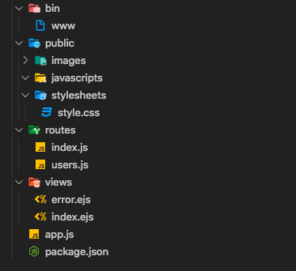
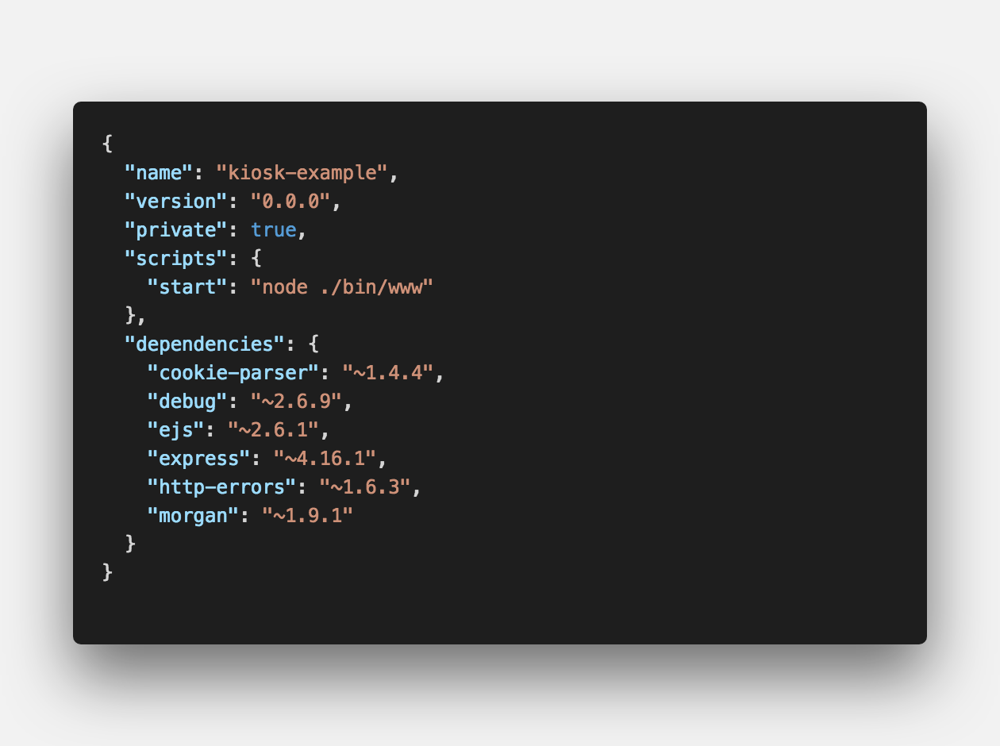

<center><strong style="color:#62B7B4">무인주문결제기</strong> 개발기</center>

## **💎 목차**
  * [서론 (Introduction)](#-서론)
  * [본론 (Main)](#-본론)
  * [결론 (Conclusion)](#🥀-결론)

## **🌱 서론**

안녕하세요~ 👋

__무인주문결제기__ 개발 2탄입니다.

앞서 배운 내용을 정리하면

1. [Raspberry Pi](https://www.raspberrypi.org/) 타겟보드 환경 셋팅

2. [Node Js](https://nodejs.org/ko/) 설치

까지 진행했습니다.

__2탄__ 에서는 `npm 설치 및 셋팅` 해보겠습니다.

<br />

**[⬆ 목차](#-목차)**

---

## **🌹 본론**

__1. express__

`Node Js`를 설치하셨으면 

```sh

$ npm install -g express

```

`npm 의존성 모듈` 관리를 위해서 `package.json`에 express를 추가하는 것만으로도 설치 가능하다.

그러나 글로벌로 설치해서 사용한다면 커맨드라인 명령으로 [Express](https://expressjs.com/ko/) 기본 골격을 만드는데 수웛하다.

```sh

$ express --ejs [Your app name]

```

express는 기본적으로 [Jade](https://github.com/pugjs/pug) 템플릿 엔진으로 설치가 된다.

그러므로 `--ejs`를 추가하여 설치하여 [Ejs](https://github.com/tj/ejs) 템플릿 엔진을 기본 구성으로 셋팅하도록 한다.

그러면 다음과 같은 구조로 폴더와 파일이 자동으로 생성된다.


<br />


<br />

`package.json` dependencies는 이렇게 구성되어있다.

<hr />

__2. pm2__

타겟보드 부트시 서버를 구동 시킬려면

서버 시작하는 부트 스크립트 등록부터 진행 하였습니다.

[pm2-startup](http://pm2.keymetrics.io/docs/usage/startup/) 링크 참조

```sh

$ pm2 startup
[PM2] You have to run this command as root. Execute the following command:
      sudo su -c "env PATH=$PATH:/home/unitech/.nvm/versions/node/v4.3/bin pm2 startup <distribution> -u <user> --hp <home-path>

```

해당 커맨드를 복사해서 붙여넣기를 해준다.

```sh

# Check if pm2-<USER> service has been added
$ systemctl list-units

# Check logs
$ journalctl -u pm2-<USER>

# Cat systemd configuration file
$ systemctl cat pm2-<USER>

# /etc/systemd/... 디렉토리 주소가 나오면
$ nano /etc/systemd/system/pm2-pi.service

[Unit]
Wants=network-online.target
After=network.target network-online.target

[....]

[Install]
WantedBy=multi-user.target network-online.target

# 기입 후 저장

# Analyze startup
$ systemd-analyze plot > output.svg

```

마무리 하면 이제 부트시 자동으로 스크립트가 실행된다.

<hr />

__3. chromium-browser__

서버가 `pm2 startup`으로 자동 실행 되었다면, 

이제 서버 주소 ex: localhost:3000 이라는 홈페이지를 켜줘야한다.

```sh

$ apt-get install -y chromium-browser

```

크로미움을 설치해준다.

라즈베리 파이에는 기본 브라우저 midori가 존재하지만,

JavaScript의 모든 Effect가 돌아가지는 않아 `Chromium`을 설치 한것이다.

```sh

$ nano ~/.config/lxsession/LXDE-pi/autostart

# 하단에 추가
@chromium-browser --incognito --kiosk http://localhost:3000/

$ reboot

```

이로써 자동으로 서버 실행, 페이지 로드가 완료되었다.


**[⬆ 목차](#-목차)**

---

## **🥀 결론**

현재 타겟보드를 소지하고 있지 않아 

대략적으로 알려준점에 대해서 진심으로 사과말씀부터 드립니다.

추후에는 구입을 하여 진행되는 영상을 유튜브에 올리도록 약속 드리겠습니다. 🤙

오늘 배운 내용을 정리하면

  1. [Express](https://www.raspberrypi.org/) 설치

  2. [PM2](http://pm2.keymetrics.io/docs/usage/startup/) autostart 셋팅

  2. `chromium-berowser` 설치 및 autostart 셋팅


__3탄__ 에서는 `간단한 화면 구성` 해보겠습니다.

<br />

**[⬆ 목차](#-목차)**

---

<br />

# 여러분의 댓글이 큰힘이 됩니다. (๑•̀ㅂ•́)و✧
