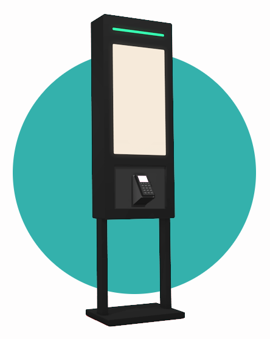
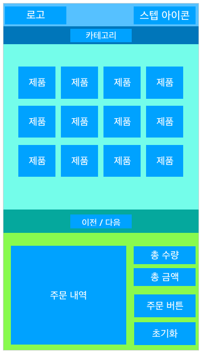
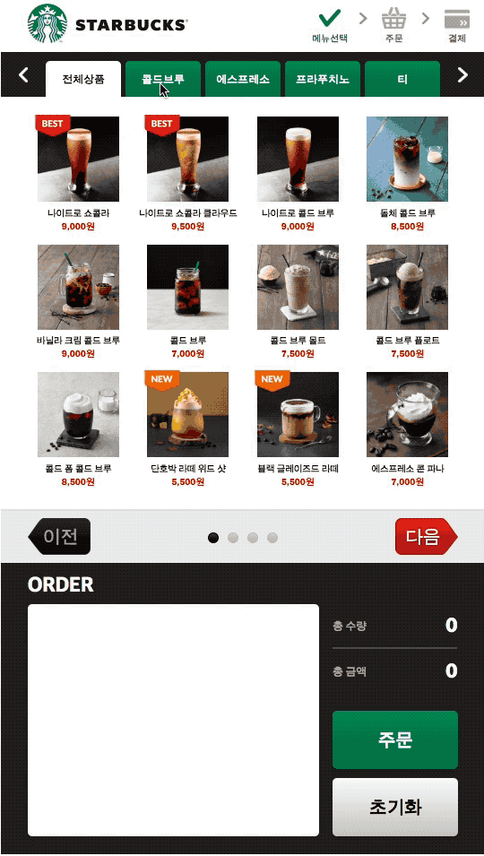

<strong style="color:#62B7B4; font-size: 20px;">무인주문결제기</strong> 개발기

## **💎 목차**

- [서론 (Introduction)](#-서론)
- [본론 (Main)](#-본론)
- [결론 (Conclusion)](#🥀-결론)

## **🌱 서론**

안녕하세요~ 👋

**E-MODER KIOSK** 개발기 3탄입니다.

앞서 배운 내용을 정리하면

1. [Raspberry Pi](https://www.raspberrypi.org/) 타겟보드 환경 셋팅

2. [Node Js](https://nodejs.org/ko/) 설치

3. [Express](https://www.raspberrypi.org/) 설치 및 기본 골격 셋팅

4. [PM2](http://pm2.keymetrics.io/docs/usage/startup/) `autostart` 셋팅

5. **chromium-berowser** 설치 및 `autostart` 셋팅

까지 진행했습니다.

**3탄** 에서는 `간단한 화면 구성` 해보겠습니다.

 

**[⬆ 목차](#-목차)**

## **🌹 본론**

#### **▸ 화면 구성**

[화면구성](https://ljlm0402.wixsite.com/kiosk/clients) 참고해서 진행하겠습니다.

초안으로 레이아웃 구조를 설계하였습니다.

 

 

데모로 만든 페이지입니다.

출처 > [스타벅스](https://www.istarbucks.co.kr/menu/drink_list.do) 제품 이미지 참고

 

**[⬆ 목차](#-목차)**

## **🥀 결론**

 

간략하게 소스 설명을 할려다가 😥

생각보다 양이 방대하여

**4탄** 에서 하도록 하겠습니다.

`HTML`, `CSS`, `SCRIPT`

3단계로 나뉘어서 설명 하도록 하겠습니다.

 

**[⬆ 목차](#-목차)**

 

# 여러분의 댓글이 큰힘이 됩니다. (๑•̀ㅂ•́)و✧
