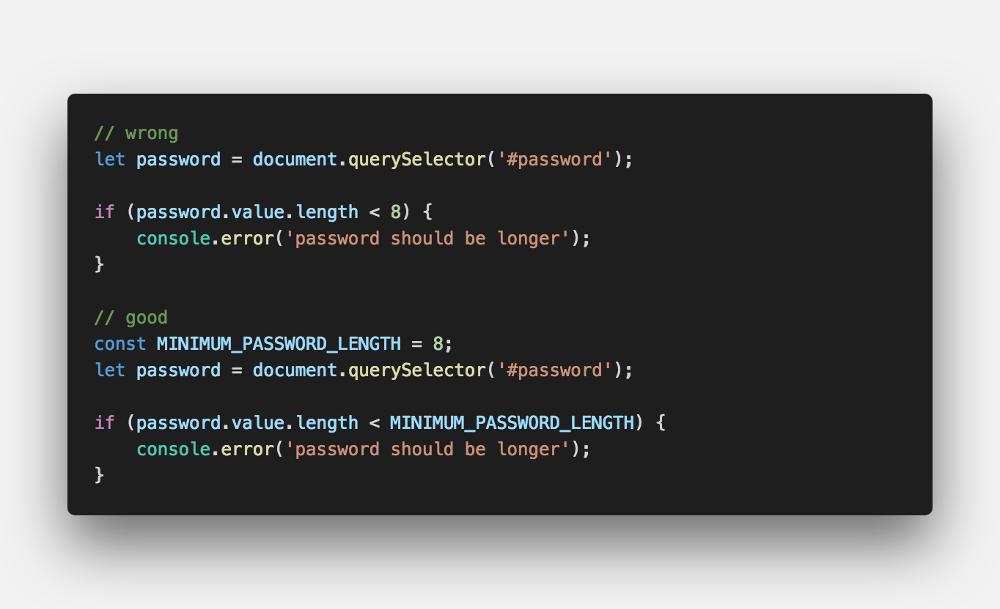
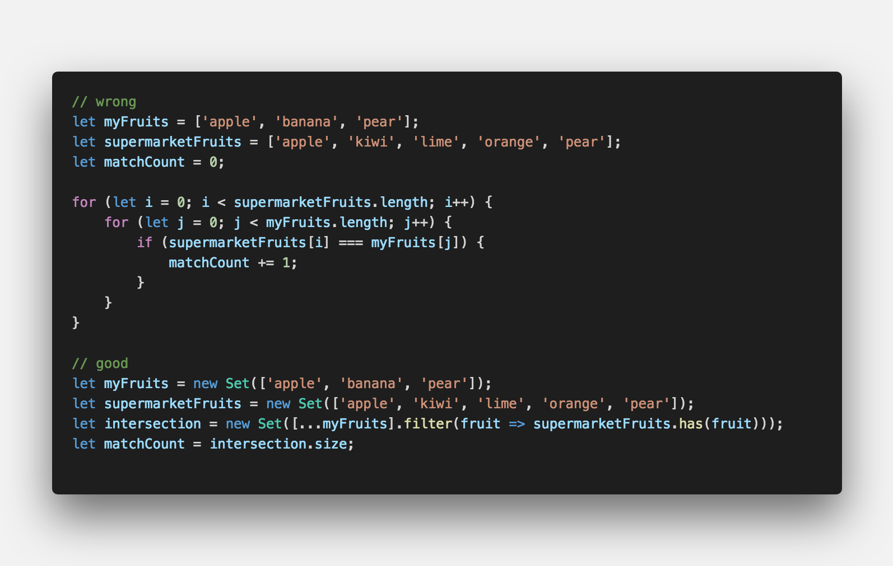
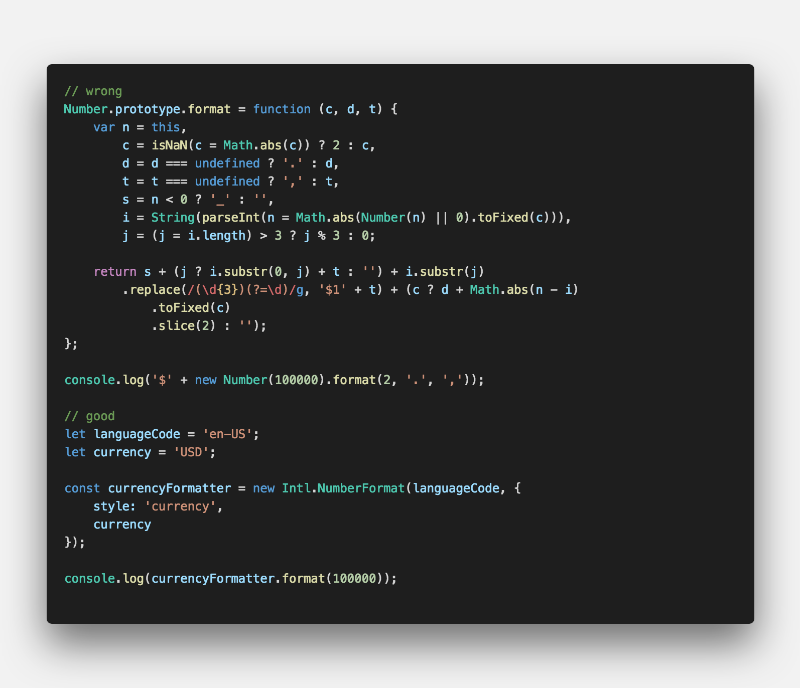

클린코드 영문 그대로 <strong style="color:#fbc2eb">깨끗한 코드</strong>를 의미

## **💎 목차**
  * [클린코드](#-클린코드)
  * [코드를 보며...](#-코드를-보며)
  * [생각 해보며...](#-생각해-보며)

## **🛁 클린코드...**

__개인적으로 생각하는 깨끗한 코드__

- 한눈에 `흐름`이 보이는 코드

- 누구나 쉽게 `이해` 할 수 있는 코드

- `모듈화`가 잘되어 있는 코드

- 의도가 `명확한` 코드

 

__클린코드를 명확하게 정의를 내릴수는 없다.__

__그러나 개발자라면 한번쯤은 생각해 봤으며 궁극적으로 도달해야할 목표라고 생각한다.__

 

**[⬆ 목차](#-목차)**

---

## **😳 코드를 보며...**

###▸ MAGIC NUMBERS (명확한 의미가 없는 고유한 값)
*   명확한 의미가 없는 숫자를 `명명된 상수`로 바꾸는 것이 좋습니다.
*   고유한 값을 갖은 값을 변수에 대입 하여 변수 명을 통해 `의도` 파악 및 `이해`

 

 

---

###▸ DEEP NESTING (깊게 중첩 된 코드)
*   중첩 루프 또는 조건문이 많이 포함되어 있으며 별도의 `함수`로 추출 해야합니다.
*   함수를 통해 간결한 코드로 한눈에 `흐름` 파악

 

 

---

###▸ LARGE FUNCTIONS (길게 늘여 놓은 함수)
*   기능이나 클래스가 크면 기능이 저하 됩니다. 
*   그러므로 `모듈화`를 통한 함수를 `분리`해야합니다.

 

 

---

###▸ CODE REPETITION (반복되는 코드)
*   반복되는 코드는 가장 기본적인 에러 정정 코드입니다.
*   의도가 `분명한` 함수 작성

 

 

---

###▸ COMPLEX EXPRESSIONS (복잡한 표현식)
*   계산을 수행하는 기능이지만 계산중인 내용이 확실하지 않은 함수 입니다.
*   `메소드`를 사용하여 `한눈`에 코드 파악

 

 

**[⬆ 목차](#-목차)**

---

## **🤔 생각해 보며...**

 

한 기업에서 출제 했던 서면 인터뷰 코드입니다.

- 다음 두개의 `fucntion` 중 더 좋은 코드는 무엇이라 생각하며 그 이유를 설명하시오.

- 추가적으로 자신이 생각하는 좋은 코드를 작성해 보시오.

 

**[⬆ 목차](#-목차)**

---

 

> 출처
>
> <a href="https://www.youtube.com/watch?v=Fevz-Kb4bxc" target="_blank">https://www.youtube.com/watch?v=Fevz-Kb4bxc</a>

#여러분의 댓글이 큰힘이 됩니다. (๑•̀ㅂ•́)و✧
