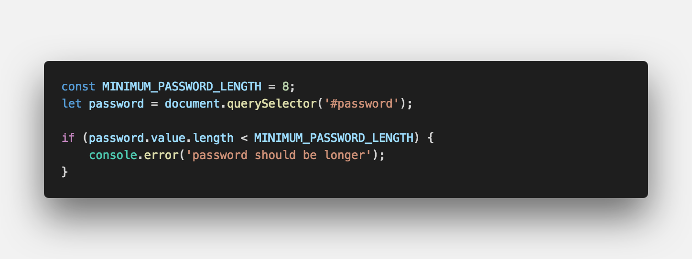
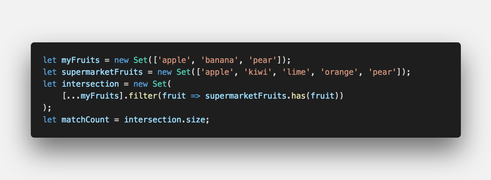
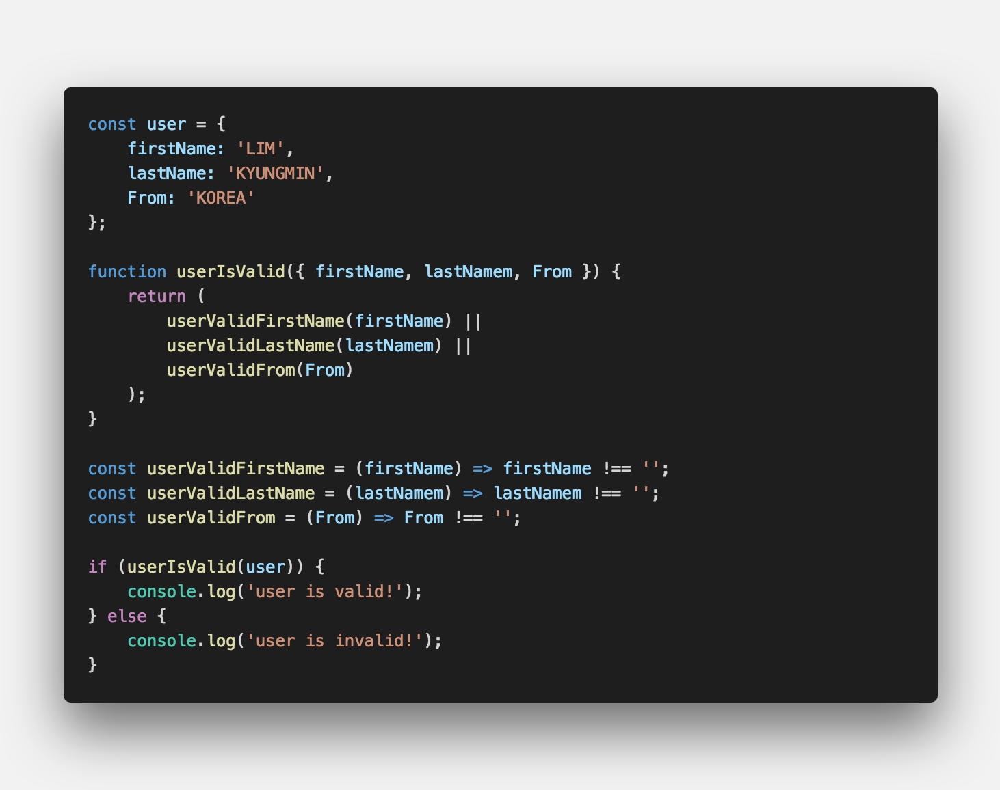
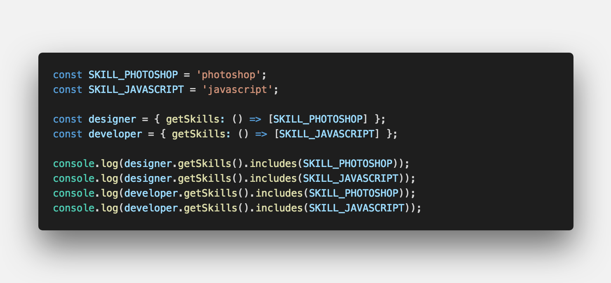
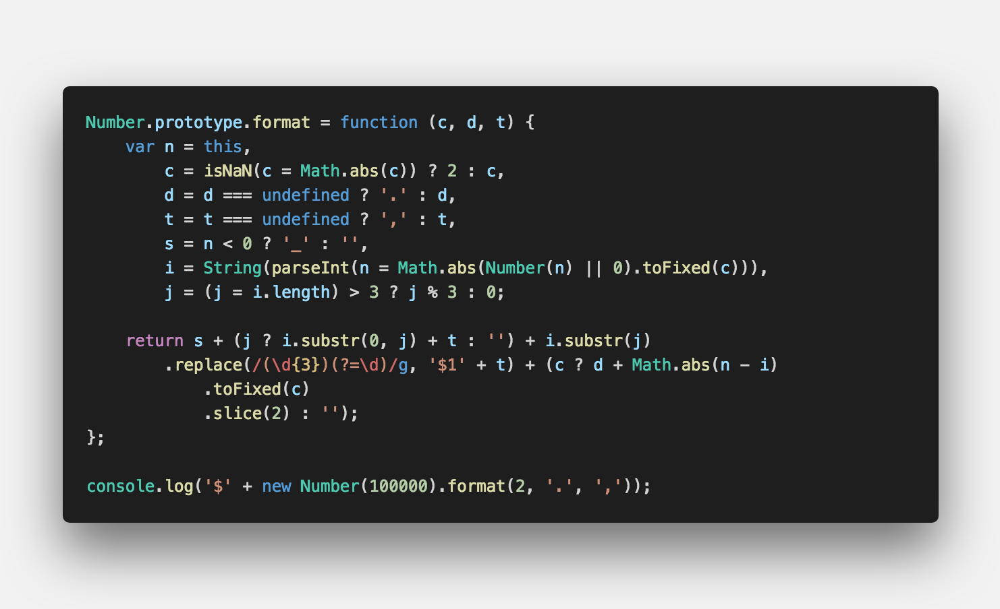
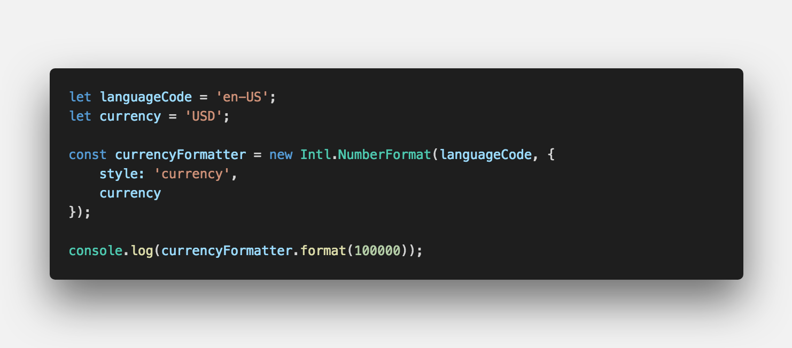
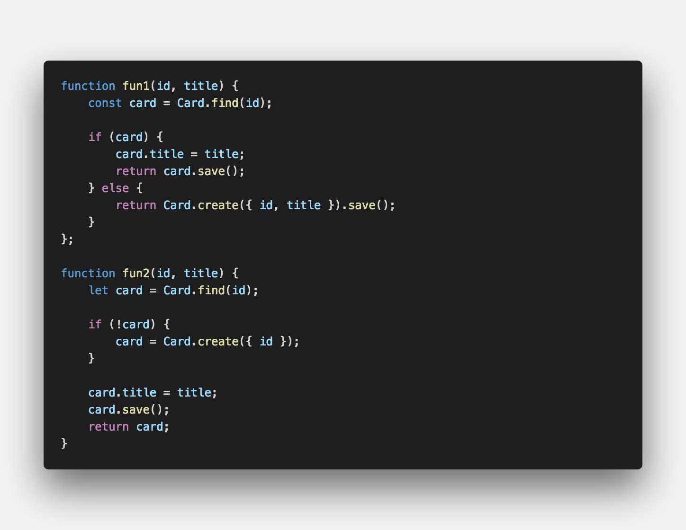

#▶︎ Clean Code ?
클린코드란 영문 그대로 깨끗한 코드를 의미한다. 그럼 과연 깨끗한 코드란 무엇일까 ?

- 한눈에 `흐름`이 보이는 코드

- 누구나 쉽게 `이해` 할 수 있는 코드

- `모듈화`가 잘되어 있는 코드

- 의도가 `명확한` 코드

 

위에 네가지는 내 개인적인 생각이다. 클린코드란 딱히 정의된 내용이 존재하지는 않는다.
그러나 개발자라면 한번쯤은 생각해 봤을 용어이며 궁극적으로 도달해야 한다고 생각한다.
본문의 내용에는 다양한 코드가 존재한다 차이점을 비교해가며 파악해보자

#▶︎ 코드를 보며...

###▸ MAGIC NUMBERS
*   설명 할 수 없는 의미를 갖는 고유 한 값 또는 이름이 지정된 상수  

 

명확한 의미가 없는 수자를 지정합니다. 명명된 상수로 바꾸는 것이 좋습니다.

고유한 값을 갖은 변수에 주어서 `이해` 향상

---

###▸ DEEP NESTING
*   깊게 중첩 된 코드  

 

코드에 중첩 루프 또는 조건문이 많이 포함되어 있으며 별도의 함수로 추출해야합니다.

filter 함수를 통해 간결한 코드로 한눈에 `흐름` 파악

---

###▸ LARGE FUNCTIONS
*   길게 늘여 놓은 함수  

 

기능이나 클래스가 크면 기능보다 저하됩니다. 그러므로 함수를 쪼개야 합니다.

함수를 여러개로 `모듈화`를 통해 코드 작성

---

###▸ CODE REPETITION
*   반복 코드  

 

반복 코드는 가장 기본적인 에러 정정 코드입니다. 코드 작성 시 실수를 범할 수도 있습니다.

의도가 `분명한` 함수를 코드 작성

---

###▸ COMPLEX EXPRESSIONS
*   복잡한 표현  

 

계산을 수행하는 기능이지만 계산중인 내용이 확실하지 않은 함수 입니다.

`모듈화`가 되어있는 메소드를 사용하여 `한눈`에 코드를 파악

---

#▶︎ 생각 해보며...

 

해당 이미지는 한 기업에서 출제 했던 서면 인터뷰입니다.

- function 중 어떤 코드가 더 좋은 코드라고 생각하고 그 이유를 설명하시오.

- 추가적으로 자신이 생각하는 좋은 코드를 작성해 보시오.

#여러분의 댓글이 큰힘이 됩니다. ʕ　·ᴥʔ

 

> 출처  
> <a href="https://www.youtube.com/watch?v=Fevz-Kb4bxc" target="_blank">https://www.youtube.com/watch?v=Fevz-Kb4bxc</a>
> <a href="https://github.com/bynodejs/study/blob/master/javascript/clean_code.js" target="_blank">https://github.com/bynodejs/study/blob/master/javascript/clean_code.js</a>
