
클린코드 영문 그대로 <strong style="color:#fbc2eb">깨끗한 코드</strong>를 의미

## **💎 목차**
  * [클린코드](#-클린코드)
  * [코드를 보며](#-코드를-보며)
  * [생각 해보며](#-생각해-보며)

## **🛁 클린코드**

__클린코드 2탄 입니다__

- 2탄에서는 같은 기능의 `문법`을 비교해보겠습니다. 

- 좋은 문법을 통해 `간결`하고 `명확한 코드` 작성 요령에 대해 알아보겠습니다.

 

__본 내용은 주관적인 내용이 포함되어 있으니 이점 유의하시기 바랍니다.__

 

**[⬆ 목차](#-목차)**

---

## **😳 코드를 보며**

### **▸ 변수(Variables)**
 

#### 의미있고 발음하기 쉬운 변수 이름을 사용하세요.

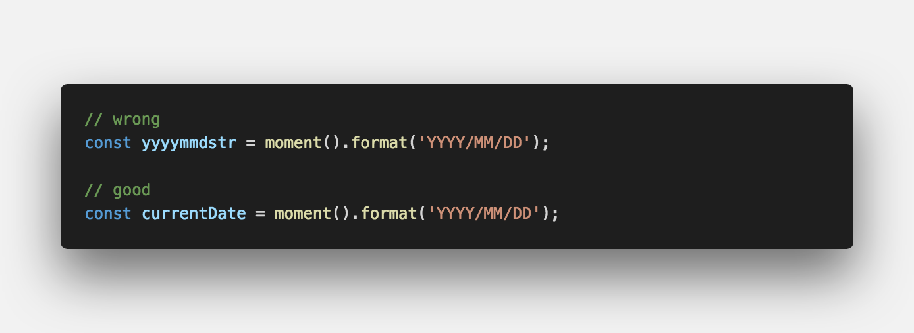
 

#### 동일한 유형의 변수에 동일한 어휘를 사용하세요.

 

#### 검색 가능한 이름을 사용하세요.
*   우리는 작성한 코드보다 `읽을 코드`가 더 많습니다.
*   그렇기 때문에 코드를 읽기 쉽고 `검색 가능`하게 작성해야 합니다.
*   그러지 않으면 여러분의 코드를 이해하려고 하는 사람들에게 큰 어려움을 줍니다.

 

#### 의도를 나타내는 변수들을 사용하세요.

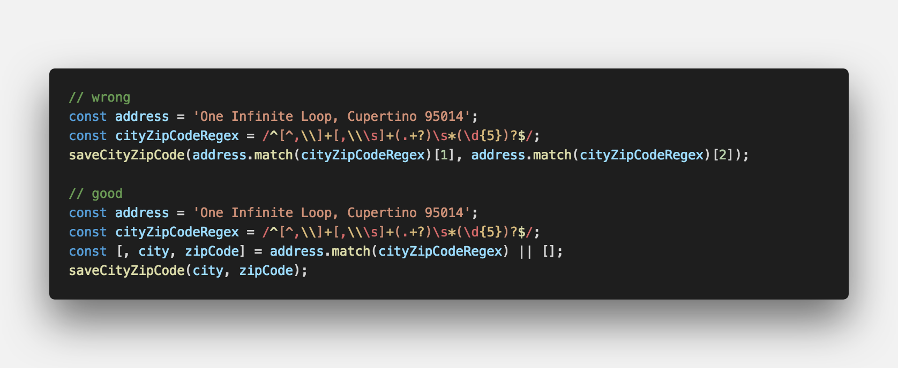
 

#### 자신만 알아볼 수 있는 작명을 피하세요.
*   명시적인 것이 암시적인 것보다 좋습니다.

 

#### 문맥상 필요없는 것들을 쓰지 마세요.
* 문맥상 필요없는 것을 작성시에는 코드 읽기가 힘들어집니다.

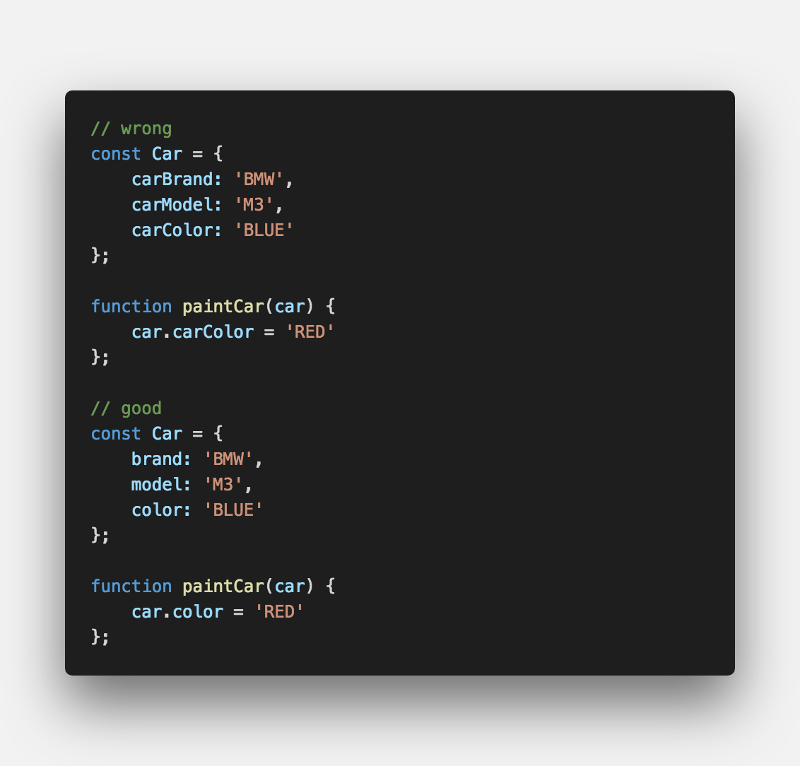
 

#### 기본 매개변수가 Short Circuiting 트릭이나 조건문 보다 깔끔합니다.
*   기본 매개변수는 종종 short circuiting 트릭보다 깔끔합니다.
*   기본 매개변수는 `undefined`일때만 적용됩니다.

 

**[⬆ 변수](#▸-변수variables)**

---

### **▸ 함수(Functions)**
 

#### 함수 인자는 2개 이하가 이상적입니다.
*   `매개변수의 개수 제한`하는 것은 함수 테스팅을 쉽게 만들어 주기 때문에 중요합니다.
*   1개나 2개의 인자를 가지고 있는 것이 가장 이상적인 케이스입니다.
*   만약 2개 이상의 인자를 가진 함수라면 그 함수에게 너무 많은 역할을 하게 만든 것입니다.
*   Javascript를 사용 시 보일러플레이트 없이 바로 객체를 만들 수 있습니다.
*   그러므로 당신이 많은 인자를 사용해야 한다면 객체를 이용하시기 바랍니다.
*   함수의 속성을 좀더 명확히 하기 위해서 `비구조화(Destructuring)구문`을 사용할 수 있습니다.

    1.  어떤 사람이 그 함수의 시그니쳐(인자의 타입, 반환되는 값 타입 등)를 볼 때 어떤 속성이 사용되는지 즉시 알 수 있습니다.
    2.  비구조화는 함수에 전달된 인수 객체의 지정된 기본타입 값을 복제하며 이는 사이드이펙트가 일어나는 것을 방지합니다.
    3.  인수 객체로 부터 비구조화된 객체와 배열은 복제되지 않습니다.
    4.  Linter를 사용하면 사용하지않는 인자에 대해 경고해주거나 비구조화 없이 코드를 짤 수 없게 할 수 있습니다.

 

#### 함수는 하나의 행동만 해야합니다.
*   이것은 소프트웨어 엔지니어링에서 가장 중요한 규칙입니다.
*   함수가 1개 이상의 행동을 한다면 작성, 테스트, 이해 전반적으로 어려워집니다.
*   함수에 하나의 행동을 정의한다면 수정도 수월하고 코드를 이해하는것도 쉬워질 것입니다.

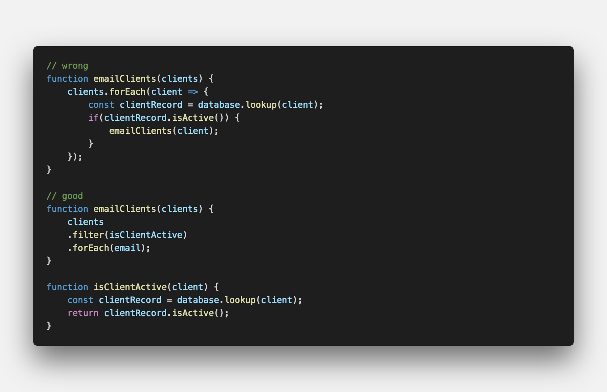
 

#### 함수명은 함수가 무엇을 하는지 알 수 있어야 합니다.
*   함수명 통해 무엇을 하는지 파악하기 위해서는 함수명 작성에 주의해야합니다.

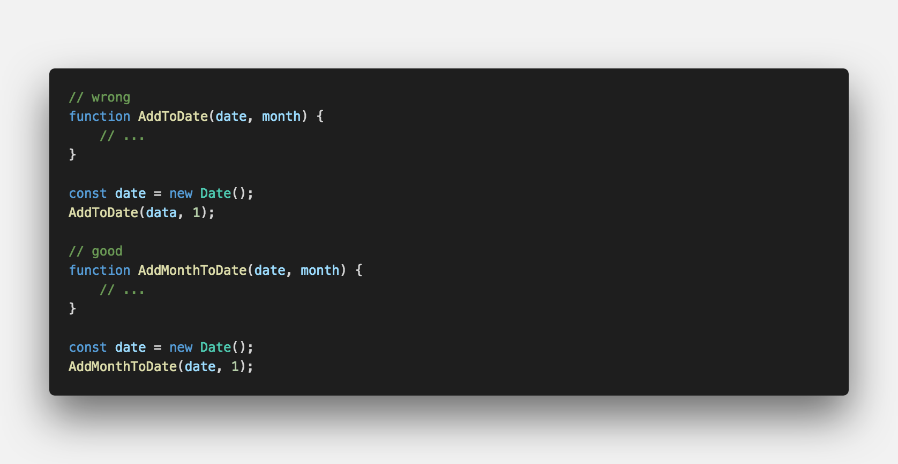
 

#### 함수는 단일 행동을 추상화 해야합니다.
*   추상화된 이름이 여러 의미를 내포하고 있다면 그 함수는 너무 많은 일을 하게끔 설계된 것입니다.
*   함수들을 나누어서 재사용 가능하고 테스트하기 쉽게 구현해야합니다.

 

#### 중복된 코드를 작성하지 마세요.
*   중복된 코드가 있다는 것은 어떤 로직을 수정해야 할 일이 생겼을 때 수정 해야할 코드가 여러 곳이라는 뜻입니다.
*   중복 코드를 제거한다는 것은 함수 / 모듈 / 클래스를 사용하여 여러 가지 차이점을 처리 할 수 있는 추상화를 만드는 것을 의미합니다.

 

#### Object.assign을 사용해 기본 객체를 만드세요.

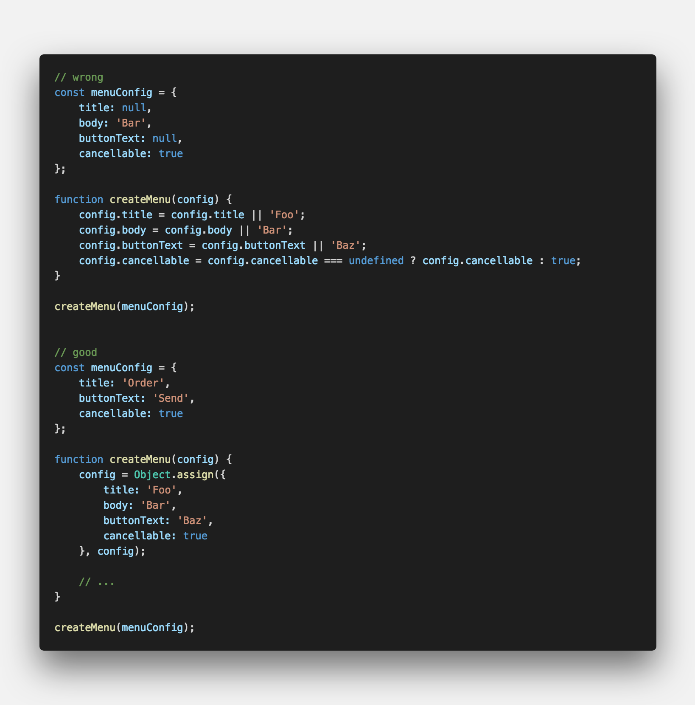
 

#### 매개변수로 플래그를 사용하지 마세요.
*   플래그를 사용하는 것 자체가 그 함수가 한가지 이상의 역할을 하고 있다는 것을 뜻합니다.
*   boolean 기반으로 함수가 실행되는 코드가 나뉜다면 함수를 분리하세요.

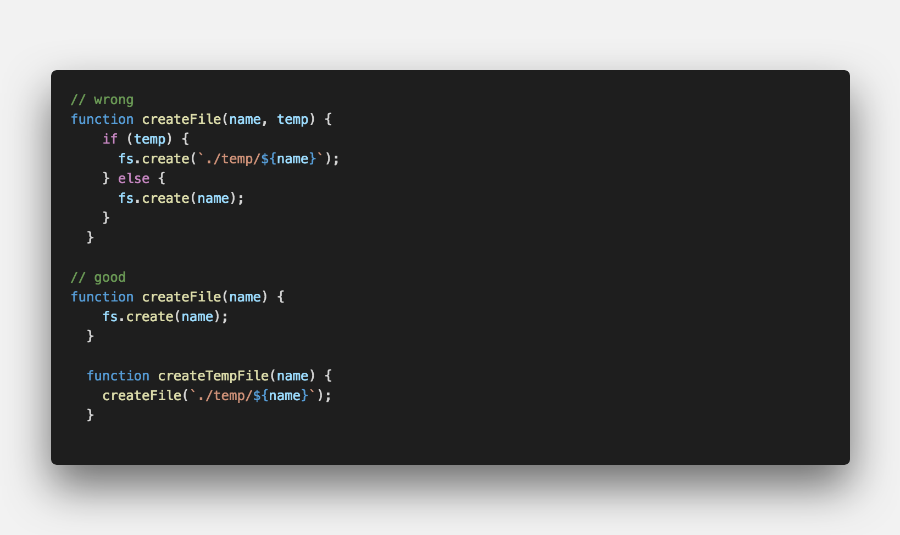
 

#### 사이드 이펙트를 피하세요. (part 1)
*   함수는 값을 받아서 어떤 일을 하거나 값을 리턴할때 사이드 이팩트를 만들어냅니다.
*   사이드 이팩트는 파일에 쓰여질 수도 있고, 전역 변수를 수정할 수 있습니다.
*   파일 작성을 하는 한개의 함수를 만듭니다. 대신, 함수나 클래스가 여러개 존재하면 안됩니다. 반드시 하나만 있어야 합니다.
*   즉, 어떠한 구조체도 없이 객체 사이의 상태를 공유하거나, 무엇이든 쓸 수 있는 변경 가능한 데이터 유형을 사용하거나, 같은 사이드 이팩트를 만들어내는 것을 여러개 만들거나 하면 안됩니다.

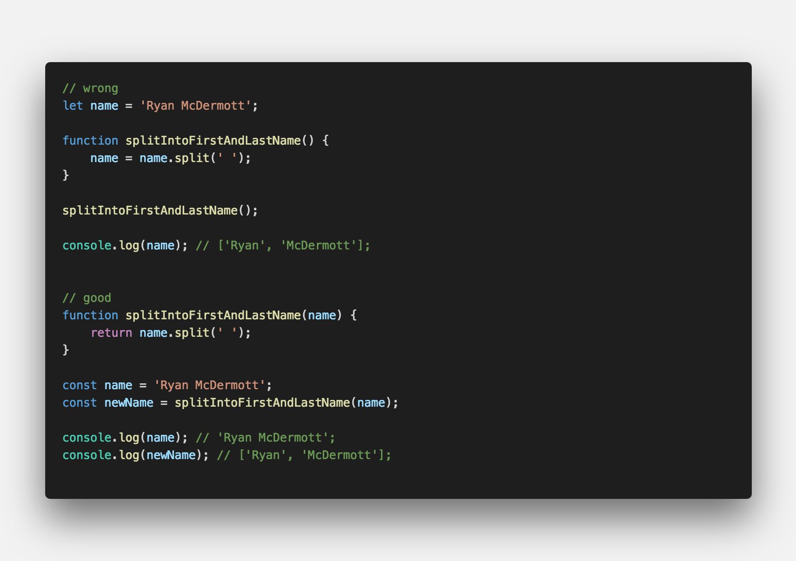
 

#### 사이드 이펙트를 피하세요. (part 2)
*   Javascript에서는 기본타입 자료형은 값을 전달하고 객체와 배열은 참조를 전달합니다.

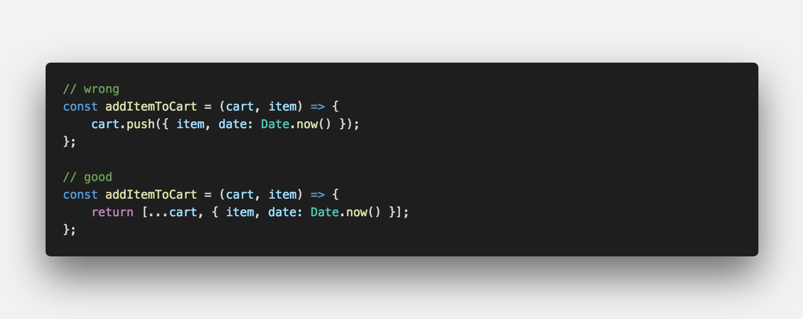
 

#### 전역 함수를 사용하지 마세요.
*   전역 환경을 사용하는 것은 Javascript에서 나쁜 관행입니다.
*   왜냐하면 다른 `라이브러리 충돌`, `운영환경에서 예외 발생`하기 전까지 문제 인지를 못하기 때문입니다.

 

#### 명령형 프로그래밍보다 함수형 프로그래밍을 지향하세요.
*   Javascript는 함수형 프로그래밍 언어는 아니지만 함수형 프로그래밍처럼 작성할 수 있습니다.
*   함수형 언어는 더 깔끔하고 테스트하기 쉽습니다.

 

#### 조건문을 캡슐화 하세요.

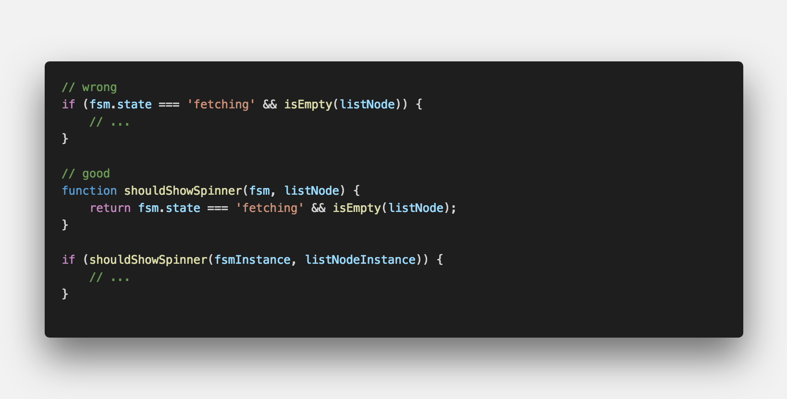
 

#### 부정조건문을 사용하지 마세요.

 

#### 조건문 작성을 피하세요.
*   조건문 작성을 피하라는 것은 매우 불가능한 일로 보입니다.
*   하지만 `다형성`을 이용한다면 동일한 작업을 수행할 수 있습니다.

 

#### 타입-체킹을 피하세요. (part 1)
*   Javascript는 타입이 정해져있지 않습니다.
*   이는 당신의 함수가 어떤 타입의 인자든 받을 수 있다는 것을 의미합니다.
*   첫번째 방법은 일관성 있는 API를 사용하는 것 입니다.

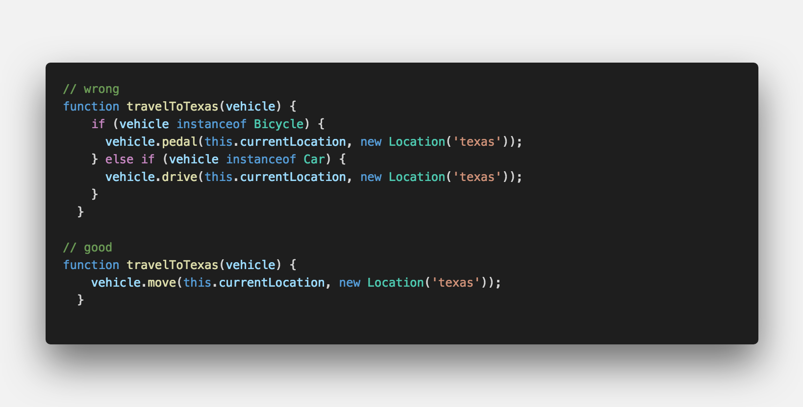
 

#### 타입-체킹을 피하세요. (part 2)
*   당신이 문자열, 정수, 배열 등 기본 자료형을 사용하고 다형성을 사용할 수 없을 때
*   여전히 타입-체킹이 필요하다고 느껴진다면 `Typescript` 사용을 권장합니다.

 

#### 과도한 최적화를 지향하세요.
*   최신 브라우저들은 런타임에 많은 최적화 작업을 수행합니다.
*   대부분 당신이 코드를 최적화 하는 것은 시간낭비 가능성이 많습니다.
*   최적화가 부족한 곳이 어딘지 알려주는 [좋은 자료](https://github.com/petkaantonov/bluebird/wiki/Optimization-killers)가 있으니 참고하세요.

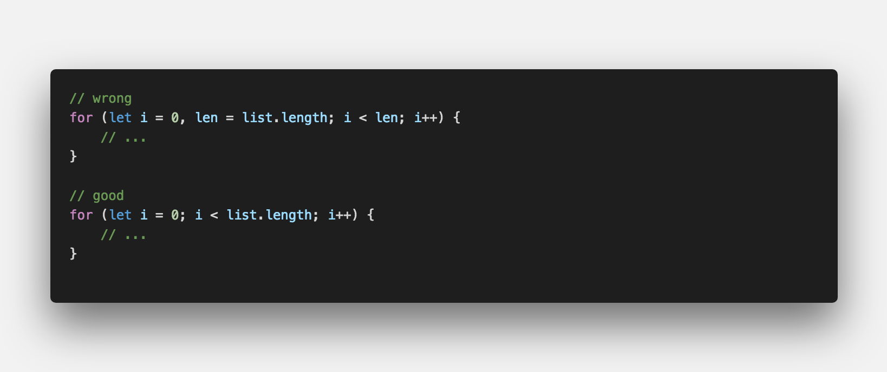
 

#### 죽은 코드를 지우세요
*   죽은 코드는 중복된 코드 만큼이나 좋지 않습니다.
*   호출되지 않는 코드가 있다면 그 코드를 지우세요.

 

**[⬆ 함수](#▸-함수functions)**

---

### **▸ 객체와 자료구조(Objects and Data Structures)**
 

#### getter와 setter를 사용하세요.
*   Javscript는 인터페이스와 타입을 가지고 있지 않고 이러한 패턴을 적용하기가 힘듭니다.
*   왜냐하면 public, private 같은 키워드가 없기 때문입니다.
*   그렇기 때문에 getter 및 setter를 사용하여 객체의 데이터에 접근하는 것이 객체의 속성을 찾는 것보다 훨씬 낫습니다.
    1. 객체의 속성을 얻는 것 이상의 많은 것을 하고 싶을대, 코드에서 모든 접근자를 찾아 바꾸고 할 필요가 없습니다.
    2. set 할때 검증 로직을 추가하는 것이 코드를 더 간단하게 만듭니다.
    3. 내부용 API를 캡슐화 할 수 있습니다.
    4. `getting`과 `setting` 할 때 로그를 찾거나 에러처리를 하기 쉽습니다.
    5. 클래스를 상속해서 디폴트 동작을 재정의할 수 있습니다.
    6. 서버에서 객체 속성을 받아올 때 lazy load 할수 있습니다.

 

#### 객체에 비공개 매법를 만드세요.
*   `클로져`를 이용하면 가능합니다.

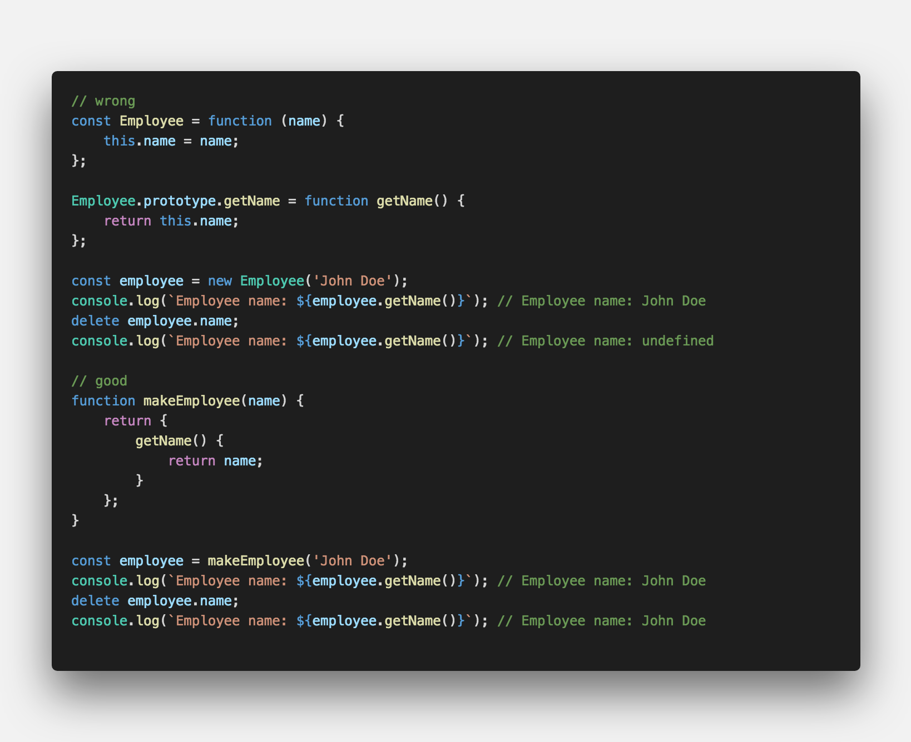
 

**[⬆ 객체와 자료구조](#▸-객체와-자료구조objects-and-data-structures)**

---

### **▸ 클래스(Classes)**
 

#### 단일 책임 원칙 (Single Responsibility Prinsiple, SRP)
*   Clean Code에서 말하길 `클래스를 수정 할 때는 수정 해야하는 이유가 2개 이상 있으면 안됩니다.`
*   이것은 하나의 클래스에 많은 기능을 쑤셔 넣는 것이나 다름 없습니다.
*   당신의 클래스가 개념적으로 응집되어 있지 않다는 것이고, 클래스를 바꿔야할 많은 이유가 됩니다.
*   클래스를 수정하는데 들이는 시간을 줄이는 것은 중요합니다.
*   왜냐하면 하나의 클래스에 너무 많은 기능들이 있고 당신이 이 작은 기능들을 수정할 때 이코드가 다른 모듈들에게 어떤한 영향을 끼치는지 이해하기 어려울 수 있기 때문입니다.

 

#### 개방/폐쇄 원칙 (Open/Closed Principle, OCP)
*   Bertrand Meyer 말에 의하면 `소프트웨어 개체(클래스, 모듈, 함수)는 확장을 위해 개방적이어야 하며 수정시엔 폐쇄적이어야 합니다.`
*   이 원리는 기본적으로 사용자가 `.js` 파일을 열어 수동으로 조작하지 않고도 모듈의 기능을 확장하도록 허용해야한다고 말합니다.

 

#### 리스코프 치환 원칙  (Liskov Substitution Principle, LSP)
*   이것은 매우 간단하지만 강력한 원칙입니다.
*   `리스코프 원칙`이란 자료형 S가 자료형 T의 하위형이라면, 프로그램이 갖추어야 할 속성들(정확성, 수행되는 작업) 변경사항 없이, 
*   자료형 T의 객체를 자료형 S의 객체로 교환(치환)할 수 있어야 한다는 원칙입니다.

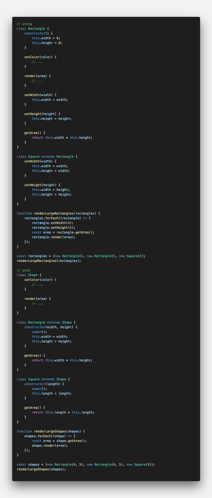
 

#### 인터페이스 분리 원칙 (Interface Segregation Principle, ISP)
*   Javascript는 인터페이스가 없기 때문에 다른 원칙들 처럼 딱 맞게 적용할 수는 없습니다.
*   그러나, Javscript에 타입 시스템이 없다 하더라도 중요하고 관계있는 원칙입니다.
*   ISP에 의하면 `클라이언트는 사용하지 않는 인터페이스에 의존하도록 강요 받으면 안됩니다.`
*   Javascript에서 보여주는 가장 좋은 예는 방대한 양의 설정 객체가 필요한 클래스입니다.
*   설정을 선택으로 할 수 있다면 무거운 인터페이스를 만드는 것을 방지할 수 있습니다.

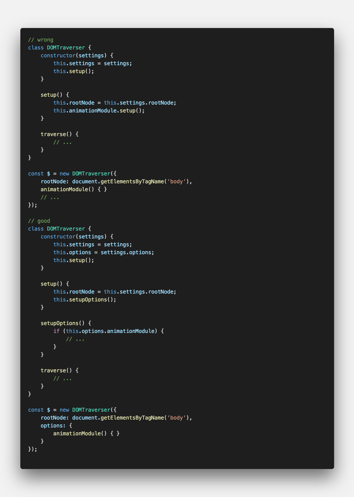
 

#### 의존성 역전 원칙 (Dependency Inversion Principle, DIP)
*   이 원칙은 두가지 중요한 요소를 가지고 있습니다.

1. 상위 모듈은 하위 모듈에 종속되어서는 안됩니다. 둘 다 추상화에 의존해야 합니다.
2. 추상화는 세부사항에 의존하지 않습니다. 세부사항은 추상화에 의해 달라져야 합니다.

* DI의 장점은 모듈 간의 의존성을 감소시키는 데에 있습니다.
* 모듈간의 의존성이 높을수록 코드를 리팩토링 하는데 어려워지고 이것은 매우 나쁜 개발 패턴들 중 하나입니다.

 

#### ES5의 함수보다 ES2015/ES6의 클래스를 사용하세요.
*   기존 ES5의 클래스에서 이해하기 쉬운 상속, 구성 및 메소드 정의를 하는 건 매우 어렵습니다.
*   매번 그런것은 아니지만 상속이 필요한 경우라면 클래스를 사용하는 것이 좋습니다.
*   하지만 당신이 크고 더 복잡한 객체가 필요한 경우가 아니라면 클래스보다 작은 함수를 사용하세요.

 

#### 메소드 체이닝을 사용하세요.
*   Javascript에서 메소드 체이닝은 매우 유용한 패턴입니다.
*   `jQuery`나 `Lodash`같은 라이브러리에서 이 패턴을 찾아볼 수 있습니다.
*   이는 코드를 간결하고 이해하기 쉽게 만들어 줍니다.
*   클래스 함수에서는 단순히 모든 함수의 끝에 `this`를 리턴해주는 것으로 클래스 메소드를 추가로 연결할 수 있습니다.

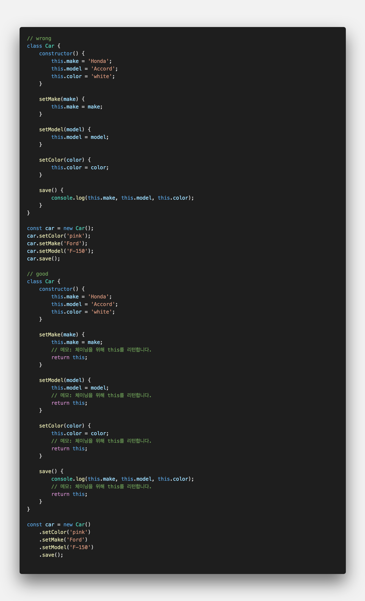
 

#### 상속보단 조합 (composition)을 사용하세요.
*   Gang of four의 [*Design Patterns*](https://en.wikipedia.org/wiki/Design_Patterns)에서 유명한 전략으로 당신은 가능하다면 상속보다는 조합을 사용해야 합니다.
*   상속을 사용했을 때 얻을 수 있는 이득보다 조합을 사용했을 때 얻을 수 있는 이득이 많기 때문입니다.
*   조합보다 상속을 쓰는게 더 좋을 만한 예시를 몇가지 들어 보겠습니다.

1.  당신의 상속 관계가 "has-a" 관계가 아니라 "is-a" 관계일 경우 (사람 -> 동물 vs 유저 -> 유저정보)
2.  기반 클래스의 코드를 다시 사용할 수 있을 때 (인간은 모든 동물처럼 움직일 수 있습니다.)
3.  기반 클래스를 수정하여 파생된 클래스 모두를 수정하고 싶을 때 (이동시 모든 동물이 소비하는 칼로리를 변경하고 싶을 때)

 

**[⬆ 클래스](#▸-클래스classes)**

---

### **▸ 테스트(Testing)**
 

*   테스트는 배포하는 것보다 중요합니다.
*   테스트 없이 배포한다는 것은 당신이 짜놓은 코드가 언제든 오작동해도 이상하지 않다는 얘기와 같습니다.
*   여기 [훌륭하고 많은 JavaScript 테스트 프레임워크들](http://jstherightway.org/#testing-tools)이 있습니다.

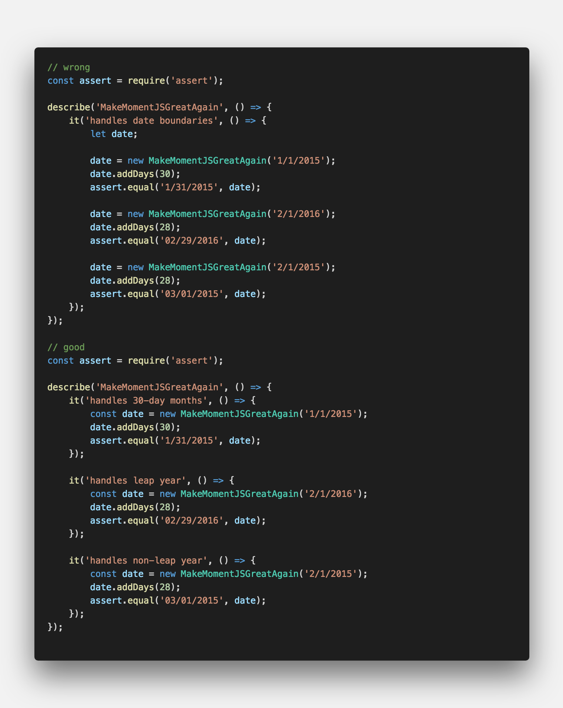
 

**[⬆ 테스트](#▸-테스트testing)**

---

### **▸ 동시성(Concurrency)**
 

#### Callback 대신 Promise를 사용하세요.
*   Callback은 깔끔하지 않습니다. 그리고 엄청난 중괄호 중첩을 만들어 냅니다.
*   ES2015/ES6에선 [Promise](https://developer.mozilla.org/ko/docs/Web/JavaScript/Reference/Global_Objects/Promise)가 내장되어 있습니다.

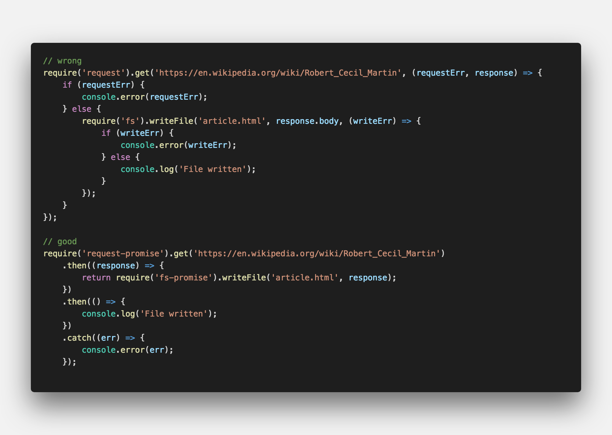
 

#### Async/Await은 Promise보다 더욱 깔끔합니다.
*   `Primise`도 Callback에 비해 깔끔하지만 ES2017/ES8에선 [async/await](https://developer.mozilla.org/ko/docs/Web/JavaScript/Reference/Statements/async_function)이 있습니다.
*   이들은 Callback에 대한 깔끔한 해결책을 줍니다.
*   오직 필요한 것은 함수 앞에 `async`를 붙이는 것 뿐입니다. 
*   그러면 함수를 논리적으로 연결하기 위해 더이상 `then`을 쓰지 않아도 됩니다.

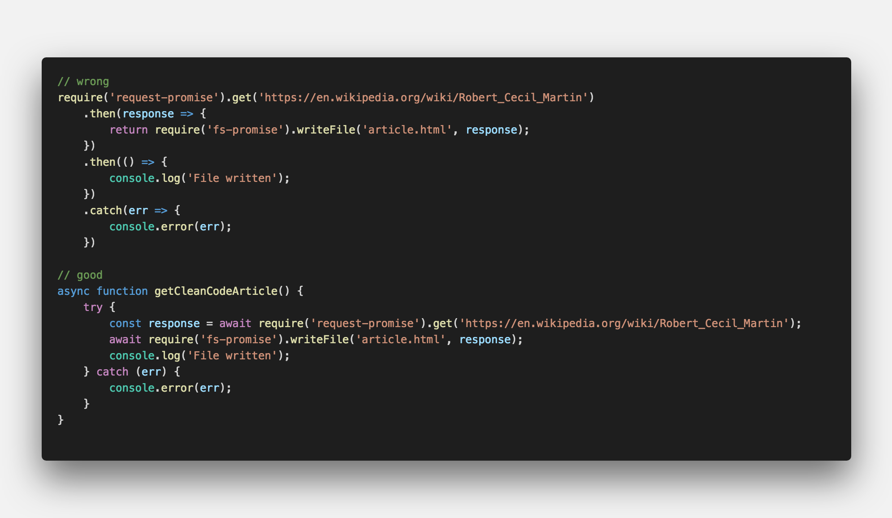
 

**[⬆ 동시성](#▸-동시성concurrency)**

---

### **▸ 에러 처리(Error Handling)**
 

*   에러를 뱉는다는 것은 좋은 것입니다! 즉, 프로그램에서 무언가 잘못되었을 때 
*   런타임에서 성공적으로 확인되면 현재 스택에서 함수 실행을 중단하고 프로세스를 종료하고 스택 추적으로 콘솔에서 사용자에게 이유를 알려줍니다.

 

#### 단순히 에러를 확인만 하지마세요.
*   단순히 에러를 확인하는 것만으로 그 에러가 해결되거나 대응 할 수 있게 되는 것은 아닙니다.
*   `console.log`를 통해 로그를 기록하는 것은 에러 로그를 읽어버리기 쉽기 때문에 좋은 방법이 아닙니다.
*   `try/catch`로 코드를 감쌋다면 그건 당신이 그 코드에 어떤 에러가 날지 모르기 때문에 감싼 것이므로 그에 대한 어떤 장치를 해야합니다.
*   에러 발생시 트래킹 모듈로는 [Sentry](https://sentry.io/welcome/)가 있습니다.

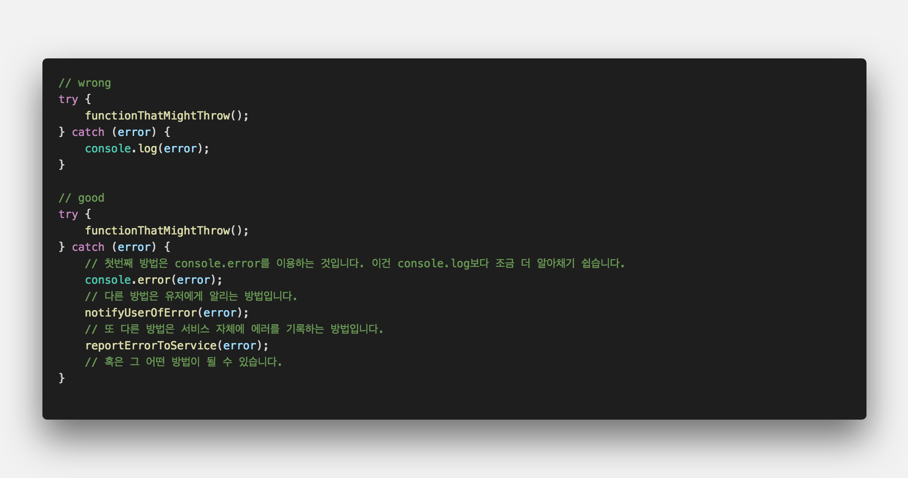
 

#### Promise가 실패된 것을 무시하지 마세요.
*   위의 원칙과 같은 이유입니다.

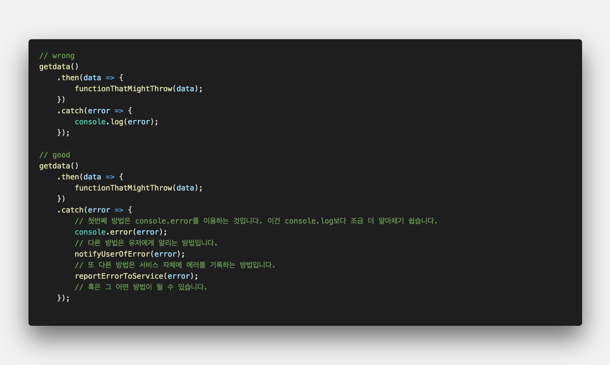
 

**[⬆ 에러 처리](#▸-에러-처리error-handling)**

---

### **▸ 포맷팅(Formatting)**
 

*   포맷팅은 주관적입니다. 즉, 과도하게 신경쓰는 것은 의미없다는 것입니다.
*   포맷팅 체크를 자동으로 해주는 [많은 도구](http://standardjs.com/rules.html)들 이 있기 때문입니다.

 

#### 일관된 대소문자를 사용하세요.
*   Javascript에는 정해진 타입이 없기 때문에 대소문자를 구분하는 것으로 당신의 변수나 함수명 등에서 많은 것을 알 수 있습니다.
*   해당 규칙 또한 주관적이기 때문에 선택한 규칙을 따르시며 항상 `일관성` 있게 사용해야합니다.

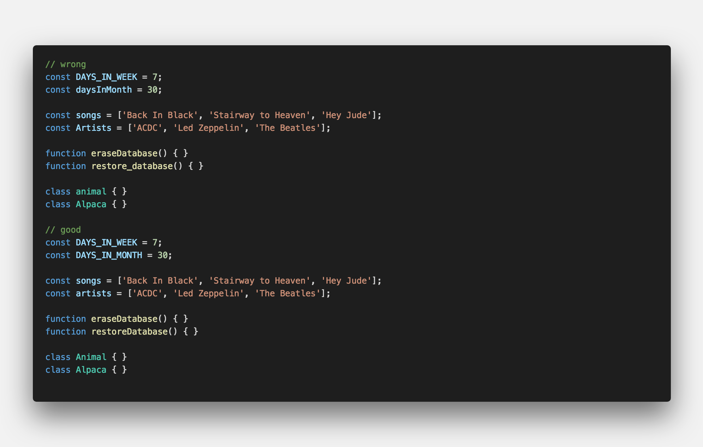
 

#### 함수 호출자와 함수 피호출자는 가깝게 위치시키세요.
*   어떤 함수가 다른 함수를 호출하면 그 함수들은 소스 파일 안에서 서로 수직으로 근접해 있어야 합니다.
*   `이상적으로는 함수 호출자를 함수 피호출자 바로 위에 위치`시켜야 합니다.
*   우리는 코드를 읽을때 신문 읽듯 위에서 아래로 읽기 때문에 코드 작성 시 고려하여 작성 해야합니다.

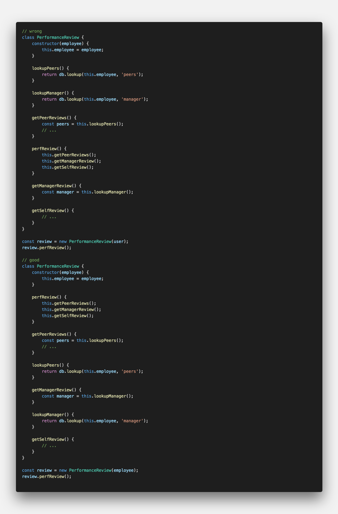
 

**[⬆ 포맷팅](#▸-포맷팅formatting)**

---

### **▸ 주석(Comments)**
 

#### 주석은 단지 그 로직이 복잡하다는 것을 말 할 뿐입니다.
*   주석을 다는것은 사과해야할 일이며 필수적인 것이 아닙니다.
*   **좋은 코드는 *코드 자체*로 말합니다.**

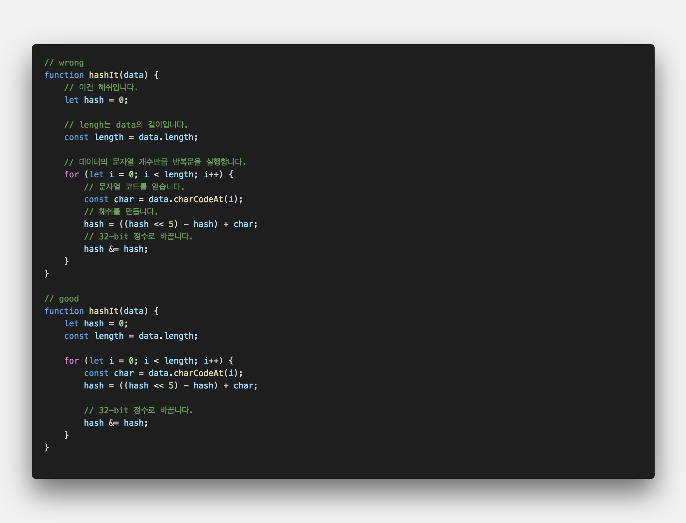
 

#### 주석으로 된 코드를 남기지 마세요.
*   버전 관리 도구가 존재하기 때문에 코드를 주석으로 남길 이유가 없습니다.

 

#### 코드 기록을 주석으로 남기지 마세요.
*   버전 관리 도구를 이용해야하는 것을 꼭 기억하세요.
*   죽은 코드도 불필요한 설명도 특히 코드의 기록에 대한 주석도 필요하지 않습니다.
*   만약 git을 사용하고 계시며 코드의 기록에 대해 보고 싶다면 `git log`를 사용하세요.

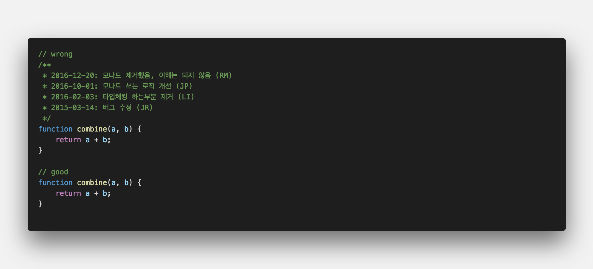
 

#### 코드의 위치를 설명하지 마세요.
*   적절한 들여쓰기와 포맷팅을 하고 함수와 변수의 이름에 의미를 부여하세요.

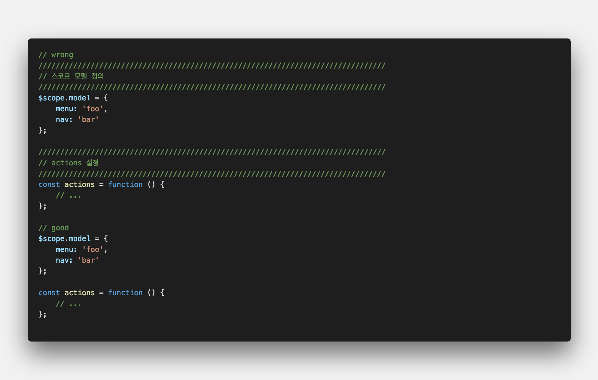
 

**[⬆ 주석](#▸-주석comments)**

---

 

**[⬆ 목차](#-목차)**

---

## **🤔 생각해 보며**

### main.ts

 

### Vehicle.ts

 

한 기업에서 출제 했던 코드입니다.

- 퀄리티를 높이는 리팩토링(가독성, 유지보수, 생산성, 협업)을 고려해서 작성하시오.

- 코드의 의도(차량이 도로를 달리는 현실세계를 표현)를 유지하는 선에서 모든 영역 수정 가능

- 예시 코드는 `Typescript`로 작성되었으나, 다른 언어로 사용 가능합니다.

- 작업한 코드는 `Github` 업로드 하시고 링크를 댓글로 남겨주시면 감사합니다.

 

**[⬆ 목차](#-목차)**

---

 

> 출처
>
> <a href="https://github.com/qkraudghgh/clean-code-javascript-ko" target="_blank">github > clean-code-javascript-ko</a> 
> <a href="https://github.com/bytypescript/refactoring-example" target="_blank">github > refactoring-example</a>

# 여러분의 댓글이 큰힘이 됩니다. (๑•̀ㅂ•́)و✧
