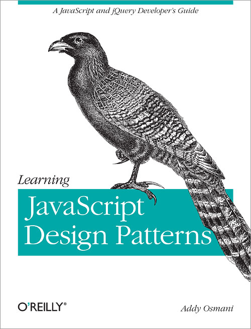
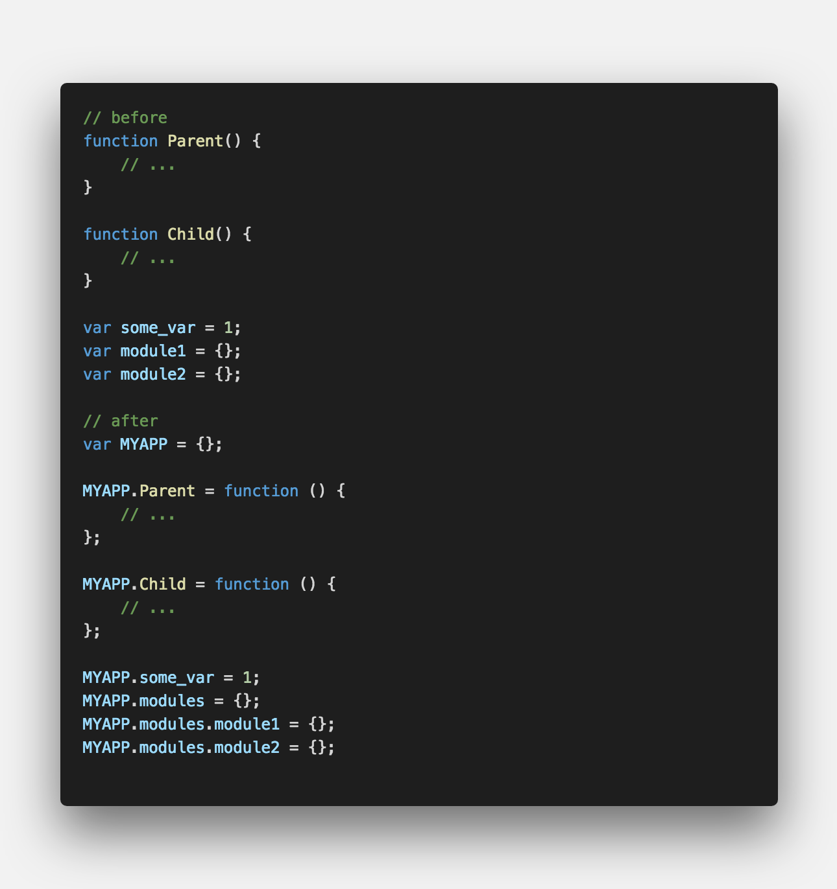
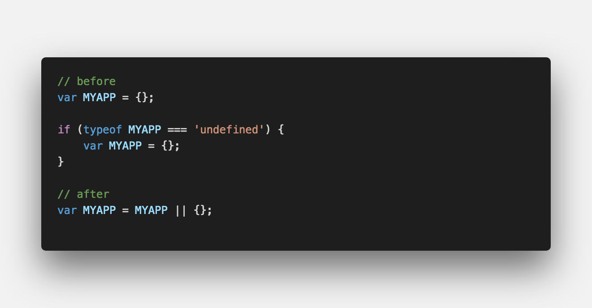
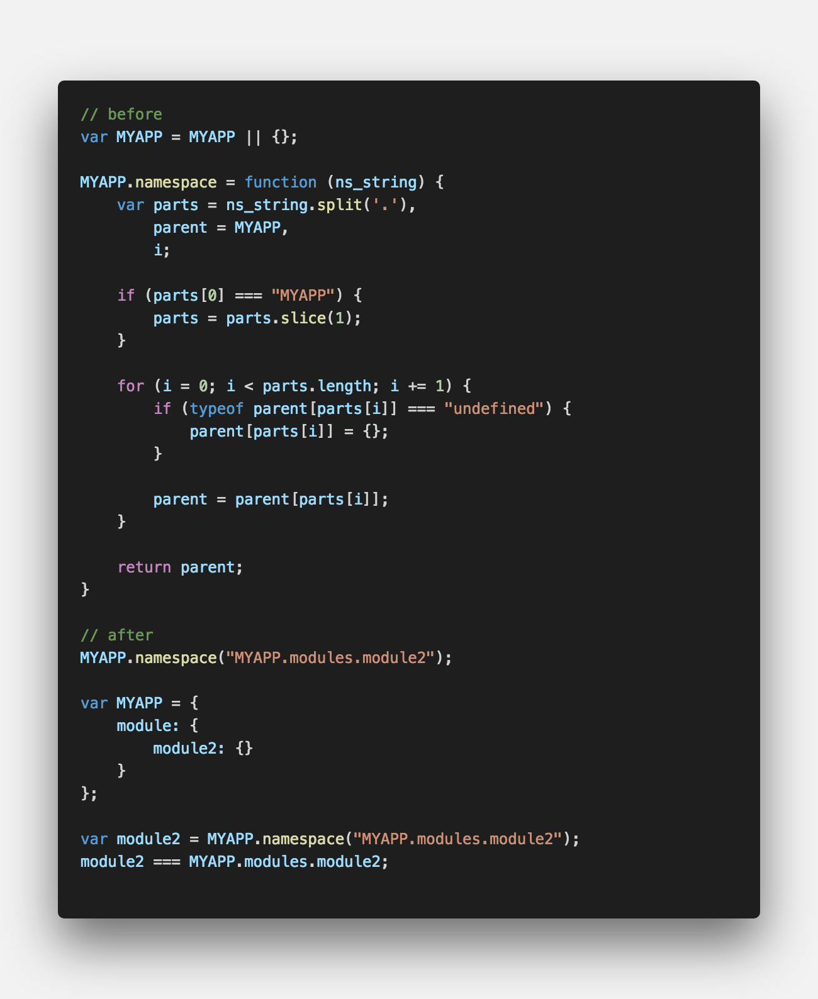
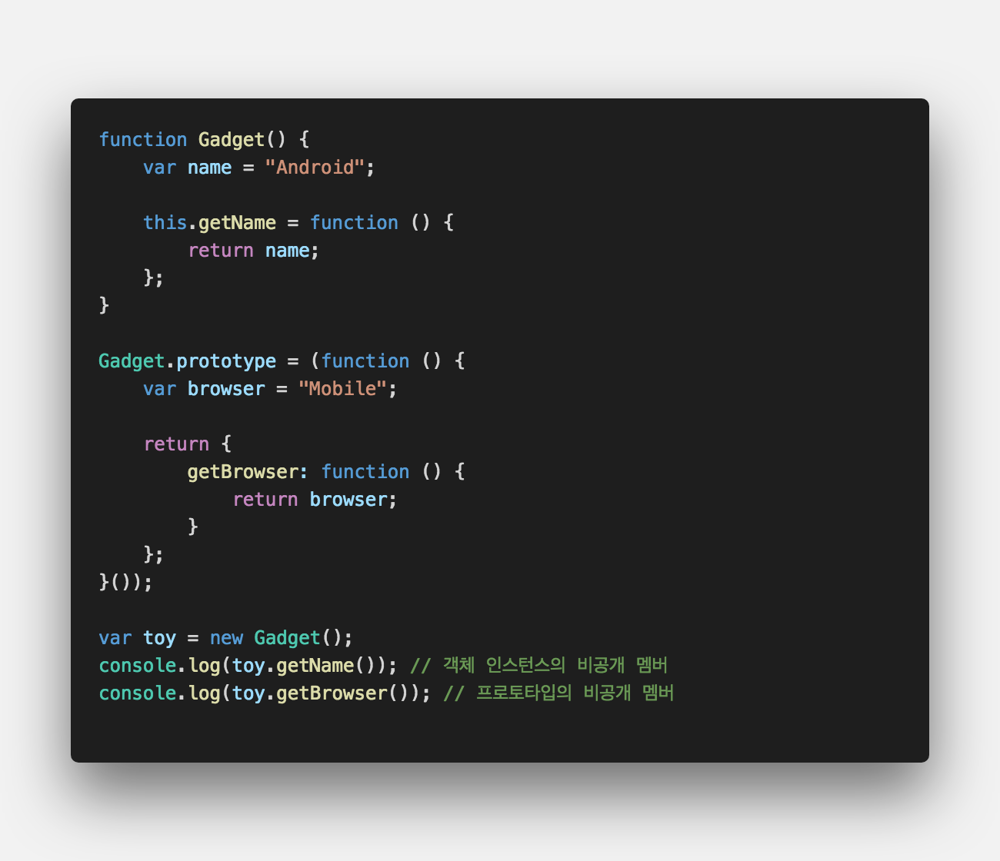
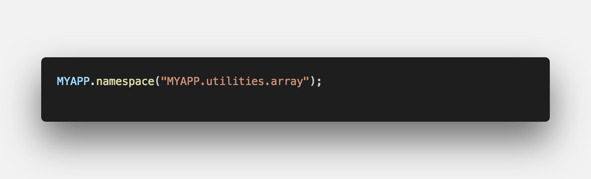
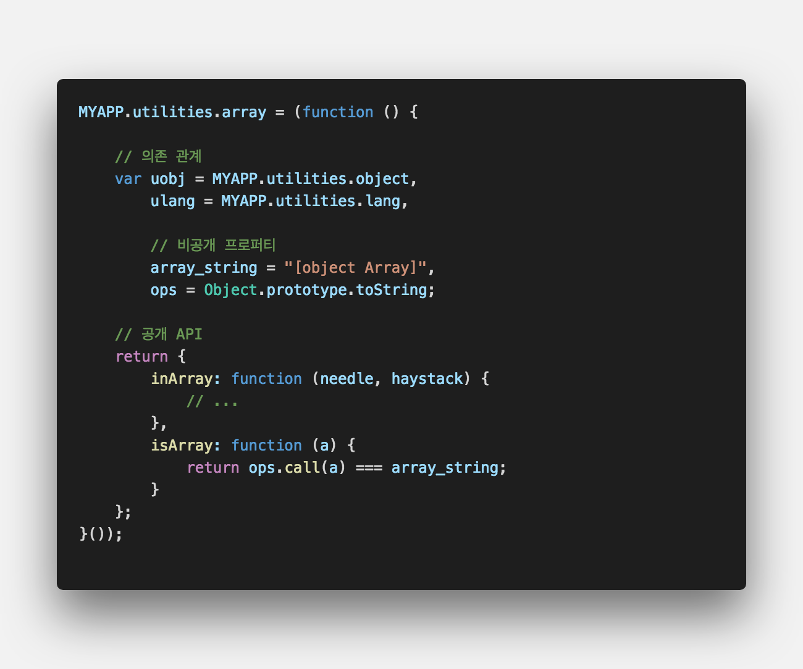
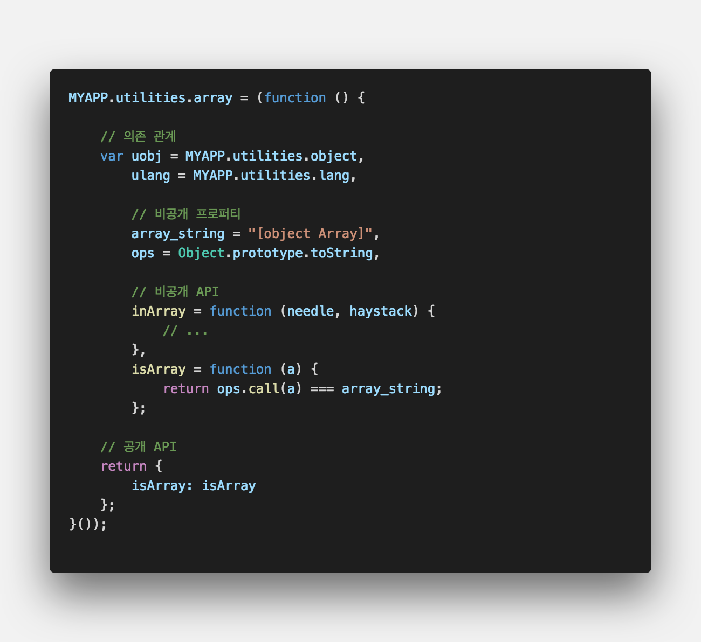

## **💎 목차**
  * [디자인패턴](#-디자인패턴)
  * [코드를 보며](#-코드를-보며)

## **디자인패턴**

- 프로그래밍을 하다보면 유사한 상황을 자주 만나게 됩니다.

- 특정 상황에 사용되는 패턴을 `정형화`를 통해 유연하게 대처할 수 있습니다.

 

**[⬆ 목차](#-목차)**

## **😳 코드를 보며**

### ▸ 네임스페이스 패턴
* `전역변수`의 개수를 줄이고, `변수명`이 불필요하게 길어짐을 방지한다.
* 전역 네임스페이스 객체는 흔히 `대문자`로 선언한다.

 

* 이 패턴의 단점은 다음과 같다.
    1. 모든 변수와 함수에 접두어를 붙이므로, 전체 코드량이 길어져 파일의 크기가 증가
    2. 전역 인스턴스가 1개이기 때문에 부분이 수정되면 다른 전역 인스턴스도 모두 수정
    3. 이름이 길어지므로, 프로퍼티 판별을 위한 검색작업이 오래걸린다. 
    
     
    
    __`샌드박스 패턴`으로 해결 가능__

 

### ▸ 범용 네임스페이스 함수
*   프로그램 크기가 커져 복잡해지면, 네임스페이스 사용에 있어 점검이 필요하다.

 

* 객체 생성시 마다 추가하는 것보다는 함수로 별도 생성하는 것이 효과적이다.

 

---

### ▸ 의존 관계 선언
* 함수나 모듈내의 최상단에 의존 관계가 있는 모듈을 선언하는 것이 좋다.

 

* 위 패턴의 장점은 다음과 같다.
  1. 의존 관계가 명시적이기 때문에, 페이지 내에 포함시켜야 하는 스크립트 파일을 알기 쉽다.
  2. 지역변수 값 탐색은 `yahoo.uil.dom`과 같은 중첩 프로퍼티 보다 훨씬 빠르다.
  3. 고급 __Compressor__는 전역변수명 변경은 위험하기 때문에 축약하지 않는다.

 

* 코드 압축 예제를 보자면

 

---

### ▸ 비공개 프로퍼티와 메서드
* `클로저`를 이용한 비공개 멤버는 다음과 같이 구현한다.

 

* 비공개 멤버 구현방법 => 함수 내에서 지역변수로 선언한 `프로퍼티`를 함수로 감싼다.
* 생성자를 이용하여 비공개 멤버를 만드는 경우에는 생성자로 새로운 객체를 만들 때 마다 비공개 멤버가 재 생성되는 단점
* 위와 같은 단점은 `프로토타입`으로 보완이 가능하다.

 

---

### ▸ 모듈 패턴
* 모듈 패턴을 이용하면 개별적인 코드를 느슨하게 `결합`이 가능하다.
* 많은 양의 코드를 구조화하고 정리하는 데 도움이 된다.
* 모듈 패턴은 아래 패턴들을 조합한 것이다.
  * 네임스페이스 패턴
  * 즉시 실행 삼수
  * 비공개 멤버 & 특권 멤버
  * 의존 관계 선언

 

#### ▸ 모듈 패턴 적용을 위한 절차
* 1단계 : 네임스페이스 설정

 

* 2단계 : 모듈 정의

 

* 비공개 프로퍼티 및 메서드를 추가한 모듈의 모습

 

* 위의 모듈 내용을 모두 비공개로 바꾼 후 다음과 같이 몇개 API만 공개로 변환이 가능하다.

 

**[⬆ 목차](#-목차)**

---

 

> 출처
>
> <a href="https://joshua1988.github.io/web-development/javascript/javascript-pattern-object/" target="_blank">CAPTAIN PANGYO > javascript-pattern-object</a>

# 여러분의 댓글이 큰힘이 됩니다. (๑•̀ㅂ•́)و✧
