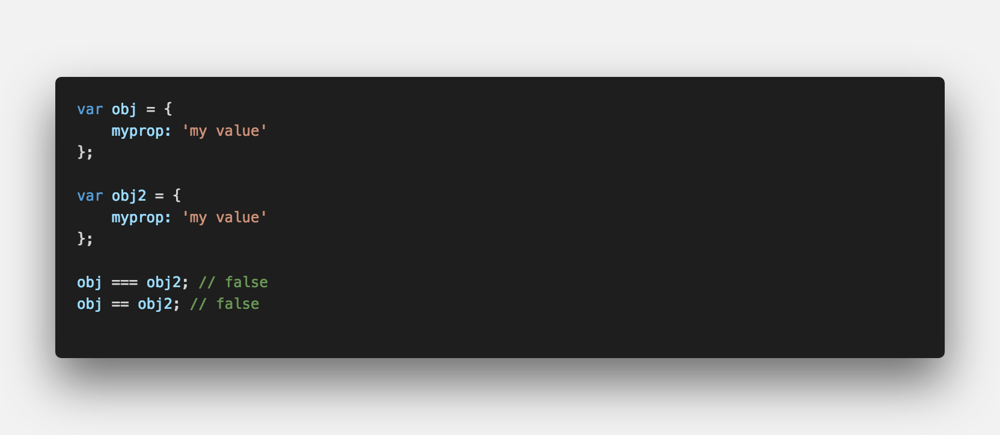
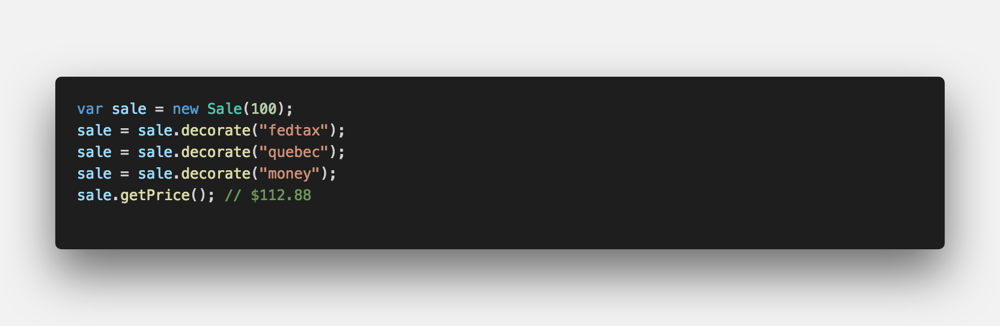
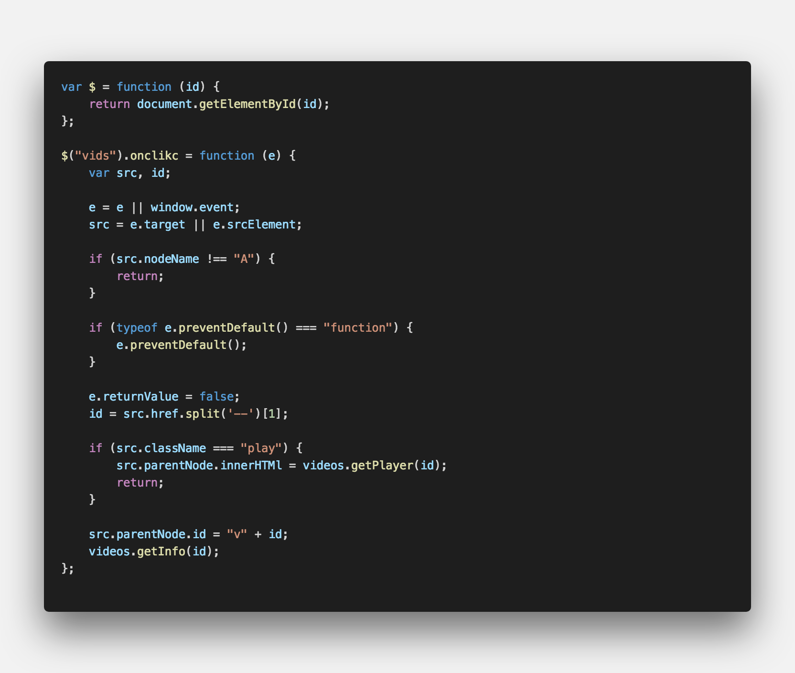
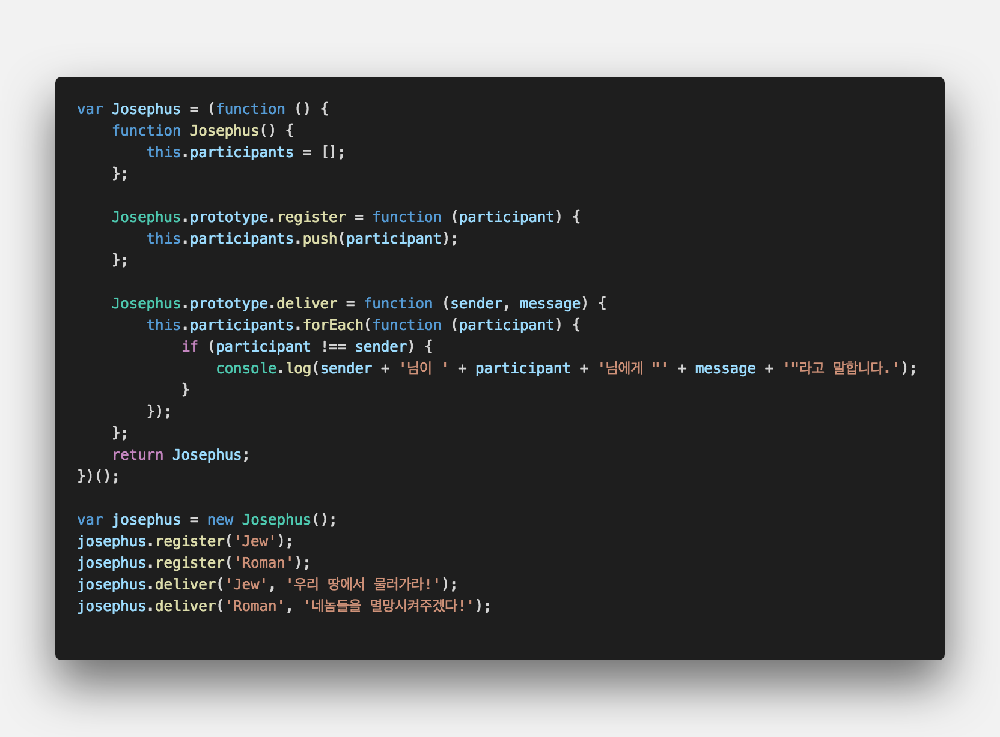
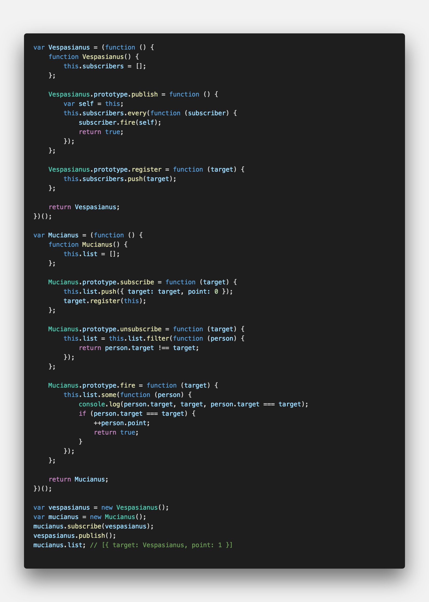

## **💎 목차**
  * [디자인패턴](#-디자인패턴)
  * [코드를 보며](#-코드를-보며)

## **디자인패턴**

- 프로그래밍을 하다보면 유사한 상황을 자주 만나게 됩니다.

- 특정 상황에 사용되는 패턴을 `정형화`를 통해 유연하게 대처할 수 있습니다.

 

**[⬆ 목차](#-목차)**

## **😳 코드를 보며**

### ▸ 싱글톤 패턴
*   싱글톤 패턴은 `특정 클래스`의 객체를 한개만 유지하는 패턴이다.
*   자바스크립트에서는 이미 객체 리터럴을 이요한 객체 생성 방법이 싱글톤 패턴과 동일하다.

 

---

### ▸ 팩토리 패턴
*   비슷한 객체를 공장에서 찍어내듯이 반복적으로 생성할 수 있게 하는 패턴
*   컴파일 시점에 구체적인 타입(클래스)을 몰라도 객체 생성이 가능하다.
*   팩토리 패턴의 가장 흔한 사례는 `Object()`를 이용한 객체 생성시,
*   주어지는 값의 타입에 따라 `String`, `Number`, `Boolean` 등 객체가 생성되는 것이다.

 

---

### ▸ Iterator 패턴
*   객체의 내부구조가 복잡하더라도 개별 속성에 쉽게 접근하기 위한 패턴

 

* 위의 agg 객체 구현방법은 아래와 같다

 

---

### ▸ Decorator 패턴
*   런타임시 객체에 동적으로 부가기능을 추가할 수 있는 패턴

 

*   구현 예제는 다음과 같다.

 

*   위 `decorators()`를 아래와 같이 구현할 수 있다.

 

---

### ▸ 프록시 패턴
*   Lazy Initialization (게으른 초기화)로 어플리케이션 부하를 줄여준다.

 

*   위와 같이 클릭 이벤트에 대해서 이벤트 핸들링이 가능하다.
*   아래는 Proxy를 이용하여 HTTP 라운드 트립을 줄일 수 있는 코드다.

 

*   HTTP 요청이 50 밀리세컨이내로 일어난다면, 각각 보낼 것이 아닌 `setTimeout()`을 이용하여 요청을 잠시 보류한 후 한번에 보낸다.
*   그렇게 되면, HTTP 라운드 트립 횟수가 줄어들기 때문에 전체적으로 성능이 향상될 수 있다.

 

---

### ▸ Mediator 패턴
*   객체 간의 영향도 (결합도)가 높은 상태에서는 어플리케이션의 리팩토링이 예기치 않은 결과를 나을 수 있다.
*   따라서, 결합도를 낮추기 위해 객체의 상태가 변경되면 Mediator에게 먼저 전달하고,
*   이를 Mdeiator가 다른 객체에 전달하는 방식의 코딩이 가능하다.

 

---

### ▸ Observer 패턴
*   클라이언트 측 자바스크립트 프로그래밍에서 널리 사용되는 패턴이다.
*   `subscriber` / `publisher` 패턴이라고도 한다.
*   예) mouseover, keypress와 같은 브라우저 이벤트
*   이 패턴은 주요 목적은 객체간의 결합도를 낮추는 것이다.

 

**[⬆ 목차](#-목차)**

---

 

> 출처
>
> <a href="https://joshua1988.github.io/web-development/javascript/javascript-pattern-design/" target="_blank">CAPTAIN PANGYO > javascript-pattern-design</a>

# 여러분의 댓글이 큰힘이 됩니다. (๑•̀ㅂ•́)و✧
