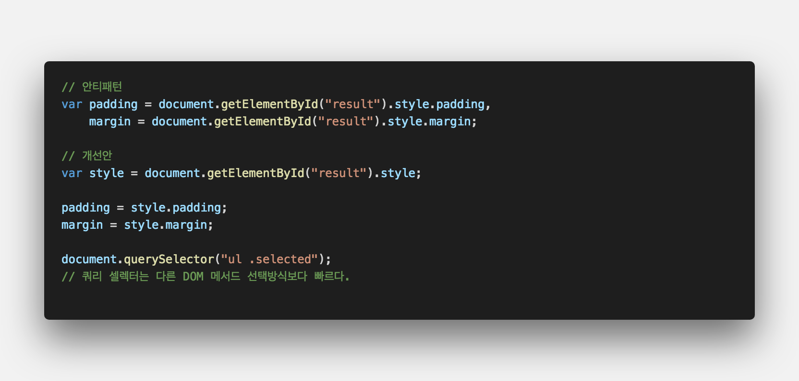
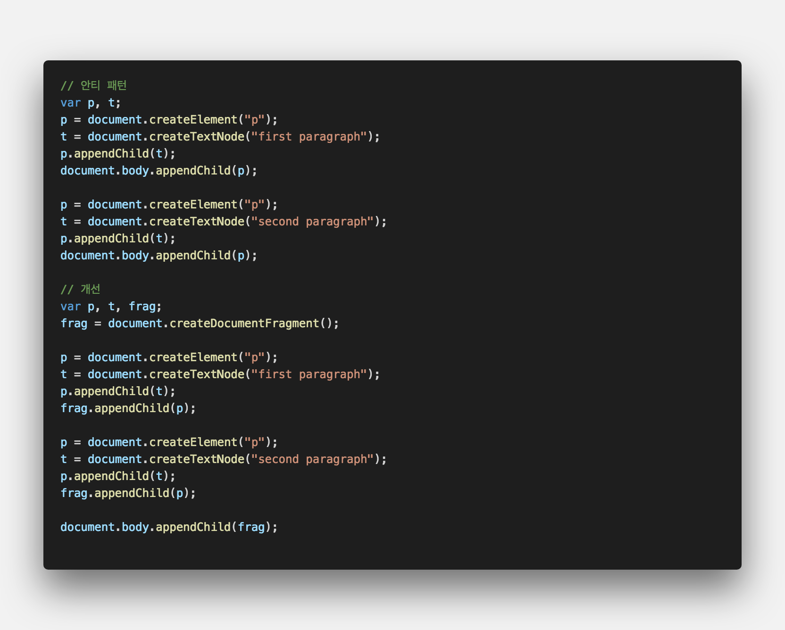
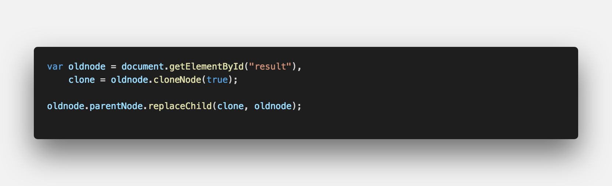
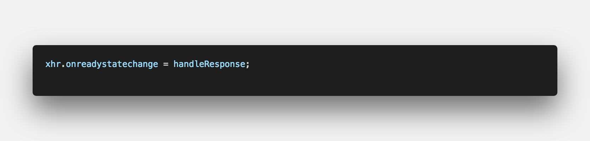

## **💎 목차**

- [디자인패턴](#-디자인패턴)
- [코드를 보며](#-코드를-보며)

## **디자인패턴**

- 프로그래밍을 하다보면 유사한 상황을 자주 만나게 됩니다.

- 특정 상황에 사용되는 패턴을 `정형화`를 통해 유연하게 대처할 수 있습니다.

<br />

**[⬆ 목차](#-목차)**

## **😳 코드를 보며**

### ▸ DOM 접근

- DOM 접근은 최소화 한다.
- 반복문 내에서 DOM 접근은 피한다.


<br />

- DOM 참조를 지역변수에 할당하여 사용한다.


<br />

- 자주 접근하는 엘리먼트에 `id 속성`을 추가하는 것도 성능 향상에 도움이 된다.
- 왜냐하면, `document.getElementById()`가 노드를 찾는 가장 빠른 방법

<br />

---

### ▸ DOM 조작

- DOM 업데이트는 최소화 하는 것이 좋다.
- 업데이트시에 화면을 `repaint` 하고, 엘리먼트를 `reflow` 하는데 많은 비용이 발생한다.
- 서브트리를 추가할 시에는 서브 트리의 구성요소를 모두 생성한 후에 마지막에 한번만 추가해준다.


<br />

- 존재하는 트리를 변경하는 경우에는 서브트리의 루트를 복제해서 변경한 뒤 원래의 노드와 바꾼다.


<br />

---

### ▸ 이벤트

- 이벤트 리스너는 아래와 같이 구현할 수 있다.


<br />

- `setTimeOut()` 이나 `Web Worker` 를 이용하여 쓰레드 같은 기능을 구현할 수 있다.

<br />

---

### ▸ XMLHttpRequest

- 자바스크립트에서 HTTP 요청을 생성하는 특별한 객체 (생성자 함수)
- 생성과정은 아래와 같다.

1. XMLHttpRequest(XHR) 객체를 생성


<br />

2. 응답 객체의 상태 변경시 알림을 받기 위한 콜백함수 지정


<br />

3. 요청


<br />

---

### ▸ JSONP

- JSON with padding
- 브라우저의 동일 도메인 정책의 제약을 받지 않는다.
- JSONP의 요청 URL 형태

<br />

```sh

http://example.org/getdata.php?callback=myHandler

```

<br />

- 위에서 `getdata.php` 가 웹페이지 이거나 스크립트가 될 수 있다.
- `getdata.php` 파일이 수신되면, `myHandler()`같은 콜백함수가 실행된다.

<br />

---

### ▸ 웹 페이지 로딩 전략

- script 태그에 들어가는 엘리멘트를 살펴보자
  - `<script type='text/javascript'>` ⇨ HTML5에서는 필수 속성이 아니다.
  - 마크업 유효성 검사를 위한 경우가 아니라면 사용하지 않는다.
  - `async(defer)` ⇨ 비동기 스크립트 로딩으로, 스크립트를 받는 동안 다른 다운로드를 방해하지 않는다.

<br />

**[⬆ 목차](#-목차)**

---

<br />

> 출처
>
> <a href="https://joshua1988.github.io/web-development/javascript/javascript-pattern-dom-browser/" target="_blank">CAPTAIN PANGYO > javascript-pattern-dom-browser</a>

# 여러분의 댓글이 큰힘이 됩니다. (๑•̀ㅂ•́)و✧
