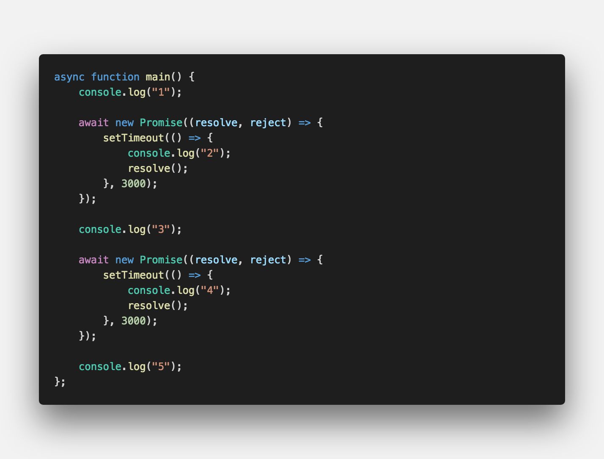
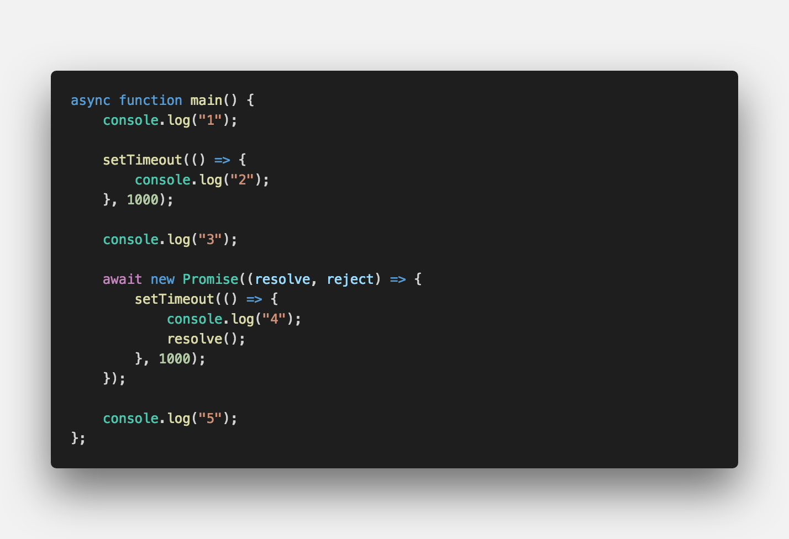

<!-- ---
title: ' 호이스팅(Hoisting) '
date: 2019-11-19 10:14:60
category: 'JavaScript'
---

선언문을 유효범위의 최상단으로 끌어올리는 행위 <strong style="color:#F6CF2F; font-size: 20px;">선언과 할당의 분리</strong>

## **💎 목차**

- [정의 (Problem)](#-정의를-보며)
- [예제 (Solution)](#-예제을-보며)
- [복습 (Practice)](#-복습을-하며)

## **📕 정의를 보며**

 

**[⬆ 목차](#-목차)**

## **📘 해답을 보며**

**결과 : `1 2 3 4 5`**

- `function`앞에 `aysnc`과 비동기로 처리되는 부분에 `await` 작성하면 된다.

- `await` 부분은 반드시 `promise`로 반환을 하기 때문에 `promise` 코드도 작성하였다.

 

**[⬆ 목차](#-목차)**

## **📗 실습을 하며**

해당 이미지는 한 기업에서 출제 했던 서면 인터뷰입니다.

- 다음 실행 결과와 그 이유를 설명하시오.

 

**[⬆ 목차](#-목차)**

 

# 여러분의 댓글이 큰힘이 됩니다. (๑•̀ㅂ•́)و✧ -->
