## **💎 목차**

- [시작하며](#-시작하며)
- [코드를 보며](#-코드를-보며)
- [마치며](#️-마치며)

## **🚀 시작하며**

안녕하세요 🕦 오늘은 늦은 시간에 포스팅을 하게되었습니다.

퇴근 후, 소소한 블로그도 또 하나의 재미라고 생각하네요. 😎

자 그럼 ~ 이번 포스팅 주제는 [Lodash](https://lodash.com/) vs [ES6](https://www.w3schools.com/js/js_es6.asp) 성능을 비교해보겠습니다.

<br />

**[⬆ 목차](#-목차)**

<hr />

## **😳 코드를 보며**

### **▸ find()**

`find()`는 조건을 만족하는 컬렉션에서의 첫번째 요소를 찾는 메소드입니다.

```js
var array = [
  { name: 'lim', age: 26 },
  { name: 'kim', age: 28 },
  { name: 'choi', age: 32 },
  { name: 'park', age: 21 },
]

/* Lodash */
_.find(array, arr => arr.age < 28)

/* ES6 */
array.find(arr => arr.age < 28)
```

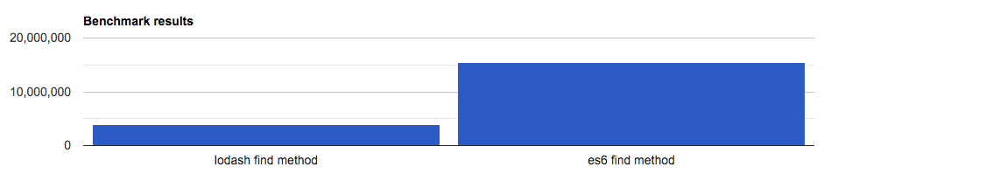
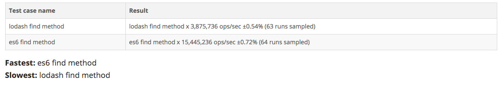

> [자세히 보기](https://measurethat.net/Benchmarks/ShowResult/85641)

<br />

### **▸ filter()**

`filter()`는 특정 조건을 만족하는 모든 요소를 추출하는 메소드입니다.

```js
var array = [
  { name: 'lim', age: 26 },
  { name: 'kim', age: 28 },
  { name: 'choi', age: 32 },
  { name: 'park', age: 21 },
]

/* Lodash */
_.filter(array, arr => arr.age > 26)

/* ES6 */
array.filter(arr => arr.age > 26)
```

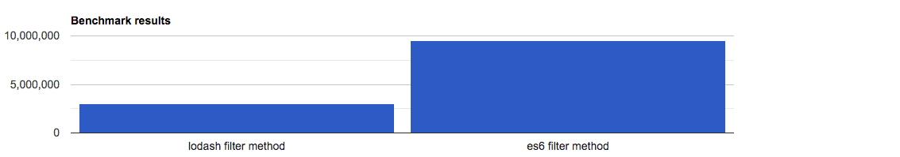


> [자세히 보기](https://measurethat.net/Benchmarks/ShowResult/85642)

<br />

### **▸ forEach()**

`forEach()`는 배열 전체를 돌며 해당 배열의 요소에 `직접적인 작업`을 하는 메소드입니다.

```js
var array = [
  { name: 'lim', age: 26 },
  { name: 'kim', age: 28 },
  { name: 'choi', age: 32 },
  { name: 'park', age: 21 },
]

/* Lodash */
_.forEach(array, (arr, index, self) => {
  // ...
})

_.each(array, (arr, index, self) => {
  // ...
})

/* ES6 */
array.forEach((arr, index, self) => {
  // ...
})
```

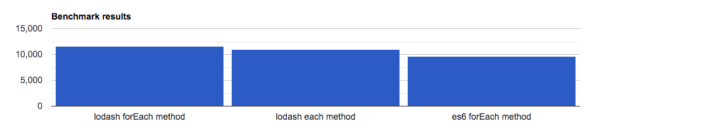
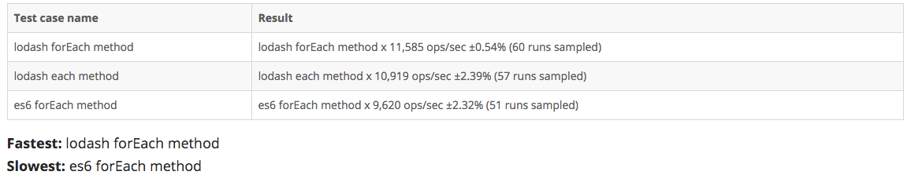

> [자세히 보기](https://measurethat.net/Benchmarks/ShowResult/85575)

<br />

### **▸ map()**

`map()`은 배열 전체를 돌며 배열의 요소를 가지고 새로운 배열을 반환하는 메소드입나다.

```js
var array = [
  { name: 'lim', age: 26 },
  { name: 'kim', age: 28 },
  { name: 'choi', age: 32 },
  { name: 'park', age: 21 },
]

/* Lodash */
var result = _.map(array, arr => {
  // ...
})

/* ES6 */
var result = array.map(arr => {
  // ...
})
```

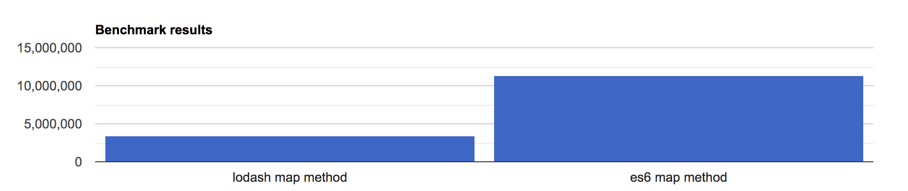
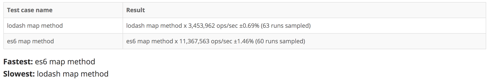

> [자세히 보기](https://measurethat.net/Benchmarks/ShowResult/85630)

<br />

### **▸ reduce()**

`reduce()`은 배열 전체를 돌며 배열의 요소를 가지고

이전 리턴 값을 넘겨받아 어떤 작업을 수행할때 사용하는 메소드입나다.

```js
var array = [
  { name: 'lim', age: 26 },
  { name: 'kim', age: 28 },
  { name: 'choi', age: 32 },
  { name: 'park', age: 21 },
]

/* Lodash */
var result = _.reduce(array, (prev, cur) => {
    // ...
}, 0)

/* ES6 */
var result = array.reduce((prev, cur) => {
  // ...
}, 0)
```


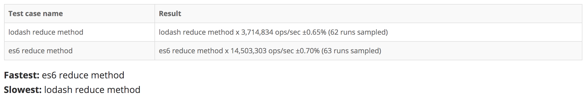

> [자세히 보기](https://measurethat.net/Benchmarks/ShowResult/85631)

<br />

### **▸ some()**

`some()`은 배열 전체를 돌며 배열의 요소를 가지고

특정 조건을 만족하는 요소가 있는지 알고싶을 때 사용하는 메소드입니다.

```js
var array = [
  { name: 'lim', age: 26 },
  { name: 'kim', age: 28 },
  { name: 'choi', age: 32 },
  { name: 'park', age: 21 },
]

/* Lodash */
var result = _.some(array, arr => {
  // ...
})

/* ES6 */
var result = array.some(arr => {
  // ...
})
```


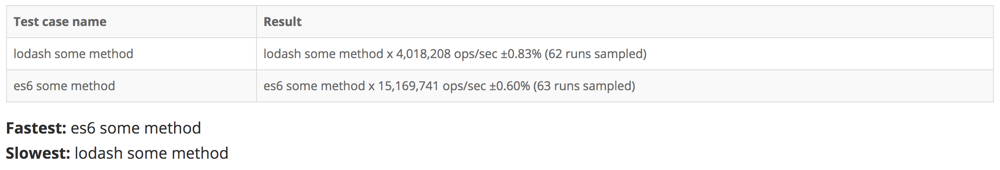

> [자세히 보기](https://measurethat.net/Benchmarks/ShowResult/85632)

<br />

### **▸ every()**

`every()`은 배열 전체를 돌며 배열의 요소를 가지고

모든 요소가 특정 조건을 만족하는지 알고싶을 때 사용하는 메소드입니다.

```js
var array = [
  { name: 'lim', age: 26 },
  { name: 'kim', age: 28 },
  { name: 'choi', age: 32 },
  { name: 'park', age: 21 },
]

/* Lodash */
var result = _.every(array, arr => {
  // ...
})

/* ES6 */
var result = array.every(arr => {
  // ...
})
```

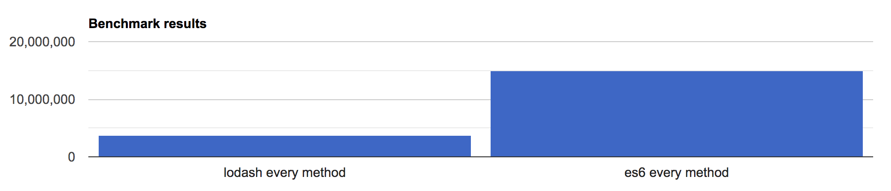
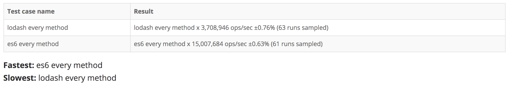

> [자세히 보기](https://measurethat.net/Benchmarks/ShowResult/85634)

<br />

### **▸ indexOf()**

`indexOf()`은 인자로 전달된 데이터와 매치되는

첫 번째 원소의 인덱스를 반환하는 메소드입니다.

```js
var array = ['a', 'b', 'c', 'd', 'e', 'f', 'g']

/* Lodash */
var result = _.indexOf(array, 'd') > -1

/* ES6 */
var result = array.indexOf('d') > -1
```

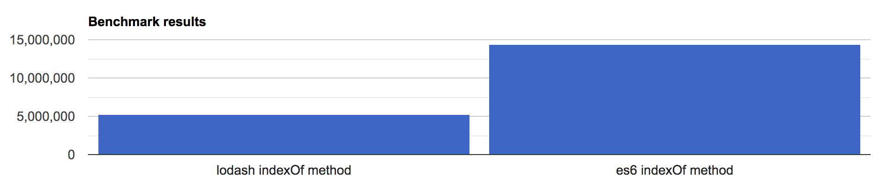
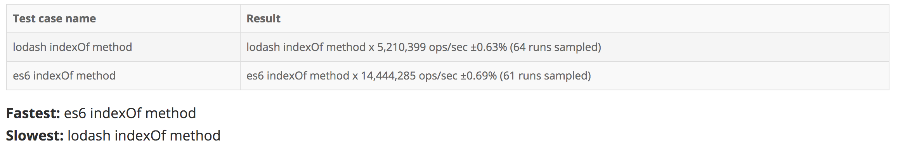

> [자세히 보기](https://measurethat.net/Benchmarks/ShowResult/85636)

<br />

### **▸ includes()**

`includes()`은 인자로 전달된 데이터가 배열 요소에

포함되어있는 확인하는 메소드입니다.

```js
var array = ['a', 'b', 'c', 'd', 'e', 'f', 'g']

/* Lodash */
var result = _.includes(array, 'd')

/* ES6 */
var result = array.includes('d')
```

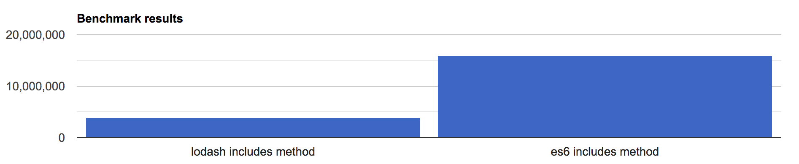
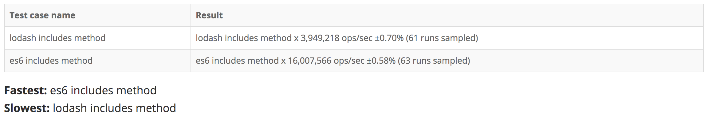

> [자세히 보기](https://measurethat.net/Benchmarks/ShowResult/85637)

<br />

**[⬆ 목차](#-목차)**

<hr />

## **⛳️ 마치며**

지금까지 다양한 Array Method 성능을 비교해보고 `개인적인 견해`를 말씀드립니다.

### **▸ Lodash**

- 장점

  1. 메소드에서 제공하는 다양한 기능으로 생산성이 높다.
  2. 다양한 데이터 타입을 지원하므로 처리가 용이롭다.

- 단점
  1. 외부 라이브러리를 사용하기 때문에 무겁다.
  2. ES6에 비하여 속도가 느리다.
  3. 버전관리가 불편하다.

### **▸ ES6**

- 장점

  1. 브라우저 호환성이 뛰어나며 (ES6는 대부분 지원)
  2. 속도가 빠르다.
  3. 코드 유지 및 보수가 편하다.

- 단점
  1. 예외 처리를 잘 해야한다. 왜냐하면 Array 타입밖에 지원을 안하기 때문이다.
  2. 복잡한 데이터 처리에는 직접 메소드를 만들어야 하므로 번거롭다.

<br />

- 프론트, 초기 로딩 속도, 리소스 양을 줄여야 하고 데이터 처리는 대부분 백엔드에서 중점적으로 하니 ES6 문법

- 백엔드, 예외 처리의 대한 오류가 발생이 위험하며, 다양한 데이터 타입을 가공해야하니 라이브러리

_프론트 : ES6 백엔드 : Lodash_

<br />

**[⬆ 목차](#-목차)**

<hr />

<br />

> 출처
>
> <a href="https://measurethat.net/" target="_blank">성능 비교 사이트</a>

# 여러분의 댓글이 큰힘이 됩니다. (๑•̀ㅂ•́)و✧
