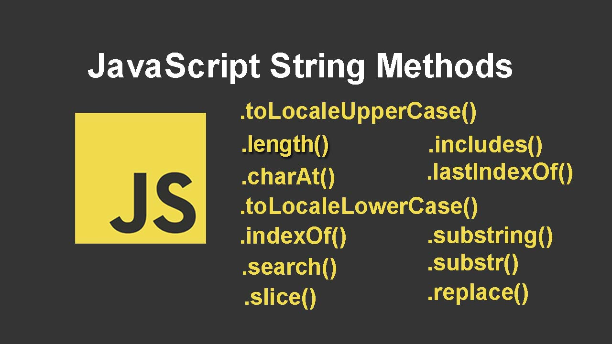

## **💎 목차**

- [문자 메서드](#-문자-메서드)
- [코드를 보며](#-코드를-보며)
- [마치며](#-마치며)

## **문자 메서드**

- 효과적인 코드 작성을 위하여 자바스크립트 `문자 메서드` 소개 및 예제를 살펴봅시다.

- 내용이 많으니 주의하시기 바랍니다.

<br />

**[⬆ 목차](#-목차)**

<hr />

## **😳 코드를 보며**

### ▸ length()

```js
const arr = [1, 2, 3, 4]
const str = 'Hello World'
const num = 1

arr.length
str.length
num.length

// result
// arr = 4
// str = 10
// num = undefined
```

변수에 `길이를` 반환합니다.

<br />
<hr />

### ▸ toLocaleLowerCase()

```js
const str = 'Hello World'
str.toLocaleLowerCase()

// result
// hello worold
```

문자열을 `소문자`로 반환합니다.

<br />
<hr />

### ▸ toLocaleUpperCase()

```js
const str = 'Hello World'
str.toLocaleUpperCase()

// result
// HELLO WORLD
```

문자열을 `대문자`로 변환합니다

<br />
<hr />

### ▸ indexOf()

```js
const str = 'Hello World'
str.indexOf('l')

// result
// 2
// H e l l o √ W o r l d
// 0 1 2 3 4 5 6 7 8 9 10 
```

문자열에서 지정된 값의 `첫 번째 위치`를 반환합니다.

<br />
<hr />

### ▸ search()

```js
const str = 'Hello World'
str.search('World')
str.search('world')

// result
// 6
// -1
```

문자열에서 지정된 값을 검색하고 `일치 상태를` 반환합니다.
대문자, 소문자에 주의하며 작성해야합니다.

<br />
<hr />

### ▸ slice()

```js
const arr = 'Hello World'
arr.slice(0, 5)

// result
// Hello
```

__slice(startIndex, endIndex)__
* startIndex : 문자열의 시작 인덱스
* endIndex : 문자열의 마지막 인덱스

문자열 `부분을 제거`하고 추출 된 부분을 `새 문자열`로 반환합니다.

<br />
<hr />

### ▸ substring()

```js
const str = 'Hello World'
str.substring(0, 5)

// result
// Hello
```

__substring(indexStart[, indexEnd])__
* indexStart : 반환 문자열의 시작 인덱스
* indexEnd (옵션) : 반환 문자열의 마지막 인덱스

문자열에서 지정된 `두 인덱스 사이의` 문자를 제거하고 새 하위 문자열을 반환합니다.

<br />
<hr />

### ▸ substr()

```js
const str = 'Hello World'
str.substr(0, 5)

// result
// Hello
```

지정된 위치의 문자에서 시작하여 `지정된 문자 수`를 반환합니다.

<br />
<hr />

### ▸ replace()

```js
const str = 'Hello World'
str.replace('Hello', 'New')

// result
// New World
```
__replace(oldStr, newStr)__
* oldStr : 이전 문자
* newStr : 변경 할 문자

값을 다른 값으로 `변경`합니다.

<br />
<hr />

### ▸ includes()

```js
const str = 'Hello World'
str.includes('World')

// result
// true
```

문자열에 지정된 문자열의 문자가 `포함되어 있는지 여부`를 반환합니다.

<br />
<hr />

### ▸ concat()

```js
const str1 = 'Hello '
const str2 ='World'

str1.concat(str2)

// result
// Hello World
```

둘 이상의 문자열을 `결합`하는 데 사용됩니다.

<br />
<hr />

### ▸ charAt()

```js
const str = 'Hello World'
str.charAt(0)

// result
// H
```

`지정된 위치의 문자`를 반환합니다.

<br />
<hr />

### ▸ charCodeAt()

```js
const str = 'Hello World'
str.charCodeAt(0)

// result
// 72
```

지정된 위치의 `문자의 유니 코드`를 반환합니다.

<br />
<hr />

### ▸ lastIndexOf()

```js
const str = 'Hello World'
str.lastIndexOf('World')

// result
// 6
```

문자열에서 지정된 문자가 `마지막으로` 나타는 색인을 반환합니다.

<br />
<hr />

### ▸ trim()

```js
const str = '   Hello World '
str.trim()

// result
// Hello World
```

문자열의 양쪽에서 `공백을 제거`합니다.

<br />
<hr />

### ▸ match()

```js
const str = 'Hello World'
str.match(/l/g)

// result
// ['l', 'l', 'l']
```

`정규식`과 일치하는 문자열을 검색하고 `일치를 Array`로 반환합니다.

<br />
<hr />


<br />

**[⬆ 목차](#-목차)**

<hr />

## **😌 마치며**

이것으로 문자 메서드에 대해 알아보았습니다.

배열 메서드와 유사한 메서드도 많으며 그 밖에 다양한 메서드도 존재합니다.

혹시 다른 문자 메서드를 알고계신다면 댓글, 이슈로 알려주시면 감사합니다.

이상 포스팅을 마칩니다.

<br />

**[⬆ 목차](#-목차)**

<hr />

<br />

# 여러분의 댓글이 큰힘이 됩니다. (๑•̀ㅂ•́)و✧
