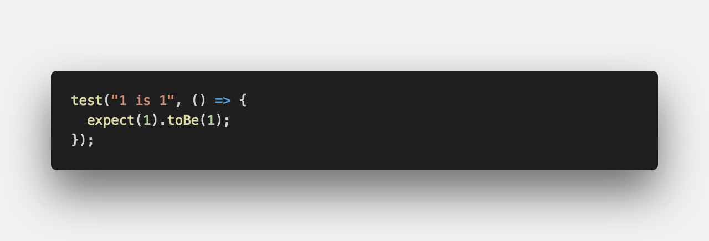
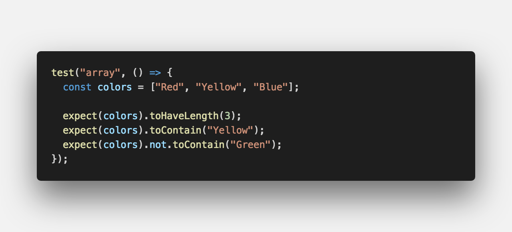
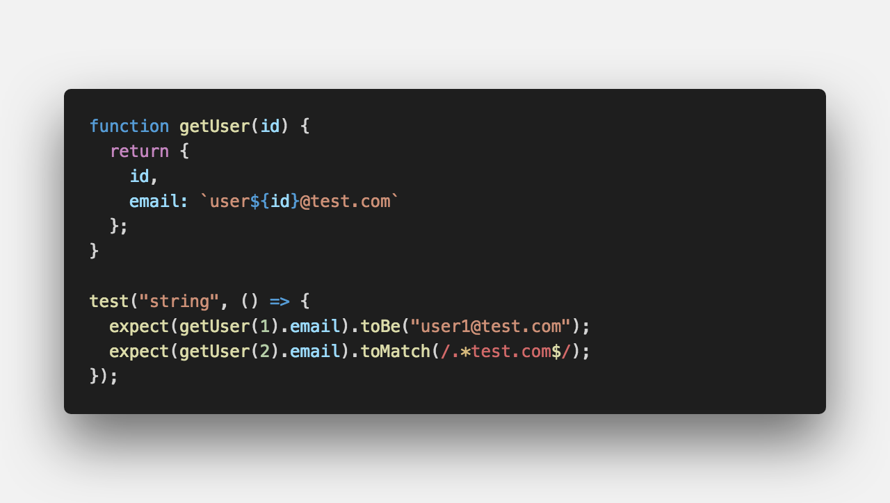

<center>페이스북에서 만든<strong style="color:#D52B00; font-size: 20px;">테스트 프레임워크</strong>입니다.</center>

## **💎 목차**

- [설치를 하며](#️-설치를-하며)
- [코드를 보며](#-코드를-보며)
- [생각 해보며](#-생각해-보며)

## **⚙️ 설치를 하며**

Jest는 All-in-one 테스팅 라이브러리로 이전에 자바스크립트 코드를 테스트하려면

여러가지 테스팅 라이브러리를 조합해서 사용하곤 했었습니다.

예를 들어, `Mocha`, `Jasmin`을 Test Runner로 사용하고,

`Chai`, `Expect`를 Test Mathcher 사용,

`Sinon`, `Testdouble` Test Mock 라이브러리가 필요했었습니다.

하지만, Jest 라이브러리 하나만 설치하면 Test Runner, Test Mathcher, Test Mock

프레임워크 모두 제공해주기 때문에 상당히 편리하게 사용하실수 있습니다.

```sh

$ npm install -D jest

```

<br />

**[⬆ 목차](#-목차)**

<hr />

## **😳 코드를 보며**

`toXxx()` 부분에서 사용되는 함수를 흔히 Test Mathcher라고 합니다.

이제 몇가지 Test Mathcher에 대해 알아 보겠습니다.

### ▸ toBe()


<br />

```js

 PASS  src/index.spec.ts
  ✓ 1 is 1 (3ms)

Test Suites: 1 passed, 1 total
Tests:       1 passed, 1 total
Snapshots:   0 total
Time:        2.224s
Ran all test suites.

```

`toBe()` 숫자, 문자와 같은 객체가 아닌 기본형(primitive)값을 비교할 때 사용합니다.

<br />
<hr />

### ▸ toEqual()


<br />

```js

 PASS  src/index.spec.ts
  ✓ return a user object (4ms)

Test Suites: 1 passed, 1 total
Tests:       1 passed, 1 total
Snapshots:   0 total
Time:        1.715s, estimated 2s
Ran all test suites.

```

`toEqual()`는 `toBe()` 함수와 매우 유사하지만 객체 타입을 비교할 때 사용합니다.

<br />
<hr />

### ▸ toBeTruthy(), toBeFalsy()


<br />

```js

 PASS  src/index.spec.ts
  ✓ number 0 is falsy but string 0 is truthy (3ms)

Test Suites: 1 passed, 1 total
Tests:       1 passed, 1 total
Snapshots:   0 total
Time:        1.64s, estimated 2s
Ran all test suites.

```

자바스크립트 언어 특성상 느슨한 타입 기반으로 되어있어, 다른 강한 타입 기반 언어처럼

true와 false가 boolean 타입에 한정되지 않습니다.

따라서, 숫자 1 = true, 숫자 0 = false 로 간주되는 것과 같이

모든 타입의 값들을 true, false 간주하는 규칙이 있습니다.

`toBeTruthy()`는 검증 대상이 이 규칙에 따라 true로 간주되면 통과,

`toBeFalsy()`는 반대로 flase로 간주되면 통과가 됩니다.

<br />
<hr />

### ▸ toHaveLength(), toContain()


<br />

```js

 PASS  src/index.spec.ts
  ✓ array (4ms)

Test Suites: 1 passed, 1 total
Tests:       1 passed, 1 total
Snapshots:   0 total
Time:        2.343s
Ran all test suites.

```

배열의 경우에는 배열의 길이 체크, 특정 원소 존재 여부를 테스트하는 경우가 많습니다.

`toHaveLength()`는 배열의 길이를 체크할 때 쓰이고,

`toContain()`는 특정 원소가 배열에 들어 있는지 확인시 사용합니다.

`not` 기능은 불만족하는지를 테스트 할때 사용합니다.

<br />
<hr />

### ▸ toMatch()


<br />

```js

 PASS  src/index.spec.ts
  ✓ string (4ms)

Test Suites: 1 passed, 1 total
Tests:       1 passed, 1 total
Snapshots:   0 total
Time:        2.094s
Ran all test suites.

```

문자열의 경우에는 `toBe()`를 사용해서 일치하는지를 체크하지만,

종종 정규식 기반의 테스트가 필요할 때가 있습니다.

그 경우, `toMatch()`를 사용합니다.

<br />

**[⬆ 목차](#-목차)**

<hr />

## **🤔 생각해 보며**

기본적인 테스트 코드 작성하는 방법에 대해서 알아보았습니다.

자바스크립트 언어 특성 상 비동기로 돌아가는 코드를 테스트해야 할 일이 많습니다.

2탄에서는 비동기 코드 테스트 작성하기에 대해 알아보겠습니다.

<br />

**[⬆ 목차](#-목차)**

<hr />

<br />

> 출처
>
> <a href="https://github.com/bynodejs/jest" target="_blank">GitHub > jest</a>

# 여러분의 댓글이 큰힘이 됩니다. (๑•̀ㅂ•́)و✧
