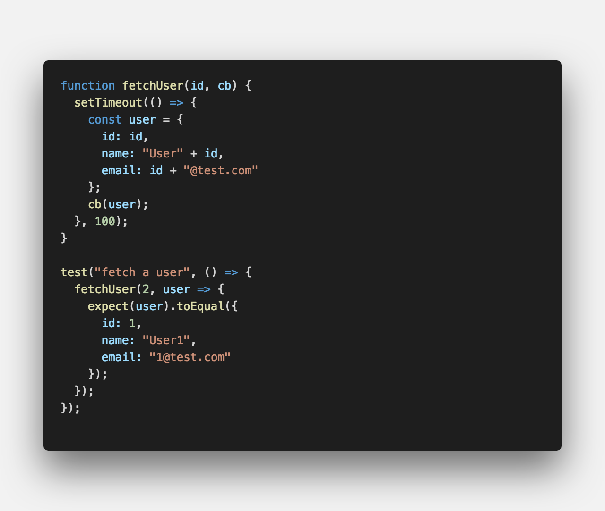
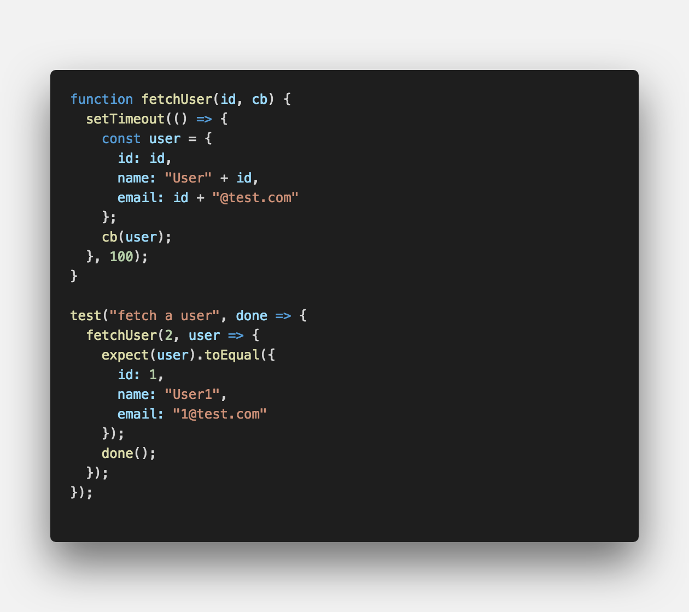
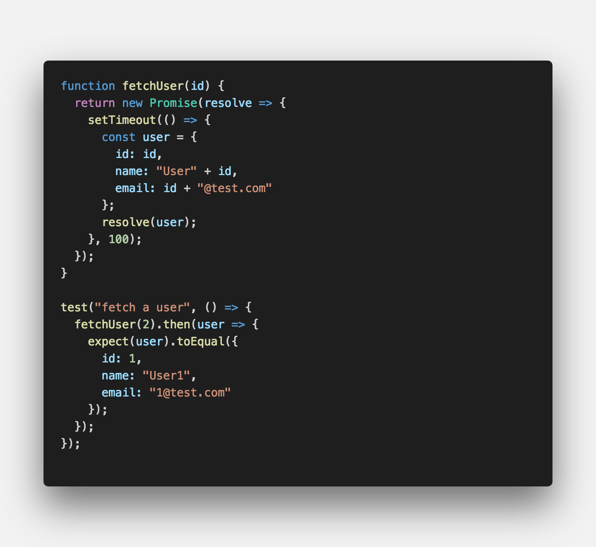
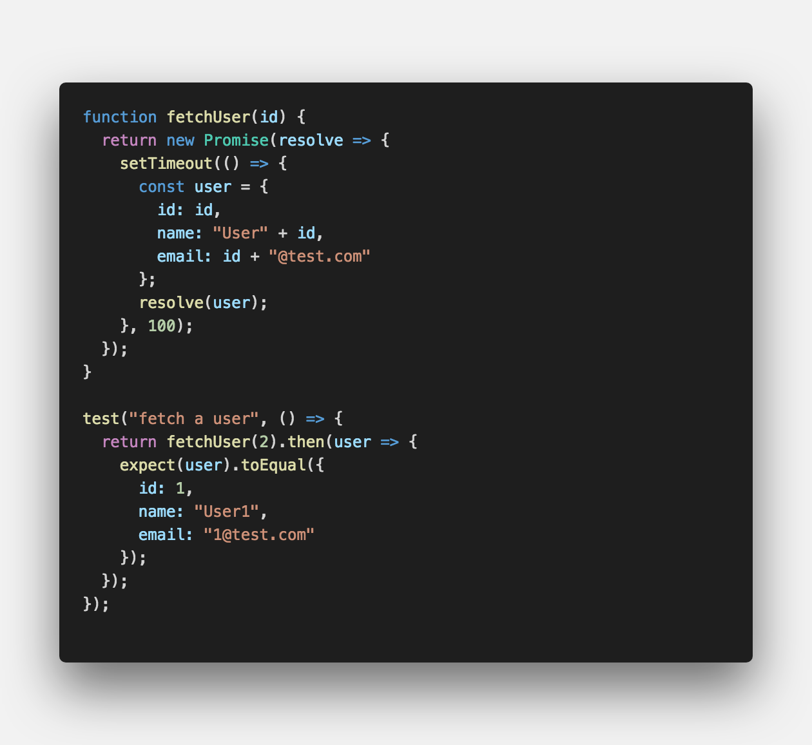
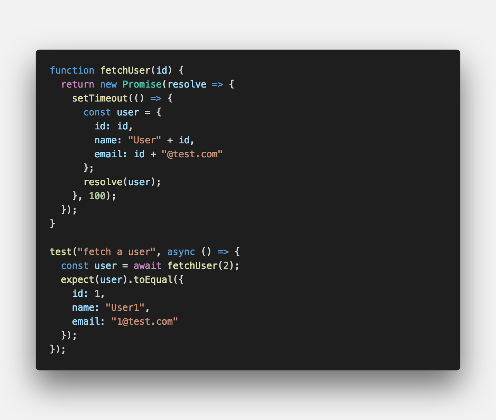
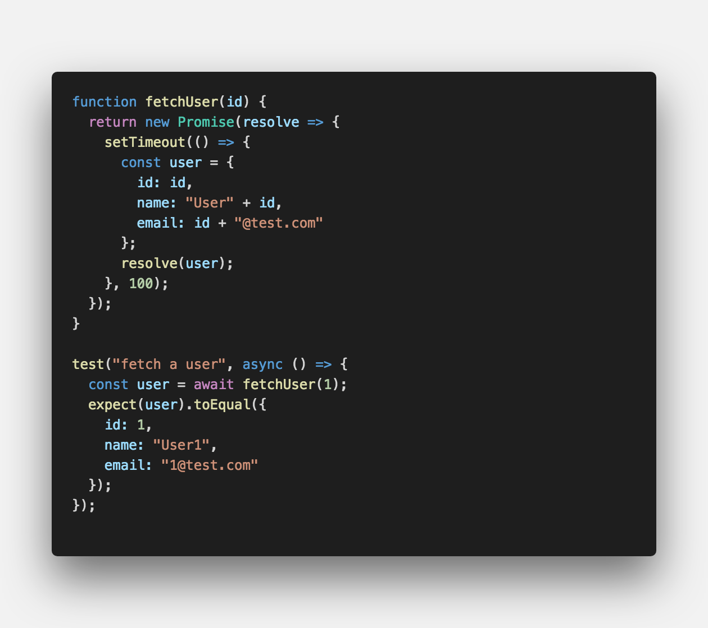

<center>페이스북에서 만든 <strong style="color:#D52B00; font-size: 20px;">테스트 프레임워크</strong> 입니다.</center>

## **💎 목차**

- [설치를 하며](#️-설치를-하며)
- [코드를 보며](#-코드를-보며)
- [생각 해보며](#-생각해-보며)

## **⚙️ 설치를 하며**

지난 포스트에서는 Jest 기본적인 테스트 코드 작성하는 방법에 대해서 알아보았습니다.

이번 포스트에서는 `비동기 코드 테스트 작성`하기에 대해 알아보겠습니다.

비동기 코드 테스트에서 흔히 하는 실수들과 적절한 대응 방법에 대해서도 알아보겠습니다.

<br />

**[⬆ 목차](#-목차)**

<hr />

## **😳 코드를 보며**

### ▸ 콜백 함수 테스트

콜백 함수를 이용하여 비동기 코드 테스트 작성하는 방법에 대해서 알아보겠습니다.

예를들어, 콜백 함수를 인자로 받는 자바스크립트 함수가 있다고 가정해보겠습니다.

이 함수는 인자로 넘어온 `id`를 가진 사용자 객체를 콜백 함수 `cb` 인자로 넘겨서 호출합니다.

(실제 코드라면, DB 조회나 API 호출 하겠지만 간단한 예제를 위해 임의로 만들어주었습니다.)

`setTimeout()` 함수를 사용해서 시간을 지연 후에 콜백 함수를 호출하겠습니다.


<br />

```js

 PASS  src/ch2/index.spec.ts
  ✓ fetch a user (2ms)

Test Suites: 1 passed, 1 total
Tests:       1 passed, 1 total
Snapshots:   0 total
Time:        1.183s
Ran all test suites.

```

테스트 결과 1ms 이상 걸린것을 확인할 수 있습니다.

즉, 0.1초, 100ms 지연이 되었다는 결과입니다.

그러나 PC 성능으로 인한 시간으로 생각할수 있어 확인위해 테스트 코드를 변경해 보았습니다.

<br />


<br />

```js

 PASS  src/ch2/index.spec.ts
  ✓ fetch a user (2ms)

Test Suites: 1 passed, 1 total
Tests:       1 passed, 1 total
Snapshots:   0 total
Time:        2.368s
Ran all test suites.

```

`fetchUser()`함수의 `id` 인자를 1에서 2로 변경하고 테스트를 진행하여도 통과합니다.

확실히 잘못되었다는 것을 알 수 있습니다.

Jest Runner는 기본적으로 테스트 함수를 가능한 빨리 호출해줍니다.

그래야 실행한 테스트가 많을 시 성능이 좋습니다.

따라서, 콜백 함수는 호출 될 기회조차 얻지 못하고,

콜백 함수 내 `toEqual()` Matcher 함수도 호출되지 못했던 것 입니다.

<br />


<br />

```js

 FAIL  src/ch2/index.spec.ts
  ✕ fetch a user (124ms)

  ● fetch a user

    expect(received).toEqual(expected) // deep equality

    - Expected
    + Received

      Object {
    -   "email": "1@test.com",
    -   "id": 1,
    -   "name": "User1",
    +   "email": "2@test.com",
    +   "id": 2,
    +   "name": "User2",
      }

      12 | test('fetch a user', done => {
      13 |     fetchUser(2, user => {
    > 14 |       expect(user).toEqual({
         |                    ^
      15 |         id: 1,
      16 |         name: 'User1',
      17 |         email: '1@test.com'

      at src/ch2/index.spec.ts:14:20
      at src/ch2/index.spec.ts:8:5

  console.error node_modules/jsdom/lib/jsdom/virtual-console.js:29
    Error: Uncaught [Error: expect(received).toEqual(expected) // deep equality

    - Expected
    + Received

      Object {
    -   "email": "1@test.com",
    -   "id": 1,
    -   "name": "User1",
    +   "email": "2@test.com",
    +   "id": 2,
    +   "name": "User2",
      }]
        at reportException (/Users/apple/Downloads/jest-master/node_modules/jsdom/lib/jsdom/living/helpers/runtime-script-errors.js:66:24)
        at Timeout.callback [as _onTimeout] (/Users/apple/Downloads/jest-master/node_modules/jsdom/lib/jsdom/browser/Window.js:680:7)
        at ontimeout (timers.js:436:11)
        at tryOnTimeout (timers.js:300:5)
        at listOnTimeout (timers.js:263:5)
        at Timer.processTimers (timers.js:223:10) { Error: expect(received).toEqual(expected) // deep equality

    - Expected
    + Received

      Object {
    -   "email": "1@test.com",
    -   "id": 1,
    -   "name": "User1",
    +   "email": "2@test.com",
    +   "id": 2,
    +   "name": "User2",
      }
        at /Users/apple/Downloads/jest-master/src/ch2/index.spec.ts:14:20
        at /Users/apple/Downloads/jest-master/src/ch2/index.spec.ts:8:5
        at Timeout.callback [as _onTimeout] (/Users/apple/Downloads/jest-master/node_modules/jsdom/lib/jsdom/browser/Window.js:678:19)
        at ontimeout (timers.js:436:11)
        at tryOnTimeout (timers.js:300:5)
        at listOnTimeout (timers.js:263:5)
        at Timer.processTimers (timers.js:223:10)
      matcherResult:
       { actual: { id: 2, name: 'User2', email: '2@test.com' },
         expected: { id: 1, name: 'User1', email: '1@test.com' },
         message: [Function],
         name: 'toEqual',
         pass: false } }

Test Suites: 1 failed, 1 total
Tests:       1 failed, 1 total
Snapshots:   0 total
Time:        1.923s
Ran all test suites.

```

해결 방법은 간단합니다.

Jest Runner에게 비동기 코드를 테스트 하니 콜백 함수가 호출되는지 봐달라는 것입니다.

실행할 테스트 함수가 `done` 라는 함수 인자를 받도록 수정하고,

`done` 함수를 콜백 함수 제일 마지막에 호출하도록 수정합니다.

수정된 테스트를 실행해보면 예상했던 바와 같이 테스트가 실패하는 것을 알 수 있습니다.

대신에 테스트 수행 시간도 124ms 으로 증가 되었습니다.

100ms 지연을 고려해보면 자연스러운 현상입니다.

이제 `fetchUser()` 함수를 호출할 때 인자를 1로 넘기도록 하면

콜백 함수도 호출되면서 Jest는 모든 코드를 빠짐없이 실행하면서 테스트를 통과시켜 줍니다.

<br />
<hr />

### ▸ Promise 테스트

`Promise`를 사용하여 비동기 코드 테스트 작성하는 방법에 대해서 알아보겠습니다.


<br />

```js

 PASS  src/ch2/index.spec.ts
  ✓ fetch a user (2ms)

Test Suites: 1 passed, 1 total
Tests:       1 passed, 1 total
Snapshots:   0 total
Time:        2.357s
Ran all test suites.

```

실패하는 테스트를 작성해보았으나 실패하지 않습니다.

`fetchUser()` 함수의 Promise 객체의 `then()` 메서드가 실행될 기회를 얻지 못했습니다.

<br />


<br />

```js

 FAIL  src/ch2/index.spec.ts
  ✕ fetch a user (121ms)

  ● fetch a user

    expect(received).toEqual(expected) // deep equality

    - Expected
    + Received

      Object {
    -   "email": "1@test.com",
    -   "id": 1,
    -   "name": "User1",
    +   "email": "2@test.com",
    +   "id": 2,
    +   "name": "User2",
      }

      40 | test("fetch a user", () => {
      41 |   return fetchUser(2).then(user => {
    > 42 |     expect(user).toEqual({
         |                  ^
      43 |       id: 1,
      44 |       name: "User1",
      45 |       email: "1@test.com"

      at fetchUser.then.user (src/ch2/index.spec.ts:42:18)

Test Suites: 1 failed, 1 total
Tests:       1 failed, 1 total
Snapshots:   0 total
Time:        2.598s
Ran all test suites.
npm ERR! Test failed.  See above for more details.

```

하지만, 해결방안은 의외로 간단합니다.

`return` 문만 추가해주시면 원했던 바와 같이 테스트는 실패합니다.

테스트 함수가 Promise를 리턴하면,

Jest Runner는 리턴된 Promise가 resolve 될 때까지 기다려줍니다.

<br />
<hr />

### ▸ async/await 테스트

마지막으로 ES6의 `async/await`를 사용해서 더 읽기 쉬운 테스트를 작성해보겠습니다.


<br />

```js

 FAIL  src/ch2/index.spec.ts
  ✕ fetch a user (115ms)

  ● fetch a user

    expect(received).toEqual(expected) // deep equality

    - Expected
    + Received

      Object {
    -   "email": "1@test.com",
    -   "id": 1,
    -   "name": "User1",
    +   "email": "2@test.com",
    +   "id": 2,
    +   "name": "User2",
      }

      63 | test("fetch a user", async () => {
      64 |   const user = await fetchUser(2);
    > 65 |   expect(user).toEqual({
         |                ^
      66 |     id: 1,
      67 |     name: "User1",
      68 |     email: "1@test.com"

      at Object.<anonymous> (src/ch2/index.spec.ts:65:16)
      at fulfilled (src/ch2/index.spec.ts:13:58)

Test Suites: 1 failed, 1 total
Tests:       1 failed, 1 total
Snapshots:   0 total
Time:        1.259s, estimated 2s
Ran all test suites.
npm ERR! Test failed.  See above for more details.

```

테스트 맨 앞에 `async`를 추가하고, Promise를 리턴하는 함수 앞에 `await`를 붙여준다.

위 테스트는 예상했던 바와 같이 id 값을 2를 넘기면서 테스트가 실패하게 됩니다.

하지만 실행 시간이 115ms 으로 보아 테스트가 함수가 제대로 실행된 것을 알 수 있습니다.


<br />

```js

 PASS  src/ch2/index.spec.ts
  ✓ fetch a user (110ms)

Test Suites: 1 passed, 1 total
Tests:       1 passed, 1 total
Snapshots:   0 total
Time:        2.454s
Ran all test suites.

```

id 값을 1로 변경해주면 이제 테스트는 정상적으로 통과하게 됩니다.

<br />

**[⬆ 목차](#-목차)**

<hr />

## **🤔 생각해 보며**

비동기 코드 테스트를 작성해 보았습니다.

다음 포스트에서는 Jest로 테스트 전/후 처리하기 방법에 대해 다뤄보도록 하겠습니다.

<br />

**[⬆ 목차](#-목차)**

<hr />

<br />

> 출처
>
> <a href="https://github.com/bynodejs/jest" target="_blank">GitHub > jest</a>

# 여러분의 댓글이 큰힘이 됩니다. (๑•̀ㅂ•́)و✧
