
페이스북에서 만든 <strong style="color:#D52B00; font-size: 20px;">테스트 프레임워크</strong> 입니다.

## **💎 목차**

- [설치를 하며](#️-설치를-하며)
- [코드를 보며](#-코드를-보며)
- [생각 해보며](#-생각해-보며)

## **⚙️ 설치를 하며**

지난 포스트에서는 비동기 코드 테스트 작성에 대해 알아보았습니다.

이번 포스트에서는 테스트를 작성하다보면 모든 테스트 함수에서 공통적으로 필요한 공통 로직이 있습니다.

Jest를 이용해서 테스트 전이나 후에 실행되야 하는 코드를 작성하는 방법에 대해서 알아보겠습니다.

 

**[⬆ 목차](#-목차)**

## **😳 코드를 보며**

### ▸ 테스트 대상 코드

데이터베이스에 접근하는 코드에 대한 테스트를 작성한다는 가정 하에,

다음과 같이 간단한 예제 코드를 작성해보겠습니다.

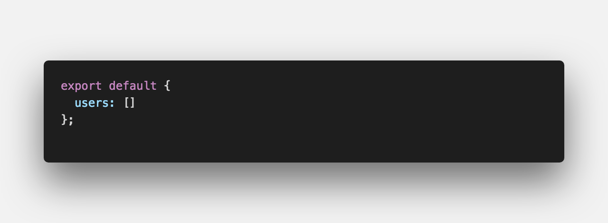
 

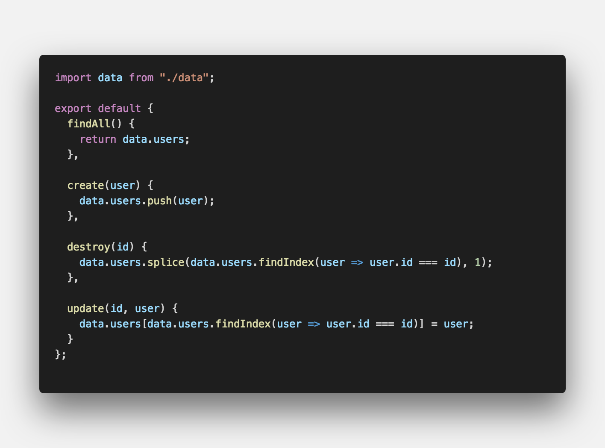
 

#### ▸ findAll() 테스트

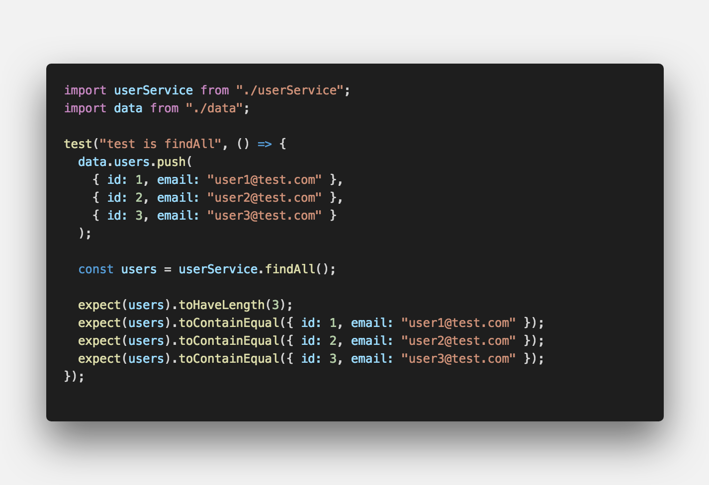
 

`findAll()` 함수에 대한 테스트입니다.

`data` 모듈의 `users` 배열이 비어있으므로,

`data.users.push()`를 통해 데이터를 추가했습니다.

그 후, `findAll()` 함수를 호출하여

1. `toHaveLength()` 길이 체크

2. `toContainEqual()` 데이터 검증

 

#### ▸ create() 테스트

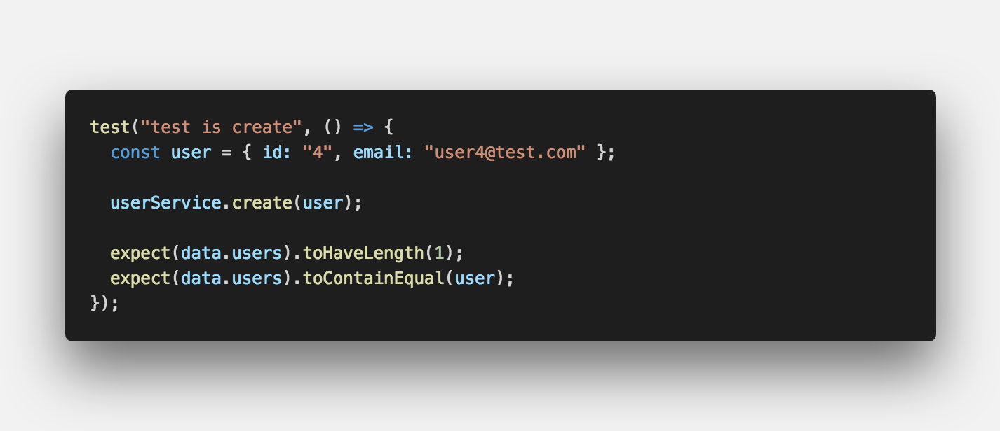
 

`create()` 함수에 대한 테스트입니다.

user에 데이터를 담아서 `create()` 함수로 데이터를 넘깁니다.

1. `toHaveLength()` 길이 체크

2. `toContainEqual()` 데이터 검증

하지만, 위 테스트를 실행해보면 data.users 배열 길이가 4이기 때문에 실패합니다.

그 이유는, 앞서 `findAll()` 함수 테스트에서 3개의 배열이 저장되어

그 배열의 데이터가 영향을 미치기 때문입니다.

 

#### ▸ beforeEach(), afterEach()

위와 같은 상황을 피하기 위해 data 모듈을 정리해주는것이 좋습니다.

두가지 방법을 소개해 드릴 예정입니다.

1. beforeEach()

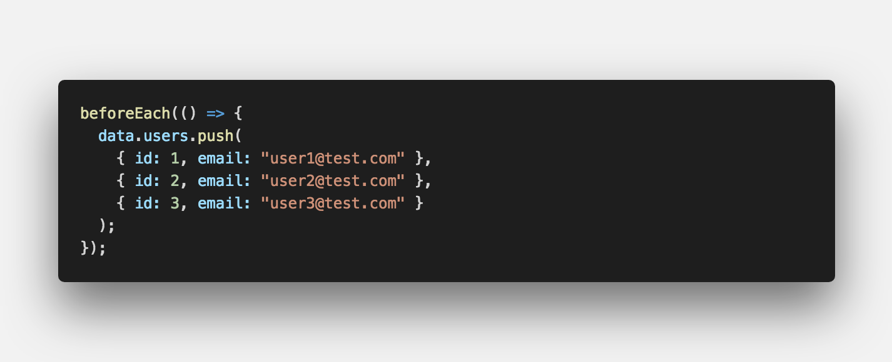
 

각각의 테스트 함수가 실행되기 전에 실행하는 함수입니다.

중복 값 제거, 초기 값 설정에 유용합니다.

 

2. afterEach()

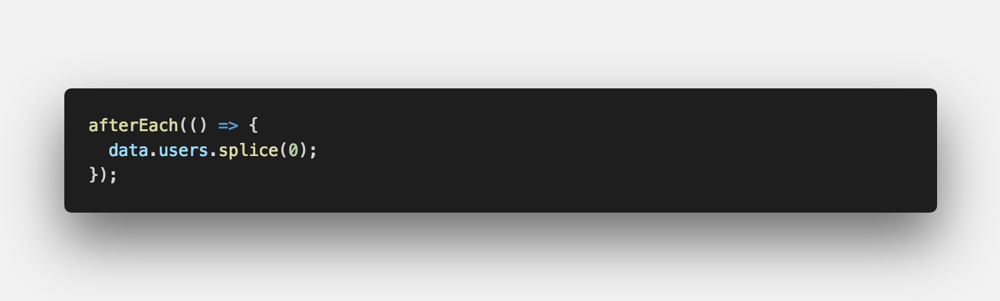
 

각각의 테스트 함수가 실행된 후에 실행하는 함수입니다.

데이터 정리, 초기 값 설정에 유용합니다.

 

#### ▸ destroy() 테스트

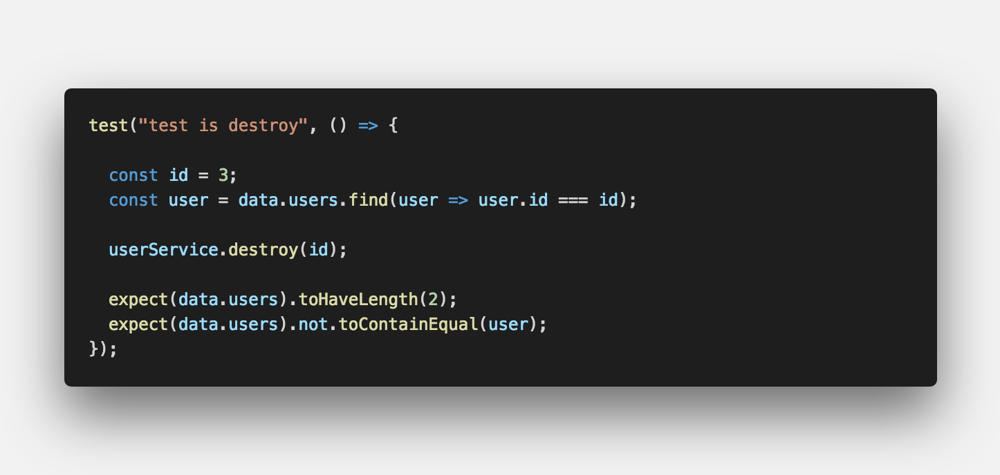
 

앞서 설명드린 `beforeEach()`에서 데이터 초기선을 해주어 중복 코드를 제거했습니다.

여러 테스트에 걸쳐 중복된 코드를 작성하는 것은 유지보수를 어렵게합니다.

따라서, `findAll()`, `destroy()` 함수에서 `data.users.push()`는 제거해줍니다.

 

#### ▸ beforeAll(), afterAll()

각각의 함수는 `beforeEach()`, `afterEach()`와 유사하게 생겻습니다.

하지만, 두개의 함수는 테스트 함수에 대해 매번 호출되지만

`beforeAll()`, `afterAll()` 함수는 맨 처음과 맨 끝에 딱 한번만 호출됩니다.

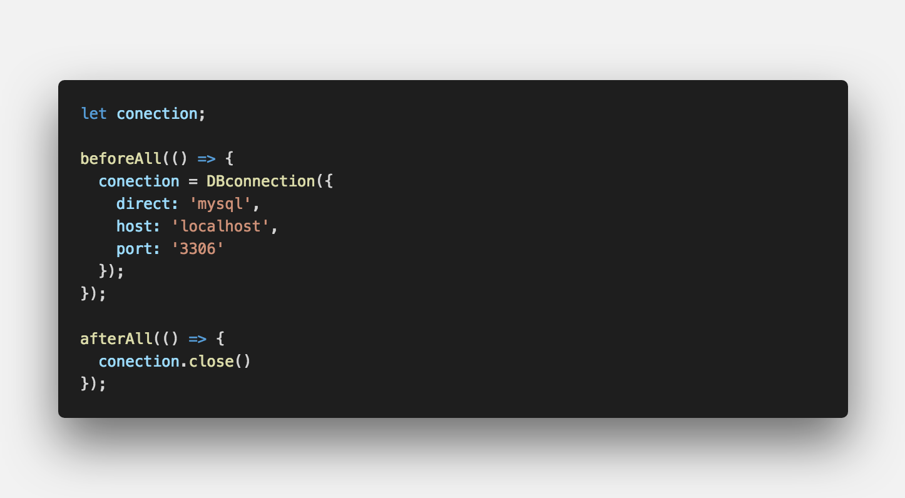
 

가장 대표적인 사용 사례로는 데이터베이스 연동을 예로 들수 있습니다.

테스트 함수 마다 매번 연결을 맺고 끊는 것보다는 맨 처음에 연결 후 테스트를 걸쳐서

마지막에 종료하는 것이 바람직합니다.

 

#### ▸ only(), skip()

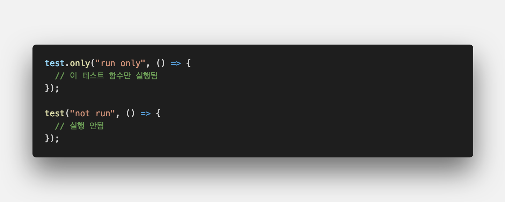
 

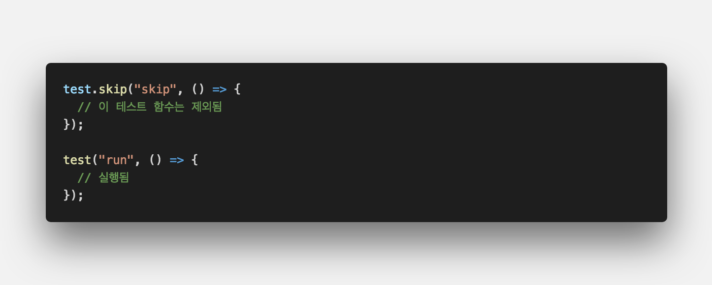
 

테스트 코드를 디버깅할 때 유용한 함수입니다.

`only()` 함수는 Jest Runner가 테스트 파일을 실행할 때 해당 함수만 실행시켜줍니다.

`skip()` 함수는 반대로 해당 함수를 제외한 함수들만 실행시켜줍니다.

 

#### ▸ describe(), it()

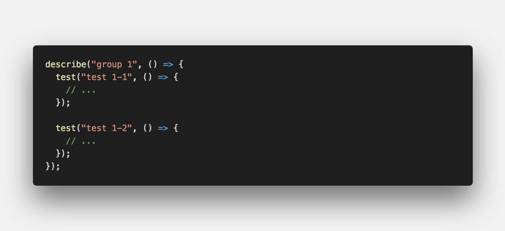
 

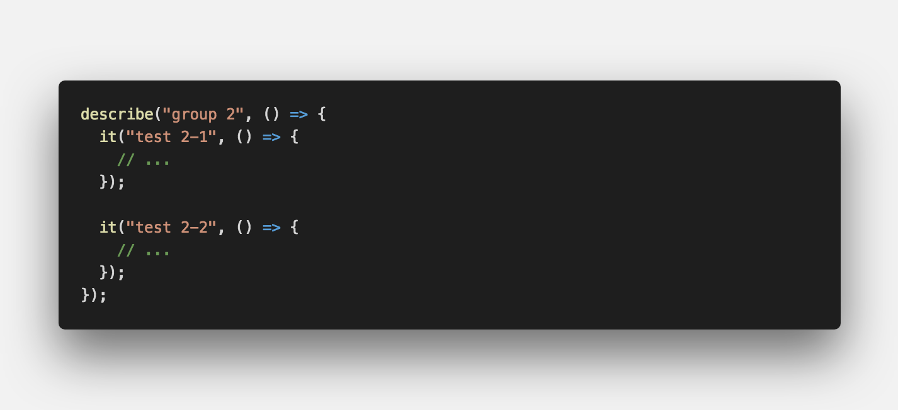
 

테스트 파일에 많은 수의 테스트 함수가 작성되어 있는 경우,

연관된 테스트 함수들끼리 `그룹화`해놓으면 코드를 읽기가 좋습니다.

다음과 같이 Jest의 `describe()` 함수를 통해 여러개의 테스트 함수를 묶는 것이 가능합니다.

또한, `test()` 함수 대신에 `it()` 함수를 사용하기도 했는데요.

이 두 함수는 완전히 동일한 기능을 하는 함수이기 때문에 원하시는 함수를 사용하시면 됩니다.

`Mocha`, `Jasmin` 같은 테스트 라이브러리에서 `it()` 사용하기 때문에 편리한 함수를 사용하시면 됩니다.

 

**[⬆ 목차](#-목차)**

## **🤔 생각해 보며**

이상으로 Jest를 이용해서 여러 테스트에 걸쳐서 공통으로 필요한 코드를 작성하는 방법에 대해서 알아보았습니다.

다음 포스트에서는 마지막으로 Jest mocking 기능에 대해서 알아보겠습니다.

 

**[⬆ 목차](#-목차)**

 

> 출처
>
> <a href="https://github.com/bynodejs/jest" target="_blank">GitHub > jest</a>

# 여러분의 댓글이 큰힘이 됩니다. (๑•̀ㅂ•́)و✧
