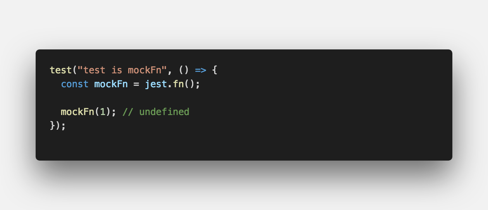
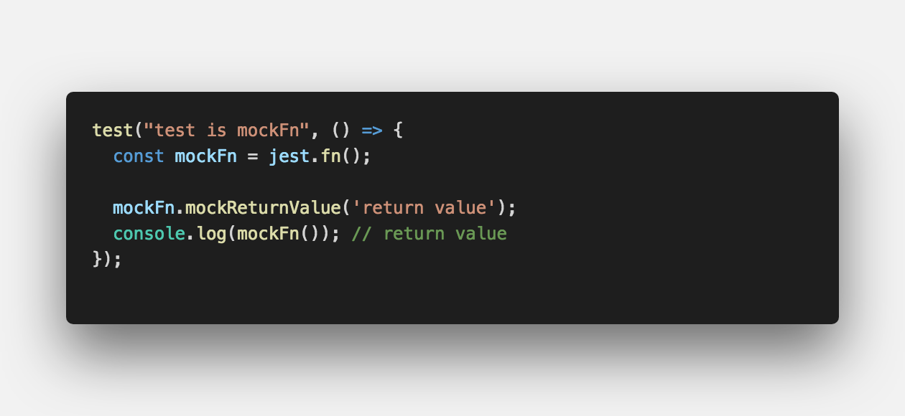
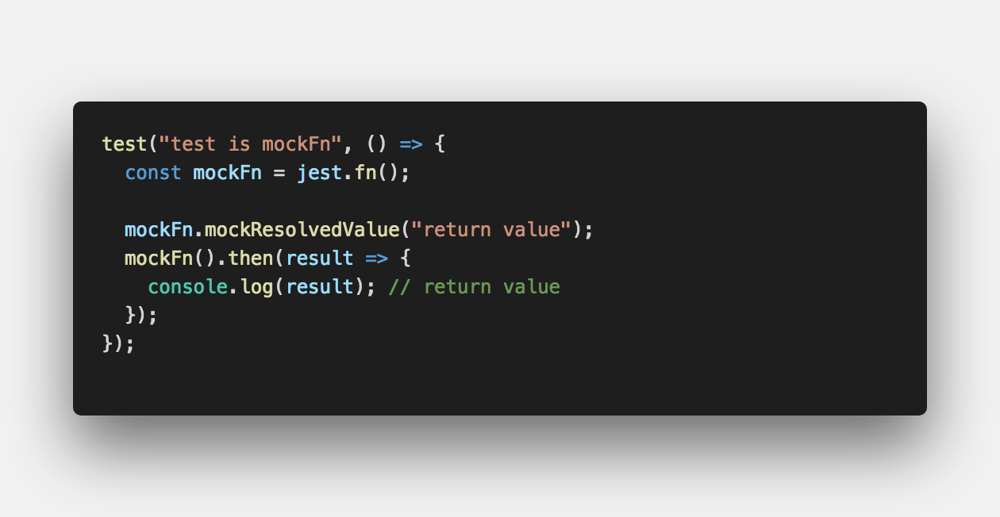
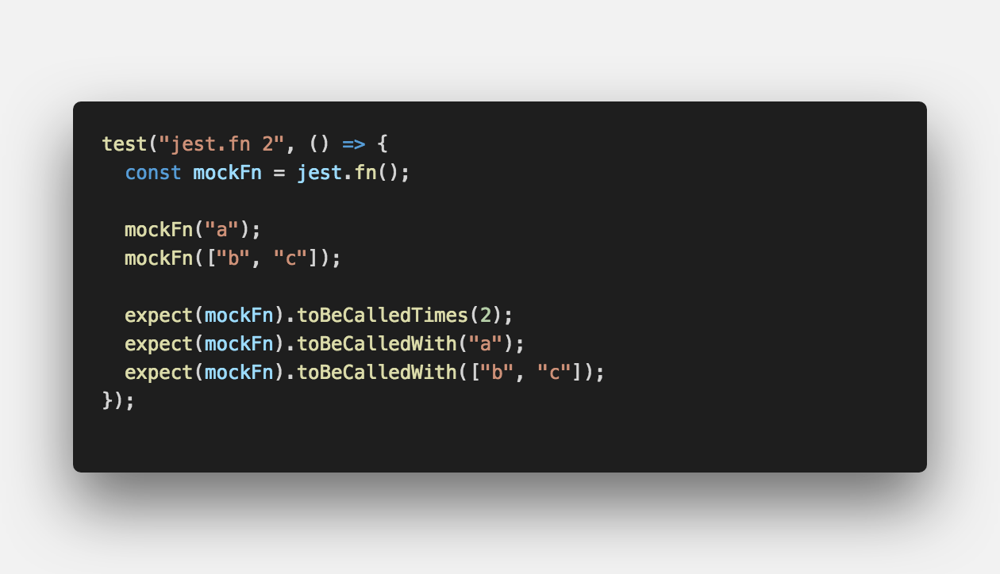
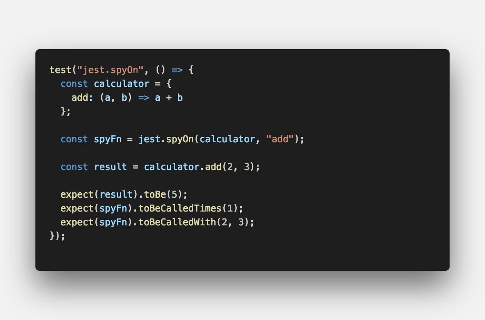
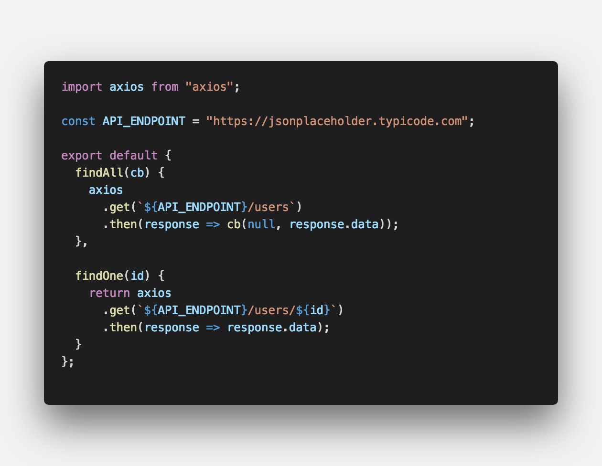
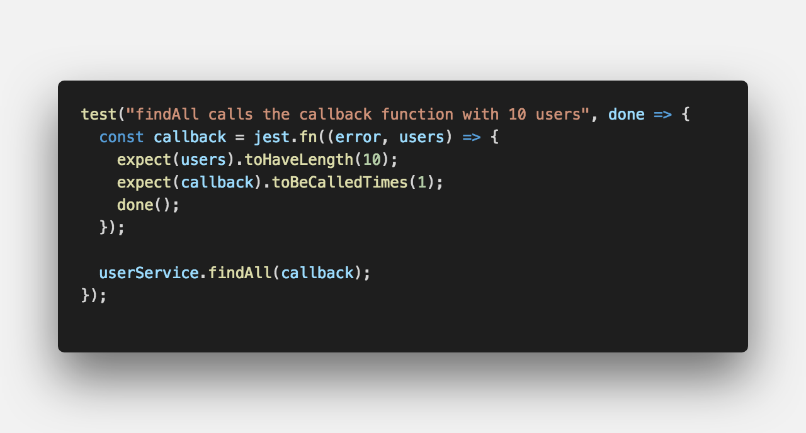
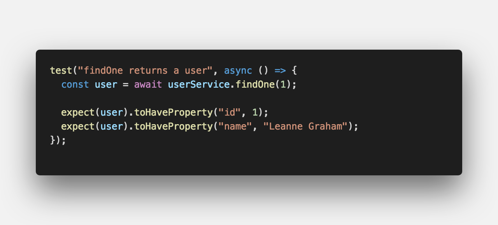
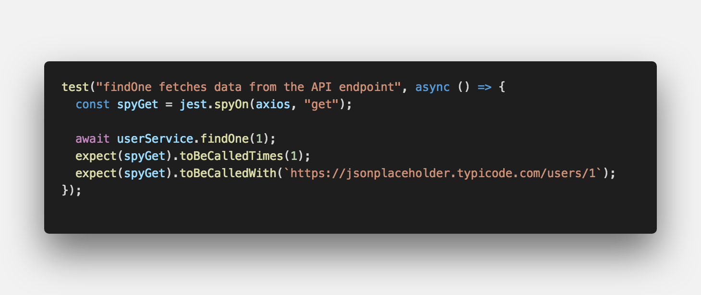

페이스북에서 만든 <strong style="color:#D52B00; font-size: 20px;">테스트 프레임워크</strong> 입니다.

## **💎 목차**

- [설치를 하며](#️-설치를-하며)
- [코드를 보며](#-코드를-보며)
- [생각 해보며](#-생각해-보며)

## **⚙️ 설치를 하며**

지난 포스트에서는 테스트 전/후 처리하기에 대해 알아보았습니다.

이번 포스트에서는 `mocking`에 대해서 알아보겠습니다.

Jest는 별도의 라이브러리 설치 없이 mock 기능을 지원한다는 장점이 있습니다.

먼저, mocking이라는 개념에 대해서 먼저 살펴 보겠습니다.

**mocking 이란 ?**

**단위 테스트 작성할 때, 해당 코드가 의존하는 부분을 가짜(mock)로 대체하는 기법**

일반적으로 의존하는 부분을 테스트 코드에서 직접 생성하기가 부담스러운 경우 사용합니다.

예를 들어, 데이터베이스에서 데이터를 삭제하는 코드에 대한 단위 테스트를 작성할 경우,

실제 데이터베이스를 사용한다면 많은 문제점이 발생할 수 있습니다.

- 데이터베이스 접속과 같이 Network, I/O 작업이 포함된 테스트는 실행 속도가 저하

- 특히, 실행해야 할 테스트가 많은 경우 큰 문제가 될 수 있습니다.

- 테스트 코드보다 데이터베이스와 연결을 맺고 트랜잭션을 생성하고 쿼리를 전송하는 코드가 더 길어질 수 있습니다.

- 만약 테스트 실행 순간 일시적으로 데이터베이스가 오프라인 작업중이었다면 해당 테스트는 실패하게 됩니다.

- 테스트가 인프라 환경에 영향을 받게됩니다.(non-deterministic)

- 테스트가 종료 직 후, 데이터베이스에서 변경 데이터를 직접 원복하거나 트랜잭션을 rollback 해줘야하는 하는경우가 발생합니다.

무엇보다 이런 방식으로 테스트를 작성하게 되면 특정 기능만 분리해서 테스트하겠다는

단위 테스트(Unit Test)의 근본적인 목적에 부합하지 않게 됩니다.

mocking은 실제 객체인 척하는 가짜 객체를 생성하는 매커니즘을 제공합니다.

또한, 테스트가 실행되는 동안 가짜 객체에 어떤 일들이 발생했는지를 기억하기 때문에 가짜 객체가 내부적으로 어떻게 사용되는지 검증할 수 있습니다.

결론적으로, mocking을 이용하면 실제 객체를 사용하는 것보다 가볍고 빠르게 실행되면서도,

항상 동일한 결과를 내는 테스트를 작성할 수 있습니다.

 

**[⬆ 목차](#-목차)**

## **😳 코드를 보며**

### ▸ jest.fn()

 

Jest는 가짜 함수(mock function)를 생성할 수 있도록 `jest.fn()` 함수를 제공합니다.

그리고 가짜 함수는 일반 함수와 동일한 방식으로 인자를 넘겨 호출할 수 있습니다.

위 가짜 함수의 호출 결과는 `undefined` 입니다.

어떤 값을 리턴해야할지 아직 알려주지 않았기 때문입니다.

 

 

`mockReturnValue()` 함수를 이용해서 어떤 값을 리턴해야할지 설정해줄 수 있습니다.

 

 

`mockResolvedValue()` 함수를 이용하면 가짜 비동기 함수를 만들수 있습니다.

 

 

`mockImplementation(...)` 함수를 이용하면 아예 해당 함수를 재구현 할 수 있습니다.

 

 

테스트를 작성할 때 가짜 함수가 유용한 이유는 어떻게 호출되었는지 모두 기억합니다.

가짜 함수로 설계된 Jest Matcher인 `toBeCalled...()` 함수를 사용하면

가짜 함수가 몇번 호출되었고 무엇이 넘어욌는지 검증할 수 있습니다.

 

### ▸ jest.spyOn()

 

mocking에는 `스파이(spy)`라는 개념이 있습니다.

현실이나 영화 속에서 스파이는 `"몰래"` 정보를 캐내는 역할입니다.

테스트 코드를 작성할 때도 모듈이나 객체의 함수의 구현을 가짜로 대체하지 않고,

해당 함수의 호출 여부와 어떻게 호출되었는지만을 알아내야 할 때가 있습니다.

Jest에서 제공하는 `jest.spyOn(object, methodName)` 함수를 이용하면 됩니다.

`jest.spyOn()` 함수를 이용해서 `calculator` 객체의 `add` 함수에 스파이를 붙였습니다.

따라서, `add` 함수를 호출 후에 호출 횟수와, 어떤 인자가 넘어갔는지 검증할 수 있습니다.

 

### ▸ 테스트 작성하기

자 그럼 위에서 배운 `jest.fn()`, `jest.spyOn()` 사용해서 테스트를 작성해보겠습니다.

예제 코드는 `axios` 라이브러리를 이용하여 REST API를 호출하여

사용자 데이터를 조회해주는 함수를 선언하고 있는 모듈입니다.

 

 

 

`callback`함수를 통해 `findAll()`함수에 대한 테스트를 작성해보았습니다.

- `toHaveLength()` 데이터 길이 측정

- `toBeCalledTimes()` 호출 횟수 측정

 

 

`async/await`함수를 통해 비동기로 `findOne()` 함수를 테스트를 작성해보았습니다.

- `toHaveProperty()` 해당 프로퍼티 데이터 검증

 

 

`findOne()` 함수가 외부 API 연동을 통해서 사용자 정보를 조회해야하는지를 테스트하는 방법을 설명드리고자 합니다.

이 함수는 내부적으로 `axios` 모듈의 `get` 함수를 사용하고 있기 때문에,

`jest.spyOn(axios, "get")`을 통해 알아낼수 있습니다.

그러나, API 서버가 다운되거나, Network 단절된 환경에서 실행시 오류가 발생하게 됩니다.

따라서 테스트는 언제 실행되든 항상 같은 결과를 내야한다는 원칙에서 위배됩니다.

왜냐하면, 단위 테스트가 단독으로 고립되어 있지 않고, 외부 환경에 의존하기 때문입니다.

 

 

이 문제를 해결하려면,

`axios` 모들의 `get` 함수가 항상 안정적으로 결과를 반환하도록 mocking 해야 합니다.

즉, `axios.get` 을 고정된 결과값을 리턴하는 가짜 함수로 대체해주면 됩니다.

테스트 입장에서 통제할 수 없는 부분을 mocking 사용하면 외부 환경에 의존하지 않고도

얼마든지 독립적으로 실행 가능한 테스트를 작성할 수 있습니다.

 

**[⬆ 목차](#-목차)**

## **🤔 생각해 보며**

이상으로 `jest.fn()`과 `jest.spyOn()` 함수의 사용법에 대해 알아보았습니다.

실제 테스트에서 mocking을 사용하여 효율적인 테스트를 하기실 권장합니다.

이상으로 jest 테스트 프레임 워크 관련 포스팅에 대해 마칩니다. 감사합니다.

 

**[⬆ 목차](#-목차)**

 

> 출처
>
> <a href="https://github.com/bynodejs/jest" target="_blank">GitHub > jest</a>

# 여러분의 댓글이 큰힘이 됩니다. (๑•̀ㅂ•́)و✧
