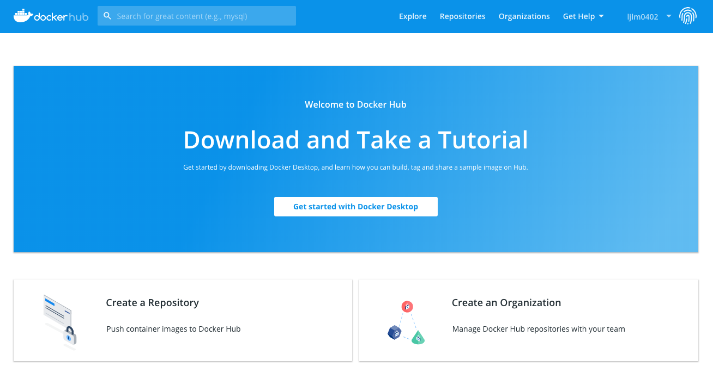
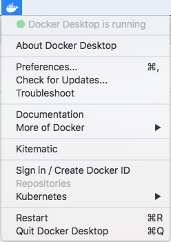
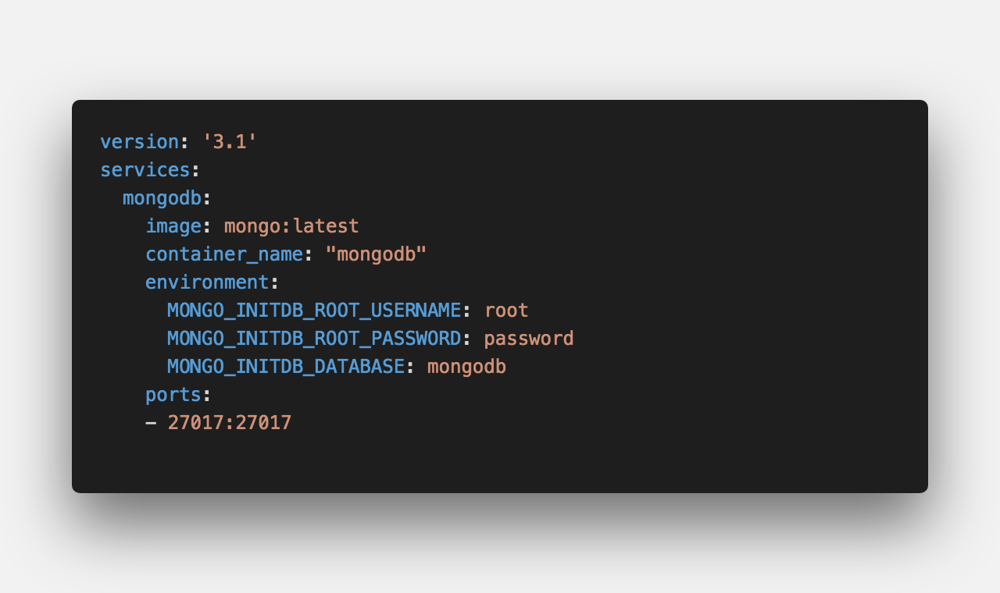
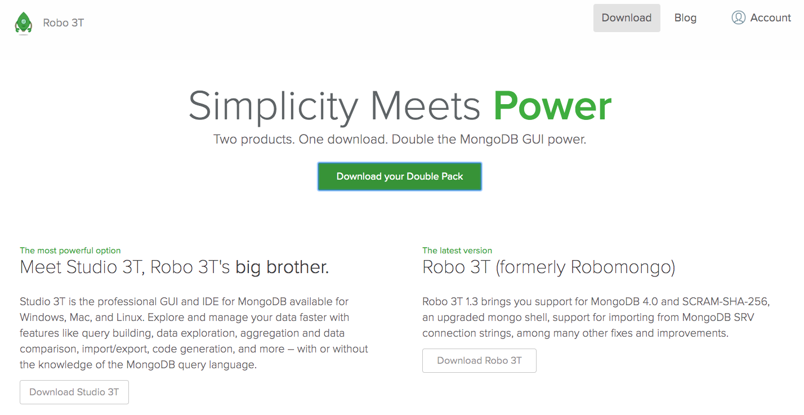
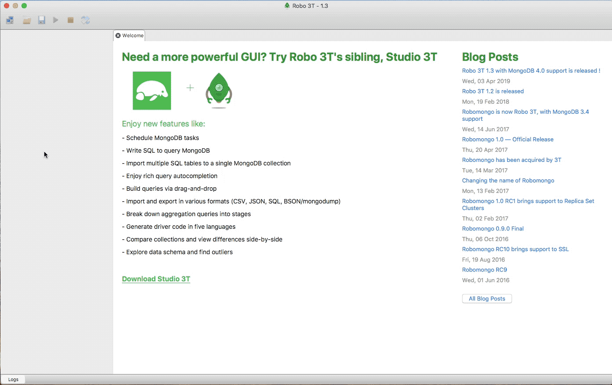
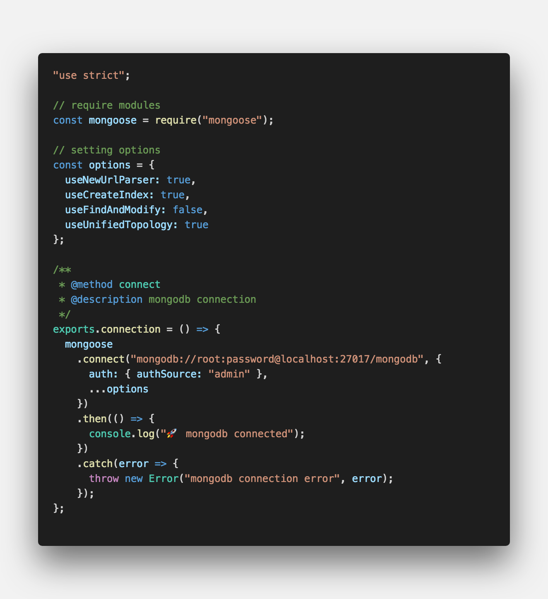
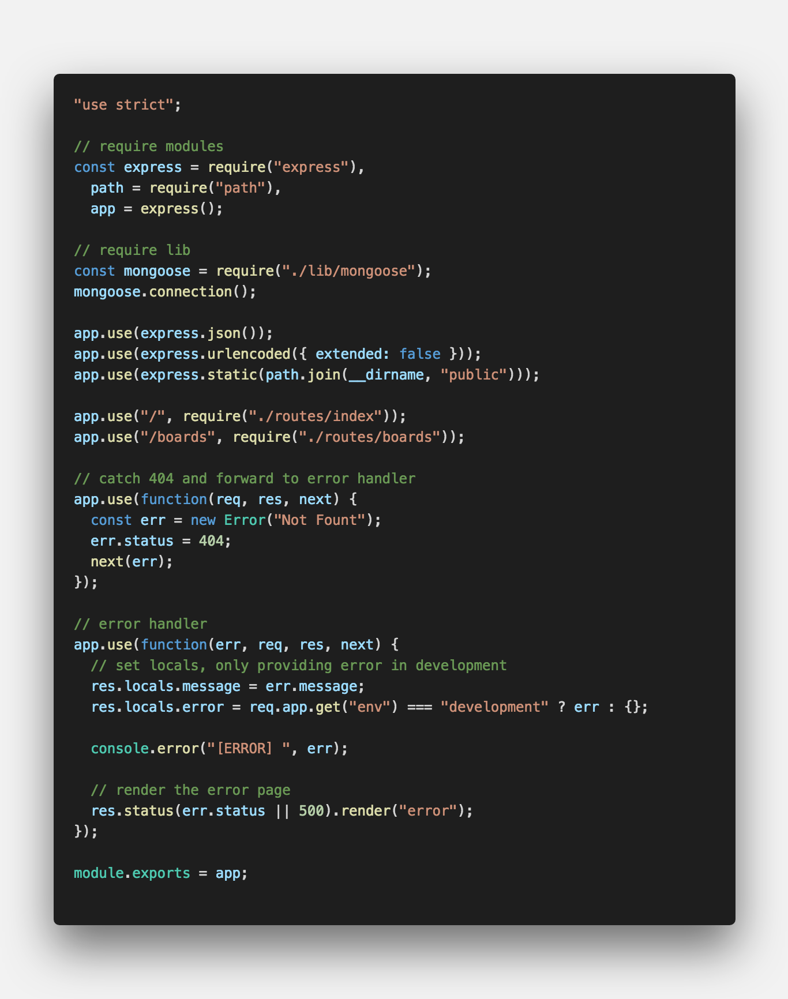

<center>mongoDB를 위한 <strong style="color:#3D291A; font-size: 20px;">ODM(Object-Document-Mapping)</strong> 라이브러리</center>

## **💎 목차**

- [서론 (Introduction)](#-서론)
- [본론 (Main)](#-본론)
- [결론 (Conclusion)](#🥀-결론)

## **🌱 서론**

mongoDB ODM 중 가장 유명한 mongoose에 대해 알아보겠습니다

우선, **ODM**이란 ?

Object Document Mapping의 두 문자어로,

풀이를 해보면 객체와 문서를 1 : 1 매칭한다는 뜻입니다.

Object는 자바스크립트 객체이고, Document는 mongoDB 문서입니다.

즉, 문서를 DB에서 조회 할 때 자바스크립트 객체로 바꿔주는 역할이라고 생각하시면 됩니다.

자, 그럼 이번 포스트에서는 `mongoDB 설치, 연동`에 대해 알아보겠습니다.

참고로, 저는 `Mac OS`를 환경에서 진행하는점 참고하시기 바랍니다.

<br />

**[⬆ 목차](#-목차)**

<hr />

## **🌹 본론**

### ▸ mongoDB 설치

몽구스를 사용하기 위해선 몽고디비가 필요합니다.

그러므로, 몽고디비 설치법에 대해서 알아보겠습니다.

두가지 방법이 있습니다.

1. [MongoDB](https://docs.mongodb.com/manual/installation/) 사이트에서 다운로드

2. [Docker Desktop](https://docs.docker.com/docker-for-mac/install/) 설치 후 [docker-compose](https://hub.docker.com/_/mongo) 사용

저는 여기서 2번째인 `docker-compose` 사용하여 진행해보겠습니다.

[](https://hub.docker.com/)
<br />

사이트 접속하셔서 `Get started with Docker Desktop` 클릭

그러면 `Docker.dmg` 파일을 다운받고 설치를 진행까지 완료했으면

<br />


<br />

`Docker` 실행, 상단 작업표시줄에 고래 아이콘이 생기고 클릭해보면

`Docker Desktop is running` 노란불에서 몇 초후 초록불로 변경됩니다.

자 그럼 도커를 실행해보록 하겠습니다.

<br />


<br />

우선 `docker-compose.yml` 파일을 생성하고

mongodb image를 서비스하는 코드를 작성합니다.

이제 명령어를 통해 해당 파일을 실행해보도록 하겠습니다.

하지만, 그 전에 간단한 명령어를 알아보겠습니다.

1. 실행

   - docker-compose up

   - docker-compose -f [파일명] up

   - `-d` 명령어를 추가로 하시면 백그라운 실행이됩니다.

2. 종료

   - docker-compose down

3. 확인
   - docker ps

<br />

자 그럼 실행 시켜보겠습니다.

```sh

$ docker-compose up -d

Starting mongodb ... done

```

이 처럼 몽고디비가 시작됬다는 커맨더가 생깁니다.

`Robo 3T`라는 mongoDB GUI 툴을 통해 몽고디비가 설치되었는지 확인하도록 하겠습니다.

<br />

[](https://robomongo.org/download)
<br />

우측 하단 `Donwload Robo 3T` 버튼을 클릭 후 설치 & 실행합니다.


<br />

커넥트 버튼을 클릭후 `create` 해줬습니다.

그러나 위 영상처럼 실패를 하실겁니다.

왜냐하면, `docker-compose.yml` 파일를 살펴보면

- MONGO_INITDB_ROOT_USERNAME: root

- MONGO_INITDB_ROOT_PASSWORD: password

라고 환경설정이 되어있습니다.

그럼 다시 진행해보겠습니다.


<br />

`Authentication` 탭에서 `User Name`, `Password`를 입력해주면 됩니다.

<br />
<hr />

### ▸ mongoDB 연동

도커를 사용하여 정상적으로 mongoDB를 설치하였습니다.

이제 대망의 mongoDB 연동을 진행해보겠습니다.

```sh

$ npm install mongoose

```

<br />

**lib - mongoose.js**


<br />

**app.js**


<br />

`options`의 사항들은 지원 중단 경고 해결 옵션입니다. [참고 링크](https://mongoosejs.com/docs/deprecations.html)

app.js에서 require를 통해 가져오시셔서 `connection()`

<br />

```js

🚀 mongodb connected

```

해당 문구가 뜨시면 성공적으로 연동이 되었습니다.

<br />

**[⬆ 목차](#-목차)**

<hr />

## **🥀 결론**

이번 포스팅은 여기까지입니다 👏👏👏

오늘 배운 내용을 정리하면

1. Docker를 이용한 mongoDB 사용

2. mongoDB 연동

**2탄** 에서는 `mongoDB를 활용한 REST API 만들기` 해보겠습니다.

<br />

**[⬆ 목차](#-목차)**

<hr />

<br />

> 출처
>
> <a href="https://github.com/bynodejs/mongoose" target="_blank">GitHub > mongoose</a>

# 여러분의 댓글이 큰힘이 됩니다. (๑•̀ㅂ•́)و✧
