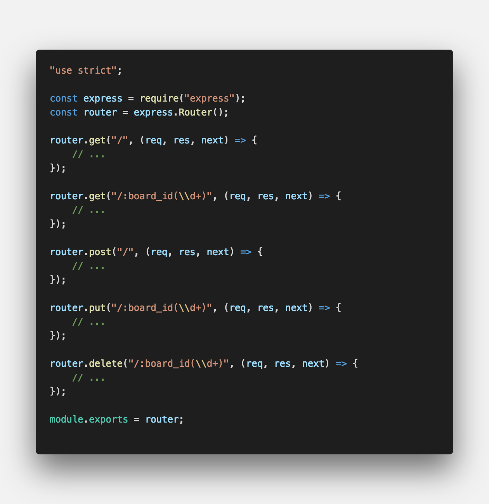
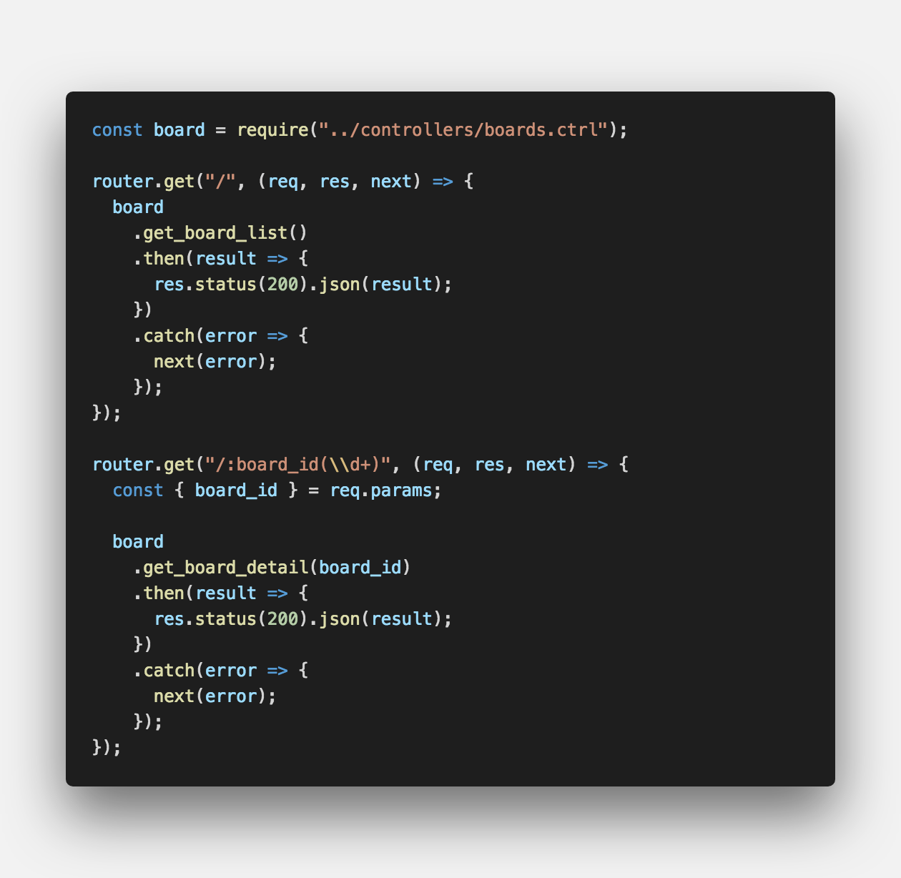
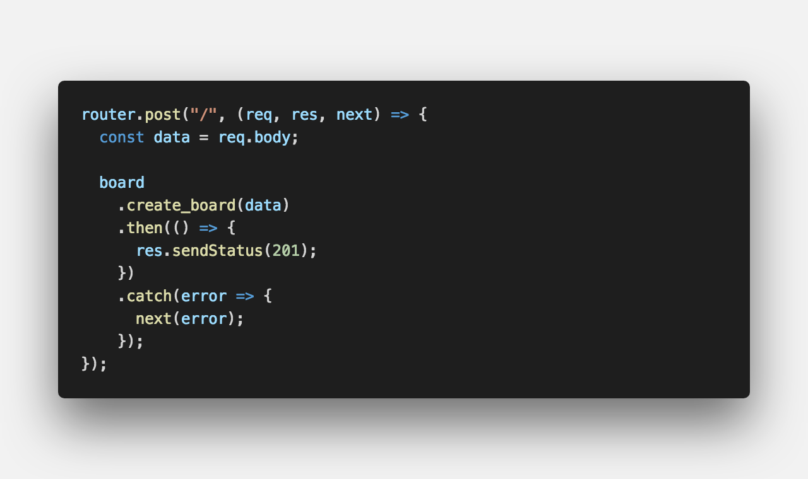
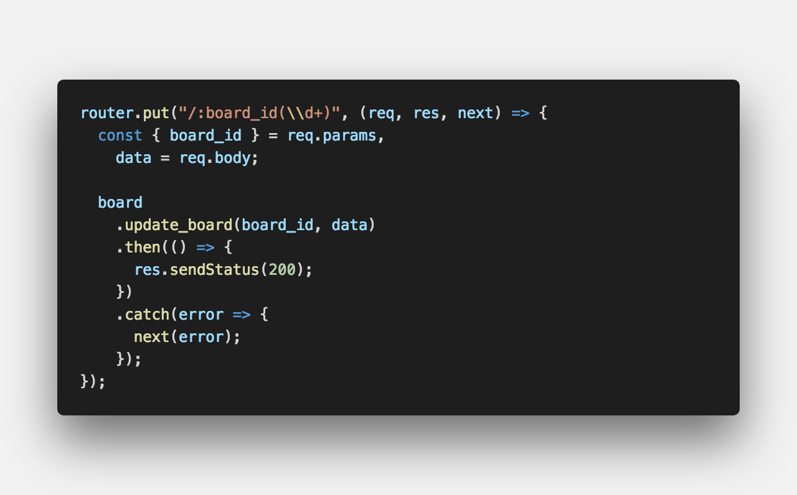
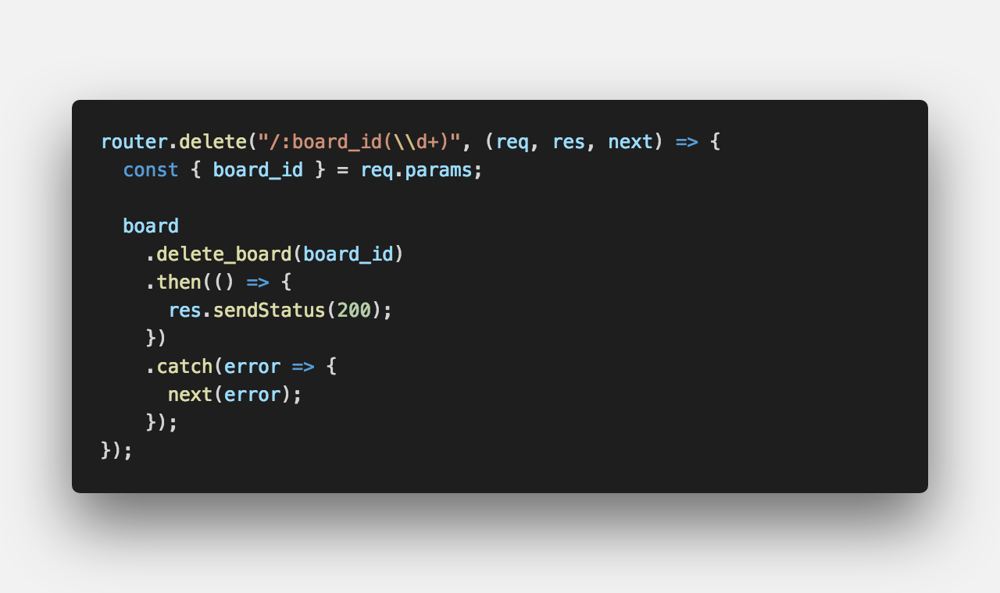
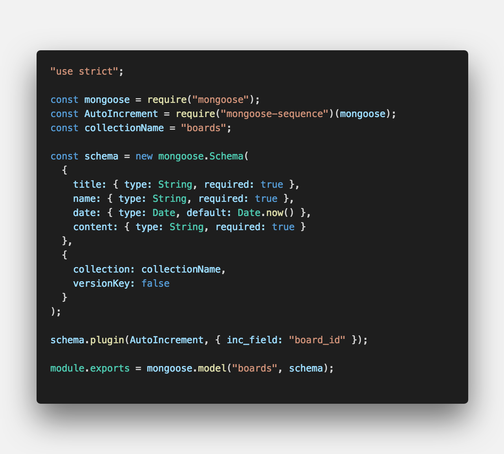
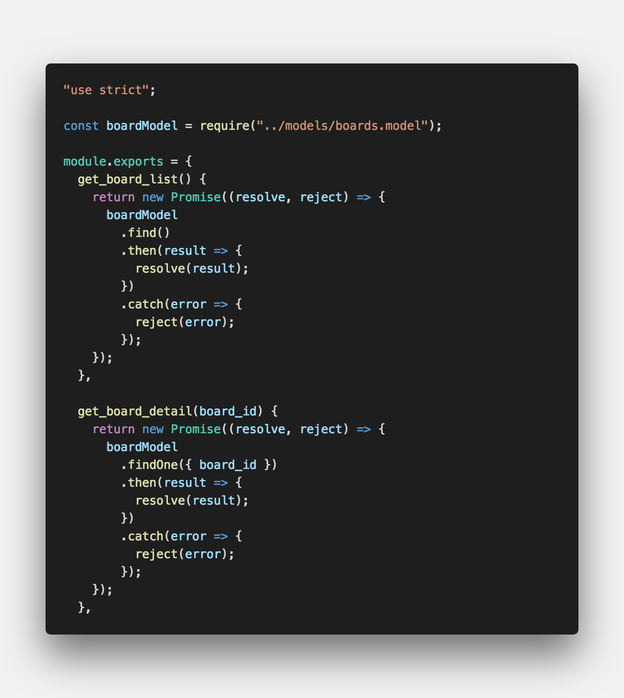
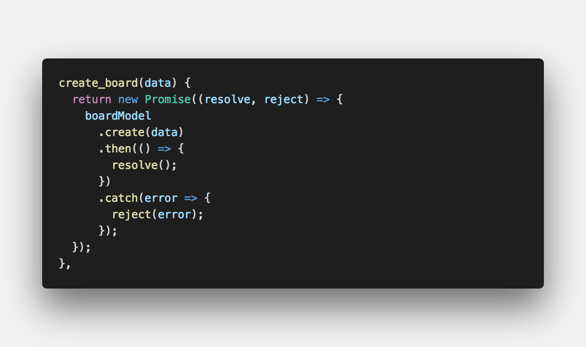
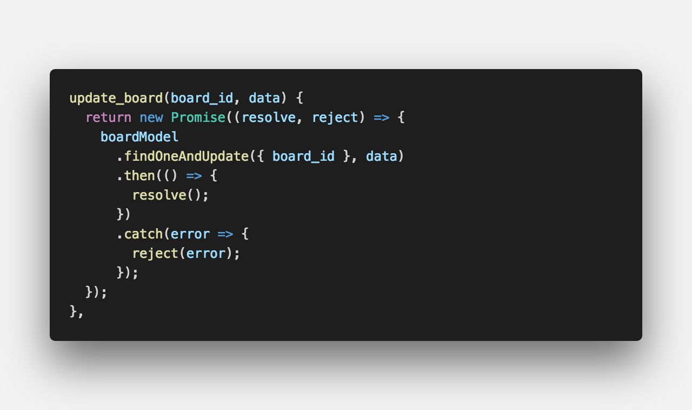
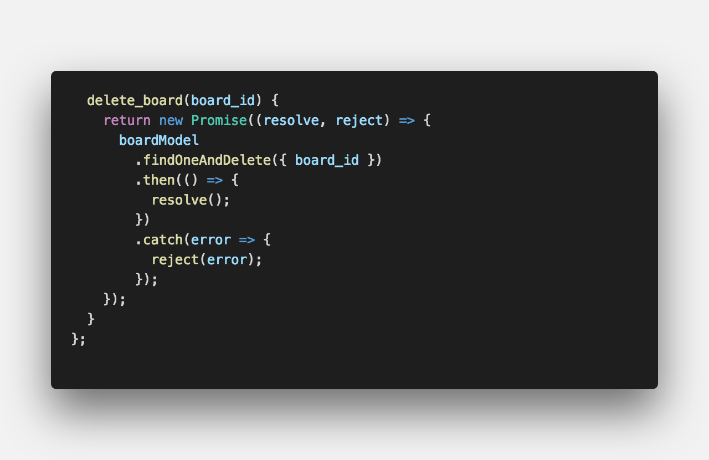

<center><strong style="color:#3D291A; font-size: 20px;">ODM(Object-Document-Mapping)</strong> 라이브러리</center>

## **💎 목차**

- [서론 (Introduction)](#-서론)
- [본론 (Main)](#-본론)
- [결론 (Conclusion)](#🥀-결론)

## **🌱 서론**

안녕하세요 👋

다시 돌아온 mongoose 2탄입니다.

2탄 내용을 설명드리기전에 복습부터 진행해 보겠습니다.

1탄에서 배운 내용으로는

1. docker-compose 사용하여 mongoDB 설치

2. mongoose를 이용한 mongoDB 연동

**2탄**에서는 `mongoDB를 활용한 REST API 만들기` 진행해 보겠습니다.

<br />

**[⬆ 목차](#-목차)**

<hr />

## **🌹 본론**

### ▸ REST API 란?

HTTP URI를 통해 자원을 명시하고,

HTTP Method를 통해 할당 자원에대한 CRUD를 적용하는것을 의미합니다.

CRUD는 다음과 같습니다.

- Create : 생성 (POST)

- Read : 조회 (GET)

- Update : 수정 (PUT)

- Delete : 삭제 (DELETE)

예를 들어) 게시판을 만든다고 가정을하면 다음과 같습니다.

- 게시판 조회 : GET

- 게시글 생성 : POST

- 게시글 수정 : UPDATE

- 게시글 삭제 : DELETE

가장 기본적인 사항이므로 반드시 숙지하시기 바랍니다.

<br />
<hr />

### ▸ 라우터 생성하기

이제 해당 URL로 요청오면 실행하는 라우터를 생성하겠습니다.

코딩 스타일은 개인적인 차이가 있으니 참고하시기 바랍니다.

우선적으로 저는 폴더구조를 이런식으로 잡았습니다.

```sh

│
├── bin
│   └── www
│
├── lib
│   └── mongoose.js
│
├── models
│   └── board.model.js
│
├── controllers
│   └── board.ctrl.js
│
├── routes
│   └── board.js
│
├── app.js
└── package.json

```

맨 처음 봐야할 곳은 routes 입니다.

routes에서는 요청 URL에 응답하는 곳입니다.


<br />

순서대로 살펴보면

1. `router.get()` : 전체 조회

2. `router.get(param)` : 상세 조회

3. `router.post()` : 생성

4. `router.put(param)` : 수정

5. `router.delete(param)` : 삭제

param이란, 해당 데이터의 고유 식별 값을 의미하며

해당 값을 가지고 데이터를 조회, 수정, 삭제하기 위해서 필요합니다.

이제 해당 라우터에서 동작하는 기능을 컨트롤러에서 구현하겠습니다.

#### ▸ GET


<br />

기본적으로 `promise/then`을 사용하였으며

`resolve` 데이터를 `res.status(200).json(result)` json 타입으로 응답합니다.

200은 `ok` 라는 응답 성공 HTTP 상태코드 입니다.

#### ▸ POST


<br />

게시글 생성 라우터로 `req.body`에 데이터를 넘겨 해당 데이터를 가지고 생성합니다.

`resolve` 될 값이 딱히 필요없으므로 `res.sendStatus(201)` 해줬습니다.

201은 `created` 라는 응답 성공 HTTP 상태코드 입니다.

#### ▸ PUT


<br />

`req.params` 해당 데이터 고유 값과 `req.body`에 데이터를 넘겨 받습니다.

즉, params 값이 일치하는 데이터를 body 데이터로 변경하라는 뜻입니다.

`resolve` 데이터가 없어서 `res.sendStatus(200)` 해줬습니다.

왜 ? 201이 아니라고 하시는 분들이 계실수도 있습니다.

201은 created 새로운 리소스가 생성했다는 의미로 주로 데이터 생성시 사용합니다.

#### ▸ DELETE


<br />

`req.params` 해당 데이터 고유 값을 가지고 값이 일치하는 row를 삭제하라는 뜻입니다.

`resolve` 데이터가 없어서 `res.sendStatus(200)` 해줬습니다.

<br />
<hr />

### ▸ 모델 정의하기

컨트롤러 작성하기 전에 데이터베이스 모델 정의를 해줘야합니다.

그래야, 어떤 collection에 접근하며 schema가 무엇인지 알수 있기 때문입니다.

그전에 npm 모듈을 하나 더 설치하겠습니다.

```sh

$ npm install mongoose-sequence

```

해당 모듈은 AutoIncrement를 사용하기위한 플러그인 역할 모듈입니다.


<br />

1. `new mongoose.Schema()` 스키마를 정의해줍니다.

| 필드명  | 타입   | 기타          |
| :------ | :----- | :------------ |
| title   | 문자형 | 필수 값       |
| name    | 문자형 | 필수 값       |
| date    | 시간   | 기본 값 now() |
| content | 문자형 | 필수값        |

2. `collection` 콜렉션 네임은 SQL에서 테이블 명이라고 생각하시면 됩니다.

3. `schema.plugin()` board_id를 AutoIncrement 해줍니다.

   - 데이터 생성시마다 자동으로 증가값으로 인덱스 개념으로 사용합니다.

4. `mongoose.model` schema를 모델 선언합니다.

이로써 모델 정의는 끝났고 컨트롤러를 작성해보겠습니다.

<br />
<hr />

### ▸ 컨트롤러 생성하기

[mongoose API Query](https://mongoosejs.com/docs/api/query.html) 참고하시기 바랍니다.

#### ▸ find(), findOne()


<br />

require를 통해 모델을 가져오고 mongoDB selector 함수로 데이터를 반환합니다.

#### ▸ create()


<br />

mongoDB create 함수 데이터를 생성합니다.

#### ▸ findOneAndUpdate()


<br />

findOne() + Update() 함수로 데이터를 찾아 수정합니다.

#### ▸ findOneAndDelete()


<br />

findOne() + Delete() 함수로 데이터를 찾아 삭제합니다.

<br />
<hr />

### ▸ 테스트 하기


<br />

[postman](https://www.getpostman.com/)을 사용해서 api 테스트를 진행하였습니다.

<br />

**[⬆ 목차](#-목차)**

<hr />

## **🥀 결론**

이번 포스팅은 여기까지입니다 ~ 😊

오늘 배운 내용을 정리하면

1. REST API 정의

2. 라우터 생성하기

3. 모델 정의하기

4. 컨트롤러 생성하기

마지막 **3탄** 에서는 `화면 구성하기` 해보겠습니다.

<br />

**[⬆ 목차](#-목차)**

<hr />

<br />

> 출처
>
> <a href="https://github.com/bynodejs/mongoose" target="_blank">GitHub > mongoose</a>

# 여러분의 댓글이 큰힘이 됩니다. (๑•̀ㅂ•́)و✧
