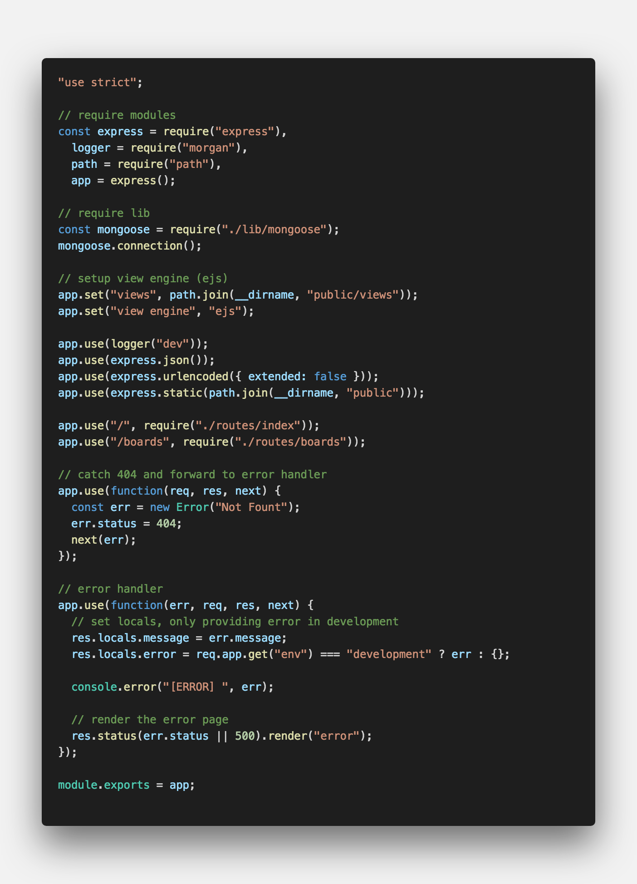
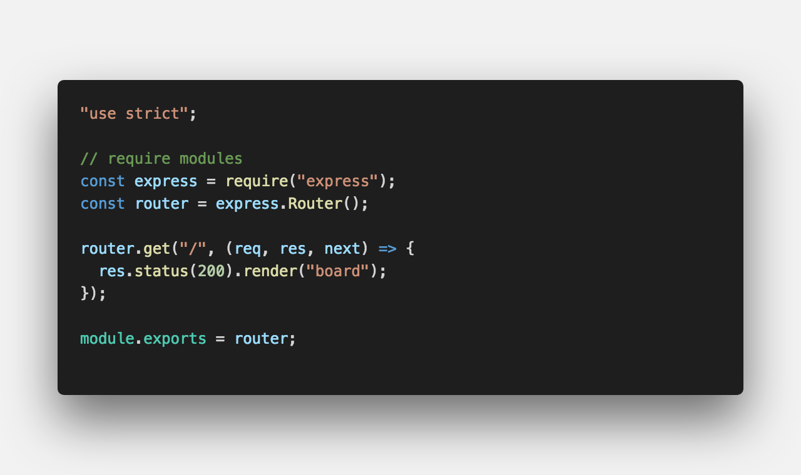
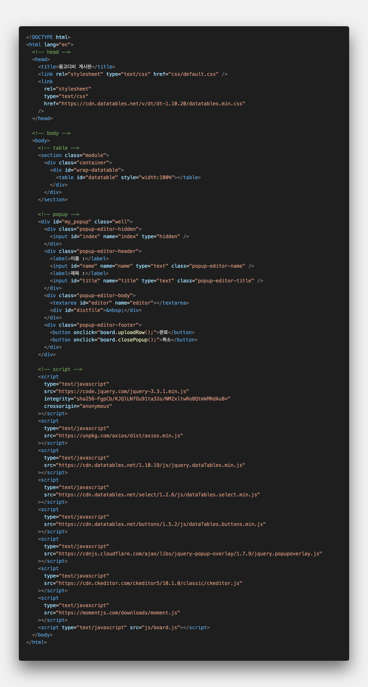
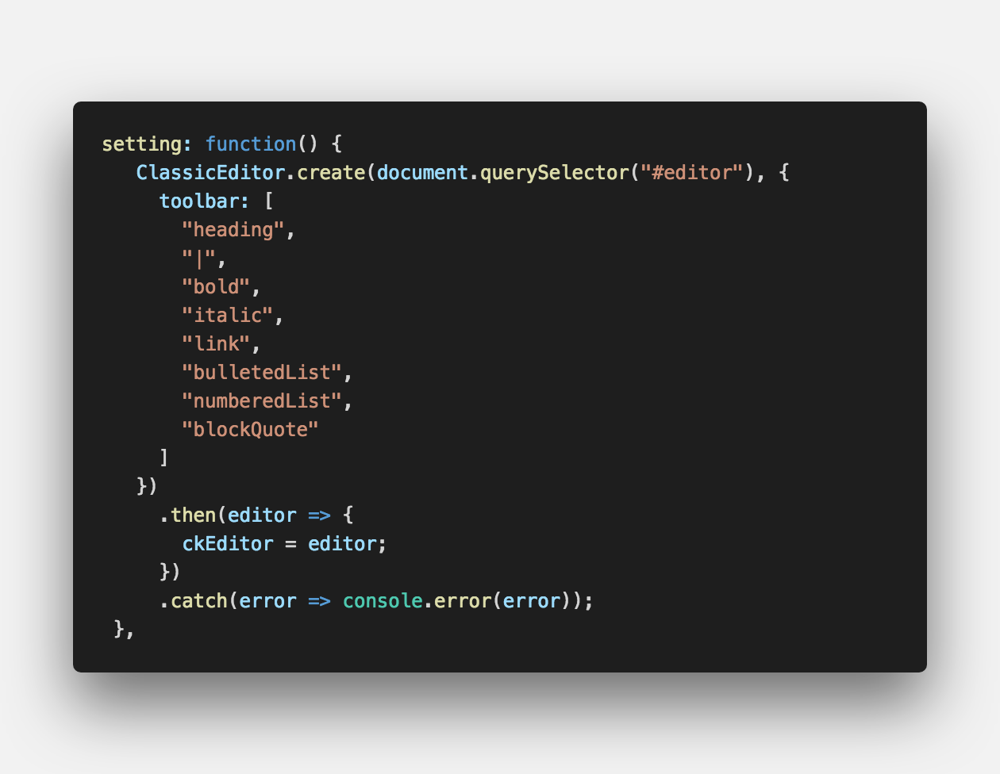
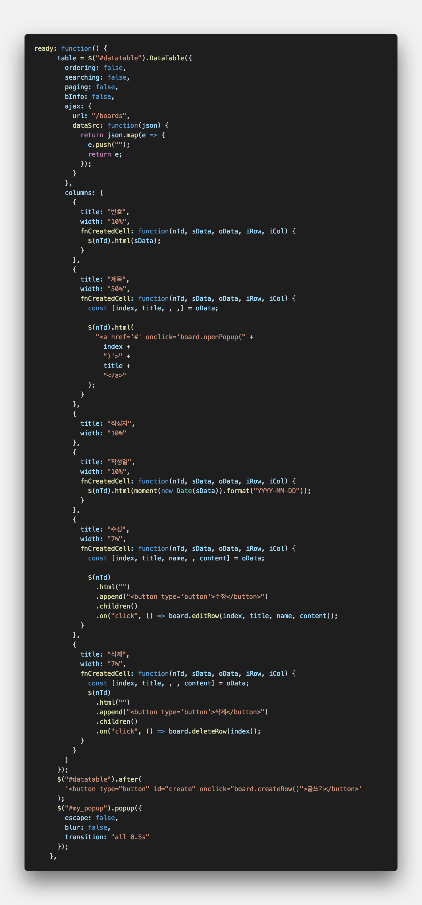
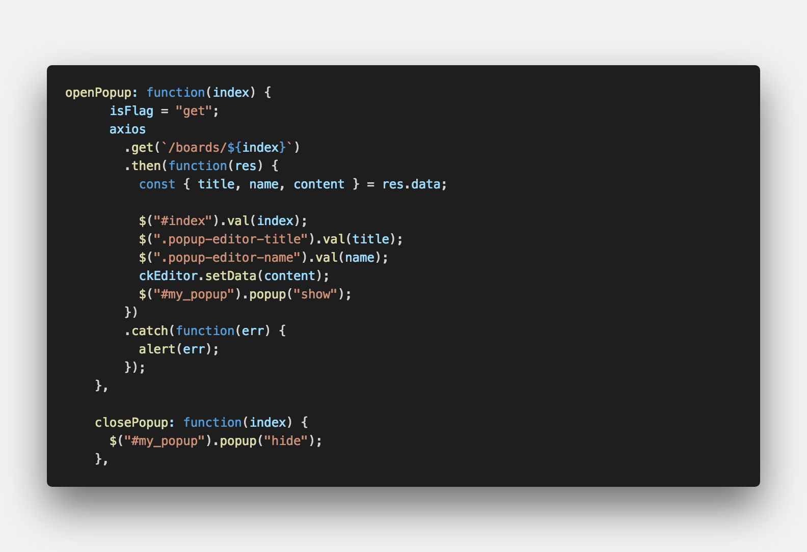
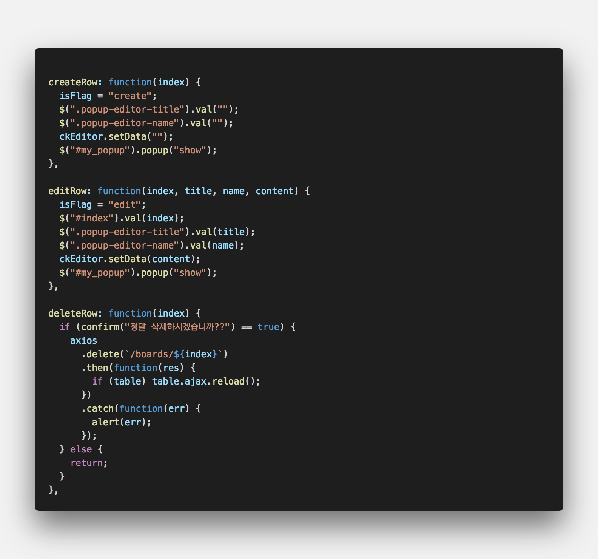
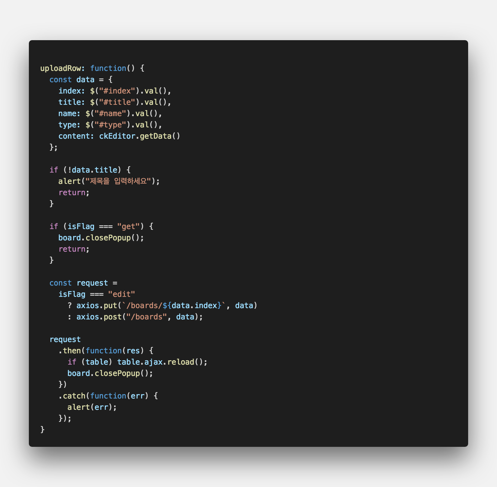

<center><strong style="color:#3D291A; font-size: 20px;">ODM(Object-Document-Mapping)</strong> 라이브러리</center>

## **💎 목차**

- [서론 (Introduction)](#-서론)
- [본론 (Main)](#-본론)
- [결론 (Conclusion)](#🥀-결론)

## **🌱 서론**

안녕하세요 ~

드디어 대망의 마지막 시간이 찾아왔습니다. 🗣 소리질러 ~

마지막 내용에 앞서 그동안 했던 내용을 복습하겠습니다.

1. Docker를 통한 mongoDB 설치

2. mongoose를 이용한 mongoDB 연동

3. REST API 정의

4. 라우터 생성하기

5. 모델 정의하기

6. 컨트롤러 생성하기

내용이 많아서 헷갈리신다면 1탄, 2탄을 참고하시기 바랍니다.

자 그럼 마지막 시간에는 `게시판 제작`을 해보겠습니다.

<br />

**[⬆ 목차](#-목차)**

<hr />

## **🌹 본론**

페이지를 만들기위해서는 템플릿 모듈이 필요합니다.

```sh

$ npm install ejs

```

`ejs` 템플릿을 사용하기 위해서 npm 패키지를 설치합니다.

라우트와 뷰엔진을 설정하는 코드를 추가합니다.


<br />

`route.use()` 를 사용하여 라우트 미들웨어를 로드할 수 있습니다.

<br />

**routes/index.js**


<br />

`res.render()`를 사용하여 `public/views/board.ejs` 파일을 렌더합니다.

<br />

**views/board.ejs**


<br />

- head : title 설정, css 로드

- body : table, popup 생성

- script : javascript 로드

여기서 핵심적인 board.js 파일만 살펴보겠습니다.

<br />

**js/board.js**


<br />

에디터를 생성하는 함수입니다.

초기 로드시 init를 통하여 생성합니다.

<br />


<br />

테이플을 생성하는 함수입니다.

`ajax`를 이용하여 `GET /boards` 라우터를 호출합니다.

그 후 `columns`에 맞게 데이터를 삽입합니다.

자세한 내용은 [링크](https://datatables.net/)를 참고하시기 바랍니다.

<br />


<br />

`openPopup` 함수는 테이블 게시글 제목을 클릭 시 호출합니다.

해당 index 번호를 가지고 `GET /boards/${index}` 라우터를 호출하여

상세 데이터를 에디터 팝업에 표시합니다.

`closePopup` 취소 버튼 클릭이나 팝업에 대한 액션을 취한 경우 팝업을 숨기는 함수입니다.

<br />


<br />

`createRow` 글쓰기를 버튼을 클릭 시 요청하는 함수입니다.

isFlag 라는 상태값을 표시하는 변수를 두어 조회, 생성, 수정을 컨트롤 합니다.

`editRow` 수정 버튼 클릭시 요청하는 함수로 클릭한 row에 데이터를

에디터에 표시하고 isFlag를 eidt로 두어 수정 기능으로 컨트롤합니다.

`deleteRow` 삭제 버튼 클릭시 요청하는 함수로 confirm을 통해서 예, 아니오를 확인하며

`DELETE /boards/${index}` 라우터를 호출하여 해당 index 데이터를 삭제합니다.

<br />


<br />

앞서 isFlag라는 변수를 컨트롤하는 곳으로

에디터가 show인 상태에서 하단에 확인 버튼 클릭시 요청합니다.

get `closePopup()`

edit `PUT /boards/${index}`

create `POST /boards`

식으로 데이터를 조회일 경우는 팝업을 닫고

생성, 수정은 axios를 통해 라우터로 데이터를 요청합니다.

<br />


<br />

완성된 페이지 입니다.

<br />

**[⬆ 목차](#-목차)**

<hr />

## **🥀 결론**

이것으로 간단하게 mongoDB를 사용하여 게시판을 만들어 보았습니다.

해당 코드를 가지고 게시판 뿐만 아니라 다양하게 활용할수 있다고 생각합니다.

앞서 배운 mongoDB CRUD를 사용하면 다양한 기능을 만들 수 있을 것입니다.

이것으로 mongoDB를 사용한 게시판 만들기를 마칩니다.

완성된 소스는 아래 출처를 확인하시면 자세히 나와있으니 참고하시기 바랍니다.

다음에는 더욱 좋은 자료로 찾아뵙겠습니다. 감사합니다.

<br />

**[⬆ 목차](#-목차)**

<hr />

<br />

> 출처
>
> <a href="https://github.com/bynodejs/mongoose" target="_blank">GitHub > mongoose</a>

# 여러분의 댓글이 큰힘이 됩니다. (๑•̀ㅂ•́)و✧
