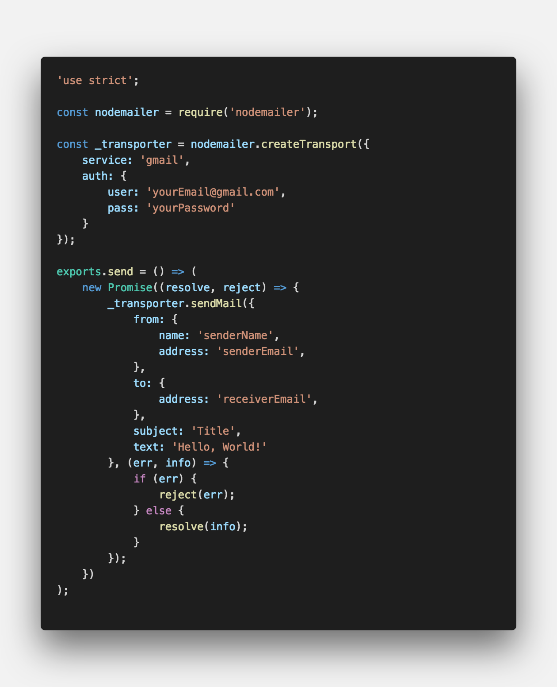
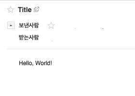
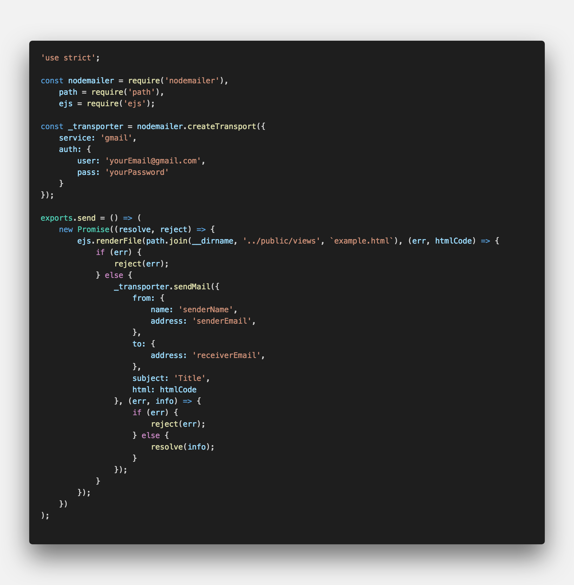
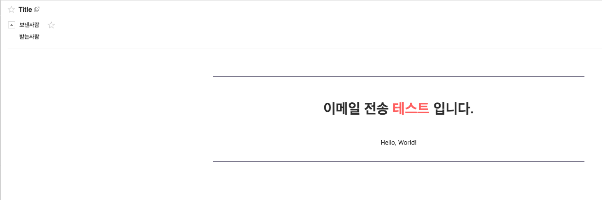
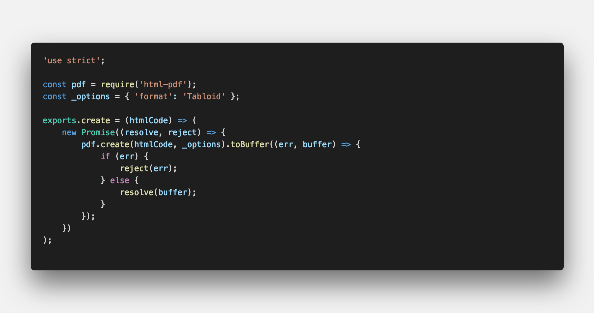
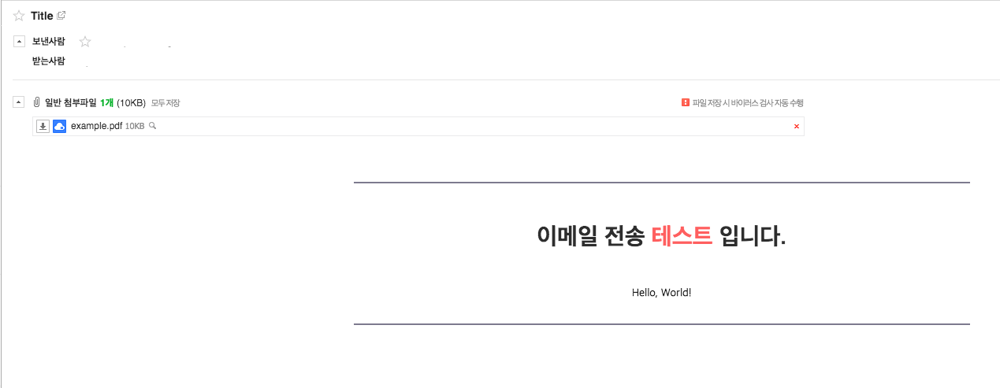
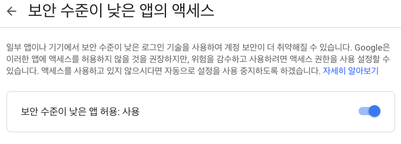
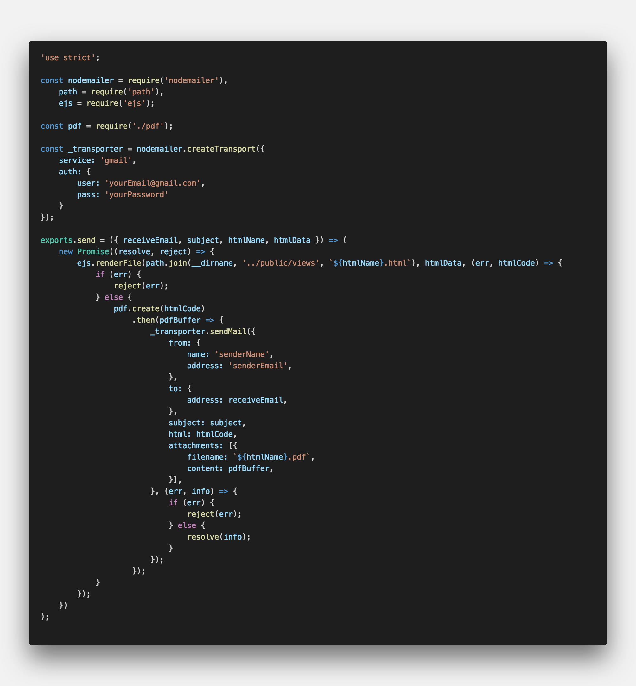
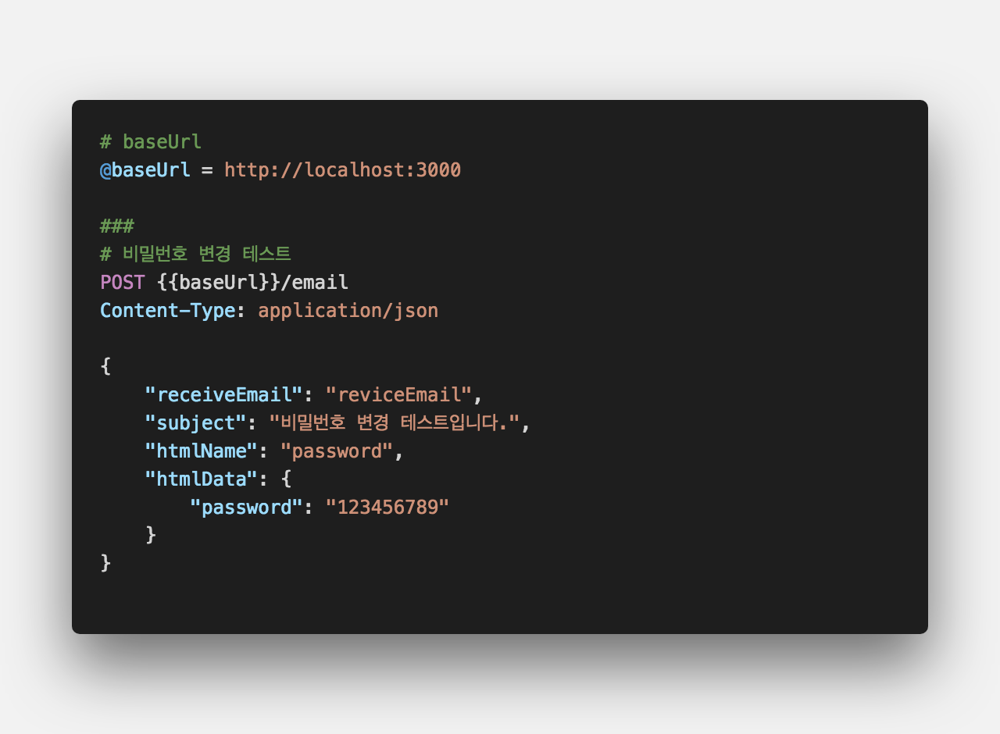
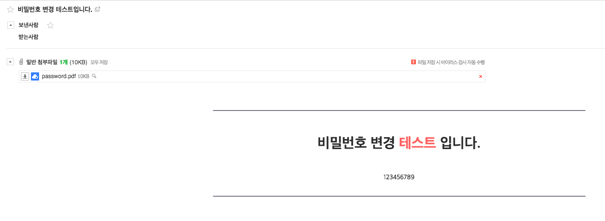

<center><strong style="color:#1FB674">이메일</strong> 발송을 위한 라이브러리</center>

## **💎 목차**
  * [설치를 하며](#️-설치를-하며)
  * [코드를 보며](#-코드를-보며)
  * [생각 해보며](#-생각해-보며)

## **⚙️ 설치를 하며**

```sh

$ npm install nodemailer

```

## **😳 코드를 보며**



<br />

* `createTransport` 
  * service - SMTP 기반 전송 지원
  * auth - user: 메일 계정, pass: 계정 비밀번호

* `sendMail` 
  * from(보내는 사람) - name: 보내는 이, address: 보내는 메일
  * to(받는 사람) - address: 받는 메일
  * subject(제목)
  * text(내용)

<br />

__전송 결과__


<br />

<hr>

### ▸ ejs
* HTML 페이지를 이용하여 이메일 전송을 한다.

```sh

// nodejs 템플릿 엔진으로 HTML 형식으로 변환 시키는 모듈이다.
$ npm install ejs

```


<br />

* `ejs.renderFile`
  * /public/views/example.html 파일을 불러와서 전송한다.

<br />

__전송 결과__


<br />

<hr>

### ▸ html-pdf
* HTML 파일을 PDF 저장하여 첨부파일로 전송한다.

```sh

// HTML 형식 파일을 PDF 문서로 변환시키는 모듈이다.
$ npm install html-pdf

```


<br />


<br />

* `ejs.renderFile` 결과 HtmlCode `pdf.create`로 전송

* `htmlCode`를 buffer로 생성하여 resolve

* buffer를 `attachments` filename(pdf 파일명), content(pdf 파일) 기입

<br />

__전송 결과__


<br />


<br />

<hr>

### ▸ error
* `service: gmail` 사용 시 에러가 발생할 수 있다.

```sh

Error: Invalid login: 535-5.7.8 Username and Password not accepted. Learn more at
535 5.7.8  https://support.google.com/mail/?p=BadCredentials y28sm48092065pfq.48 - gsmtp

```

<br />


<br />

* 구글 계정에서 보안 수준 앱의 엑세스를 허용하면 가능하다.

<br />

**[⬆ 목차](#-목차)**

---

## **🤔 생각해 보며**
* 이메일 전송 서비스를 활용하여 비밀번호 변경 메일을 구성해보자

<br />


<br />


<br />


<br />

* 데이터를 동적으로 할당 받아 html 전송한다.

<br />

__전송 결과__


<br />

**[⬆ 목차](#-목차)**

---

<br />

> 출처
>
> <a href="https://github.com/bynodejs/nodemailer" target="_blank">github > nodemailer</a>

# 여러분의 댓글이 큰힘이 됩니다. (๑•̀ㅂ•́)و✧
