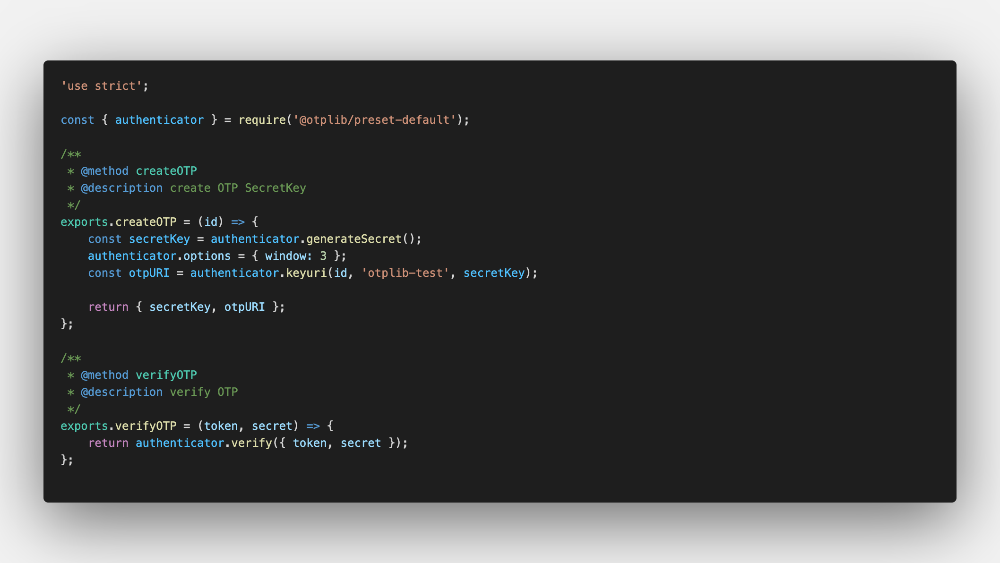
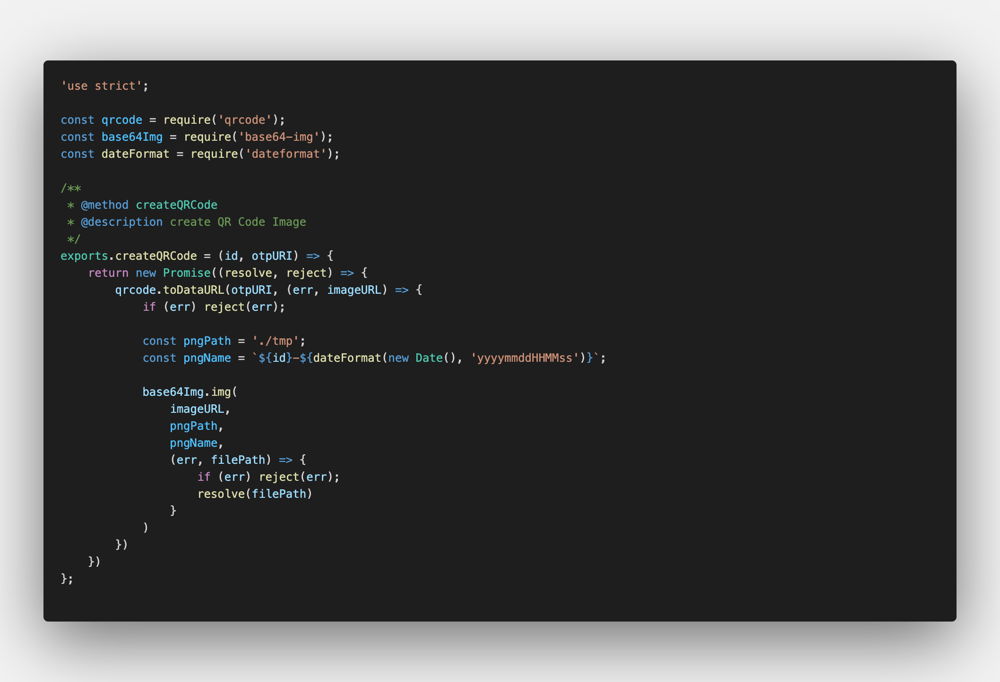
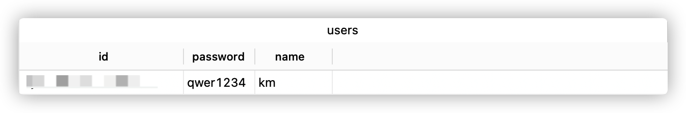
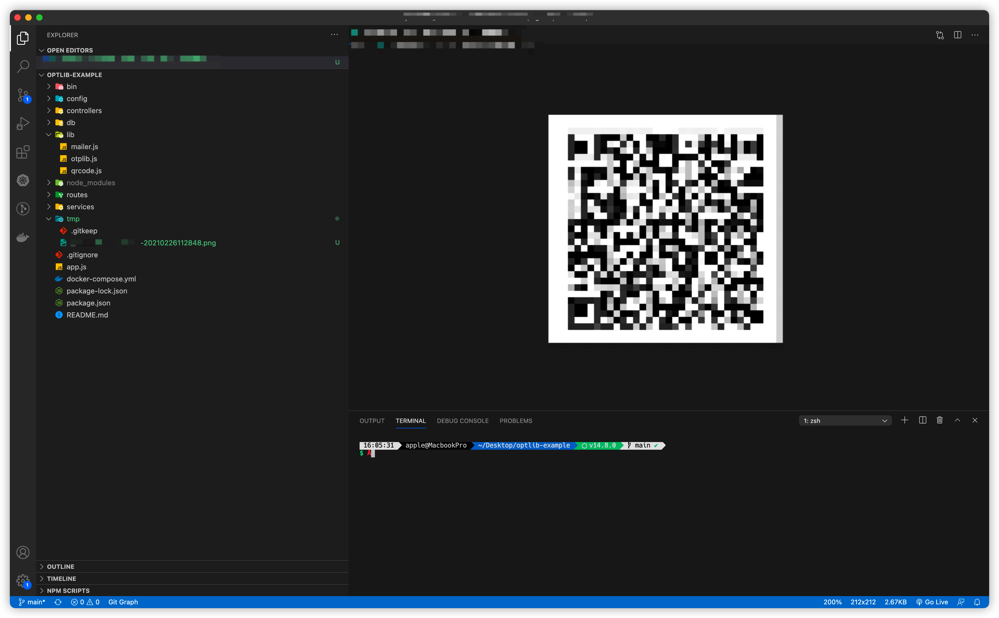
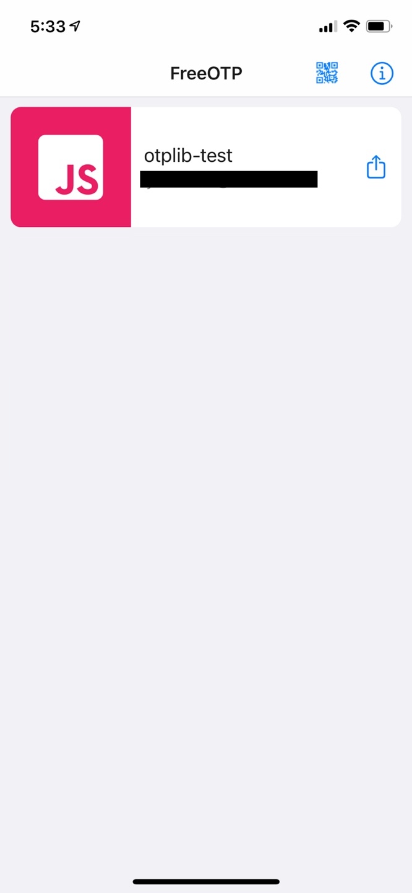
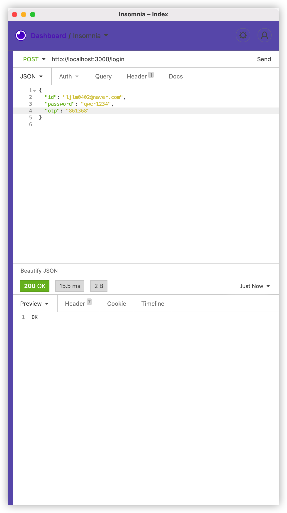
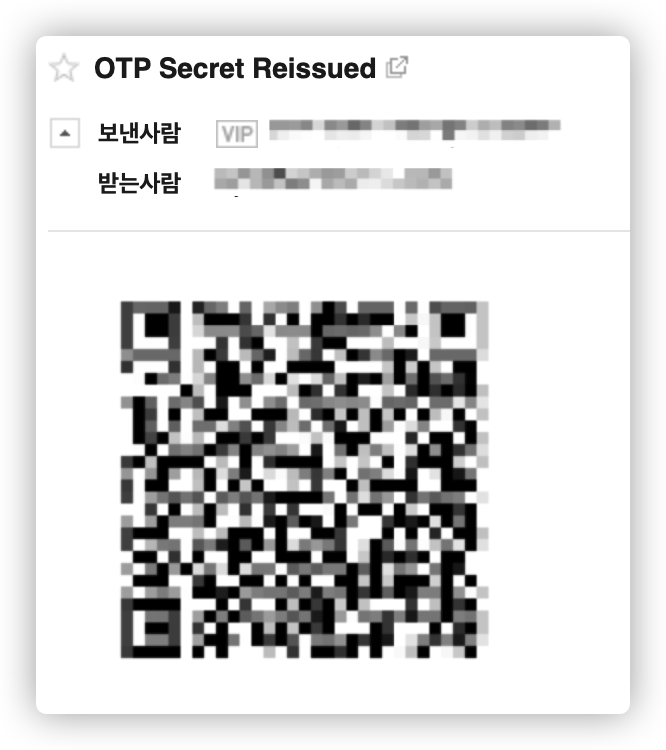

<center><strong style="color:#40D064; font-size: 20px;">OTP</strong> 생성 및 확인을 위한 JavaScript OTP (One Time Password) 라이브러리</center>

## **💎 목차**

- [준비를 하며](#-준비를-하며)
- [설치를 하며](#️-설치를-하며)
- [코드를 보며](#-코드를-보며)
- [생각 해보며](#-생각해-보며)

## **준비를 하며**

보안적인 이슈가 나날이 급증하면서, 2-Factor 인증을 도입하는 추세가 늘고있습니다.

이번 포스팅에서는 간단하게 OTP 인증을 통한 회원가입 및 로그인을 진행 해 보겠습니다.

하단 링크를 통해서 자신의 기종에 맞는 OTP 어플리케이션을 설치하시기 바랍니다.

* FreeOTP Authenticator
  * [Android](https://play.google.com/store/apps/details?id=org.fedorahosted.freeotp&hl=ko&gl=US)
  * [IOS](https://apps.apple.com/us/app/freeotp-authenticator/id872559395)

* Google OTP
  * [Android](https://play.google.com/store/apps/details?id=com.google.android.apps.authenticator2)
  * [IOS](https://apps.apple.com/us/app/google-authenticator/id388497605)

<br />

**[⬆ 목차](#-목차)**

<hr />

## **⚙️ 설치를 하며**

```sh

$ npm install base64-img, otplib, qrcode

```

<br />

**[⬆ 목차](#-목차)**

<hr />

## **😳 코드를 보며**

▼ OTP 생성


<br />

@createdOTP
- OTP SecretKey를 생성하는 함수입니다.

  * generateSecret: Secret Key 생성
  * keyuri: 비밀 키는 다음 형식의 URI로 QR 코드로 인코딩

<br />

@verifyOTP
- 입력한 OTP 값을 검증하는 함수입니다.

  * verify: OTP 값과 생성했던 SecretKey를 통해 검증

<br />

▼ OTP 데이터를 가지고 QR Code 생성


<br />

@createQRCode
- QR Code를 생성하는 함수입니다.

  * toDataURL: OtpURI를 기반으로 qrcode를 생성하며, 해당 이미지를 base64Img를 통해 png파일을 생성합니다.

<br />

### 결과

▼ DATABASE TABLE


<br />


<br />

▼ QR Code 생성


<br />

▼ QR Code Scan


<br />

▼ 로그인


<br />

<br />

**[⬆ 목차](#-목차)**

<hr />

## **🤔 생각해 보며**

회원가입을 통해 OTP QR Code를 사용자 메일로 전송

▼ QR Code를 사용자 메일로 전송


<br />

@createTransport
- mailer SMTP 설정
  * service - SMTP 기반 전송 지원
  * auth - user: 메일 계정, pass: 계정 비밀번호

<br />

@sendMail
- 메일 전송

  * from(보내는 사람) - name: 보내는 이, address: 보내는 메일
  * to(받는 사람) - address: 받는 메일
  * subject(제목)
  * text(내용)

<br />

## 결과

▼ 사용자 메일 수신


<br />

<br />

**[⬆ 목차](#-목차)**

<hr />

<br />

> 출처
>
> <a href="https://github.com/bynodejs/otplib" target="_blank">GitHub > otplib</a>

# 여러분의 댓글이 큰힘이 됩니다. (๑•̀ㅂ•́)و✧
