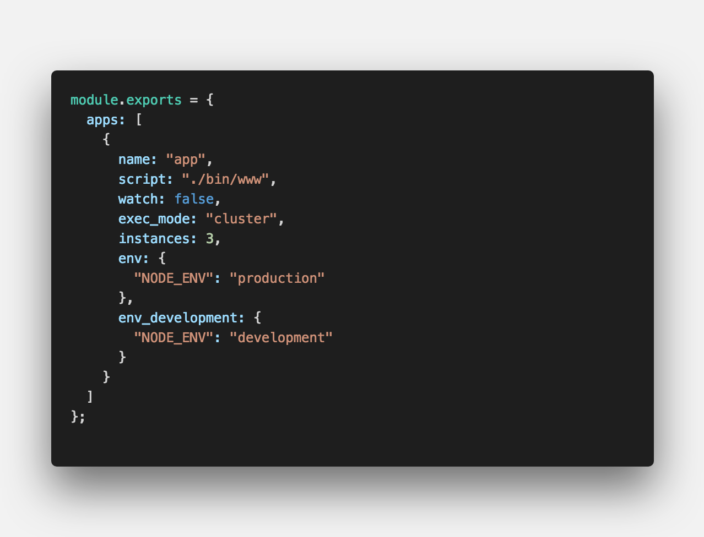

<center><strong style="color:#3EB1F3; font-size: 20px;">노드 프로세스</strong>를 관리해주는 라이브러리</center>

## **💎 목차**

- [설치를 하며](#️-설치를-하며)
- [명령어 보며](#-명령어-보며)
- [생각 해보며](#-생각해-보며)

## **⚙️ 설치를 하며**

```sh

$ npm install pm2 -g

```

<br />

**[⬆ 목차](#-목차)**

<hr />

## **😳 명령어 보며**

### ▸ pm2 -v

```sh

$ pm2 -v
3.5.1

```

pm2 버전 확인

<br />
<hr />

### ▸ pm2 start <id|name>

```sh

$ pm2 start ./bin/www
[PM2] Starting /Users/apple/Desktop/pm2/bin/www in fork_mode (1 instance)
[PM2] Done.
┌──────────┬────┬─────────┬──────┬──────┬────────┬─────────┬────────┬─────┬──────────┬───────┬──────────┐
│ App name │ id │ version │ mode │ pid  │ status │ restart │ uptime │ cpu │ mem      │ user  │ watching │
├──────────┼────┼─────────┼──────┼──────┼────────┼─────────┼────────┼─────┼──────────┼───────┼──────────┤
│ www      │ 0  │ 0.0.0   │ fork │ 8369 │ online │ 0       │ 0s     │ 0%  │ 9.2 MB   │ apple │ disabled │
└──────────┴────┴─────────┴──────┴──────┴────────┴─────────┴────────┴─────┴──────────┴───────┴──────────┘

```

프로세스 실행

<br />
<hr />

### ▸ pm2 stop <id|name>

```sh

$ pm2 stop www
[PM2] Applying action stopProcessId on app [www](ids: 0)
[PM2] [www](0) ✓
┌──────────┬────┬─────────┬──────┬─────┬─────────┬─────────┬────────┬─────┬────────┬───────┬──────────┐
│ App name │ id │ version │ mode │ pid │ status  │ restart │ uptime │ cpu │ mem    │ user  │ watching │
├──────────┼────┼─────────┼──────┼─────┼─────────┼─────────┼────────┼─────┼────────┼───────┼──────────┤
│ www      │ 0  │ 0.0.0   │ fork │ 0   │ stopped │ 0       │ 0      │ 0%  │ 0 B    │ apple │ disabled │
└──────────┴────┴─────────┴──────┴─────┴─────────┴─────────┴────────┴─────┴────────┴───────┴──────────┘

```

프로세스 중지

<br />
<hr />

### ▸ pm2 restart <id|name>

```sh

$ pm2 restart www
Use --update-env to update environment variables
[PM2] Applying action restartProcessId on app [www](ids: 0)
[PM2] [www](0) ✓
┌──────────┬────┬─────────┬──────┬──────┬────────┬─────────┬────────┬─────┬──────────┬───────┬──────────┐
│ App name │ id │ version │ mode │ pid  │ status │ restart │ uptime │ cpu │ mem      │ user  │ watching │
├──────────┼────┼─────────┼──────┼──────┼────────┼─────────┼────────┼─────┼──────────┼───────┼──────────┤
│ www      │ 0  │ 0.0.0   │ fork │ 8477 │ online │ 1       │ 0s     │ 0%  │ 6.7 MB   │ apple │ disabled │
└──────────┴────┴─────────┴──────┴──────┴────────┴─────────┴────────┴─────┴──────────┴───────┴──────────┘

```

프로세스 재시작

<br />
<hr />

### ▸ pm2 delete <id|name>

```sh

$ pm2 delete www
[PM2] Applying action deleteProcessId on app [www](ids: 0)
[PM2] [www](0) ✓
┌──────────┬────┬─────────┬──────┬─────┬────────┬─────────┬────────┬─────┬─────┬──────┬──────────┐
│ App name │ id │ version │ mode │ pid │ status │ restart │ uptime │ cpu │ mem │ user │ watching │
└──────────┴────┴─────────┴──────┴─────┴────────┴─────────┴────────┴─────┴─────┴──────┴──────────┘

```

프로세스 제거

<br />
<hr />

### ▸ pm2 list

```sh

$ pm2 list
┌──────────┬────┬─────────┬──────┬──────┬────────┬─────────┬────────┬──────┬───────────┬───────┬──────────┐
│ App name │ id │ version │ mode │ pid  │ status │ restart │ uptime │ cpu  │ mem       │ user  │ watching │
├──────────┼────┼─────────┼──────┼──────┼────────┼─────────┼────────┼──────┼───────────┼───────┼──────────┤
│ www      │ 0  │ 0.0.0   │ fork │ 8553 │ online │ 2       │ 26s    │ 0.1% │ 37.4 MB   │ apple │ disabled │
└──────────┴────┴─────────┴──────┴──────┴────────┴─────────┴────────┴──────┴───────────┴───────┴──────────┘

```

프로세스 목록

<br />
<hr />

### ▸ pm2 show <id|name>

```sh

$ pm2 show www
 Describing process with id 0 - name www
┌───────────────────┬──────────────────────────────────────┐
│ status            │ online                               │
│ name              │ www                                  │
│ version           │ 0.0.0                                │
│ restarts          │ 2                                    │
│ uptime            │ 58s                                  │
│ script path       │ /Users/apple/Desktop/pm2/bin/www     │
│ script args       │ N/A                                  │
│ error log path    │ /Users/apple/.pm2/logs/www-error.log │
│ out log path      │ /Users/apple/.pm2/logs/www-out.log   │
│ pid path          │ /Users/apple/.pm2/pids/www-0.pid     │
│ interpreter       │ node                                 │
│ interpreter args  │ N/A                                  │
│ script id         │ 0                                    │
│ exec cwd          │ /Users/apple/Desktop/pm2             │
│ exec mode         │ fork_mode                            │
│ node.js version   │ 10.16.0                              │
│ node env          │ N/A                                  │
│ watch & reload    │ ✘                                    │
│ unstable restarts │ 0                                    │
│ created at        │ 2019-09-11T05:44:28.964Z             │
└───────────────────┴──────────────────────────────────────┘
 Actions available
┌────────────────────────┐
│ km:heapdump            │
│ km:cpu:profiling:start │
│ km:cpu:profiling:stop  │
│ km:heap:sampling:start │
│ km:heap:sampling:stop  │
└────────────────────────┘
 Trigger via: pm2 trigger www <action_name>

 Code metrics value
┌────────────────────────┬───────────┐
│ Heap Size              │ 14.73 MiB │
│ Heap Usage             │ 66.85 %   │
│ Used Heap Size         │ 9.85 MiB  │
│ Active requests        │ 0         │
│ Active handles         │ 4         │
│ Event Loop Latency     │ 2.22 ms   │
│ Event Loop Latency p95 │ 5.70 ms   │
└────────────────────────┴───────────┘
 Divergent env variables from local env


 Add your own code metrics: http://bit.ly/code-metrics
 Use `pm2 logs www [--lines 1000]` to display logs
 Use `pm2 env 0` to display environement variables
 Use `pm2 monit` to monitor CPU and Memory usage www

```

프로세스 상세 조회

<br />
<hr />

### ▸ pm2 log

```sh

$ pm2 log
[TAILING] Tailing last 15 lines for [all] processes (change the value with --lines option)
/Users/apple/.pm2/pm2.log last 15 lines:
PM2        | 2019-09-11T14:42:42: PM2 log: App [www:0] exited with code [0] via signal [SIGINT]
PM2        | 2019-09-11T14:42:42: PM2 log: pid=8369 msg=process killed
PM2        | 2019-09-11T14:43:39: PM2 log: App [www:0] starting in -fork mode-
PM2        | 2019-09-11T14:43:39: PM2 log: App [www:0] online
PM2        | 2019-09-11T14:43:45: PM2 log: Stopping app:www id:0
PM2        | 2019-09-11T14:43:45: PM2 log: App [www:0] exited with code [0] via signal [SIGINT]
PM2        | 2019-09-11T14:43:45: PM2 log: pid=8468 msg=process killed
PM2        | 2019-09-11T14:43:45: PM2 log: App [www:0] starting in -fork mode-
PM2        | 2019-09-11T14:43:45: PM2 log: App [www:0] online
PM2        | 2019-09-11T14:44:28: PM2 log: Process 0 in a stopped status, starting it
PM2        | 2019-09-11T14:44:28: PM2 log: Stopping app:www id:0
PM2        | 2019-09-11T14:44:28: PM2 log: App [www:0] exited with code [0] via signal [SIGINT]
PM2        | 2019-09-11T14:44:29: PM2 log: pid=8477 msg=process killed
PM2        | 2019-09-11T14:44:29: PM2 log: App [www:0] starting in -fork mode-
PM2        | 2019-09-11T14:44:29: PM2 log: App [www:0] online

/Users/apple/.pm2/logs/www-out.log last 15 lines:
/Users/apple/.pm2/logs/www-error.log last 15 lines:

```

프로세스 로그파일 확인

<br />
<hr />

### ▸ pm2 log <id|name>

```sh

$ pm2 log www
[TAILING] Tailing last 15 lines for [www] process (change the value with --lines option)
/Users/apple/.pm2/logs/www-out.log last 15 lines:
/Users/apple/.pm2/logs/www-error.log last 15 lines:

```

특정 프로세스의 로그파일 확인

<br />
<hr />

### ▸ pm2 flush

```sh

$ pm2 flush
[PM2] Flushing /Users/apple/.pm2/pm2.log
[PM2] Flushing:
[PM2] /Users/apple/.pm2/logs/www-out.log
[PM2] /Users/apple/.pm2/logs/www-error.log
[PM2] Logs flushed

```

로그파일 삭제

<br />
<hr />

### ▸ pm2 monit

```sh

┌─ Process list ──────────────────────────────────────┐┌─ Global Logs ──────────────────────────────────────────────────────────────────────────────────────────────────────────────────┐
│[ 0] www            Mem:  30 MB    CPU:  0 %  online ││                                                                                                                                │
│                                                     ││                                                                                                                                │
│                                                     ││                                                                                                                                │
│                                                     ││                                                                                                                                │
│                                                     ││                                                                                                                                │
│                                                     ││                                                                                                                                │
│                                                     ││                                                                                                                                │
│                                                     ││                                                                                                                                │
│                                                     ││                                                                                                                                │
│                                                     ││                                                                                                                                │
│                                                     ││                                                                                                                                │
│                                                     ││                                                                                                                                │
│                                                     ││                                                                                                                                │
│                                                     ││                                                                                                                                │
│                                                     ││                                                                                                                                │
│                                                     ││                                                                                                                                │
│                                                     ││                                                                                                                                │
│                                                     ││                                                                                                                                │
│                                                     ││                                                                                                                                │
│                                                     ││                                                                                                                                │
│                                                     ││                                                                                                                                │
│                                                     ││                                                                                                                                │
│                                                     ││                                                                                                                                │
│                                                     ││                                                                                                                                │
│                                                     ││                                                                                                                                │
│                                                     ││                                                                                                                                │
│                                                     ││                                                                                                                                │
│                                                     ││                                                                                                                                │
│                                                     ││                                                                                                                                │
│                                                     ││                                                                                                                                │
│                                                     ││                                                                                                                                │
│                                                     ││                                                                                                                                │
│                                                     ││                                                                                                                                │
└─────────────────────────────────────────────────────┘└────────────────────────────────────────────────────────────────────────────────────────────────────────────────────────────────┘
┌─ Custom metrics (http://bit.ly/code-metrics) ───────┐┌─ Metadata ─────────────────────────────────────────────────────────────────────────────────────────────────────────────────────┐
│ Heap Size                                    13.23  ││ App Name              www                                                                                                      │
│ Heap Usage                                   66.42  ││ Version               0.0.0                                                                                                    │
│ Used Heap Size                                8.79  ││ Restarts              2                                                                                                        │
│ Active requests                                  0  ││ Uptime                3m                                                                                                       │
│ Active handles                                   4  ││ Script path           /Users/apple/Desktop/pm2/bin/www                                                                         │
│ Event Loop Latency                            2.13  ││ Script args           N/A                                                                                                      │
│ Event Loop Latency p95                        5.54  ││ Interpreter           node                                                                                                     │
│                                                     ││ Interpreter args      N/A                                                                                                      │
│                                                     ││ Exec mode             fork                                                                                                     │
│                                                     ││ Node.js version       10.16.0                                                                                                  │
│                                                     ││ watch & reload        ✘                                                                                                        │
└─────────────────────────────────────────────────────┘└────────────────────────────────────────────────────────────────────────────────────────────────────────────────────────────────┘

 left/right: switch boards | up/down/mouse: scroll | Ctrl-C: exit                                                                                To go further check out https://pm2.io/

```

프로세스 실시간 모니터링

<br />

**[⬆ 목차](#-목차)**

<hr />

## **🤔 생각해 보며**

### ▸ Cluster Mode

```sh

$ pm2 start ./bin/www -i 2
[PM2] Starting /Users/apple/Desktop/pm2/bin/www in cluster_mode (2 instances)
[PM2] Done.
┌──────────┬────┬─────────┬─────────┬──────┬────────┬─────────┬────────┬─────┬───────────┬───────┬──────────┐
│ App name │ id │ version │ mode    │ pid  │ status │ restart │ uptime │ cpu │ mem       │ user  │ watching │
├──────────┼────┼─────────┼─────────┼──────┼────────┼─────────┼────────┼─────┼───────────┼───────┼──────────┤
│ www      │ 0  │ 0.0.0   │ cluster │ 8888 │ online │ 0       │ 0s     │ 0%  │ 32.7 MB   │ apple │ disabled │
│ www      │ 1  │ 0.0.0   │ cluster │ 8889 │ online │ 0       │ 0s     │ 0%  │ 25.2 MB   │ apple │ disabled │
└──────────┴────┴─────────┴─────────┴──────┴────────┴─────────┴────────┴─────┴───────────┴───────┴──────────┘

```

클러스터 모드로 CPU를 최대한 활용

`-i` 옵션은 클러스터 모드로 실행하며 뒤에 인스턴스 개수를 지정 가능

`0`을 지정할 경우 사용 가능한 CPU 개수만큼 실행

<br />
<hr />

#### ▸ pm2 reload <id|name>

```sh

$ pm2 reload www
Use --update-env to update environment variables
[PM2] Applying action reloadProcessId on app [www](ids: 0,1)
[PM2] [www](0) ✓
[PM2] [www](1) ✓

```

클러스터 모드에 사용할 경우 다운타임 없이 서버를 재기동할 수 있다.

<br />
<hr />

### ▸ Ecosystem File

```sh

$ pm2 ecosystem

```

pm2 설정 파일 생성

<br />

**ecosystem.cofing.js**


<br />

`name` 실행한 프로세스 이름

`script` 실행할 파일 경로

`watch` 파일 변경시 자동으로 재실행 여부 (true, false)

`exec_mode` 실행 모드 (cluster, fork)

`instances` cluster로 실행시 인스턴스 개수

`env` 환경변수로 PORT, NODE_ENV 같은 precess.env.{} 설정

<br />

```sh

# NODE_ENV=production
$ pm2 start ecosystem.cofing.js

# NODE_ENV=development
$ pm2 start ecosystem.cofing.js --env development

```

<br />

**[⬆ 목차](#-목차)**

<hr />

<br />

> 출처
>
> <a href="https://github.com/bynodejs/pm2" target="_blank">GitHub > pm2</a>

# 여러분의 댓글이 큰힘이 됩니다. (๑•̀ㅂ•́)و✧
