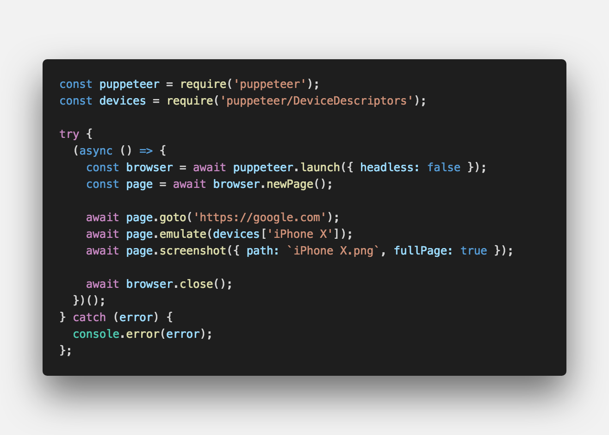
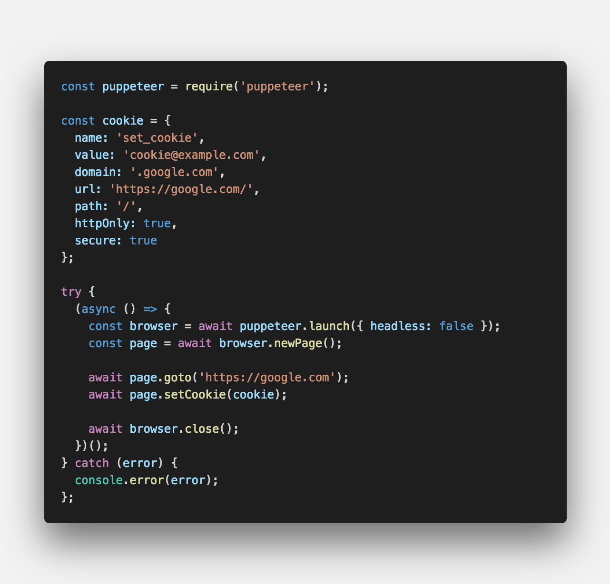
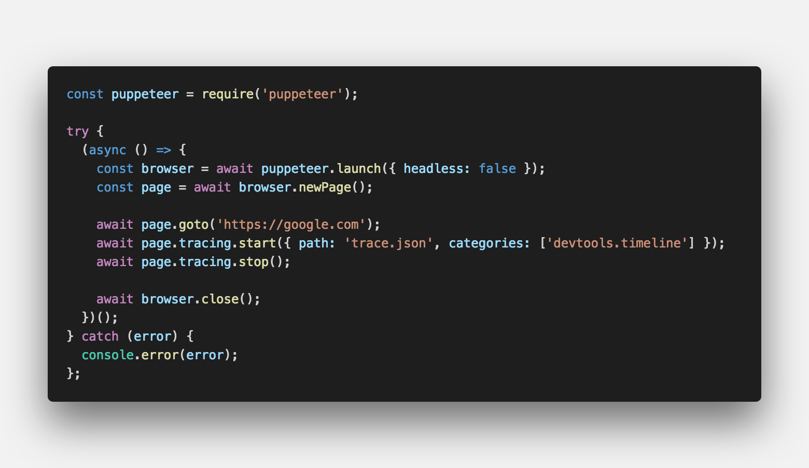
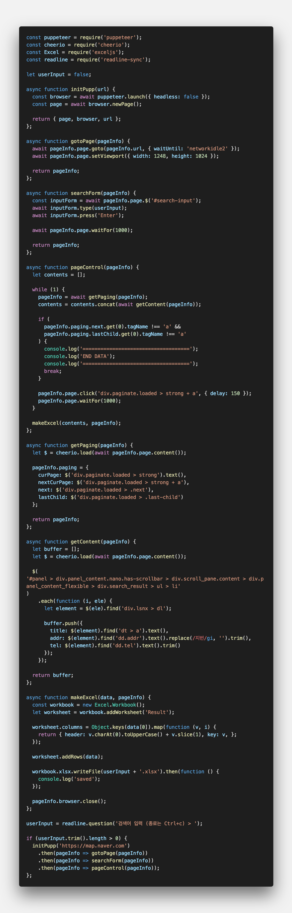

  
<center><strong style="color:#fbc2eb">Headless Chrome</strong>을 쉽게 사용할 수 있는 node.js 라이브러리이다.</center>

## **💎 목차**
  * [설치를 하며](#︎-설치를-하며)
  * [코드를 보며](#-코드를-보며)
  * [생각 해보며](#-생각해-보며)

## **⚙️ 설치를 하며**
```js

npm install puppeteer

```

## **😳 코드를 보며**

### ▸ screenshot
*   스크린샷을 저장한다.


<br />

### ▸ pdf
*   PDF 파일을 저장한다.


<br />

### ▸ emulate devices
*   디바이스 모드로 전환한다.


<br />

### ▸ setCookie
*   쿠키를 설정한다.


<br />

### ▸ tracing
*   접속 브라우저 정보를 추적한다.


<br />

**[⬆ 목차](#-목차)**

---

## **🤔 생각해 보며**

`완성도`와 `세련도`를 높이고자 몇 가지 모듈을 추가해보자.

### **▸ cheerio**
-   HTML DOM Element 접근에 용이한 모듈
<br />

### **▸ exceljs**
-   Excel 파일 생성 모듈
<br />

### **▸ readline-sync**
-   콘솔 입력 모듈
<br />


<br />

해당 소스는 `네이버 맵` 크롤링 소스이다. 간략히 설명 하겠습니다.

1. `readline` 모듈을 통해 검색어를 입력

2. `cheerio` 모듈을 통해 손쉽게 Element 접근

3. `exceljs` 모듈을 통해 데이터 수집이 완료 시 Excel 저장

<br />

**[⬆ 목차](#-목차)**

---

<br />

> 출처
>
> <a href="https://github.com/bynodejs/crawling" target="_blank">github > crawling</a>

# 여러분의 댓글이 큰힘이 됩니다. (๑•̀ㅂ•́)و✧
