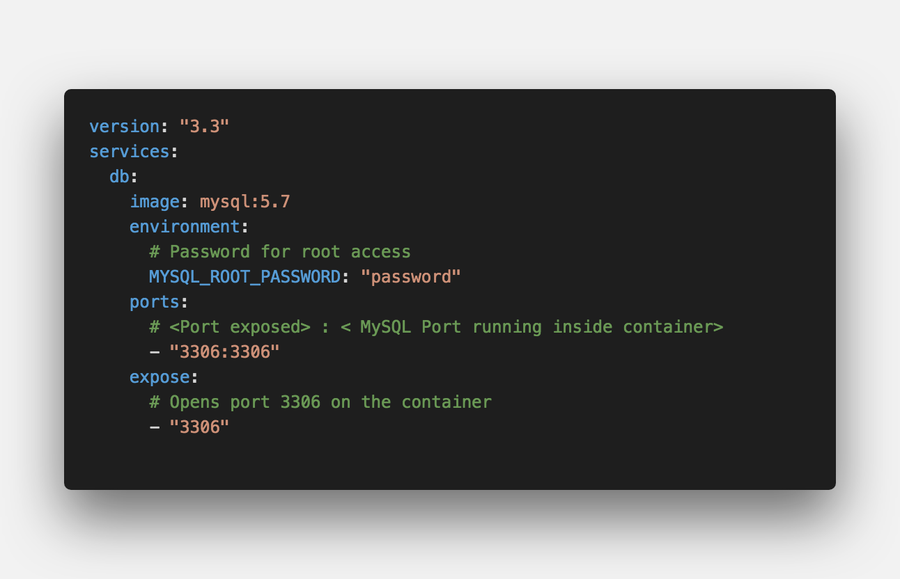
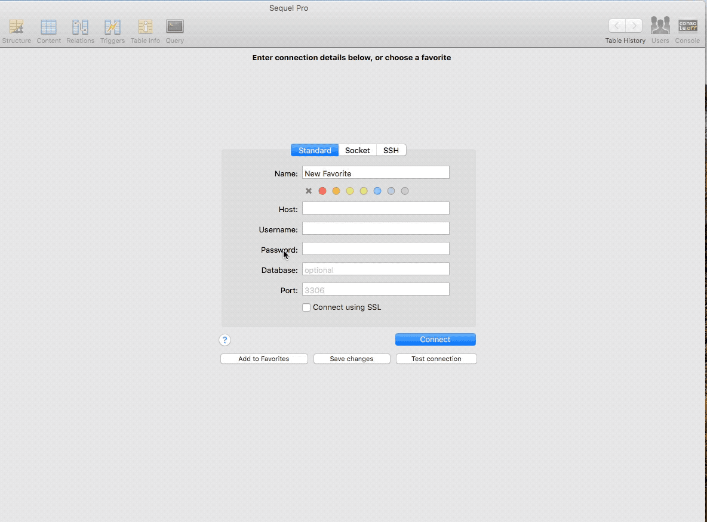
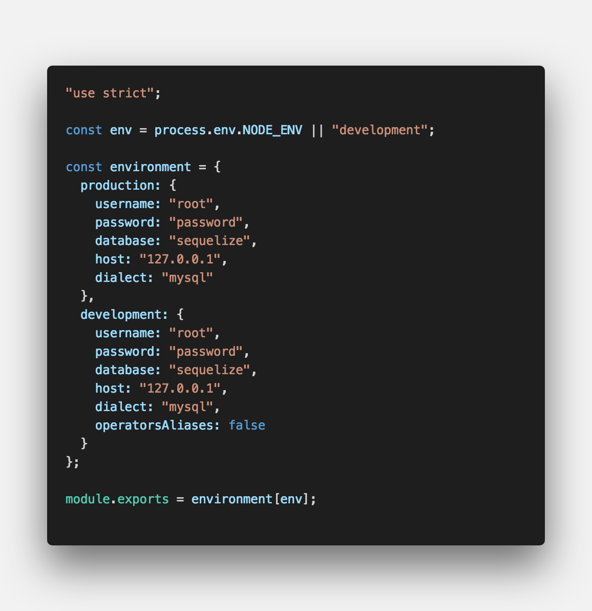
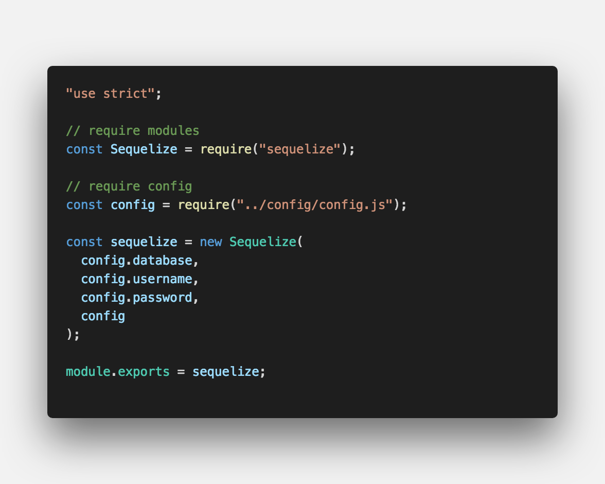
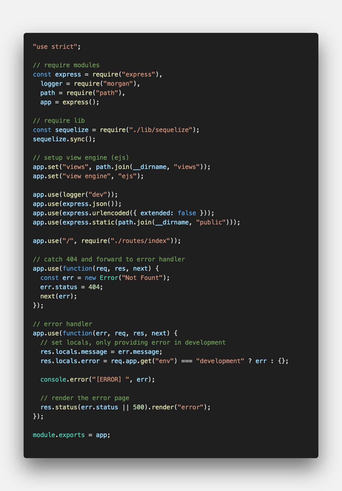

<center><strong style="color:#54AEEA; font-size: 20px;">ORM(Object-Relational-Mapping)</strong> 라이브러리</center>

## **💎 목차**

- [서론 (Introduction)](#-서론)
- [본론 (Main)](#-본론)
- [결론 (Conclusion)](#🥀-결론)

## **🌱 서론**

시퀄라이즈는 ORM(Object-Relational-Mapping)으로 분류됩니다.

ORM은 자바스크립트 객체와 데이터베이스의 릴레이션을 매핑해주는 도구입니다.

시퀄라이즈를 MySQL하고만 같이 써야 하는 것은 아닙니다.

MariaDB, PostgreSQL, SQLite, MSSQL 등 다른 데이터베이스도 같이 쓸 수 있습니다.

문법이 어느 정도 호환되므로 다른 SQL 데이터베이스로 전환할 때도 편리합니다.

시퀄라이즈를 쓰는 이유는 자바스크립트 구문을 알아서 SQL로 바꿔주기 때문입니다.

따라서 SQL 언어를 직접 사용하지 않아도 자바스크립트만으로 MySQL을 조작할 수 있습니다.

시퀄라이즈 포스팅에서는 MySQL을 사용하여 진행하도록 하겠습니다.

자 그럼, 이번 포스트에서는 `MySQL 설치, 연동`에 대해 알아보겠습니다.

참고로, 저는 `Mac OS`를 환경에서 진행하는점 참고하시기 바랍니다.

<br />

**[⬆ 목차](#-목차)**

<hr />

## **🌹 본론**

### ▸ MySQL 설치

시퀄라이즈를 사용하기 위해서 우선 MySQL를 설치하겠습니다.

세가지 방법이 있습니다.

1. [MySQL](https://dev.mysql.com/downloads/mysql/) 사이트를 통해 설치

2. macOS 패키지 관리자 [Homebrew](https://whitepaek.tistory.com/16) 설치 후 MySQL 설치

3. [Docker Desktop](https://docs.docker.com/docker-for-mac/install/) 설치 후 [docker-compose](https://hub.docker.com/_/mysql) 사용

저는 여기서 3번째인 `docker-compose` 사용하여 진행해보겠습니다.

`docker` 설치 관련 포스팅은 [링크](https://ljlm0402.netlify.com/nodejs/mongoose.1/) mongoDB 설치란을 참고하시기 바랍니다.

<br />


<br />

```sh

$ docker-compose up -d

Creating network "sequelize_default" with the default driver

Creating sequelize_db_1 ... done

```

이미지 상단 링크를 확인하시면 도커 명령어도 확인할수있습니다.

[Sequel Pro](https://www.sequelpro.com) macOS MySQL GUI 툴을 통해 디비가 설치되었는지 확인하도록 하겠습니다.


<br />

`DOWNLOAD`를 클릭하여 dmg 파일을 install 해줍니다.

<br />


<br />

기본 값인 root / password 입력하여 접속이 하고

접속이 정상적으로 되면 database `sequlize`를 생성해줍니다.

database 생성 이유는 sequlize는 테이블은 생성 모델을 통해 가능하지만,

database 생성은 불가하기 때문에 미리 생성해줬습니다.

### ▸ MySQL 연동

도커를 사용하여 정상적으로 MySQL를 설치하였습니다.

이제 연동을 진행해보겠습니다.

```sh

$ npm install -g sequelize-cli

$ npm install sequelize

$ npm install mysql2

$ sequelize init
Sequelize CLI [Node: 10.0.0, CLI: 4.0.0, ORM: 4.37.6]

Created "config\config.json"
Successfully created models folder at ...
Successfully created migrations folder at ...
Successfully created seeders folder at ...
```

`sequelize init` 명령어를 통해 설정 파일을 생성합니다.

```sh

│
├── bin
│   └── www
│
├── config
│   └── config.json
│
├── migrations
│
├── models
│   └── index.js
│
├── routes
│   └── index.js
│
├── seeders
│
├── views
│   └── index.ejs
│
├── app.js
└── package.json

```

기본 구성이 셋팅 되었습니다.

**config - config.js**


<br />

**lib - sequelize.js**


<br />

**app.js**


<br />

`sequlize.sync()` 사용하여 연동해줍니다.

정상적으로 연동이 되었습니다.

<br />

**[⬆ 목차](#-목차)**

<hr />

## **🥀 결론**

이번 포스팅은 여기까지입니다.

어느덧 시간이 🕕 많이 흘럿네요.

오늘 배운 내용을 정리하면

1. docker-compose 이용하여 MySQL 설치

2. sequelize 사용하여 MySQL 연동

**2탄** 에서는 `모델 정의, REST API 만들기` 해보겠습니다.

<br />

**[⬆ 목차](#-목차)**

<hr />

<br />

> 출처
>
> <a href="https://github.com/bynodejs/sequelize" target="_blank">GitHub > sequelize</a>

# 여러분의 댓글이 큰힘이 됩니다. (๑•̀ㅂ•́)و✧
