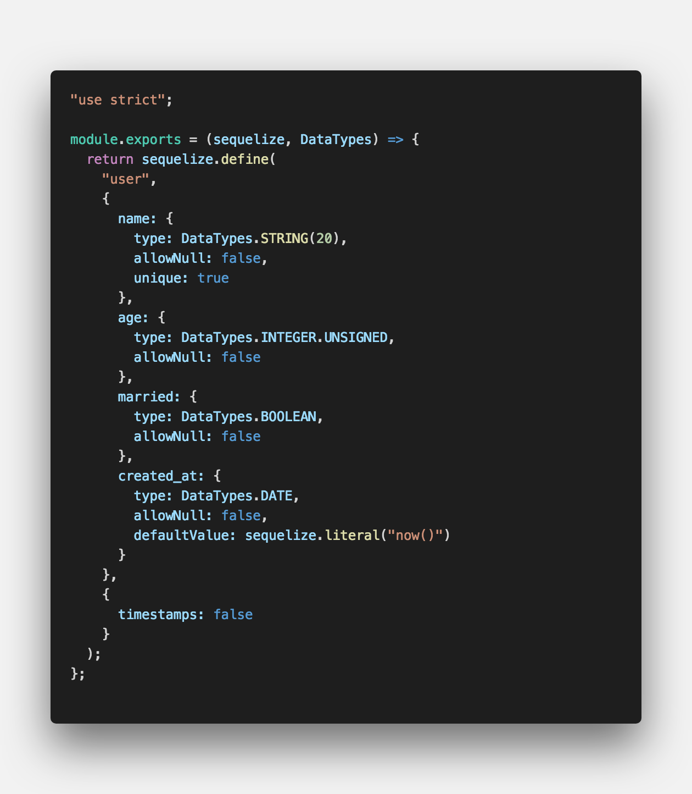
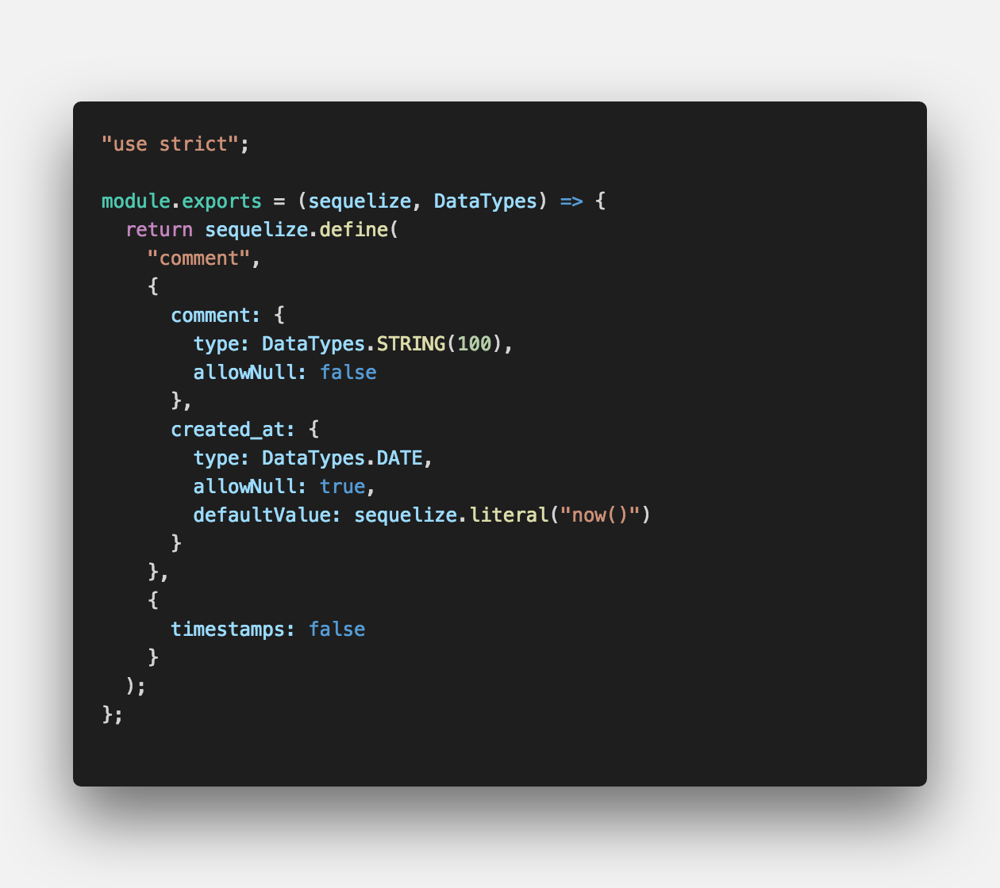
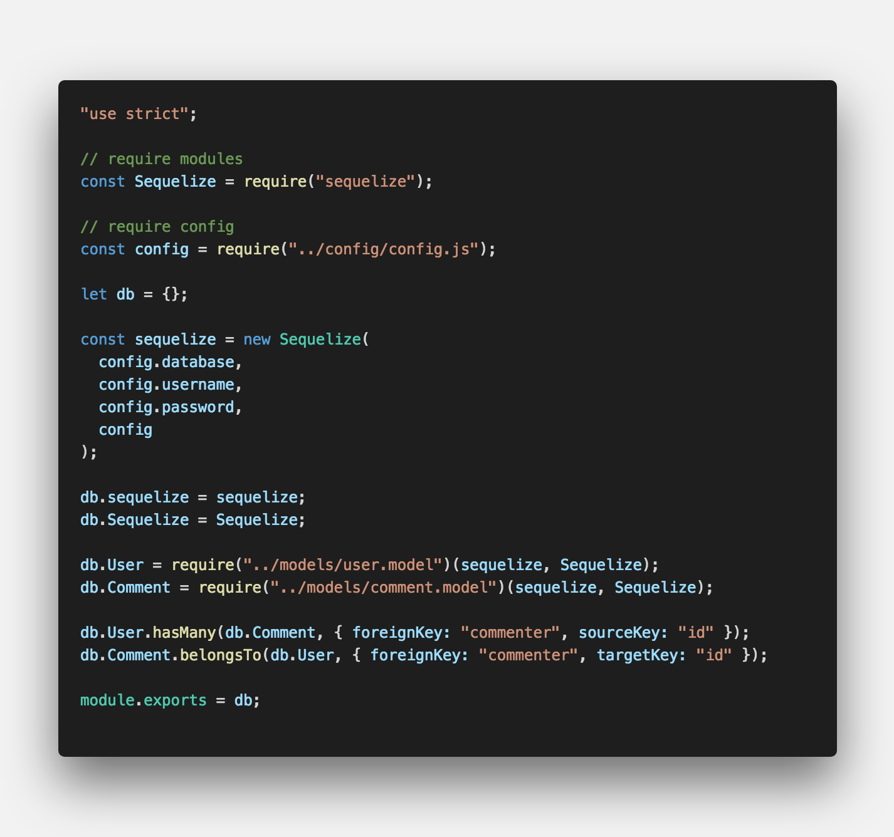
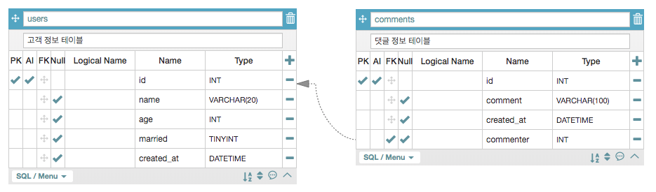
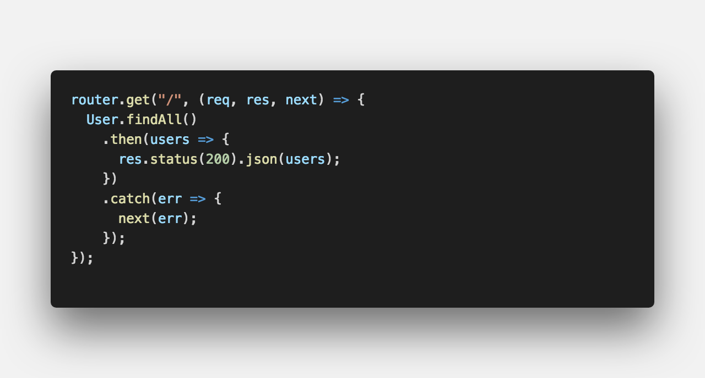
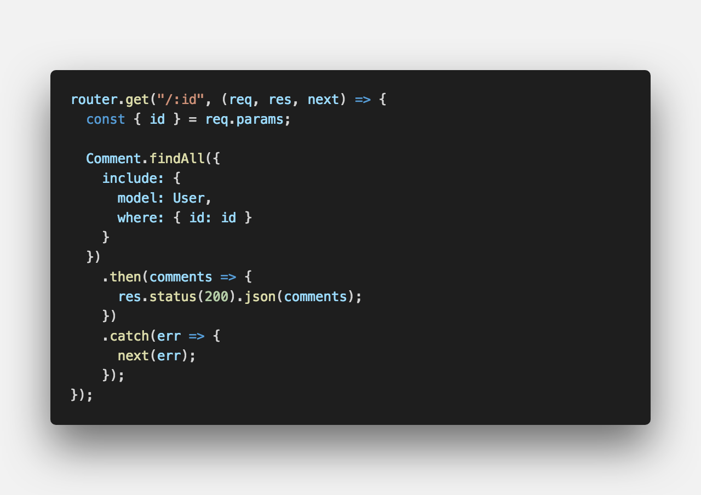
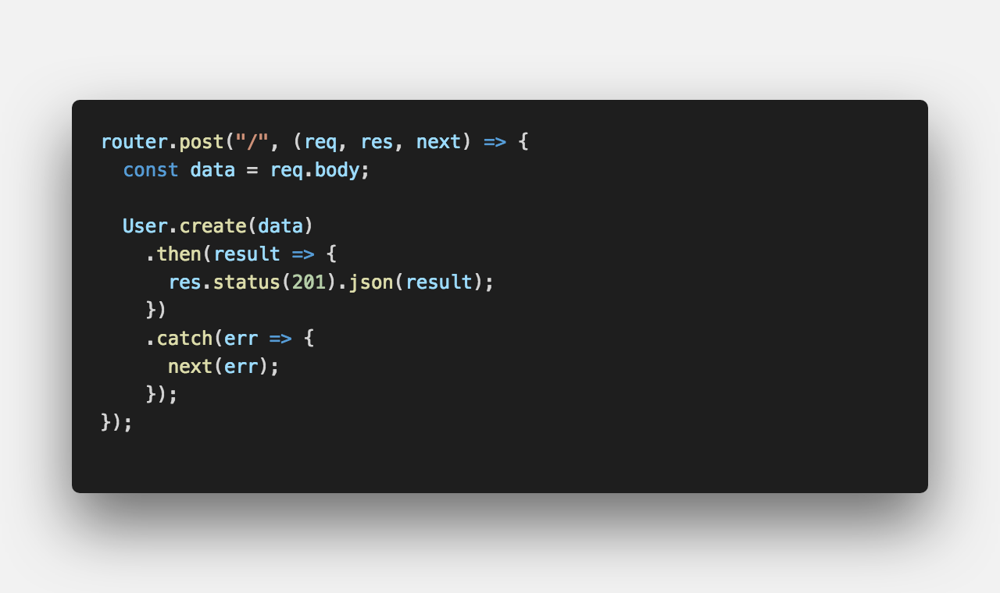
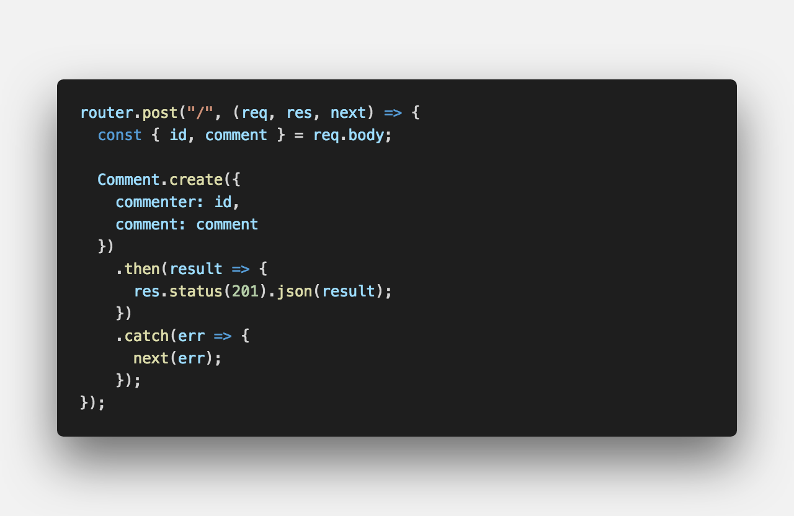
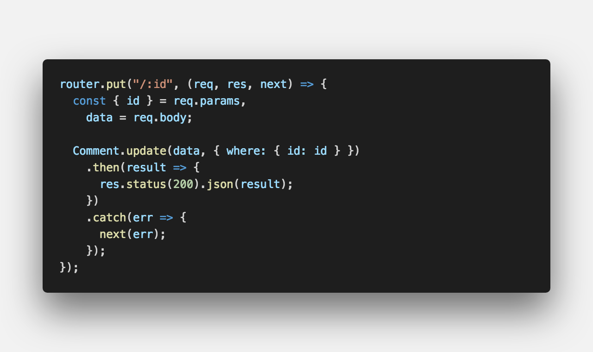
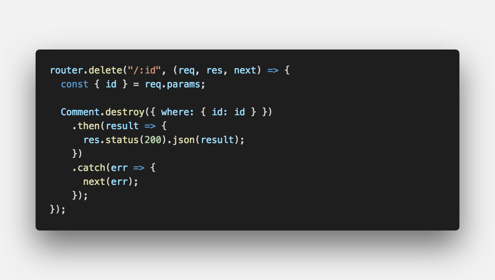

<strong style="color:#54AEEA; font-size: 20px;">ORM(Object-Relational-Mapping)</strong> 라이브러리

## **💎 목차**

- [서론 (Introduction)](#-서론)
- [본론 (Main)](#-본론)
- [결론 (Conclusion)](#🥀-결론)

## **🌱 서론**

시퀄라이즈 2탄이 돌아왔습니다. 와아~ 🤩

2탄에 들어가기 앞서 1탄에서 배운 내용을 정리해보겠습니다.

1. docker-compose 사용하여 MySQL 설치

2. sequelize 사용하여 MySQL 연동

**2탄**에서는 `모델 정의, REST API 만들기` 진행해 보겠습니다.

 

**[⬆ 목차](#-목차)**

## **🌹 본론**

### ▸ 모델 정의

**models - user.model.js**

 

`sequelize.define` 테이블명, 컬럼을 정의해줍니다.

`user` 테이블을 생성하고

| 필드명     | 타입            | 기타                       |
| :--------- | :-------------- | :------------------------- |
| name       | 문자형, 길이 20 | null 비허용, 유니크        |
| age        | 정수, 10진수    | null 비허용                |
| married    | 자료형          | null 비허용                |
| created_at | 시간            | null 비허용, 기본 값 now() |

**models - comment.model.js**

 

`comment` 테이블 생성하고

| 필드명     | 타입             | 기타                       |
| :--------- | :--------------- | :------------------------- |
| comment    | 문자형, 길이 100 | null 비허용                |
| created_at | 시간             | null 비허용, 기본 값 now() |

**lib - sequelize.js**

 

One-To-Many associations

1 : n 관계를 형성하기 위해서 작업을 해야한다.

`hasMany`의 경우 하나의 모델을 여러개의 Target 모델과 연결시킨다.

즉, user 테이블에서 `sourceKey` id는 많은 comment 테이블 데이터를 가진다.

`belongsTo` 1 : 1 관계에서 필요한 foreign key가 model에 추가되는 메소드이다.

즉, comment 테이블에서 `foreignKey` commenter이고 `targetKey`는 id이다.

이로써 user(고객)은 여러개의 comment(댓글)을 가질 수 있다.

 

 

완성된 데이터베이스 설계 구조입니다.

 

### ▸ REST API 만들기

[Sequelize API Reference](https://sequelize.org/master/class/lib/model.js~Model.html) 참고하시기 바랍니다.

기본적으로 시퀄라이즈 모든 쿼리 결과는 promise로 리턴됩니다.

#### ▸ findAll()

 

 

model 메소드로 조건에 맞는 모든 row를 찾아 리턴합니다.

만약 row가 없다면 빈 배열을 리턴합니다.

`include`를 통해 model을 매핑하고 where 조건으로 해당 값을 리턴합니다.

#### ▸ create()

 

 

model 테이블에 데이터를 생성합니다.

{ key : value } 를 지정해주어서 원하는 필드에 데이터를 생성할수도 있습니다.

#### ▸ update()

 

model 테이블 where 해당하는 row를 data로 수정합니다.

#### ▸ destroy()

 

model 테이블 where 해당하는 row를 삭제합니다.

 

**[⬆ 목차](#-목차)**

## **🥀 결론**

이번 포스팅의 내용은 여기까지입니다~

REAT API로 CRUD를 만들어보았습니다.

CRUD는 기본적인 데이터 요청으로 반드시 알아두셔야합니다.

또한 포스팅처럼 기본적인거 외에도 다양하게 활용할수도 있습니다.

오늘 배운 내용을 정리하면

1. 모델 정의

2. REST API 만들기

마지막 **3탄** 에서는 `화면 구성하기` 해보겠습니다.

 

**[⬆ 목차](#-목차)**

 

> 출처
>
> <a href="https://github.com/bynodejs/sequelize" target="_blank">GitHub > sequelize</a>

# 여러분의 댓글이 큰힘이 됩니다. (๑•̀ㅂ•́)و✧
