<center><strong style="color:#54AEEA; font-size: 20px;">ORM(Object-Relational-Mapping)</strong> 라이브러리</center>

## **💎 목차**

- [서론 (Introduction)](#-서론)
- [본론 (Main)](#-본론)
- [결론 (Conclusion)](#🥀-결론)

## **🌱 서론**

안녕하세요 ~

드디어 ! 마지막 포스팅으로 찾아뵙습니다. 😱

많이 아쉬워하시는 분들도 계신텐데요 (제발...)

아쉬움을 뒤로하고 힘차게 시작해보겠습니다.

시작에 앞서 그동안 했던 내용을 복습하겠습니다.

1. Docker를 통한 MySQL 설치

2. sequelize를 이용한 MySQL 연동

3. 모델 정의

4. REST API 만들기

1번 MySQL 설치를 제외하고는 가장 기본적인 시퀄라이즈 사용 방법이였습니다.

혹시나 헷갈리신다면 1탄, 2탄을 참고하시기 바랍니다.

자 그럼 마지막 시간에는 `화면 구성하기`을 해보겠습니다.

<br />

**[⬆ 목차](#-목차)**

<hr />

## **🌹 본론**

페이지를 만들기 위해서 모듈을 설치합니다.

```sh

$ npm install ejs

```

그후 view engine으로 설정해 줍니다.

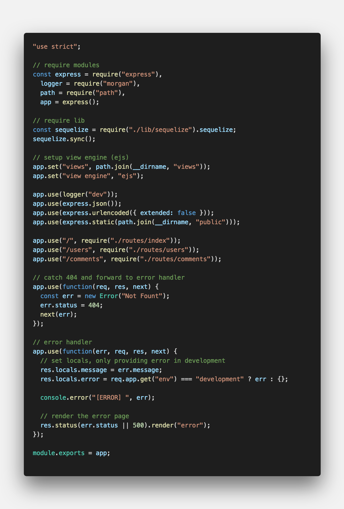
<br />

`route.use()` 를 사용하여 라우트 미들웨어를 로드할 수 있습니다.

<br />

**routes - index.js**

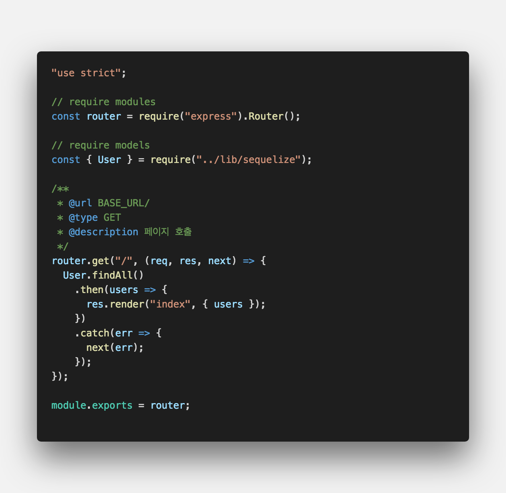
<br />

`findAll()` 메소드를 사용하여

user 테이블 데이터를 가져와서 index 페이지로 render합니다.

<br />

**views - index.ejs**

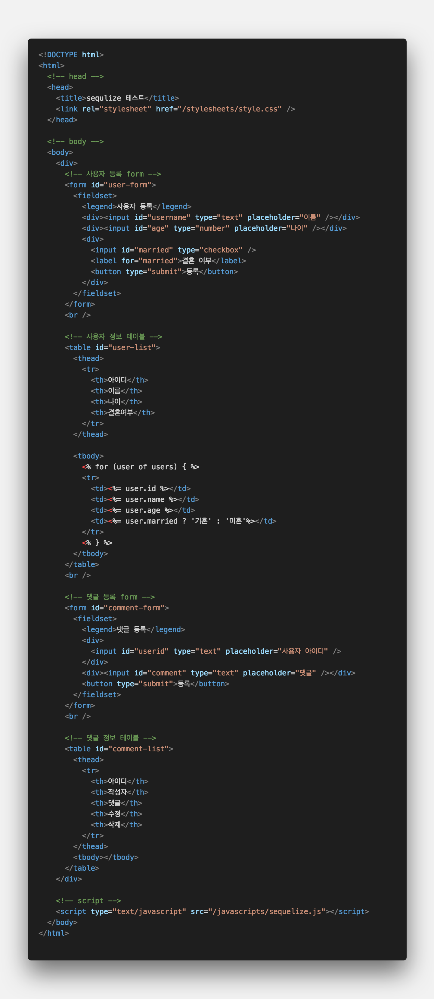
<br />

- 사용자 등록 폼, 조회 테이블

- 댓글 등록 폼, 조회 테이블

이렇게 각각 만들어 주었습니다.

<br />

**public - javascript - sequelize.js**

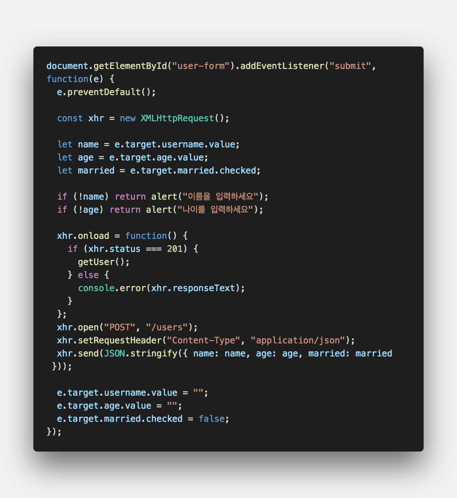
<br />

- 사용자 등록

<br />

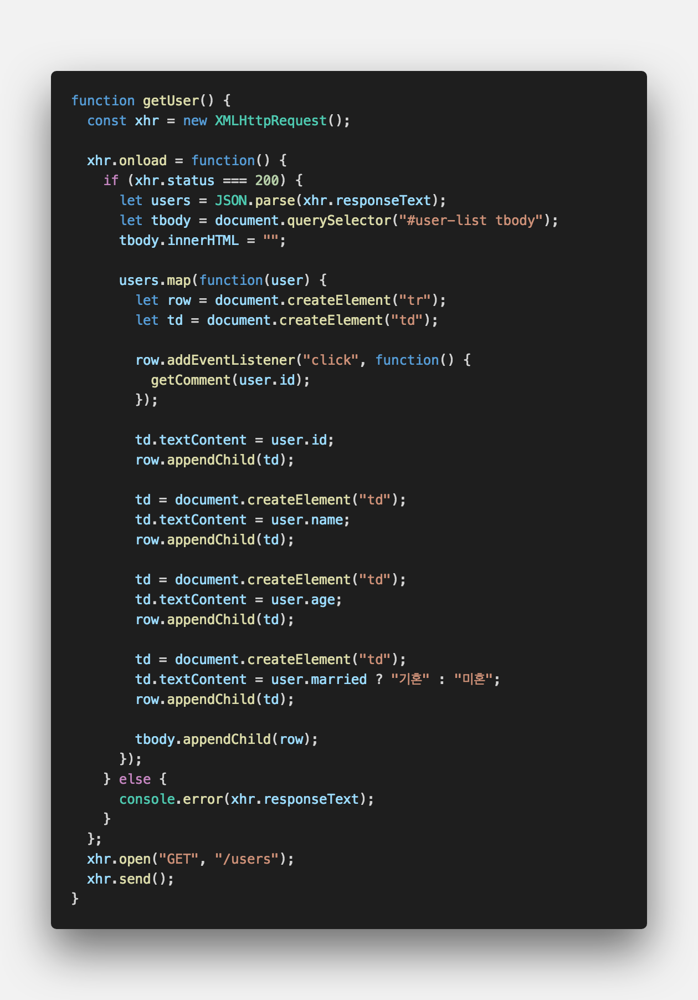
<br />

- 사용자 로딩

<br />

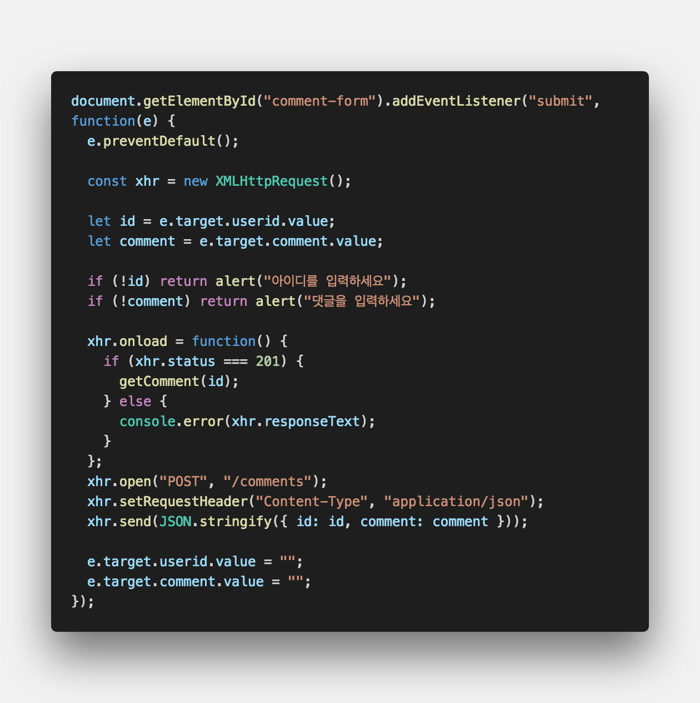
<br />

- 댓글 등록

<br />

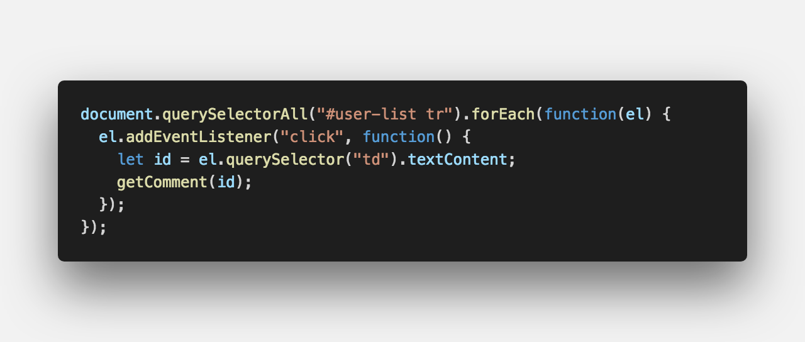
<br />

- 사용자 클릭 시 댓글 로딩

<br />

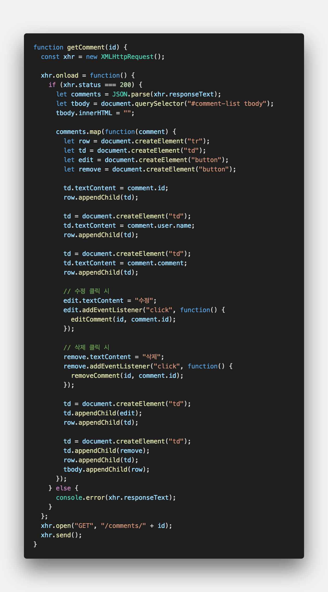
<br />

- 댓글 로딩

<br />

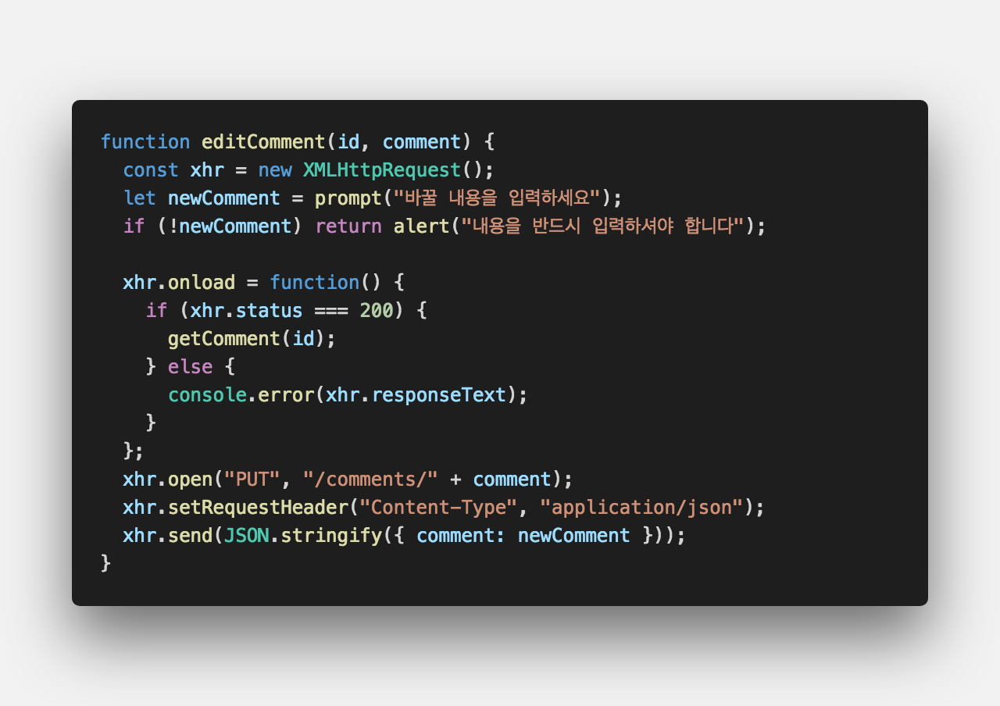
<br />

- 댓글 수정

<br />

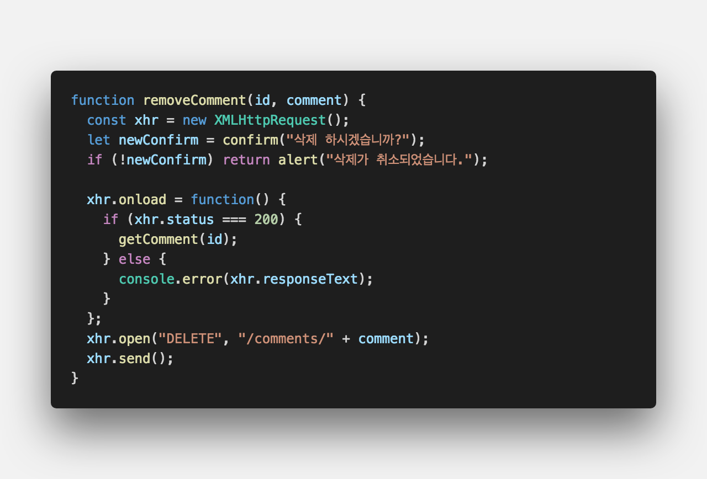
<br />

- 댓글 삭제

<br />

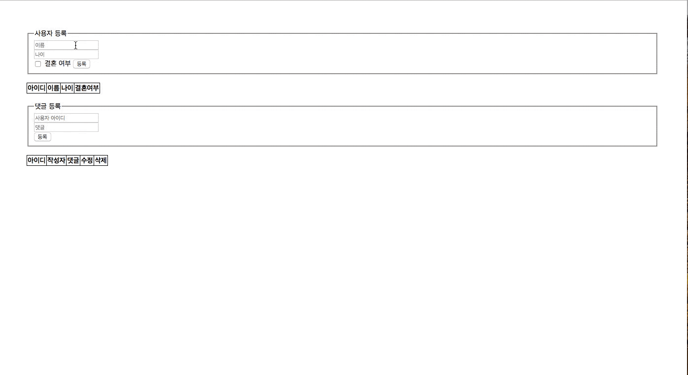
<br />

완성된 페이지입니다.

**[⬆ 목차](#-목차)**

<hr />

## **🥀 결론**

이것으로 간단하게 MySQL 사용하여 유저 + 댓글을 관리하는 페이지를 만들어보았습니다.

앞서 배운 CRUD를 사용하면 다양한 기능을 만들 수 있을 것입니다.

완성된 소스는 아래 출처를 확인하시면 자세히 나와있으니 참고하시기 바랍니다.

다음에는 더욱 좋은 자료로 찾아뵙겠습니다. 감사합니다.

<br />

**[⬆ 목차](#-목차)**

<hr />

<br />

> 출처
>
> <a href="https://github.com/bynodejs/sequelize" target="_blank">GitHub > sequelize</a>

# 여러분의 댓글이 큰힘이 됩니다. (๑•̀ㅂ•́)و✧
