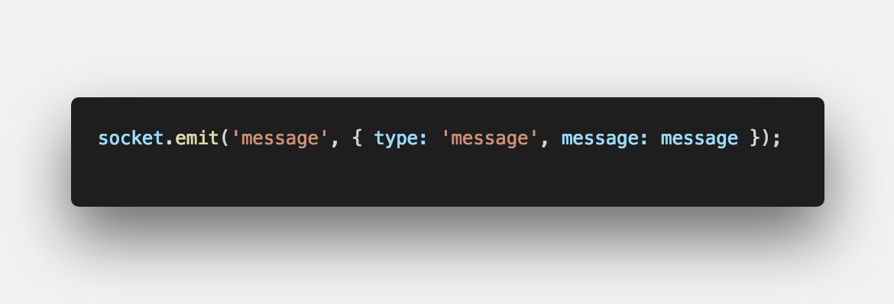
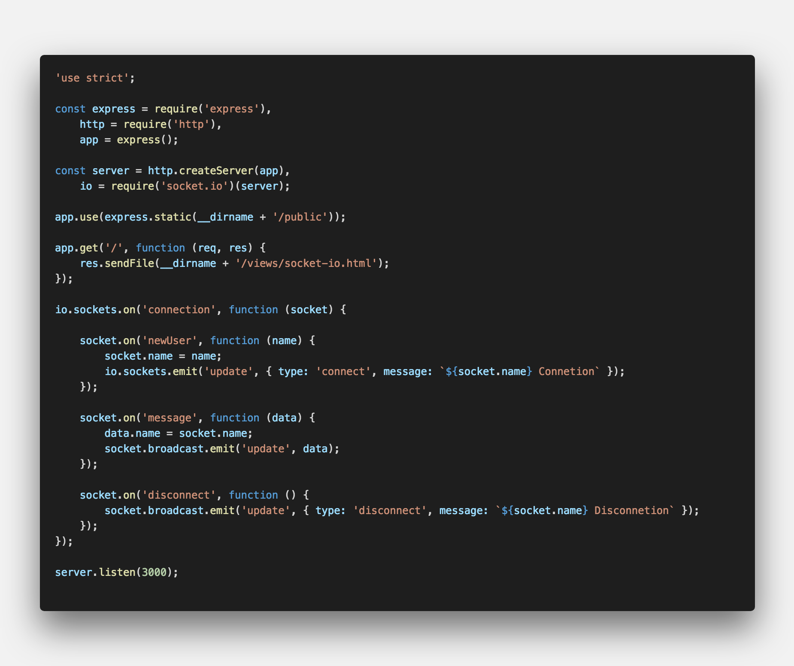
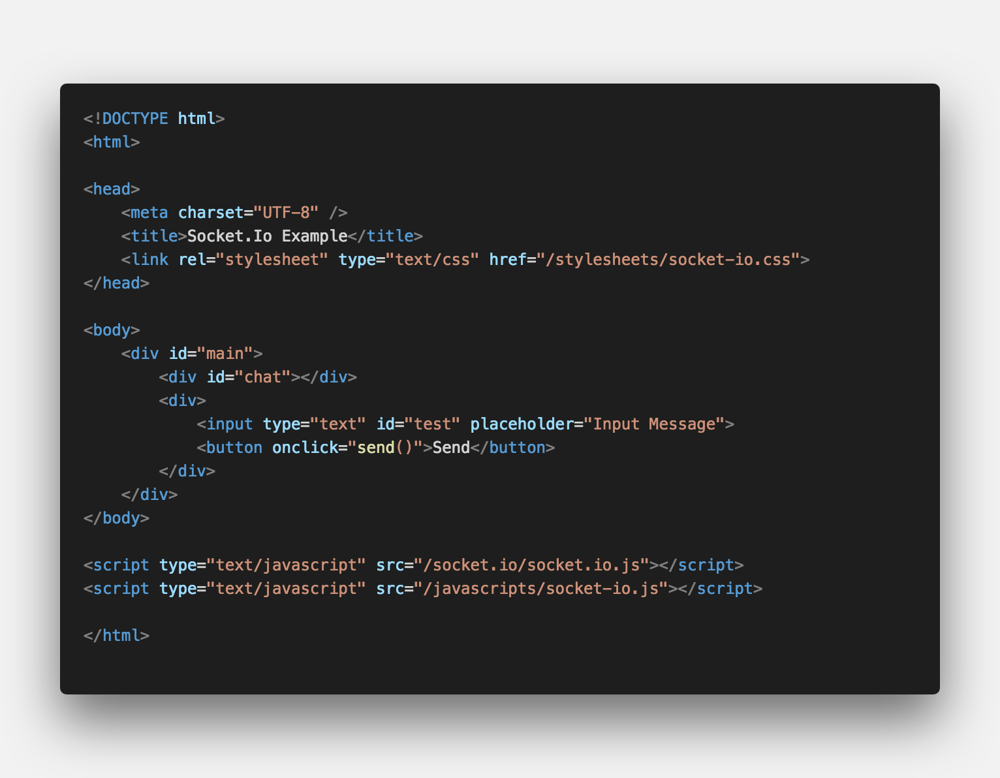

  
<center><strong>실시간</strong>으로 상호작용하는 서비스</center>

## **💎 목차**
  * [설치를 하며](#️-설치를-하며)
  * [코드를 보며](#-코드를-보며)
  * [생각 해보며](#-생각해-보며)

## **⚙️ 설치를 하며**

```sh

$ npm install express

$ npm install http

$ npm install socket.io

```

## **😳 코드를 보며**

### ▸ event


<br />

- `connect` 소켓 연결

- `disconnect` 소켓 연결 해지

- `error` 소켓 에러

<br />

### ▸ data


<br />


<br />

- `socket.emit('Event', data)` 데이터 전송

- `socket.on('Event',function(data))` 데이터 수신

<br />

### ▸ broadcast


<br />

- `socket.broadcast.emit('Event', data)` 자신을 제외한 전체에게 데이터 전송

<br />

**[⬆ 목차](#-목차)**

---

## **🤔 생각해 보며**

### ▸ server


<br />

### ▸ client


<br />


<br />

* 해당 소스는 실시간 채팅 예시 소스입니다.

  1. `socket.emit('Event', data)`에서 data에 type을 지정하여 css를 컨트롤
  2. `socket.broadcast('Event', data)`를 통한 데이터 전송 컨트롤

<br />

**[⬆ 목차](#-목차)**

---

<br />

> 출처
>
> <a href="https://github.com/bynodejs/socket.io" target="_blank">github > socket.io</a>

# 여러분의 댓글이 큰힘이 됩니다. (๑•̀ㅂ•́)و✧
