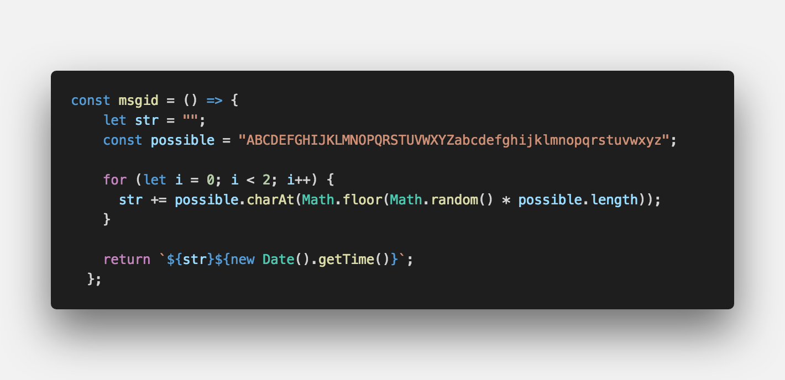
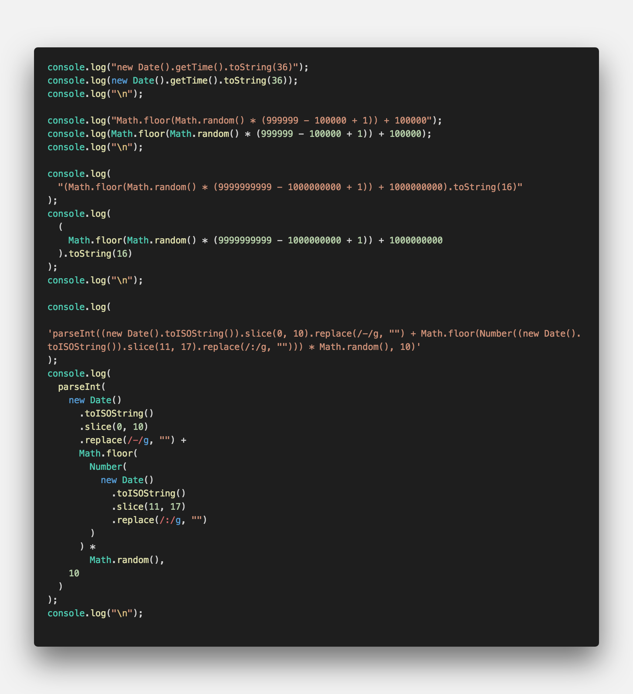

<center><strong style="font-size: 20px;">고유한 이름을 부여</strong>하기 위해 모듈</center>

## **💎 목차**

- [설치를 하며](#️-설치를-하며)
- [코드를 보며](#-코드를-보며)
- [생각 해보며](#-생각해-보며)

## **⚙️ 설치를 하며**

```sh

$ npm install uuid

```

## **😳 코드를 보며**

### **▸ Version 1 (timestamp)**

```js
const uuidv1 = require('uuid/v1')

uuidv1() // ⇨ 2c5ea4c0-4067-11e9-8bad-9b1deb4d3b7d
```

<br />
<hr />

### **▸ Version 3 (namespace)**

```js
const uuidv3 = require('uuid/v3')

// DNS namespace (for domain names)
uuidv3('hello.example.com', uuidv3.DNS) // ⇨ 9125a8dc-52ee-365b-a5aa-81b0b3681cf6

// URL namespace (for, well, URLs)
uuidv3('http://example.com/hello', uuidv3.URL) // ⇨ c6235813-3ba4-3801-ae84-e0a6ebb7d138
```

<br />
<hr />

### **▸ Version 4 (random)**

```js
const uuidv4 = require('uuid/v4')
uuidv4() // ⇨ 1b9d6bcd-bbfd-4b2d-9b5d-ab8dfbbd4bed
```

<br />
<hr />

### **▸ Version 5 (namespace)**

```js
const uuidv5 = require('uuid/v5')

// DNS namespace (for domain names)
uuidv5('hello.example.com', uuidv5.DNS) // ⇨ fdda765f-fc57-5604-a269-52a7df8164ec

// URL namespace (for, well, URLs)
uuidv5('http://example.com/hello', uuidv5.URL) // ⇨ 3bbcee75-cecc-5b56-8031-b6641c1ed1f1
```

<br />

**[⬆ 목차](#-목차)**

---

## **🤔 생각해 보며**


<br />


<br />

`uuid` 사용하면 유니크 성은 보장되지만 긴 문자열로 사용이 꺼려지는 경우도 있다.

그러므로, 모듈을 사용하지 않고 유니크한 값을 만드는 소스를 몇가지 만들어보았다.

`new Date`, `Math.random`을 사용했으며, 실제 서비스에서도 사용해도 전혀 손색이 없다.

해당 소스보다 좋은 소스를 생각해보고 공유도 함께해주시면 감사합니다.

<br />

**[⬆ 목차](#-목차)**

---

<br />

> 출처
>
> <a href="https://github.com/bynodejs/uuid" target="_blank">GitHub > uuid</a>

# 여러분의 댓글이 큰힘이 됩니다. (๑•̀ㅂ•́)و✧
