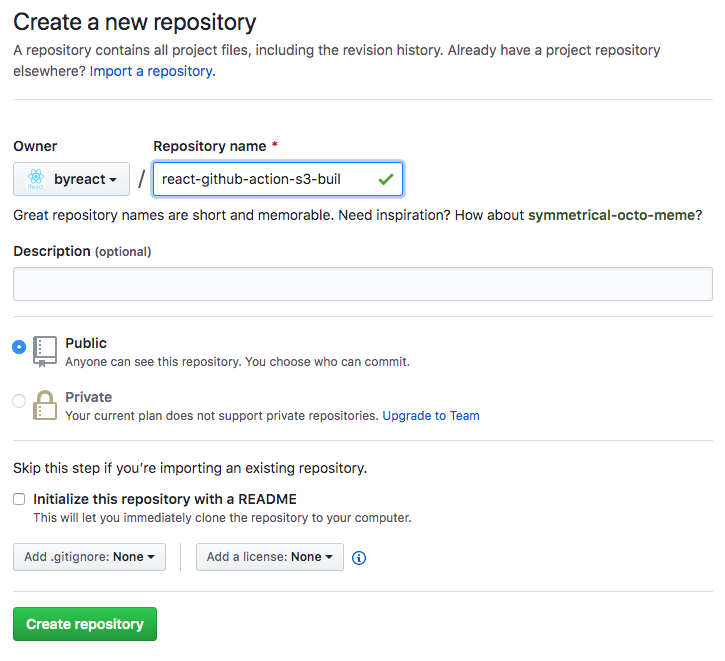
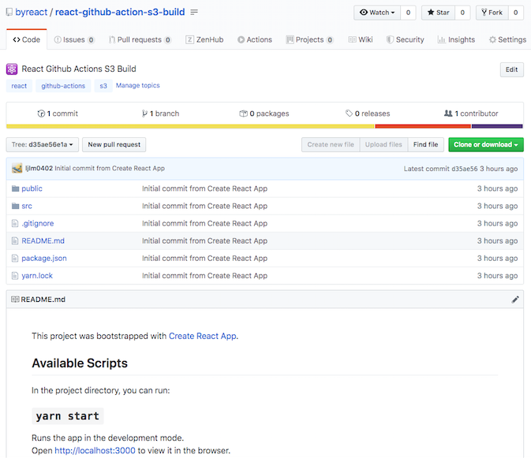
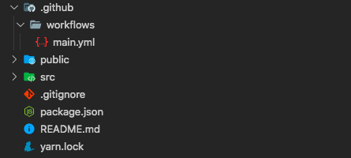
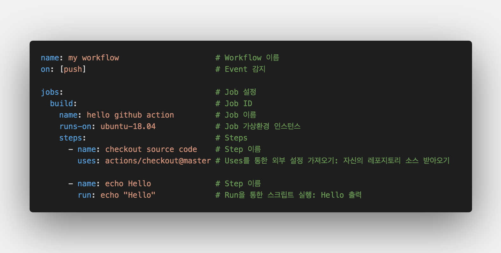
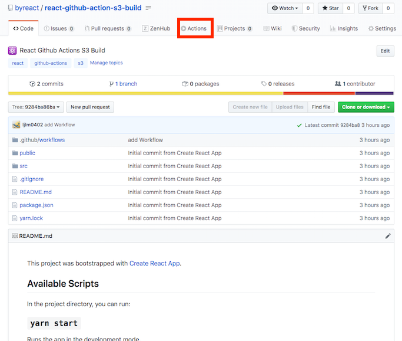
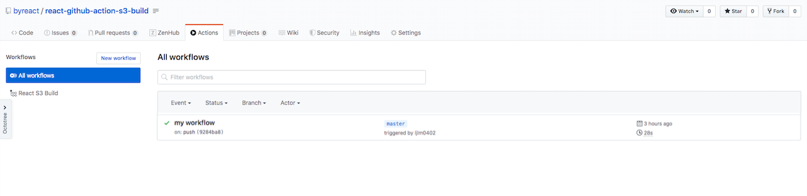
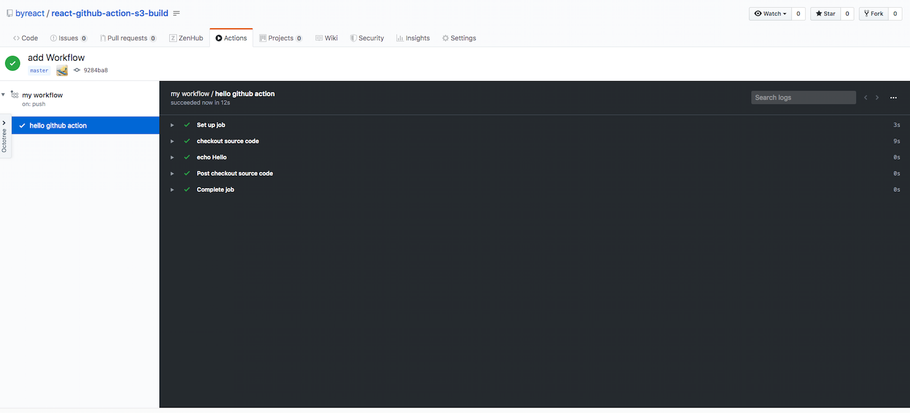
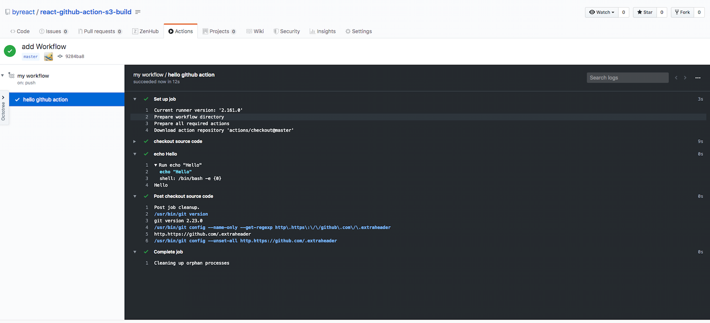

<center>github에서 공개한 <strong style="color:#2A7CF2; font-size: 20px;">빌드/배포 자동화 서비스</strong></center>

## **💎 목차**

- [서론 (Introduction)](#-서론)
- [본론 (Main)](#-본론)
- [결론 (Conclusion)](#🥀-결론)

## **🌱 서론**

- [Github Actions](https://github.com/features/actions)는 github에서 공개한 빌드/배포 자동화 서비스입니다.

- 자동화 서비스에는 [Circle CI](https://circleci.com), [Travis CI](https://travis-ci.org), [Jenkins](https://jenkins.io/) 등 많은 서비스가 있습니다.

- 이번에 포스트에서는 Github Actions을 사용하여 리액트를 [AWS S3](https://aws.amazon.com/ko/s3)에 자동화 배포를 해보겠습니다.

<br />

**[⬆ 목차](#-목차)**

<hr />

## **🌹 본론**

### **▸ 기술 스텍**

개발에 앞서 먼저 사용할 기술 스텍을 알려드리겠습니다.

1. React (create-react-app)

2. Github Actions

3. AWS S3

자 그럼 차근차근 진행해보겠습니다.

<br />
<hr />

### **▸ React 프로젝트 생성하기**

```sh

$ npm install -g create-react-app

$ npx create-react-app [my app name]

```

`create-react-app`(CRA)를 사용하여 리액트 프로젝트를 생성합니다.
<br />



그 후, github에서 repository를 생성해줍니다.
<br />

```sh
$ git init

$ git add .

$ git commit -m "first commit"

$ git remote add origin [자신의 레포지토리 주소]

$ git push -u origin master
```

그 다음 생성했던 리액트 프로젝트를 해당 레포지토리에 `push` 합니다.


<br />

자신의 소스가 정상적으로 `push` 된 것을 확인할 수 있습니다.

<br />
<hr />

### **▸ Github Action 시작하기**

Github Action에 시작하기 앞서 용어를 간단하게 설명드리겠습니다.

#### ▸ Workflow

- 프로젝트를 빌드, 테스트, 패키지 릴리스 또는 배포하기 위한 전체적인 프로세스입니다.

- 여러 개의 Job으로 구성되어 있으며 evnet(On)에 의해 실행됩니다.

#### ▸ Job

- 하나의 인스턴스(리눅스, 맥, 윈도우 등)에서 여러 Step을 그룹시켜 실행하는 역할을 합니다.

#### ▸ Step

- 순차적으로 명령어를 수행하며, 크게 `uses`와 `run`으로 작업 단위가 나뉘어집니다.

- `uses`는 이미 다른 사람들이 정의한 명령어를 가져와 실행하는 것입니다.

- `run`은 `npm install`, `npm start` 같이 가상환경 내에서 실행할 수 있는 스크립트 명령어를 실행합니다.

#### ▸ Event

- 워크플로우를 실행시키는 조건을 설정합니다.

- 예를들어, 레포지토리에 code가 push 될때, pull request 될때, 원하는 브런치에 변경사항이 있었을 때 등으로 조건을 줄수있습니다.

- 물론 cron 처럼 주기적으로 스케줄링하는 방법 또한 지원합니다.

<br />
<hr />

#### **▸ Workflow 설정하기**

자 그럼 workflow 부터 설정해보도록 하겠습니다.


<br />

`.github/workflows`폴더 안에 `*.yml` 설정 파일이 있으면 활성화 됩니다.

우선 `main.yml` 파일로 생성하겠습니다.


<br />

`step` 마다 `name`을 설정하고, 실행 단위를 정하여 코드를 작성합니다.

`uses`는 외부에 이미 만들어진 코드를 가져와 실행한다고 앞서 설명했습니다.

`actions/checkout`는 [Github Actions 공식 Checkout](https://github.com/actions/checkout) 액션을 가져와 실행시킵니다.

workflow를 실행할 때마다 새롭게 가상환경(ubuntu)을 구축하기 때문에, 해당 환경에는 아무것도 없습니다.

`actions/checkout` 액션으로 레포지토리 소스코드를 가져와 프로젝트 구성을 하는 작업을 해줍니다.

**때문에 대부분의 workflow의 job 최상단에 해당 step을 작성합니다**

작성이 완료되었으면, 소스를 올려보도록 하겠습니다.

```sh
$ git add .

$ git commit -m "add Workflow"

$ git push -u origin master

```

<br />


<br />


<br />

레포지토리 상단 Actions 탭을 클릭하면, my workflow가 생성된 것 확인할 수 있습니다.

클릭하여 상세히 확인해봅시다.


<br />


<br />

설정했던 `step`의 name을 볼 수 있으며 해당 step을 클릭하면 상세히 로그도 볼수있습니다.

또한 앞서 workflow 파일에서 `on:[push]` 설정해놔서 `push` 이벤트가 발생을 감지하여 workflow가 job을 생성하여 실행한 것 입니다.

<br />

**[⬆ 목차](#-목차)**

<hr />

## **🥀 결론**

잘 따라오시느라 고생하셨습니다. 👍🏻

`Github Action` 관련해서는 [Document](https://help.github.com/en/actions/automating-your-workflow-with-github-actions)를 통해 자세히 알아볼수 있습니다.

차근차근 도큐먼트를 정독해보시는것을 권장합니다.

앞서 배운 내용을 정리하면

1. React 프로젝트 생성(CRA)

2. Github Actions 시작 (workflow 작성)

을 해보았습니다.

다음 포스팅에서는 `React Build, actions/cache`을 해보겠습니다.

<br />

**[⬆ 목차](#-목차)**

<hr />

<br />

# 여러분의 댓글이 큰힘이 됩니다. (๑•̀ㅂ•́)و✧
